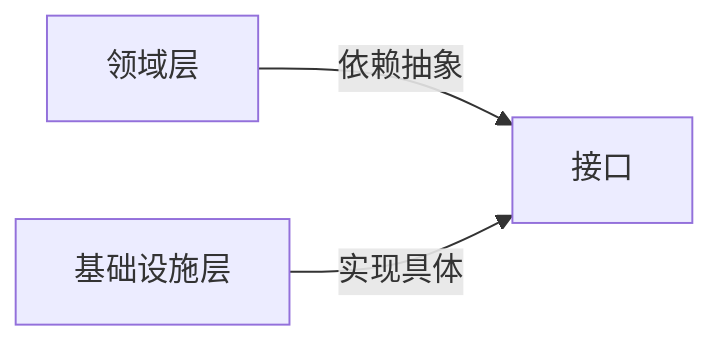

# 通用语言
# 战略设计
## 领域划分
### 限界上下文
- 定义业务语义边界，避免概念混淆（例如“客户”在销售与客服上下文中的含义不同）。
- 识别方法：语言分析、业务流程梳理、组织结构映射。
> 限界上下文直接对应微服务边界
### 子域
* 核心域（Core Domain）：业务核心竞争力所在（如电商的订单系统）
* 通用域（Generic Domain）：通用功能（如权限管理）
* 支撑域（Supporting Domain）：辅助性功能（如日志服务）。
# 战术设计
## 实体

通过ID标识（如用户），有生命周期。
### 验证
1. 单个属性的验证逻辑放在setter方法中，或者说领域中，整个对象合法性的验证逻辑其实是易变的，可以用ValidHandler来分离出来
2. 通过领域事件来跟踪状态的变化，在实体生命周期过程中，不是每个状态的变化都需要跟踪，而是需要跟踪持续变化的状态，需要跟踪的状态变化时，触发领域事件
### 职责
1. 并不是所有的逻辑都要放在领域中，比如校验逻辑，可以单独用handler解耦。还有一些逻辑可以放在领域服务中
### 建模
1. 并不是说数据库的一条记录就要建模成实体
## 值对象

通过属性定义（如地址），不可变且无ID
### 建模
1. 我们尽量使用值对象建模，而不是实体，因为值对象更容易创建、使用、优化
2. 值对象是可以嵌套的
3. 值对象可以包含一个属性，也可以包含多个相关的属性
4. 如果在领域中有一些通用语言，要注意可能最好设计成值对象，而不是基本类型，因为这些通用语言可能会有行为
5. 注意不要过度将一些可以用基本数据类型完成资质的属性包装成值对象，可能更适合用单独的属性表示
### 什么领域概念可以成为值对象
* 描述领域中的一个概念，比如一个人的年龄，名字等等
* 将相关属性合成一个概念整体
* 当描述改变时，可以用另一个对象替换
* 可以和其他值对象做相等比较
* 不会对引用他的对象造成副作用
* 不需要给他添加任何身份标识
* 创建后的不变性
### 注意
1. 值对象也可由自己的行为

## 聚合
### 什么是聚合

### 原则
1. 在单个事务中，只允许对一个聚合对象进行修改，如果要改变多个聚合，可以使用领域事件。可能有些场景，比如批量的操作，可能需要遍历操作多个聚合，这也是被允许的，因为本质上他们是一种聚合类型
2. 聚合和聚合之间的关联，可以使用唯一标识，而不是引用整个聚合，这样会造成性能问题，如果关联的对象很多的话，一次性查出所有对象会有问题，如果需要引用对象，可能设计成延迟加载会是更好的选择。另一种方式是拆成多个聚合，避免嵌套的引用，这样获取聚合的时候不用获取关联对象
3. 不建议在聚合中进行依赖注入，而是在执行聚合的命令方法的时候，将参数传进去，其实现在看，这条原则并没有太大的说服力呢

> 聚合根对应主表，内部对象可能映射关联表，但需避免直接耦合

## 聚合和实体有什么区别？

### 角色与定位

| 对比维度  | 实体（Entity）       | 聚合根（Aggregate Root）  |
| ----- | ---------------- | -------------------- |
| 核心特征  | 通过唯一标识（ID）追踪状态变化 | 聚合的入口，管理一组关联对象       |
| 生命周期  | 可独立存在或被聚合根包含     | 掌控内部所有对象的生命周期        |
| 访问权限  | 可被外部直接访问（非聚合内实体） | 唯一外部访问点，屏蔽对内部对象的直接操作 |
| 一致性边界 | 仅维护自身状态有效性       | 维护整个聚合内所有对象的一致性      |

> **聚合根是一种特殊的实体，每个聚合有且仅有一个聚合根，聚合根下可包含多个实体或值对象。**

### 二、深入剖析：职责差异

#### 1. **实体（Entity）的核心职责**

- **业务身份标识**：  
    通过唯一ID区分不同实例（即使属性相同，ID不同即不同对象）。
    
	```java
    public class Product { // 实体
        private ProductId id; // 唯一标识
        private String name;
        private Price price;
    }
    ```

#### 2. **聚合根（Aggregate Root）的核心职责**

确保聚合内所有对象遵守业务规则（事务最小单元），外部只能通过聚合根方法修改内部对象。
    
```java
    
    public class Order { // 聚合根
        private OrderId id;
        private List<OrderItem> items; // 内部实体
       
        // 添加订单项时校验总金额不超过限额
        public void addItem(Product product, int quantity) {
            if (calculateTotal() + product.getPrice() * quantity > MAX_AMOUNT) {
                throw new BusinessException("订单总额超限");
            }
            items.add(new OrderItem(product, quantity));
        }
    }
    ```
**访问控制门面**：  

```java

// 正确：通过聚合根方法修改
order.updateItemQuantity(productId, newQuantity);

// 错误：直接操作内部实体
order.getItems().get(0).setQuantity(10); // 破坏封装性！
```
    
**持久化单元**：  

整个聚合作为一个整体进行保存/加载（如Order和OrderItem一并存储）。

---

### 经典案例：电商订单聚合

```
classDiagram
    class Order {
        -id: OrderId
        -userId: UserId
        -status: OrderStatus
        -items: List~OrderItem~
        +addItem()
        +removeItem()
        +pay() 
    }
    
    class OrderItem {
        -productId: ProductId
        -quantity: int
        -price: Money
    }
    
    class Product {
        -id: ProductId
        -name: String
        -price: Money
    }
    
    Order "1" *-- "*" OrderItem : 包含
    OrderItem --> ProductId : 引用
```

- **聚合根**：`Order`
    
- **内部实体**：`OrderItem`（依赖订单存在，无独立生命周期）
    
- **外部实体**：`Product`（属于另一个聚合，仅通过ID引用）
    

**规则示例**：

- 当修改`OrderItem`数量时，必须通过`Order`的`updateItemQuantity()`方法，在其中校验库存、重新计算订单总额。
    
- 直接修改`OrderItem.quantity`将破坏订单总额一致性。
    

---

### 四、设计聚合根的三大原则

1. **高内聚原则**
    
    - 将紧密关联的对象放在同一聚合（如订单和订单项）。
        
    - 避免将频繁修改的对象分散在不同聚合（减少跨聚合事务）。
        
2. **小聚合原则**
    
    - 聚合尽量小型化（通常不超过10个对象），原因：
        
        - **性能**：加载/保存更高效
            
        - **并发**：减少事务冲突概率
            
    - 反例：将整个用户账户（含订单、支付记录）作为一个聚合 → 臃肿且易冲突。
        
3. **强一致性边界**
    
    - 聚合内规则实时校验（如库存扣减），跨聚合采用最终一致性（如订单支付后异步更新库存）。
        

---

### 五、常见误区与避坑

|**误区**|**问题**|**解决方案**|
|---|---|---|
|暴露内部实体可写方法|外部可能绕过聚合根规则破坏一致性|聚合根提供完整行为方法|
|聚合引用外部聚合的实体|导致隐式跨聚合强耦合|**仅通过ID引用**其他聚合|
|为性能拆分聚合|牺牲业务一致性（如订单和支付分离）|优先保障一致性，用CQRS优化查询|

---

### 六、面试高频问题解析

**Q：聚合根和实体在代码实现上如何区分？**  
→ 聚合根是聚合的**入口类**，通常：

- 包含管理内部对象的方法（`addItem()`/`removeItem()`）
    
- 仓储（Repository）仅针对聚合根定义
    
- 领域事件由聚合根发布
    

**Q：为什么值对象（Value Object）不属于聚合根？**  
→ 值对象无生命周期且不可变（如地址`Address`），其存在依赖于实体或聚合根，无需独立管理。

**Q：如何识别聚合根？**  
→ 通过业务语义分析：

1. 找出核心业务实体（如`Order`）
    
2. 确定哪些对象必须由其统一管理（如`OrderItem`离开订单无意义）
    
3. 检查是否需维护跨对象规则（如订单总额校验）
    

---

### 总结：关键差异表

|**特征**|**实体（Entity）**|**聚合根（Aggregate Root）**|
|---|---|---|
|标识性|有唯一ID|有唯一ID|
|作用范围|可独立或属于聚合|**整个聚合的根节点**|
|外部访问|可直接访问（非聚合内）|**唯一外部访问入口**|
|业务规则维护|仅自身状态校验|**维护聚合内多对象一致性**|
|持久化粒度|可能单独存储|**整个聚合作为存储单元**|

**核心记忆点**：

> 🔹 **聚合根是实体的升级形态**——它不仅是实体，更是聚合的“守护者”。  
> 🔹 **设计关键**：通过聚合根封装内部实现，对外提供行为方法而非getter/setter。  
> 🔹 **落地原则**：小聚合、强内聚、弱引用（通过ID关联其他聚合）。

# 领域服务

## 什么是领域服务，用来做什么的
* 如果是单个实体，肯定不需要领域服务，直接放实体里就可以
* 所以领域服务是多个实体的逻辑
* 如果一段业务逻辑不知道放在哪个实体里，就需要领域服务了

# 领域事件

## 为什么需要领域事件
1. 领域事件可以解耦

## 规范
1. 事件的命名要表示过去发生的事，比如OrderCreated表示订单创建了
2. 注意消费方的幂等处理
3. 消费方处理时要调用应用服务，而不是直接调用领域服务
4. 可以设计DomainEvent和Publisher
5. 领域事件可能是聚合和实体发出来的，也可能是前端直接发送领域事件

# 资源库

### 设计
1. 资源库的设计要和集合一样，比如HashSet，包含add\remove等等方法

### 规范
1. 资源库应该有谁调用？实体内还是实体外？

# 分层
- 接入层  
	- api  
- application：任务协调（调用领域服务）
	- application service  
- domin：核心业务逻辑（实体/聚合/领域服务）
	- entity  
	- vo
	- aggravate root  
	- factory  
		- 创建实体  
	- domin service  
- infrastructure：技术实现（数据库/消息队列）
	- repository  
		- 获取实体  
	- 中间件  
	- rpc

> 依赖方向：**上层→下层**（领域层不依赖基础设施）

| **层级**         | **职责**             |
| -------------- | ------------------ |
| 领域服务           | 封装跨实体的业务逻辑（如转账服务）  |
| 应用服务           | 协调领域对象与技术设施（无业务逻辑） |
| 仓储（Repository） | 封装聚合的持久化操作         |

## DDD依赖倒置



- 领域层定义**仓储接口**（如 `IOrderRepository`）
- 基础设施层实现该接口（如 `OrderRepositoryImpl` 操作MySQL）

|**价值点**|**说明**|
|---|---|
|**领域层与技术解耦**|领域逻辑不依赖具体数据库/框架（可替换MySQL为MongoDB而不改领域代码）|
|**提升可测试性**|单元测试时可Mock仓储接口，无需启动数据库|
|**架构灵活性**|支持六边形架构/整洁架构，核心业务处于最内层|
|**持续演进安全网**|技术栈升级（如更换ORM框架）只需重写基础设施层，领域模型不受影响|
