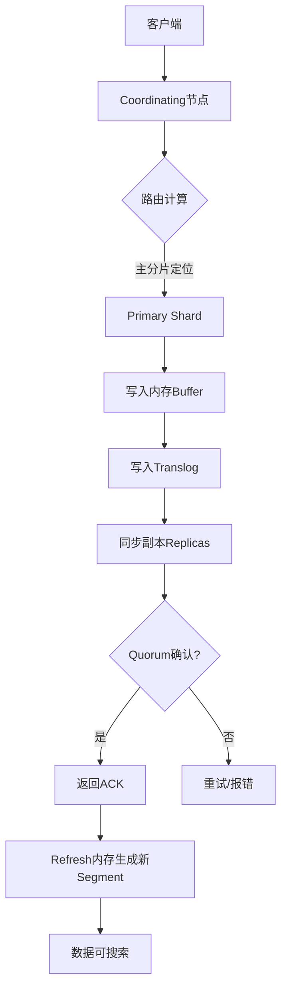
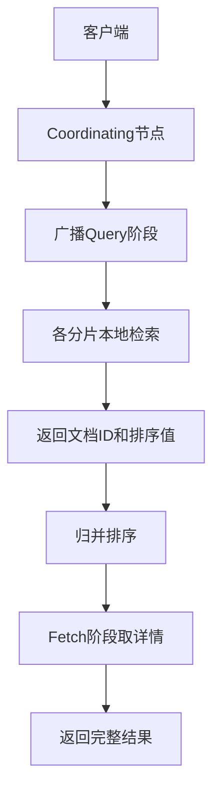
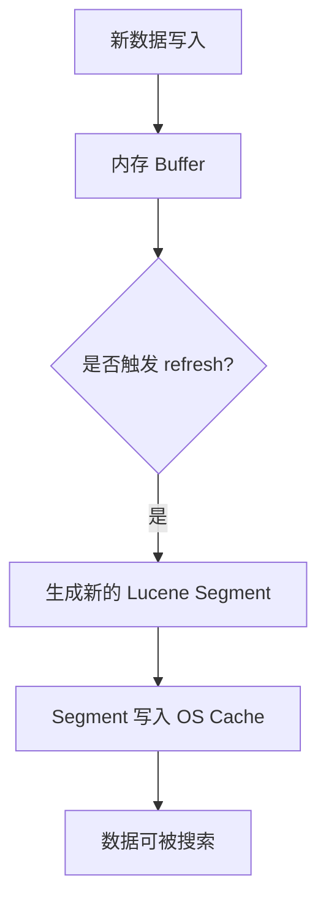
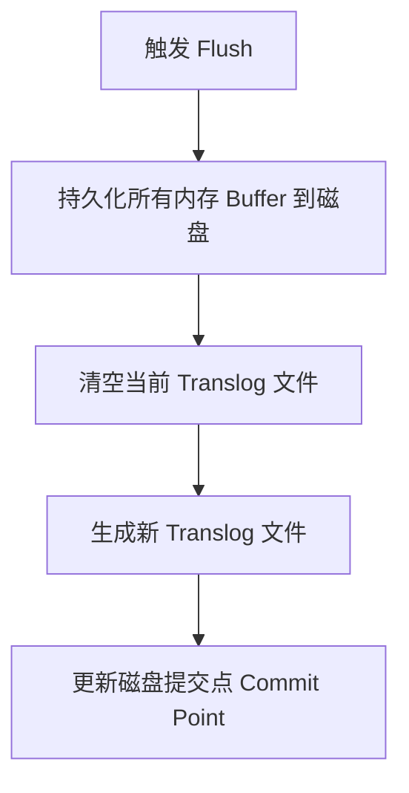
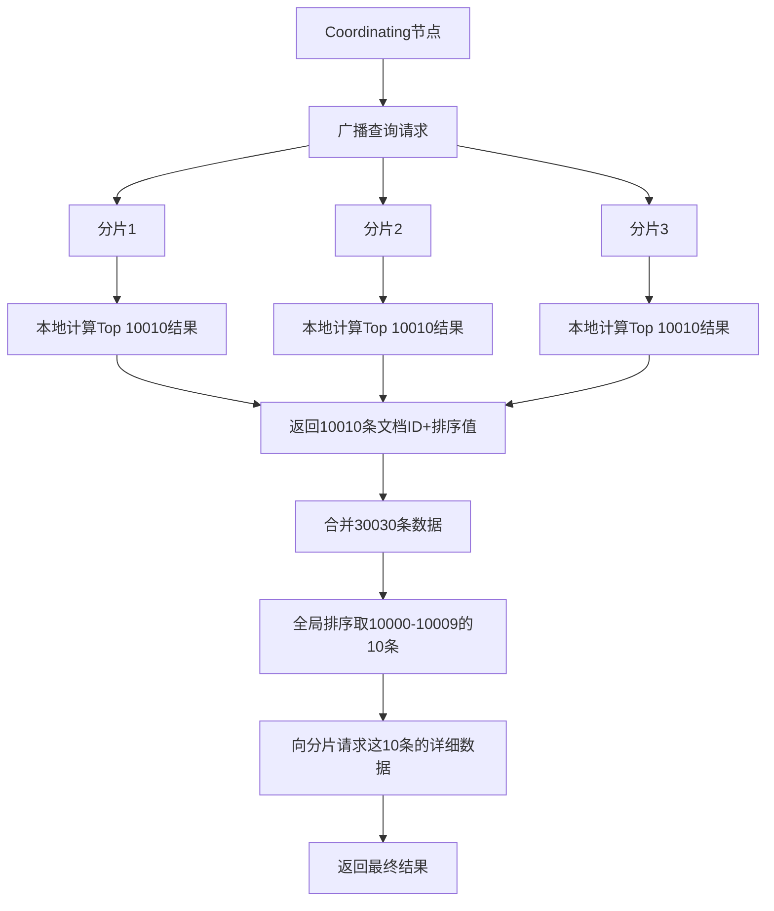

## P0面试优先级（2026）
- `P0-1` 索引设计：mapping、分词器、字段类型与倒排结构。
- `P0-2` 写入链路：primary/replica、refresh、flush、segment merge。
- `P0-3` 查询优化：filter 与 query、分页、聚合、深分页治理。
- `P0-4` 集群治理：分片副本规划、热点分片、迁移与恢复。
- `P0-5` 线上调优：慢查询、线程池、JVM 堆与磁盘 IO。

## P0常见误区修正（本页已修订）
- 分片不是越多越好，过多会带来调度与内存开销。
- `text` 字段默认不可聚合排序，通常要配 `keyword` 子字段。
- ES 不是关系库替代品，事务与 Join 能力边界要明确。

#flashcards 

## ES的工作流程
### 读流程
1. 客户端请求集群协调节点  
2. 协调节点计算数据所在的主分片和所有副本的位置  
3. 负载均衡轮询所有分片  
4. 请求转发给具体节点  
5. 节点数据返回协调节点  
6. 协调节点返回客户端
### 写流程
1. 客户端请求集群协调节点  
2. 协调节点将请求转发给指定节点  
    >协调节点默认使用文档 ID 参与计算（也支持通过 routing），以便为路由提供合适的分片：`shard = hash(document_id) % (num_of_primary_shards)`  
3. 主分片将数据写入  
    - 当分片所在的节点接收到来自协调节点的请求后，会将请求写入到 Memory Buffer，然后定时（默认是每隔 1 秒）写入到 Filesystem Cache，这个从 Memory Buffer 到 Filesystem Cache 的过程就叫做 [refresh](#refresh&nbsp;操作)；
        - **写入Memory Buffer**
        - **写入translog**
        - **定时写入Filesystem Cache**
    - 当然在某些情况下，存在 Memory Buffer 和 Filesystem Cache 的数据可能会丢失， ES 是通过[ translog的机制](#translog)来保证数据的可靠性的。其实现机制是接收到请求后，同时也会写入到 translog 中，当 Filesystem cache 中的数据写入到磁盘中时，才会清除掉，这个过程叫做 [flush](#flush)；  
        - **为保证数据可靠性，当 Filesystem cache 中的数据写入到磁盘，translog才被清除**
    - 在 flush 过程中，内存中的缓冲将被清除，内容被写入一个新段，段的 fsync 将创建一个新的提交点，并将内容刷新到磁盘，旧的 translog 将被删除并开始一个新的 translog。  
    - **flush 触发的时机是定时触发（默认 30 分钟）或者 translog 变得太大（默认为 512M）时**；  
4. 主分片将数据发送给副本  
    - 一致性参数设置  
        - one  
            - 只需要主分片成功写入  
        - all  
            - 所有主分片和副本都要写入成功  
        - quorum  
            - 超过半数分片写入  
5. 副本保存数据然后返回  
6. 主分片返回  
7. 协调节点返回客户端


> 客户端 → Coordinating Node → 路由到主分片 → 同步副本 → 返回响应
### 更新和删除文档的流程

- 删除和更新也都是写操作，但是 Elasticsearch 中的文档是不可变的，因此不能被删除或者改动以展示其变更；  
- 磁盘上的每个段都有一个相应的.del 文件。**当删除请求发送后，文档并没有真的被删除，而是在.del文件中被标记为删除。该文档依然能匹配查询，但是会在结果中被过滤掉**。当[段合并](#段合并)时，在.del 文件中被标记为删除的文档将不会被写入新段。  
- 在新的文档被创建时， Elasticsearch 会为该文档指定一个版本号，**当执行更新时，旧版本的文档在.del文件中被标记为删除，新版本的文档被索引到一个新段**。旧版本的文档依然能匹配查询，但是会在结果中被过滤掉。
### 搜索流程

搜索被执行成一个两阶段过程，我们称之为 Query Then Fetch；  
- 在初始查询阶段时，查询会广播到索引中每一个分片拷贝（主分片或者副本分片）。 每个分片在本地执行搜索并构建一个匹配文档的大小为 from + size 的优先队列。 PS：在搜索的时候是会查询Filesystem Cache 的，但是有部分数据还在 Memory Buffer，所以搜索是近实时的。  
- 每个分片返回各自优先队列中所有文档的 ID 和排序值 给协调节点，它合并这些值到自己的优先队列中来产生一个全局排序后的结果列表。  
- 接下来就是取回阶段， 协调节点辨别出哪些文档需要被取回并向相关的分片提交多个 GET 请求。每个分片加载并丰富文档，如果有需要的话，接着返回文档给协调节点。一旦所有的文档都被取回了，协调节点返回结果给客户端。  
- Query Then Fetch 的搜索类型在文档相关性打分的时候参考的是本分片的数据，这样在文档数量较少的时候可能不够准确， DFS Query Then Fetch 增加了一个预查询的处理，询问 Term 和 Document frequency，这个评分更准确，但是性能会变差。


> Query 阶段（各分片本地检索）→ Fetch 阶段（Coordinating Node 归并结果）

## ES的分布式架构原理

**核心思想：分而治之 & 冗余备份**

1. **集群 (Cluster)**
    - **概念：** 一个 ES 集群由一个或多个节点（Node）组成。这些节点共同协作，存储所有数据，并提供联合的索引与搜索能力。
    - **唯一标识：** 集群有一个唯一的名称（默认是 `elasticsearch`），节点通过配置这个名称来加入集群。
2. **节点 (Node)**
    - **概念：** 一个运行中的 ES 实例就是一个节点。它是集群中的基本工作单元。
    - **角色 (Node Roles)：** 现代 ES 版本中，节点可以扮演不同的角色（可配置组合）：
        - **`master` (主节点)：** 负责集群层面的轻量级管理操作：
            - 创建或删除索引。
            - 跟踪哪些节点是集群的一部分。
            - 决定将哪些分片分配给哪些节点。
            - 维护集群状态 (`cluster state`)，并确保其在所有节点间的一致性。
            - **关键点：** 主节点_不_参与文档级别的索引和搜索操作（避免成为瓶颈）。集群通常有多个`master-eligible`节点，通过选举产生一个`active master`，其他作为备胎。
        - **`data` (数据节点)：** 负责存储数据（分片），执行与数据相关的操作（CRUD、搜索、聚合）。这是承载数据负载的主力。
        - **`ingest` (预处理节点)：** 在索引文档之前执行预处理管道（pipeline）操作（如数据转换、丰富）。
        - **`ml` (机器学习节点)：** 运行机器学习任务。
        - **`coordinating` (协调节点)：** 这是一个隐含角色（通常由不设置`master`、`data`、`ingest`的节点承担，或者所有节点默认都具备）。它负责：
            - 接收客户端请求（如搜索请求）。
            - 将请求_路由_到包含相关数据分片的节点。
            - 汇总来自各个数据节点的结果，进行合并、排序等。
            - 将最终结果返回给客户端。
        - **`voting_only` (仅投票主节点)：** 一种特殊的`master-eligible`节点，只参与选举投票，但永远不会被选为`active master`（增加选举稳定性）。
    - **节点发现：** 节点通过配置的发现机制（如 `discovery.seed_hosts`）找到彼此并加入集群。
3. **索引 (Index)**
    - **概念：** 在 ES 中，索引是具有相似特征文档的集合（类似于关系型数据库中的“数据库”或“表”）。
    - **分布式核心：** 一个索引在创建时会被分成一个或多个**分片 (Shard)**。这是 ES 实现分布式存储和并行处理的基础。
4. **分片 (Shard)**
    - **概念：** 分片是索引的组成部分，是一个独立的 Lucene 索引实例。它存储索引数据的一部分。
    - **类型：**
        - **主分片 (Primary Shard)：**
            - 文档在被索引时，首先写入其所属的主分片。
            - 主分片是索引数据的“权威”副本。
            - 索引创建时指定主分片数量 (`number_of_shards`)，之后_无法修改_（除非重建索引或使用 `reindex` API）。
            - 主分片数量决定了索引数据的最大存储容量和并行处理能力上限。
        - **副本分片 (Replica Shard)：**
            - 是主分片的**精确拷贝**（异步复制）。
            - 主要作用：**高可用性**（主分片故障时，副本可以提升为主分片）和**提升读取性能**（搜索和 GET 请求可以在所有分片副本上并行执行）。
            - 副本数量 (`number_of_replicas`) 可以随时动态调整。
    - **分片分配：** ES 自动将索引的分片（主和副本）**均匀分布**到集群的各个数据节点上。同一个分片的主副本和其副本_不会_分配到同一个节点上（避免单点故障）。
    - **分片路由：** 当索引一个文档时，ES 需要确定它应该存储在哪个主分片上。这是通过一个简单的公式实现的：  
        `shard_num = hash(_routing) % number_of_primary_shards`
        - `_routing` 默认是文档的 `_id`，但可以指定其他字段。
        - 这个路由机制确保了同一个 `_routing` 值的文档总是路由到同一个主分片。
        - 客户端请求可以直接发送到持有目标分片的节点（避免协调节点跳转）。
5. **分布式写入流程 (Indexing)**
    1. **客户端请求：** 客户端向_任意节点_（通常是协调节点）发送索引文档请求。
    2. **路由计算：** 接收请求的节点（协调节点）根据文档 ID (`_id`) 或指定路由键 (`_routing`) 计算出文档应该存储在哪个主分片上 (`shard = hash(routing) % num_primaries`)。
    3. **转发请求：** 协调节点将请求转发给**持有该主分片的数据节点**。
    4. **主分片写入：** 目标数据节点在其持有的_主分片_上执行写入操作（Lucene 索引）。
    5. **并发复制：** 主分片写入成功后，它会将写入操作**并行地**转发给所有该主分片的**副本分片所在的数据节点**。
    6. **副本写入确认：** 副本分片节点执行写入操作，成功后向主分片节点发送确认。
    7. **主分片响应：** 主分片节点等待所有副本分片（或达到配置的最小成功副本数 `wait_for_active_shards`）都确认成功后，才向协调节点报告写入成功。
    8. **客户端响应：** 协调节点将成功响应返回给客户端。
6. **分布式搜索流程 (Searching)**
    1. **客户端请求：** 客户端向_任意节点_（协调节点）发送搜索请求。
    2. **查询广播：** 协调节点将搜索请求**并行地**转发给**所有相关索引的每个分片**（包括主分片和副本分片）。ES 默认使用 `query_then_fetch` 或 `dfs_query_then_fetch` 策略。
    3. **分片本地搜索：** 每个收到请求的数据节点在其持有的分片（主或副本）上**独立地**执行搜索请求（Query 阶段）。
    4. **返回结果：** 每个数据节点将其分片上的**排序后的前 N 个结果（文档 ID 和排序值）** 返回给协调节点。`N` 通常是 `from + size`（考虑深度分页）。
    5. **结果合并：** 协调节点收集所有分片返回的结果，进行**全局排序**（根据排序值），选出最终需要的 `from` 到 `from+size` 条文档。
    6. **文档获取：** 协调节点根据全局排序确定的最终文档列表，向**持有这些文档的分片所在的数据节点**发送**批量 GET 请求**（Fetch 阶段）。
    7. **返回文档内容：** 各数据节点返回指定文档的完整内容 (`_source`)。
    8. **组装响应：** 协调节点组装所有获取到的文档内容，构建最终的搜索结果响应，返回给客户端。
7. **高可用性 (High Availability)**
    - **副本分片：** 主分片故障时，集群会自动将一个可用的**副本分片提升为新的主分片**，继续提供服务。新的副本分片会被创建以恢复冗余级别。
    - **主节点选举：** `active master` 节点故障时，`master-eligible` 节点会通过选举协议（类 Raft）快速选出新的 `active master`，确保集群管理功能不中断。
    - **无单点故障：** 通过合理的节点角色规划（如至少 3 个 dedicated `master-eligible` 节点，避免`data`节点同时是`master`），确保关键角色（主节点、数据）都有冗余。
8. **可扩展性 (Scalability)**
    - **横向扩展 (Scale Out)：** 增加新的数据节点即可。ES 会自动将新加入节点的分片（或新增副本）迁移到新节点上，实现负载均衡。
    - **重平衡 (Rebalancing)：** 当节点加入或离开集群时，ES 会自动触发分片重平衡，确保分片（主和副本）在数据节点间均匀分布，保持负载均衡和数据冗余。
    - **增加副本：** 提高查询吞吐量和容错能力（只需调整 `number_of_replicas`）。
**关键分布式特性总结：**
- **数据分片 (Sharding)：** 将大数据集切分成更小的单元（分片），分布存储在不同节点上，实现数据水平分割和并行处理。
- **冗余复制 (Replication)：** 每个分片有多个副本，存储在不同节点上，提供高可用性和读取负载均衡。
- **自动故障转移 (Automatic Failover)：** 节点或分片故障时，系统自动检测并恢复（副本提升、主节点选举）。
- **请求路由 (Request Routing)：** 协调节点智能地将请求路由到持有相关数据的分片节点。
- **集群状态管理 (Cluster State Management)：** `active master` 负责维护全局一致的集群状态，并通过发布-订阅机制同步给所有节点。
- **节点发现与自愈 (Node Discovery & Self-Healing)：** 节点自动发现彼此加入集群，集群自动处理节点加入/离开/故障。
**理解要点：**
- **分片是核心：** 所有分布式操作都围绕分片进行（路由、复制、分配）。
- **角色分离：** 节点角色分离（master, data, coordinating）提高了稳定性、性能和可管理性。
- **最终一致性：** 副本复制是异步的，在极端情况下可能存在短暂的数据不一致（但 ES 通过写入确认机制尽力保证主副本间强一致，主副本与副副本间是近实时的最终一致）。
- **协调节点的重要性：** 它是分布式请求的枢纽，负责分解、路由、合并结果。
## 为什么说ES是近实时搜索? ::
### refresh 操作

主分片先将数据写入 Memory Buffer，然后定时（默认每隔1s）将 Memory Buffer 中的数据写入一个新的 segment 文件中，并进入 Filesystem Cache（同时清空 Memory Buffer），这个过程就叫做 refresh；

每个 Segment 文件实际上是一些倒排索引的集合， 只有经历了 refresh 操作之后，这些数据才能变成可检索的。  

**ES 的近实时性：当数据存在 Memory Buffer 时是搜索不到的，只有数据被 refresh 到 Filesystem Cache 之后才能被搜索到，而 refresh 是每秒一次， 所以称 es 是近实时的，或者可以通过手动调用 es 的 api 触发一次 refresh 操作，让数据马上可以被搜索到；**  

Memory Buffer，也称为 Indexing Buffer，这个区域默认的内存大小是 10% heap size。


触发条件：
- 默认每 1 秒 自动执行一次（通过 `refresh_interval` 配置）。
- 手动触发：`POST /index/_refresh`
- 写入时带 `?refresh=true` 参数（生产环境慎用）。

| **场景**         | **问题**                   | **优化方案**                          |
| -------------- | ------------------------ | --------------------------------- |
| **高频写入**（如日志）  | 每秒生成大量小 Segment → 查询性能下降 | 增大 `refresh_interval`（如 30s）      |
| **低延迟搜索**（如电商） | 默认 1 秒延迟太高               | 调小 `refresh_interval`（如 500ms）    |
| **索引重建**       | 导入历史数据无需实时搜索             | 关闭刷新：`index.refresh_interval: -1` |
```JSON
PUT /logs/_settings
{
  "index.refresh_interval": "30s"  // 日志类索引降低刷新频率
}
```

>将内存缓冲区（In-memory Buffer）中的数据转换成 Lucene 段（Segment） 并放入 OS Cache，使**新写入的数据在 1 秒内可被搜索到（NRT 特性）。注意：此时数据仍在内存/OS Cache 中，未落盘！宕机会丢失**。
### translog

由于 Memory Buffer 和 Filesystem Cache 都是基于内存，假设服务器宕机，那么数据就会丢失，所以 ES 通过 translog 日志文件来保证数据的可靠性，在数据写入 memory buffer 的同时，将数据写入 translog 日志文件中，在机器宕机重启时，es 会从磁盘中读取 translog 日志文件中最后一个提交点 commit point 之后的数据，恢复到 Memory Buffer 和 Filesystem cache 中去。  

ES 数据丢失的问题：translog 也是先写入 Filesystem cache，然后默认每隔 5 秒刷一次到磁盘中，所以默认情况下，可能有 5 秒的数据会仅仅停留在 memory buffer 或者 translog 文件的 Filesystem cache中，而不在磁盘上，如果此时机器宕机，会丢失 5 秒钟的数据。也可以将 translog 设置成每次写操作必须是直接 fsync 到磁盘，但是性能会差很多。
### flush

不断重复上面的步骤，translog 会变得越来越大， translog 文件默认每30分钟或者阈值超过 512M ，就会触发 flush 操作，将 memory buffer 中所有的数据写入新的 Segment 文件中， 并将内存中所有的 Segment 文件全部落盘，最后清空 translog 事务日志。  
1. 将 memory buffer 中的数据 refresh 到 Filesystem Cache 中的一个新的 segment 文件中去，然后清空 Memory Buffer；  
2. 创建一个新的 commit point（提交点），同时强行将 Filesystem Cache 中目前所有的数据都 fsync 到磁盘文件中；  
3. 删除旧的 translog 日志文件并创建一个新的 translog 日志文件，此时 flush 操作完成  


flush 操作主要通过以下几个参数控制  
- index.translog.flush_threshold_period  
	>每隔多长时间执行一次flush，默认30m  
- index.translog.flush_threshold_size 
	>当事务日志大小到达此预设值，则执行flush，默认512mb  
- index.translog.flush_threshold_ops  
	>当事务日志累积到多少条数据后flush一次
- 手动触发
	>`POST /index/_flush`

核心作用：

> * 将内存 Buffer 和 OS Cache 中的 Segment **持久化到磁盘**。
> * **清空 Translog**（事务日志），释放磁盘空间。
> * **确保宕机后数据不丢失**。

**Refresh vs Flush 关键区别**

| 维度          | Refresh            | Flush               |
| --------------- | ---------------------- | ----------------------- |
| 目的          | 让数据可搜索（NRT）        | 保证数据持久化（不丢失）        |
| 数据位置        | 内存 → OS Cache          | OS Cache → 磁盘           |
| 是否写磁盘       | ❌ 否                    | ✅ 是                     |
| Translog 处理 | 不清理 Translog           | 清空当前 Translog       |
| 频率          | 高（默认 1 秒 1 次）          | 低（默认 512MB 或 30 分钟 1 次） |
| 手动命令        | `POST /index/_refresh` | `POST /index/_flush`    |
### 段合并  
- 将多个小 segment 文件合并成一个 segment，在合并时被标识为 deleted 的 doc（或被更新文档的旧版本）不会被写入到新的 segment 中。  
- 合并完成后，然后将新的 segment 文件 flush 写入磁盘；然后创建一个新的 commit point 文件，标识所有新的 segment 文件，并排除掉旧的 segement 和已经被合并的小 segment；  
- 然后打开新 segment 文件用于搜索使用，等所有的检索请求都从小的 segment 转到 大 segment 上以后，删除旧的 segment 文件，这时候，索引里 segment 数量就下降了。
## ES如何保证读写一致？::

- 可以通过版本号使用乐观并发控制，以确保新版本不会被旧版本覆盖，由应用层来处理具体的冲突；  
- 另外对于写操作，一致性级别支持 quorum/one/all，默认为 quorum，即只有当大多数分片可用时才允许写操作。但即使大多数可用，也可能存在因为网络等原因导致写入副本失败，这样该副本被认为故障，分片将会在一个不同的节点上重建。  
- 对于读操作，可以设置 replication 为 sync(默认)，这使得操作在主分片和副本分片都完成后才会返回；如果设置 replication 为 async 时，也可以通过设置搜索请求参数_preference 为 primary 来查询主分片，确保文档是最新版本。
## 什么是倒排索引？::

倒排索引（Inverted Index）是一种数据结构，通常用于快速查找文档中包含特定词语的情况。它将词汇表中的每个词与包含该词的文档列表相关联。

传统的索引结构是将文档编号与包含的词语映射起来。但在倒排索引中，我们反转了这种映射关系，是将词语与其关联的文档编号做映射。这样做的好处是，当我们需要查找某个词语时，可以快速获取到包含该词的文档列表，而不需要遍历所有的文档。

倒排索引主要用于全文搜索引擎中，通过倒排索引，搜索引擎可以快速找到包含用户查询关键词的文档，从而提供相关的搜索结果。

- **原理（反转映射关系）**：词项（Term）到文档ID的映射（如“Java” → 文档1, 文档3），通过分词、构建词典和倒排表实现快速检索。存储所有分词后的唯一词项（如“iPhone”、“128GB”），使用FST（有限状态转换器）压缩存储，内存占用降低50%+。
- **核心组成：**
    - **词典 (Term Dictionary)：**
        - 包含索引中所有**唯一词项 (Term)** 的**有序列表**。词项通常是经过**分析**（分词、标准化）后的单词或词语。
        - **作用：** 快速定位某个词项是否存在以及它在倒排表中的位置。类似字典的“目录”。
        - **实现优化：** 常使用高效数据结构如 **FST (Finite State Transducer)** 进行压缩存储和快速查找。
    - **倒排表 (Postings List)：**
        - 对于词典中的**每一个词项**，都有一个对应的**倒排表**。
        - 倒排表记录了**所有包含该词项的文档的 ID (`DocID`)**。
        - 更重要的是，它还存储了**每个文档中该词项的元信息 (Metadata)**：
            - **词频 (Term Frequency - TF)：** 该词项在**该文档**中出现的**次数**。是**相关性评分**（如 TF-IDF, BM25）的重要因子。TF 越高，通常认为该文档与该词项越相关。
            - **位置 (Position)：** 该词项在文档字段中出现的**位置**（第几个词）。这对于**短语查询 (`"quick brown fox"`)** 至关重要——需要词项按特定顺序和距离出现。
            - **偏移量 (Offset)：** 词项在原始文本中的**开始和结束字符位置**。用于**高亮显示 (Highlighting)**。
        - **存储优化：** Postings List 包含大量整数（DocID, Position, Offset），Lucene 使用高效的**整数压缩算法**（如 Frame Of Reference, PForDelta）进行压缩存储，大大减少磁盘占用和内存消耗。
- **底层优化**：
	- FST（Finite State Transducer）压缩存储词项，节省内存且查询效率 O(n)45。
	- **Roaring Bitmaps**：高效压缩文档ID集合，加速`AND/OR`布尔查询。
	- **Skip List（跳表）**：在长倒排列表中快速定位文档，时间复杂度 O(log n)。

- **构建过程 (简化)：**
    
    1. **文档收集：** 获取要索引的文档。
    2. **字段分析 (Analysis)：** 对每个需要索引的**文本字段**进行处理：
        - **分词 (Tokenization)：** 将文本拆分成独立的单词/词语（Token）。
        - **标准化 (Normalization)：** 对 Token 进行处理，使其规范化。常见操作包括：
            - 小写转换 (Lowercasing)
            - 去除停用词 (Stop Word Removal - 如 "a", "the", "is")
            - 词干提取 (Stemming - 如 "running" -> "run", "jumps" -> "jump")
            - 同义词转换
    3. **生成词项 (Term)：** 经过分析后得到的 Token 就是词项。
    4. **构建映射：** 对于文档中的**每个词项**：
        - 将其添加到**词典**（如果不存在）。
        - 在**该词项对应的倒排表**中，添加一个**条目 (Posting)**。这个条目包含：
            - 当前文档的 ID (`DocID`)
            - 该词项在当前文档中出现的次数 (`TF`)
            - 该词项在当前文档中出现的位置 (`Position`) 列表（多次出现就有多个位置）
            - 该词项在当前文档中出现的偏移量 (`Offset`) 列表
    5. **排序与压缩：** 词典通常按词项字典序排序。倒排表中的文档 ID 列表按 ID 排序（利于压缩和集合运算）。最后应用压缩算法。
- **查询过程 (简化 - 以单 Term 查询为例)：**
    1. **分析查询词：** 对用户输入的查询词进行**相同的分析过程**（分词、标准化），得到要查询的**词项 (Term)**。例如，查询 `"The Quick Brown Fox"` 可能被分析为词项 `["quick", "brown", "fox"]`。
    2. **查找词典：** 在 **Term Dictionary** 中快速查找目标词项（如 `"quick"`）。如果找到，获取指向其对应的 **Postings List** 的指针。
    3. **读取倒排表：** 读取该词项对应的 **Postings List**。这个列表直接告诉你**哪些文档 (`DocID`) 包含了 "quick"**，以及每个文档中的 TF、Position 等信息。
    4. **处理复杂查询 (如 BooleanQuery)：**
        - **AND (`quick AND brown`)：** 分别查找 `"quick"` 和 `"brown"` 的 Postings List，然后求**交集 (Intersection)**。
        - **OR (`quick OR brown`)：** 求**并集 (Union)**。
        - **NOT (`quick NOT brown`)：** 求 `"quick"` 的列表与 `"brown"` 的列表的**差集 (Difference)**。
        - **短语查询 (`"quick brown"`)：** 查找 `"quick"` 和 `"brown"` 的列表，求交集，然后检查在交集文档中，`"brown"` 的位置是否紧跟在 `"quick"` 的位置之后（例如 Position(`brown`) = Position(`quick`) + 1）。
    5. **评分与排序：** 根据相关性评分算法（利用 TF、IDF 等信息）计算匹配文档的得分 (`_score`)，并按需排序。
    6. **结果返回：** 返回匹配的文档 ID 列表（或进一步获取文档内容）。
- **为什么高效？**
    - **避免全表扫描：** 直接通过词项定位到包含它的文档，无需检查每个文档。
    - **词典高效查找：** Term Dictionary 使用 FST 等数据结构，查找速度快 (`O(log n)` 甚至接近 `O(1)`）。
    - **倒排表压缩：** Postings List 高效压缩，减少 I/O，加快加载速度。
    - **集合运算高效：** 有序的 DocID 列表使得求交集、并集等操作非常高效（使用 Skip List 等算法）。
    - **并行潜力：** 不同词项的查询可以并行处理（在 ES 中体现为分片级并行）。

> **总结倒排索引：**
> * **搜索引擎的心脏：** 实现毫秒级全文检索的核心数据结构。
> * **反转映射：** `词项 (Term) -> 包含该词项的文档列表 (Postings List)`。
> * **组成：** **词典 (Term Dictionary)** + **倒排表 (Postings List)**。
> * **倒排表内容：** 文档ID (DocID)、词频(TF)、位置(Position)、偏移量(Offset)。
> * **高效之源：** 基于词项的快速定位、倒排表的压缩存储、有序DocID的高效集合运算。
>**关系梳理：**
>* **Lucene** 使用 **倒排索引**（和 Doc Values 等）在**单机**上提供强大的索引和搜索能力。
>* **Elasticsearch** 在 Lucene 之上构建：
>	* 将数据**分片 (Shard)**，每个分片是一个**独立的 Lucene 索引**。
>	* 通过**分布式架构**（主分片、副本分片、协调节点）实现数据的**分布式存储、高可用、水平扩展**。
>	* 提供**分布式查询流程**（Query then Fetch）来协调多个分片上的 Lucene 查询。
>	* 提供 **RESTful API**、**聚合分析**、**管理功能**等上层能力。


## master 选举流程  

- Elasticsearch的选主是ZenDiscovery模块负责的，主要包含Ping（节点之间通过这个RPC来发现彼此）和Unicast（单播模块包含-一个主机列表以控制哪些节点需要ping通）这两部分。  
- 对所有可以成为master的节点（node master: true）根据nodeId字典排序，每次选举每个节点都把自己所知道节点排一次序，然后选出第一个（第0位）节点，暂且认为它是master节点。  
- 如果对某个节点的投票数达到一定的值（可以成为master节点数n/2+1）并且该节点自己也选举自己，那这个节点就是master。否则重新选举一直到满足上述条件。

## Lucene 介绍

**Lucene 是 Elasticsearch 的基石和核心引擎。** ES 的分布式能力、REST API、聚合分析等构建在 Lucene 强大的单机索引和搜索能力之上。

### 核心定位

- 一个**高性能、全功能**的**文本搜索引擎库**（Library），**不是**一个独立的应用。
- 用 **Java** 编写。
- 提供强大的**索引 (Indexing)** 和**搜索 (Searching)** API。

### 核心概念

- **索引 (Index)：** Lucene 的索引是存放在文件系统上的一个**目录**，包含一系列**段 (Segments)** 和其他文件（如锁文件、配置文件）。
- **文档 (Document)：** 索引和搜索的基本单位。一个 Document 由多个 **字段 (Field)** 组成（如 `title`, `content`, `author`, `date`）。
- **字段 (Field)：** 文档的属性。每个 Field 有**名称 (Name)** 和**值 (Value)**。值可以是文本、数字、日期等。Field 可以配置不同的**属性 (Attributes)** 决定其如何被处理和存储：
	- **是否分词 (Analyzed / Not Analyzed)：** 文本字段通常需要分词（拆分成词项），非文本字段（如 ID、日期）通常不分词。
	- **是否索引 (Indexed / Not Indexed)：** 索引了的字段才能被搜索。通常 ID、标题、内容等需要索引，而一些仅用于展示的字段可能不需要索引。
	- **是否存储 (Stored / Not Stored)：** 存储了的字段，其原始值会完整保留在索引中，可以被检索出来（如 `_source`）。不存储的字段，搜索时无法返回其原始值（但可能被索引用于搜索或聚合）。
	- **是否包含词向量 (Term Vectors)：** 存储每个词项在文档中出现的位置、频率等信息，用于高亮显示等。
- **词项 (Term)：** 索引和搜索的最小单位。是经过**分词 (Tokenization)** 和**标准化 (Normalization - 如小写转换、去除停用词、词干提取)** 后的单词或词语。
        
### 核心数据结构 - 倒排索引 (Inverted Index)

- Lucene 的核心魔法所在！是它实现**快速全文检索**的基础。
- **基本原理：**
	- 传统数据库（正排索引）：`文档ID -> 文档内容 -> 包含哪些词`。
	- 倒排索引：`词项 (Term) -> 出现该词项的文档ID列表 (Postings List)`。
- **组成：**
	- **词典 (Term Dictionary)：** 包含索引中所有**唯一词项 (Term)** 的排序列表。类似字典的目录。
	- **倒排表 (Postings List)：** 对于词典中的每个词项，记录**哪些文档 (Doc ID)** 包含了这个词项，以及在该文档中的**出现频率 (Term Frequency - TF)**，**位置 (Position)**（用于短语查询），**偏移量 (Offset)** 等信息。`Postings List` 是**压缩存储**的。
- **优势：** 给定一个查询词项，可以**非常快速**（通过词典定位，再跳转到倒排表）地找到包含它的所有文档 ID。避免了扫描所有文档。
### 其他重要数据结构

- **正排数据 / Doc Values：**
	- 为了解决**排序 (Sorting)**、**聚合 (Aggregations)**、**脚本访问字段值**等需要按**文档**访问**字段值**的场景而设计。
	- **列式存储：** 将**同一字段**的所有值**按文档 ID 顺序**存储在一起。想象一个表格转置，列是文档ID，行是字段值。
	- **优势：** 高效压缩，非常适合遍历某一字段的所有值（排序、求和、平均值等聚合操作）。在索引时生成（与倒排索引并行）。
	- **与 `_source` 区别：** `_source` 存储的是**整个文档的原始 JSON**。Doc Values 存储的是**单个字段**的**结构化值**（文本字段默认不生成 Doc Values）。
- **Store (`_source`):** 存储文档的原始 JSON 内容。用于在搜索返回结果时展示 `_source` 字段。可以禁用或选择性地存储部分字段。
### 索引写入过程 (Lucene 视角)：

- **文档分析 (Analysis)：** 文本字段通过 **分析器 (Analyzer)** 处理（分词、标准化），生成词项流。
	
- **内存缓冲区 (In-memory Buffer)：** 新添加/更新的文档首先缓存在内存中。
- **构建索引结构：** 根据字段配置，构建倒排索引（词典、倒排表）、Doc Values、Store (`_source`) 等数据结构在内存中的表示。
- **生成新段 (New Segment)：** 当内存缓冲区满或达到特定条件时，内存中的内容会被写入磁盘，形成一个**新的、不可变的 Lucene 段 (Segment)**。这是一个相对昂贵的操作。
- **增量索引：** Lucene 索引由多个**只读的段 (Segment)** 和一个**活动的内存缓冲区**组成。新文档写入内存缓冲区，然后周期性地刷新为新的段。这是一种**追加写入 (Append-Only)** 模式，有利于并发读。
	
### 段合并 (Segment Merging)：

- 随着写入进行，会产生大量小段。
- 小段会**消耗文件句柄、内存**，并且**降低搜索效率**（需要打开多个文件查找）。
- Lucene 在后台（独立线程）自动执行**段合并 (Merging)**：将多个小段合并成一个更大的段。
- 合并过程：
	- 选择一组小段。
	- 读取这些小段的索引数据。
	- 基于合并策略（如 TieredMergePolicy），创建出一个新的、更大的段。
	- 删除旧的小段。
- **优点：** 减少文件数量，优化索引结构（如删除文档在合并时才真正物理删除），提升查询性能。
- **代价：** 是 I/O 和 CPU 密集型操作，可能影响写入吞吐量和查询延迟（尤其在大合并时）。ES 提供了丰富的段合并策略和节流配置。
### 搜索过程 (Lucene 视角)：

- **查询解析：** 将查询语句（如 Query DSL 或 Query String）解析成 Lucene 底层的 **Query 对象**（如 TermQuery, BooleanQuery, PhraseQuery）。
- **查询执行：**
	- 对于 **TermQuery**：直接在**词典 (Term Dictionary)** 中查找词项（通常使用 **FST - Finite State Transducer** 高效查找），找到对应的 **倒排表 (Postings List)**。
	- 对于 **BooleanQuery**：组合多个子查询的结果（AND, OR, NOT）。
	- 对于 **PhraseQuery**：利用倒排表中存储的**位置 (Position)** 信息，检查词项是否按顺序相邻出现。
	- 对于 **范围查询 / 排序 / 聚合**：主要利用 **Doc Values** 列式存储进行高效遍历和计算。
- **评分 (Scoring)：** 使用 **相似度算法 (Similarity)**（如 TF-IDF, BM25）计算文档与查询的相关性得分 (`_score`)。
- **结果收集：** 收集匹配的文档 ID (`DocIdSet`)，并根据需要计算得分、排序、应用分页、获取存储的字段值 (`_source` 或 Stored Fields) 等。

### 总结 Lucene：

- **搜索引擎核心库：** 提供顶级的单机索引和搜索能力。
- **核心数据结构：** **倒排索引**（快速全文检索）、**Doc Values**（列式存储，高效排序聚合）、**Store (`_source`)**（存储原始文档）。
- **段式结构：** 索引由多个**不可变的段**组成，写入通过**追加新段**实现，后台**合并小段**优化性能。
- **ES 的基石：** ES 的分布式、高可用、REST API 等特性都构建在 Lucene 强大的单机能力之上。每个 ES 分片本质上就是一个独立的 Lucene 索引。

## 深度分页问题

避免深度分页：改用 `search_after` 或滚动查询（`Scroll`）。
问题：
`from+size` 方式（如 `from=10000, size=10`）需在协调节点归并 10010 条数据，内存易 OOM。


解决方案：
    
- **Scroll API**：
	```json
	POST /index/_search?scroll=1m
	{ "size": 100, "query": {...} }

	// 初始化快照
	POST /order/_search?scroll=5m 
	{
	  "size": 1000,
	  "query": { "match_all": {} }
	}
	
	// 后续获取
	GET _search/scroll
	{
	  "scroll": "5m",
	  "scroll_id": "DXF1ZXJ5QW5kRmV0Y2gBAAAAAA..."
	}
	```
	创建快照，适合海量数据导出（不支持实时查询）。
	- 适用场景：  
	    全量数据导出（如ETL），**不适用于实时分页**
	- 特点：
	    - 创建查询时的数据快照
	    - 每次返回下一批结果，无深度分页问题
- **Search After**：
	```json
	GET /index/_search
	{
	  "size": 10,
	  "query": {...},
	  "sort": [{"_id": "desc"}], 
	  "search_after": ["last_id"]
	}
	
	GET /order/_search
	{
	  "size": 10,
	  "query": { "match_all": {} },
	  "sort": [ 
	    {"order_date": "desc"},  // 必须包含唯一值字段（如_id）防重复
	    {"_id": "asc"} 
	  ],
	  "search_after": ["2023-08-01T00:00:00", "order_9999"] // 上页最后一条的排序值
	}
	```
	基于上一页最后一条排序值翻页，无内存瓶颈（**推荐生产使用**）。
	- 原理：  
	    将上一页最后一条的排序值作为参数，各分片直接定位到该位置后取size条数据。
	- 优势：
	    - 每个分片只返回精确的size条数据（10条）
	    - 协调节点只需归并 `分片数 × size` 条数据（10分片仅需处理100条）
	    - 内存消耗恒定，与翻页深度无关
- **最大分页限制保护**
	```yml
	# elasticsearch.yml 保护配置
	max_result_window: 10000  # 禁止 from+size > 10000 的请求
	```

## 生产调优

#### 场景 1：写入吞吐优先（日志采集）


```json

PUT /logs/_settings
{
  "index.refresh_interval": "30s",        // 减少刷新频率
  "index.translog.durability": "async",   // 异步刷盘
  "index.translog.flush_threshold_size": "1gb" // 增大刷盘阈值
}
```
- **效果**：写入吞吐量提升 5-10 倍，但数据延迟 30 秒可见，宕机可能丢失 1 秒数据。

#### 场景 2：数据安全优先（金融交易）

```json

PUT /transactions/_settings
{
  "index.refresh_interval": "1s",         // 快速可查
  "index.translog.durability": "request", // 每次写操作同步刷盘
  "index.number_of_replicas": 2           // 多副本保障
}
```

- **代价**：写入性能下降 50%，需更高配置硬件支撑。

#### 场景 3：大规模数据导入

1. 导入前关闭刷新和副本：
	```json
    PUT /temp_index/_settings
    {
      "index.refresh_interval": "-1",
      "index.number_of_replicas": 0
    }
    ```
2. 批量导入数据（如用 `_bulk` API）。
3. 导入完成后恢复设置并强制刷新：
	```json
    PUT /temp_index/_settings
    {
      "index.refresh_interval": "1s",
      "index.number_of_replicas": 1
    }
    POST /temp_index/_refresh
    ```
