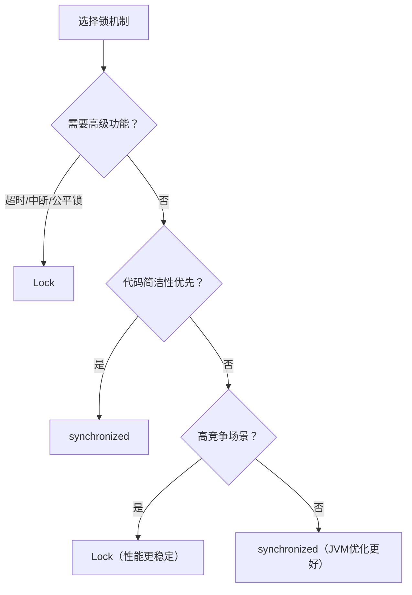
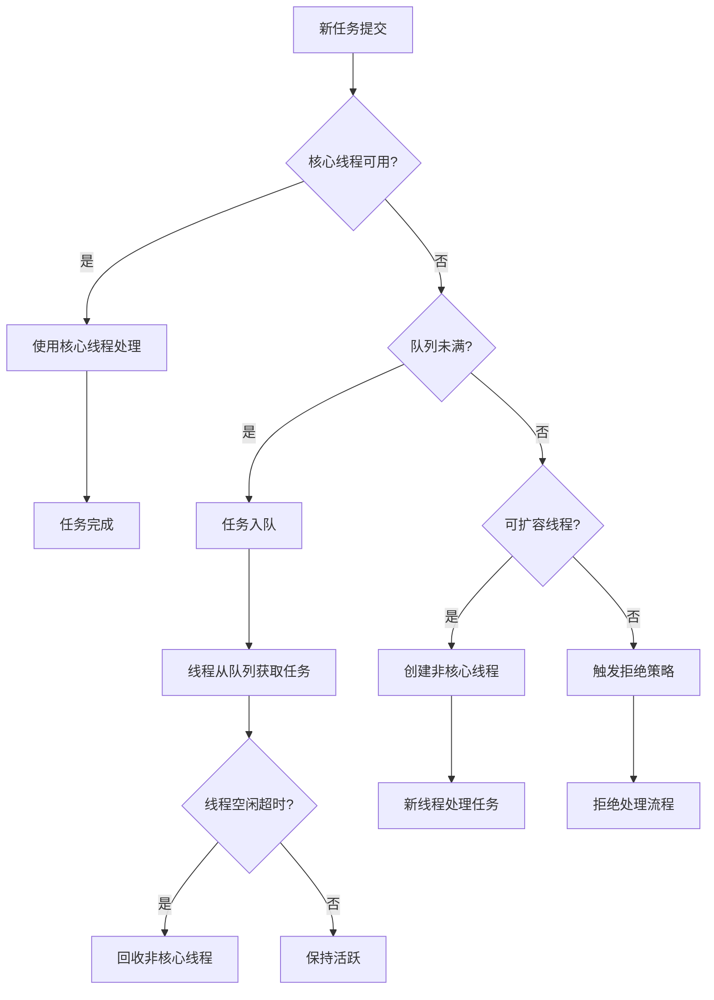

# 集合
## P0面试优先级（2026）
- `P0-1` HashMap/ConcurrentHashMap：数据结构、扩容、并发控制、JDK7/8差异。
- `P0-2` 线程安全与JMM：`volatile`、`synchronized`、`happens-before`、可见性/有序性/原子性。
- `P0-3` AQS体系：`ReentrantLock`、`Semaphore`、`CountDownLatch`、`Condition`。
- `P0-4` 线程池：核心参数、拒绝策略、线程池隔离与常见事故（队列打满、任务堆积）。
- `P0-5` CAS与无锁：ABA问题、`Atomic*` 与 `LongAdder` 的适用边界。
- `P0-6` ThreadLocal：结构、内存泄漏根因、线程池场景 `remove()`。


## P0常见误区修正（本页已修订）
- HashMap 扩容触发条件是“元素个数超过阈值”，不是“必须发生哈希冲突”。
- HashSet 底层复用 HashMap 的固定哨兵值（`PRESENT`），不是每次都 `new Object()`。
- `ThreadLocalMap` 不是 `HashMap`，而是 ThreadLocal 私有实现（Entry 数组 + 开放寻址）。
- 偏向锁属于老版本JDK优化点（JDK 15 起已移除），面试回答要标注版本前提。
## 集合类继承关系
* Collection
	* List  
	    - ArrayList  
	    - LinkedList  
	    - CopyOnWriteArrayList  
	- Set  
	    - HashSet  
	    - TreeSet  
	- Queue  
	    - Deque
	    - ArrayDeque  
	    - PriorityQueue
* Map
	* HashMap  
	- ConcurrentHashMap  
	- TreeMap  
	- ConcurrentSkipListMap  
	- LinkedHashMap
## Collection
### ArrayList
* 懒加载的思想
* 初始化10
* 1.5倍扩容
### LinkedList
根据查找index的位置决定从前往后查找还是从后往前查找

> 编者注：需了解ArrayList和LinkedList的底层原理与区别。
### HashSet
HashSet底层基于HashMap，实际是 `map.put(e, PRESENT)`，Key是Set元素，Value是一个固定哨兵对象（`PRESENT`）。
### CopyOnWriteArrayList

其set方法很有意思，如果set的元素和原来元素相同，他会重新复制一下原数组的引用，这是为了保证volatile的语义，否则如果set不一样的元素会刷新内存，保存一样的元素不刷新内存，这会导致set方法之前的语句是否具有可见性表现出两种不同的现象，这样会导致代码很奇怪
- 缺点  
	读多写少场景  
	内存消耗大  
	数据一致性，可能读不到刚写的数据

#### 原理
* 写时复制 
	* 每次添加元素的时候，操作者需要获取锁，也就意味着不能同时添加，添加的人会在原数组的基础上copy出新的数组，在新数组上写操作，最后变换引用。
* 读操作，无锁直接读，所以可能读不到刚添加的元素

### CopyOnWriteArraySet
* `CopyOnWriteArraySet`底层是`CopyOnWriteArrayList`，循环比较保证Set不重复

## Map
### HashMap
#### HashMap的数据结构是什么样的？::  
- **数组 + 链表 + 红黑树**（链表长度 ≥8 且数组长度 ≥64 时，链表转红黑树；红黑树节点 ≤6 时转回链表）
- 数组索引通过 `(n - 1) & hash` 计算（`n` 是数组长度）
> 为什么这么设计？1.7中仅仅是拉链法
> * 解决哈希碰撞性能退化：将过长的链表转换为红黑树，将最坏情况下的查找/插入时间复杂度从 O(n) 优化到 O(log n)，极大地提升了在存在严重哈希冲突时的性能稳定性，增强了抵御哈希碰撞攻击的能力。
> * 平衡开销：树化需要额外空间和构造时间，默认阈值 8 是基于**泊松分布**统计得出的，链表长度达到 8 的概率极低（约千万分之六）。在极低概率的长链表场景下用空间和时间换取性能是值得的。退化阈值 6 避免了在临界值附近频繁转换的开销。
#### 关键参数
- `DEFAULT_INITIAL_CAPACITY = 16`
- `DEFAULT_LOAD_FACTOR = 0.75f`
- 扩容阈值 = 容量 × 负载因子。
#### 如何解决hash冲突以及应用场景? :: 
- 开放定址法  
	- ThreadLocal：线性探测  
- 再哈希法  
	- 布隆过滤器  
- 链地址法  
	- HashMap  
- 建立公共溢出区  
#### 讲一下HashMap的懒加载？::
- 第一次调用put方法的时候才会初始化
#### 讲一下HashMap的扩容机制？::
* 首次调用put方法时，HashMap会发现table为空然后调用resize方法进行初始化。  
* 非首次调用put方法时，当元素个数超过threshold（阈值，容量 × 负载因子）就会触发扩容。  
* 链表长度大于8 且数组长度小于64 会进行扩容。
* 扩容时数组大小翻倍（`newCap = oldCap << 1`）。
- 重新计算元素位置：`newIndex = e.hash & (newCap - 1)`。
- **Java 8 优化**：扩容后元素位置要么在原索引，要么在 `原索引 + oldCap`。
>  扩容时节点重定位优化：利用高位哈希位，元素在新数组中的位置要么是原索引 `i`，要么是 `i + oldCap`，无需重新计算所有哈希值，只需判断新增的高位 bit 是 0 还是 1。提高了扩容效率。
#### HashMap有什么并发问题？::  
* 1.7：头插
	* JDK 7 头插法在并发扩容下有成环风险（可能导致死循环）
    * 实际上头插法比尾插法效率高
* 1.8：尾插
* **死循环**（Java 7 链表头插法导致，Java 8 改用尾插法已解决）。
- **数据丢失**：并发 put 时覆盖键值对。
- **size 不准确**：并发更新导致统计错误。
> - 1.8中采用尾插法： 解决了 Java 7 并发扩容时头插法可能导致的死循环问题（虽然 HashMap 本身还是线程不安全，但这个优化为安全使用提供了更好的基础，也为 CHM 的优化铺平了道路）。
#### Key 的设计要求
- 重写 `hashCode()` 和 `equals()` 方法。
- **不可变性**：避免修改 Key 导致哈希值变化（如用 `String`、`Integer` 作 Key）。

#### HashMap演进
核心是**优化单线程或低冲突场景下的性能，特别是解决严重哈希冲突导致的性能悬崖问题**，通过引入红黑树和优化扩容策略实现。线程安全问题仍需外部解决（如 `Collections.synchronizedMap` 或使用 `CHM`）。
#### HashMap其他内容
- 二次散列  
- 扰动函数  
> 编者注：需了解：
> * HashMap的底层数据结构
> 	* 负载因子
> 	* hash冲突
> 	* 树化与链化
> * HashMap的put执行流程
> * HashMap的扩容机制
> * HashMap在多线程下存在什么问题

> * **核心：** 提供最快的查找、插入和删除操作（平均时间复杂度 `O(1)`）。它**不保证**元素的任何顺序（插入顺序、访问顺序或键的自然顺序）。迭代顺序不保证稳定，元素增删或扩容（Rehashing）后可能发生变化。

#### 使用场景
- **最常用、默认选择。** 当你**只需要高效的键值对存储和查找，完全不关心元素的迭代顺序**时。
- 缓存实现（需要结合过期策略）。
- 需要快速根据键查找值的任何场景。
- 存储对象属性映射。
- 统计频率（例如词频统计：`map.put(word, map.getOrDefault(word, 0) + 1)`）。

### ConcurrentHashMap

#### 关键方法

- **`putVal()`**：
	- 桶为空时：用 `CAS` 写入头节点（无锁）。
	- 桶非空时：`synchronized` 锁头节点后插入。
- **`get()`**：无锁（通过 `volatile` 保证可见性）。
- **`transfer()`（扩容）**：
	- 支持多线程协同扩容（线程可帮助迁移数据）。
	- 通过 `ForwardingNode` 标记迁移中的桶。
- **`size()`（计数）**：
	- 使用 `CounterCell[]`（类似 LongAdder）分段统计，避免竞争。
#### ConcurrentHashMap如何解决并发问题的？::
- 并发处理 
	- Java 7 分段锁（Segment）
		- 结构：分多个 Segment（继承 `ReentrantLock`），每个 Segment 是一个小的 HashMap。
		- 并发度：锁粒度是 Segment 级别，不同 Segment 可并行操作。
	- Java 8 的优化（CAS + synchronized）
		* 锁粒度细化
		    - 锁单个数组桶（链表头节点/红黑树根节点），并发度 = 数组长度。
		    - 使用 `synchronized` 锁头节点（非整个表），减少锁竞争。
- sizeCtrl的含义  
	- **-1 : 初始化。初始化的时候会尝试CAS将sizeCtrl设置为-1**
	- **>0 ：扩容阈值。容量 × 负载因子**
	- **-n：-( 1 + count )。表示扩容线程 + 1**
- hash函数的特殊处理  
	- hash >= 0：是Node节点；  
	- hash = -2：是TreeBin,表示该table元素是红黑树的节点；  
	- hash = -1：是ForwardingNode；容器正在扩容  
	- hash = -3：是ReservationNode，在调用computeIfAbsent方法时可能会使用的占位对象  
#### ConcurrentHashMap是如何扩容的？::
##### 扩容触发时机 (`transfer()` 的调用点)

扩容并非由一个单独的线程主动发起，而是在 **写操作 (如 `putVal`, `computeIfAbsent` 等)** 过程中，由 **多个线程协作完成** 的。触发点主要有两个：

1. **新增元素后超过阈值：**
    - 当一个线程成功添加一个新节点后，会检查当前 `table` 中元素总数（通过 `addCount()` 更新 `baseCount` 和 `CounterCell` 估算）。
    - 如果估算的总数 **超过了 `sizeCtl` 的值** (此时 `sizeCtl` 等于 `容量 * 负载因子`，即扩容阈值)，则会调用 `transfer()` 开始扩容。
    - **注意：** `sizeCtl` 在此时是一个正数，代表扩容阈值。
2. **链表转树时发现表太小：**
    - 在尝试将链表转换为红黑树 (`treeifyBin()`) 时，会先检查当前 `table` 的长度。
    - 如果当前 `table` 长度 **小于 `MIN_TREEIFY_CAPACITY` (默认 64)**，则**不会进行树化**，而是改为调用 `tryPresize()` -> `transfer()` 进行**扩容**。扩容可以分散元素，减少单个桶的冲突，从而可能避免树化的开销。
##### 核心控制变量：`sizeCtl`

`private transient volatile int sizeCtl;`

`sizeCtl` 是一个 **`volatile`** 修饰的 `int` 变量，它是 CHM 并发控制的 **核心枢纽**，承担着 **多重职责**，其值的含义随着 CHM 所处的状态而 **动态变化**：

|**`sizeCtl` 的值**|**代表的含义**|
|---|---|
|**`-1`**|**初始化中 (Initialization Lock):** 表示 `table` 数组正在由某个线程进行初始化。其他线程检测到此状态会 `yield` 或 `Thread.yield()` 让出 CPU 等待。|
|**`-(1 + n)`**|**扩容中 (Resizing):** `n` (正整数) 表示当前正在 **协助扩容的线程数量**。例如 `-2` 表示有 1 个线程在扩容 (`-(1+1)`)，`-3` 表示有 2 个线程 (`-(1+2)`)。|
|**`>= 0`**|**正常状态：**  <br>1. **`table == null` 时：** 表示创建时指定的 **初始容量** (如果未指定则为 0)。  <br>2. **`table != null` 时：** 表示下一次触发扩容的 **阈值 (`capacity * loadFactor`)**。|

**`sizeCtl` 的关键操作：**

1. **初始化 (`initTable()`):**
    - 线程通过 `CAS` 尝试将 `sizeCtl` 从初始值（可能是0或指定的初始容量）设置为 `-1`。成功设置的线程获得初始化权。
    - 初始化完成后，将 `nextTable` 置为 `null`，并将 `sizeCtl` 设置为 **新的扩容阈值 (`0.75 * n`)**。
2. **触发扩容 (`addCount()`, `tryPresize()`):**
    - 线程检测到需要扩容时，会先尝试通过 `CAS` **将 `sizeCtl` 从当前阈值修改为 `-(1 + n)`** (初始 `n=1`，表示自己作为第一个扩容线程)。这相当于设置一个“扩容中”的标志并记录协助线程数起点。
    - 如果 `CAS` 失败，说明其他线程已经触发了扩容，当前线程可能转为协助者。
3. **协助扩容 (`helpTransfer()`):**
    - 线程在执行写操作时，如果发现当前桶的头节点是 `ForwardingNode` (表示该桶已迁移完或正在迁移)，或者检测到 `sizeCtl < 0` (表示正在扩容中)，则会尝试调用 `helpTransfer(tab, f)` 协助扩容。
    - 在 `helpTransfer` 中，线程会再次确认需要协助，然后尝试通过 `CAS` **将 `sizeCtl` 的值 `+1`** (即增加协助线程计数 `n`)。成功 `CAS` 后，该线程加入迁移大军。


##### 扩容流程 (`transfer()`) 详解

1. **计算步长 (Stride) 和任务分配：**
    - 首个触发扩容的线程（或协助线程）会创建一个新的、**容量翻倍** 的 `nextTable`。
    - 维护一个全局的 **`transferIndex`** 变量，表示 **旧表 (`table`) 中尚未被分配迁移任务的最高索引位置 + 1**（初始值 = `oldTable.length`）。
    - 每个参与扩容的线程 (包括触发者和协助者) 在进入 `transfer()` 时，会通过 `CAS` **原子性地减少 `transferIndex`** 来 **领取一个迁移任务区间**。这个区间的大小称为 **步长 (stride)**。
        - 如果 `table` 较小（`<= 16`），步长固定为 16 (最小粒度)。
        - 否则，步长通常为 `(n >>> 3) / NCPU`（`n` 是旧表长度），但会有一个最小步长限制 (`MIN_TRANSFER_STRIDE=16`)。
    - 线程领取的任务区间是 `[transferIndex - stride, transferIndex - 1]`，然后将 `transferIndex` 更新为 `transferIndex - stride`。例如：旧表长 64，`transferIndex` 初始 64，线程 A 领取步长 16，则任务区间为 [48, 63]，`transferIndex` 变为 48。
2. **按区间迁移数据：**
    - 线程从它领取的 **最高索引** 开始（如上面的 63），**逆序** 向低索引方向（如 62, 61...）逐个迁移桶。
    - 迁移一个桶时：
        - 对该桶加锁 (`synchronized` 锁住旧桶的头节点)。
        - 遍历桶中的链表或树。
        - 根据新表的容量 (`nextTable.length`)，**重新计算每个节点在新表中的位置**。得益于新容量是旧容量的 2 倍，节点的新位置只可能是以下两种之一：
            - **位置 i** (与原旧表位置相同)
            - **位置 i + oldCap** (原位置 + 旧表长度)
        - 将节点按新位置构建链表或树，放入 `nextTable`。
        - 在旧桶的位置放置一个 **`ForwardingNode`** 节点。这个特殊节点：
            - 指向新表 (`nextTable`)。
            - 当其他线程（读/写）访问到这个桶时，知道该桶已迁移，会转向新表查询或协助迁移。
            - 当写线程 (`put`) 遇到它时，会先阻塞等待迁移完成或参与协助迁移。
3. **任务完成与状态更新：**
    - 当一个线程完成它领取的整个区间的迁移任务后：
        - 它会再次尝试领取新的区间（重复步骤 1）。
        - 如果 **无法再领取到新的区间** (`transferIndex <= 0`)，说明所有桶都已分配出去。
    - 该线程会通过 `CAS` **将 `sizeCtl` 中的协助线程数 `n` 减 1** (`sizeCtl = sizeCtl + 1`)。
    - **最后一个完成迁移的线程：**
        - 在减少 `sizeCtl` 后，会检查是否自己是最后一个线程 (`(sc - 2) == resizeStamp(n) << RESIZE_STAMP_SHIFT`，这是一个复杂的位运算校验，核心是判断协助线程数是否归零)。
        - 如果是最后一个线程：
            - 将 `table` 指向扩容完成的新表 `nextTable`。
            - 将 `nextTable` 置为 `null`。
            - 将 `sizeCtl` 设置为 **新表的扩容阈值 (`(newCapacity * loadFactor)`)**（一个正数），扩容结束。
4. **协助扩容 (`helpTransfer()`) 如何融入：**
    - 其他线程（通常是执行 `put` 的线程）在操作过程中遇到 `ForwardingNode` 或检测到 `sizeCtl < 0`，会调用 `helpTransfer()`。
    - 在 `helpTransfer()` 中：
        - 确认确实需要协助（检查 `nextTable` 不为 `null`）。
        - 尝试通过 `CAS` **将 `sizeCtl` 中的 `n` 加 1** (`sizeCtl = sizeCtl - 1`)。
        - 如果 `CAS` 成功，该线程加入迁移大军，调用 `transfer()` 参与数据迁移（从步骤 1 开始，领取任务区间）。
        - 如果 `CAS` 失败（可能扩容刚好结束），则继续执行原操作。

##### 扩容流程与 `sizeCtl` 状态变化

1. **初始状态 (正常读写)：** `table` 已初始化，`sizeCtl = threshold > 0` (例如 12，容量16，负载因子0.75)。
2. **触发扩容 (`put` 后 `addCount()` 发现超阈值)：**
    - 线程 T1 尝试 `CAS` 将 `sizeCtl` 从 12 改为 `-(1 + 1) = -2`。成功。
    - T1 成为首个扩容线程。创建 `nextTable` (容量32)。`transferIndex = 16`。
3. **领取任务与迁移：**
    - T1 计算步长 (假设为 16)，通过 `CAS` 将 `transferIndex` 从 16 改为 0 (`transferIndex = transferIndex - stride`)。领取区间 [0, 15]。
    - T1 开始从桶 15 向桶 0 迁移。在每个桶迁移完后放置 `ForwardingNode`。
4. **协助线程加入：**
    - 线程 T2 执行 `put`，访问到桶 10 (已被迁移，是 `ForwardingNode`)。
    - T2 调用 `helpTransfer()`。
    - T2 尝试 `CAS` 将 `sizeCtl` 从 -2 改为 -3 (`sizeCtl = sizeCtl - 1`)。成功。
    - T2 加入 `transfer()`。此时 `transferIndex=0`，无法领取新任务，直接参与迁移（可能帮助完成剩余工作）。
5. **任务完成与状态更新：**
    - T1 和 T2 协作完成所有桶的迁移。
    - T1 或 T2 在完成自己最后的任务后，尝试领取新区间失败，减少 `sizeCtl` (假设 T2 最后减)。
    - T2 将 `sizeCtl` 从 -3 改为 -2 (`sizeCtl = sizeCtl + 1`)。
    - T2 检查发现自己是最后一个线程 (`(sc - 2) == resizeStamp(16) << RESIZE_STAMP_SHIFT` 成立)。
    - T2 执行收尾工作：
        - `table = nextTable` (指向新表 32)。
        - `nextTable = null`。
        - `sizeCtl = (32 * 0.75) = 24` (新的扩容阈值)。
6. **回到正常状态：** 所有读写操作基于新表进行，`sizeCtl = 24 > 0`。

> 关于`lastRun`? TODO

#### ConcurrentHashMap在红黑树上为什么有双向链表指针？

* 保证ConcurrentHashMap在写的时候，红黑树发生旋转，不影响对ConcurrentHashMap的读操作。
* 在扩容的时候是通过双向链表来迁移数据的。
#### 线程安全设计

- `volatile Node<K,V>[] table`：保证数组引用可见性。
- `volatile Node next`：保证链表遍历可见性。
- `UNSAFE.compareAndSwap***`：实现无锁更新。

> 编者注：需了解：
> * ConcurrentHashMap如何解决并发问题
> * ConcurrentHashMap是如何扩容的
> * ConcurrentHashMap中sizeCtrl的含义

#### CHM的演进
- **Java 5 - Java 7：分段锁 (`Segment Locking`)**
    - **结构：** 将整个哈希表分成多个固定数量的 **`Segment`** (默认为 16)。每个 `Segment` 本质上是一个继承 `ReentrantLock` 的小型 `HashMap` (数组+链表)。
    - **并发控制：**
        - 操作不同 `Segment` 的线程可以**完全并行**。
        - 操作同一个 `Segment` 的线程需要竞争该 `Segment` 的锁（串行）。
    - **演进原因 (当时)：**
        - **解决 `Hashtable`/`synchronizedMap` 的全局锁瓶颈：** 相对于对整个 Map 加一把大锁 (`Hashtable` 或 `Collections.synchronizedMap(new HashMap())`)，分段锁将锁的粒度从整个表缩小到一个 `Segment`，显著提高了并发度（最高等于 `Segment` 的数量）。
        - **提供真正的并发读写：** 允许同时进行多个读操作和不同 `Segment` 上的写操作。
    - **存在的问题/局限性：**
        
        - **并发度固定且受限：** `Segment` 的数量在创建时就固定了（通过 `concurrencyLevel` 指定，默认为 16）。即使后期 Map 扩容到非常大，并发度也无法提升，可能成为瓶颈。无法动态适应更高的并发需求。
        - **锁粒度相对较粗：** 一个 `Segment` 包含多个桶。即使两个线程操作同一个 `Segment` 中不同的桶（没有实际冲突），也需要竞争同一把锁，造成不必要的阻塞。
        - **内存开销：** 每个 `Segment` 都维护着自己的数组等结构，存在一定的内存开销。
        - **实现相对复杂：** 需要维护两层结构 (`Segments` 和 `Tables`)。
- **Java 8+：桶锁 (`Bucket Locking`) + CAS + `synchronized`**
    - **结构：** 回归到类似 `HashMap` 的单层结构：数组 + 链表 + 红黑树（共享了 `HashMap` 的优化）。
    - **核心并发控制机制：**
        - **`CAS` (Compare-And-Swap)：** 用于**无锁化**的操作：
            - 初始化 `table`。
            - 在**桶为空**时尝试 `CAS` 写入新节点（避免锁）。
            - `size()` 计数 (使用 `CounterCell` 数组分段计数，类似 `LongAdder`)。
            - 协助扩容时标记桶的状态 (`ForwardingNode`)。
        - **`synchronized`：** 用于**桶级别**的锁定。
            - 当桶**非空**（链表头节点或树根节点已存在）时，对该**头节点/根节点**加 `synchronized` 锁。
            - 锁粒度细化到**单个桶**。操作不同桶的线程完全并行。
        - **`volatile`：** 保证数组引用 (`table`) 和节点 `next` 指针的**内存可见性**，使得 `get()` 操作完全**无锁**。
    - **关键优化点：**
        - **锁粒度极致细化：** 锁单个桶（头节点），并发度理论上等于桶的数量，可以随着 `table` 扩容而动态增长，远高于固定 `Segment` 的方式。不同桶的操作完全并行。
        - **无锁读 (`get`)：** 利用 `volatile` 读，性能极高。
        - **无锁初始化/CAS写入：** 对于空桶的写入非常高效。
        - **更智能的扩容 (`transfer`)：**
            - **多线程协同扩容：** 当有线程进行 `put` 操作时发现正在扩容，会主动帮助迁移数据 (`helpTransfer`)，加快扩容速度。
            - **`ForwardingNode`：** 迁移中的桶会被替换为一个特殊的 `ForwardingNode` 节点。查询操作遇到它会被转发到新表；写操作遇到它会先协助迁移。
        - **共享 `HashMap` 的红黑树优化：** 同样解决了长链表性能问题。
        - **内存更紧凑：** 单层结构，避免了 `Segment` 的额外开销。
    - **演进原因 (根本驱动力)：**
        - **解决分段锁的固定并发度瓶颈：** 桶锁的并发度随 `table` 大小动态扩展，能更好地利用现代多核处理器。
        - **进一步减小锁粒度，降低冲突概率：** 将锁从一组桶 (`Segment`) 缩小到一个桶，显著减少了线程间不必要的锁竞争。
        - **利用现代 JVM 对 `synchronized` 的优化：** Java 6 以后，JVM 对 `synchronized` 进行了大量优化（偏向锁、轻量级锁、锁消除、锁粗化、适应性自旋等），使得在低竞争场景下 `synchronized` 的性能开销已经非常接近 `CAS`，甚至更低（避免了 `CAS` 的忙等开销）。同时 `synchronized` 是 JVM 内置原语，更易于优化。
        - **利用 CAS 实现无锁化基础操作：** 在安全的前提下（如空桶写入），使用 CAS 完全避免锁开销。
        - **简化实现：** 单层数据结构比两层结构更清晰、更易于维护和优化。

#### 总结演进原因与核心思想

1. **性能是永恒追求：** 无论是 `HashMap` 引入红黑树解决 O(n) 退化，还是 `CHM` 从分段锁到桶锁，核心目标都是**提升操作速度，尤其是高并发下的吞吐量**。
2. **锁粒度越来越细：** `CHM` 的演进史就是一部**锁粒度不断细化**的历史：
    - 全局锁 (`Hashtable`) -> 分段锁 (`CHM-Java7`) -> **桶锁 (`CHM-Java8`)**  
        更细的锁意味着更低的冲突概率、更高的并行度。
3. **无锁化 (Lock-Free) 技术的应用：** 在安全且可行的场景（读、空桶写、计数、状态标记）优先使用 **`volatile` + `CAS`** 实现无锁操作，最大化性能。
4. **拥抱 JVM 优化：** Java 8 `CHM` 选择 `synchronized` 而非 `ReentrantLock`，是充分信任并利用了现代 JVM 对内置锁的强大优化能力。
5. **数据结构共享与优化：** `CHM` Java 8 借用了 `HashMap` Java 8 的红黑树优化，共同解决了哈希冲突的性能瓶颈。扩容策略优化也提高了效率。
6. **动态适应与协作：** Java 8 `CHM` 的并发度动态可变，线程能协作扩容，体现了更好的**弹性和协作性**。
    
> * 理解 **`HashMap` Java 8 引入红黑树的原因和效果**（解决哈希冲突性能退化，O(n)->O(log n)）。
> * 深刻理解 **`ConcurrentHashMap` 从分段锁到桶锁+`CAS`+`synchronized` 演进的根本原因**（解决固定并发度瓶颈、进一步细化锁粒度、利用现代 JVM 优化）。
> * 掌握 **Java 8 `CHM` 的核心并发控制机制**：
> 	* `get()`：无锁 (`volatile` 读)。
> 	* 空桶 `put`：`CAS`。
> 	* 非空桶 `put`：`synchronized`(锁头节点)。
> 	* `size()`：分而治之 (`CounterCell`，类似 `LongAdder`)。
> 	* 扩容：多线程协作 + `ForwardingNode`。
   >* - 对比 **`synchronized` vs `ReentrantLock` 在 `CHM` 中的选择原因**（JVM 优化、开发简便性）。
   >* 理解 **`volatile`、`CAS`、`synchronized` 在 `CHM` 中各自扮演的角色**及其带来的性能优势。
   
> 加分项：
> * 解释 **哈希扰动函数** `(h = key.hashCode()) ^ (h >>> 16)`（高位参与运算，减少冲突）。
> * 了解 **CHM 中的 `ForwardingNode`**（扩容时转发查询）。
> * 理解 **`sizeCtl` 的作用**（控制初始化、扩容状态）。


### HashMap vs ConcurrentHashMap

| **特性**       | **HashMap** | **ConcurrentHashMap**       |
| ------------ | ----------- | --------------------------- |
| **线程安全**     | ❌ 不安全       | ✅ 安全                        |
| **锁机制**      | 无锁          | Java 7：分段锁；Java 8：桶级锁 + CAS |
| **Null 键/值** | ✅ 允许        | ❌ 不允许（会抛 NPE）               |
| **迭代器**      | `Fail-Fast` | `Weakly Consistent`（弱一致性）   |
| **性能开销**     | 低（单线程）      | 中等（锁细化降低竞争）                 |

### ConcurrentSkipListMap
跳表  

### LinkedHashMap

**继承自 `HashMap`**。在 `HashMap` 的基础上，**增加了一个双向链表**。这个链表贯穿所有条目（Entry）。这个链表决定了迭代顺序。
    
- 顺序类型：
    - **插入顺序 (默认)：** 元素按照第一次被插入到 Map 中的顺序进行迭代。**这是最常见的使用模式。**
    - **访问顺序：** 元素按照最近最少使用（**LRU - Least Recently Used**）的顺序进行迭代。最近访问过（调用 `get()` 或 `put()` 更新值）的元素会被移动到链表尾部。通过构造函数 `LinkedHashMap(int initialCapacity, float loadFactor, boolean accessOrder)` 并将 `accessOrder` 设置为 `true` 来启用。
- 实现： 在 `HashMap` 的哈希表结构外维护一个双向链表。每次插入新元素时，会将其添加到链表尾部（或根据访问顺序调整位置）。
- 性能： 比 `HashMap` 稍慢一点点，因为需要维护链表。但 `get()` 和 `put()` 操作的平均时间复杂度仍然是 `O(1)`。迭代遍历比 `HashMap` 快，因为它直接遍历链表，不需要遍历整个哈希桶数组。
#### 使用场景：

- 需要**保持元素插入顺序**进行迭代。例如：
	
	- 记录用户操作步骤（按操作时间插入）。
	- 需要按照配置项加载顺序处理的场景。
	- 需要输出与输入顺序一致的映射结果。
		
- 需要实现 **LRU (Least Recently Used) 缓存淘汰策略** (通过设置 `accessOrder=true` 并重写 `removeEldestEntry(Map.Entry eldest)` 方法)。
- 在需要 `HashMap` 性能但同时又需要可预测迭代顺序的场景下替代 `HashMap`。

### TreeMap

- 核心： 基于**红黑树（Red-Black Tree）** 实现。元素根据其键的**自然顺序**（`Comparable` 接口）或创建时提供的 **`Comparator`** **进行排序**。迭代时元素按排序后的顺序输出。
    
- 实现： 红黑树是一种自平衡的二叉搜索树，保证了基本的插入、删除、查找操作的时间复杂度为 `O(log n)`。
    
- 功能： 实现了 `SortedMap` 和 `NavigableMap` 接口，提供了丰富的基于**排序**的操作：
    
    - 获取子集 (`subMap(K fromKey, K toKey)`)。
    - 获取头部/尾部子集 (`headMap(K toKey)`, `tailMap(K fromKey)`)。
    - 获取第一个 (`firstKey()`) / 最后一个 (`lastKey()`) 键。
    - 获取大于等于 (`ceilingKey(K key)`) / 小于等于 (`floorKey(K key)`) / 大于 (`higherKey(K key)`) / 小于 (`lowerKey(K key)`) 某个键的键。
- 性能： 查找、插入、删除操作的时间复杂度为 `O(log n)`，比 `HashMap` 和 `LinkedHashMap` 慢。**不适合需要极高频率写操作的场景。**
    
#### 使用场景
    
- **需要元素按键排序**进行迭代或操作。例如：
	
	- 按字母顺序或数字大小顺序展示数据。
	- 实现字典、电话簿等需要排序的映射。
		
- **需要范围查询**（Range Queries）或获取排序相关的视图（如子映射）。例如：
	
	- 查找成绩在 80-90 分之间的所有学生。
	- 获取某个时间范围内的日志记录。
		
- **需要频繁获取最小键或最大键**（`firstKey()`/`lastKey()`）或进行相邻键查找（`ceilingKey()`/`floorKey()`等）的场景。
### 对比

* HashMap
	* 底层数据结构：数组 + 链表/红黑树
	* 迭代顺序：无保证的随机顺序
	* 是否允许`null`：Key 和 Value **都允许** `null` 
	* 性能 (平均)：`O(1)` (get, put)        
	* 排序依据：无
	* 实现接口：Map
	* 线程安全：**否** (需用 `Collections.synchronizedMap` 或 `ConcurrentHashMap`)
* LinkedHashMap
	* 底层数据结构：数组 + 链表/红黑树 + 双向链表
	* 迭代顺序：**可预测的顺序** (插入顺序 或 访问顺序)
	* 是否允许`null`：Key 和 Value **都允许** `null` 
	* 性能 (平均)：`O(1)` (get, put)        
	* 排序依据：插入顺序或访问顺序
	* 实现接口：Map
	* 线程安全：**否** (需用 `Collections.synchronizedMap` 或 `ConcurrentHashMap`)
* TreeMap
	* 底层数据结构：**红黑树** (自平衡二叉搜索树)
	* 迭代顺序：**排序顺序** (自然顺序 或 自定义顺序)
	* 是否允许`null`：**Key 不允许** `null` (取决于比较器)
	* 性能 (平均)：``O(log n)` (get, put, containsKey)
	* 排序依据：Key 的自然顺序 或 Comparator
	* 实现接口：Map, **SortedMap**, **NavigableMap**
	* 线程安全：**否** (需用 `Collections.synchronizedMap` 或 `ConcurrentHashMap`)

# 并发

## Java中有哪些实现线程安全的方式？::
1. **使用同步机制**：可以使用关键字[`synchronized`](#synchronized) 或 `ReentrantLock` 类来实现互斥访问，确保同一时间只有一个线程可以访问共享资源。
2. **使用原子类**：Java提供了一系列原子类，如 `AtomicInteger`、`AtomicLong`、`AtomicReference` 等，它们提供了原子操作，保证了操作的原子性，避免了多线程竞争的问题。
3. **使用线程安全的集合类**：Java提供了线程安全的集合类，如 `ConcurrentHashMap`、`CopyOnWriteArrayList` 等，它们在内部实现上使用了同步机制，可以安全地在多线程环境下使用。
4. **使用volatile关键字**：`volatile` 关键字可以确保共享变量的可见性，即对一个 `volatile` 变量的写操作对于其他线程是立即可见的，从而避免了多线程之间的数据不一致问题。
5. **使用ThreadLocal类**：`ThreadLocal` 类提供了线程局部变量的功能，每个线程都有自己独立的变量副本，避免了线程间的数据共享和竞争。
6. **使用并发工具类**：Java提供了一系列并发工具类，如 `CountDownLatch`、`CyclicBarrier`、`Semaphore` 等，它们可以实现线程间的协调和同步，确保多线程操作的正确性。
7. **使用不可变对象**：不可变对象是指创建后状态不可变的对象，比如用[final]()修饰的变量。它们不需要额外的同步机制就可以在多线程环境下安全地共享。
## Java的内存模型
### 什么是JMM？::
JMM（Java Memory Model）是Java内存模型的缩写，它定义了Java程序中多线程并发访问共享内存时的行为规范。JMM规定了线程如何与主内存和线程本地内存交互，以及如何保证可见性、有序性和原子性。
### 为什么要有JMM？::
1. **跨平台性**：
>JMM的设计目标之一是保证Java程序在不同平台上的一致性行为。通过在不同平台上定义共享内存的访问规则，JMM可以确保Java程序在各种操作系统和硬件架构上的一致性。
2. **提供并发编程的规范**：
>多线程编程中存在一些常见的问题，如竞态条件（Race Condition）、死锁（Deadlock）和内存可见性等。JMM提供了一套规范，定义了如何正确地编写并发程序，以避免这些问题。
3. **优化程序执行**：
>JMM还定义了一些允许编译器和处理器进行的优化规则。这些规则允许编译器和处理器对指令进行重排序，以提高程序的执行效率。同时，JMM也提供了一些特殊的指令和内存屏障，用于保证多线程环境下的可见性和有序性

### JMM规范了哪些内容？::
Java内存模型实际上就是规范了JVM如何提供按需禁用缓存和重排序优化的方法。其核心就包括[volatile](#volatile)、synchronized和final三个关键字，以及几项Happens-Before规则。

1. 所有共享变量都存储于主内存。这里说的变量指的是实例变量和类变量，不包含局部变量，因为局部变量是线程私有的，不存在竞争问题
2. 每个线程还存在自己的工作内存，线程的工作内存，保留了被线程使用的变量的工作副本，线程对变量的所有操作，都必须在工作内存中完成，而不能直接读写主内存中转来完成
3. 不同线程之间也不能直接访问对方工作内存中的变量，线程间变量值的传递需要通过主内存中转来完成
4. 内存屏障
5. Happens-Before原则
#### JMM规范了8中原子性操作
**lock（锁定）**：作用于主内存，它把一个变量标记为一条线程独占状态；
**read（读取）**：作用于主内存，它把变量值从主内存传送到线程的工作内存中，以便随后的load动作使用；
**load（载入）**：作用于工作内存，它把read操作的值放入工作内存中的变量副本中；
**use（使用）**：作用于工作内存，它把工作内存中的值传递给执行引擎，每当虚拟机遇到一个需要使用这个变量的指令时候，将会执行这个动作；
**assign（赋值）**：作用于工作内存，它把从执行引擎获取的值赋值给工作内存中的变量，每当虚拟机遇到一个给变量赋值的指令时候，执行该操作；
**store（存储）**：作用于工作内存，它把工作内存中的一个变量传送给主内存中，以备随后的write操作使用；
**write（写入）**：作用于主内存，它把store传送值放到主内存中的变量中。
**unlock（解锁）**：作用于主内存，它将一个处于锁定状态的变量释放出来，释放后的变量才能够被其他线程锁定；

>a = b 并不是原子性操作， read a; assign b;

Java内存模型还规定了执行上述8种基本操作时必须满足如下规则:
1. 不允许read和load、store和write操作之一单独出现（即不允许一个变量从主存读取了但是工作内存不接受，或者从工作内存发起写操作但是主存不接受的情况），以上两个操作必须按顺序执行，但没有保证必须连续执行，也就是说，read与load之间、store与write之间是可插入其他指令的。
2. 不允许一个线程丢弃它的最近的assign操作，即变量在工作内存中改变了之后必须把该变化同步回主内存。
3. 不允许一个线程无原因地（没有发生过任何assign操作）把数据从线程的工作内存同步回主内存中。
4. 一个新的变量只能从主内存中“诞生”，不允许在工作内存中直接使用一个未被初始化（load或assign）的变量，换句话说就是对一个变量实施use和store操作之前，必须先执行过了assign和load操作。
5. 一个变量在同一个时刻只允许一条线程对其执行lock操作，但lock操作可以被同一个条线程重复执行多次，多次执行lock后，只有执行相同次数的unlock操作，变量才会被解锁（重入）。
6. 如果对一个变量执行lock操作，将会清空工作内存中此变量的值，在执行引擎使用这个变量前，需要重新执行load或assign操作初始化变量的值。
7. 如果一个变量实现没有被lock操作锁定，则不允许对它执行unlock操作，也不允许去unlock一个被其他线程锁定的变量。
8. 对一个变量执行unlock操作之前，必须先把此变量同步回主内存（执行store和write操作）。

#### 什么是happens-before原则?
1. **程序次序规则**：一个线程内，按照代码顺序，书写在前面的操作先行发生于书写后面的操作。（这里说的是具有依赖性的代码，如果代码之间不存在依赖性，那么还是会出现指令重排序的情况，这条规则是用来保证单线程的执行的有序性）
2. **锁定规则**：一个`unlock`操作先行发生于后面对同一个锁的`lock`操作。
3. **volatile变量原则**：对一个变量的写操作先行发生于后面对这个变量的读操作。
4. **传递规则**：如果操作A先行发生于操作B，而操作B又先行发生于操作C，则可以得出操作A先行发生于操作C。
5. **线程启动规则**：Thread对象的`start()`方法先行发生于此线程的每一个动作。
6. **线程中断规则**：对线程`interrupt()`方法的调用先行发生于被中断线程的代码检测到中断事件的发生。
7. **线程终结规则**：线程中所有的操作都先行发生于线程的终止检测，我们可以通过`Thread.join()`方法结束、`Thread.isAlive()`的返回值手段检测到线程已经终止执行。
8. **对象终结规则**：一个对象的初始化完成先行发生于他的`finalize()`方法的开始。

### JMM和CPU多级缓存
JMM屏蔽了不同硬件细节，定义了不同机器下，Java程序中多线程并发访问共享内存时的行为规范，其中存在线程本地内存不一致的问题。在CPU多级缓存下，同样存在缓存不一致的问题。无论是JMM中线程工作内存和主存的不一致，还是CPU多级缓存和主存的不一致，java中提供了一系列关键字以及锁来影响这些行为。

### 一个可见性的例子
```java
public class ThreadTest {  
  
    public static int a = 0;  
  
    public static void main(String[] args) {  
        new Thread(() -> {  
            int tmp = a;  
            while (tmp < 50) {  
                synchronized (ThreadTest.class) {  
                    if (tmp != a) {  
                        try {  
                            Thread.sleep(100);  
                        } catch (InterruptedException e) {  
                            throw new RuntimeException(e);  
                        }  
                        tmp = a;  
                    }  
  
                }  
            }  
  
            System.out.println("read thread :" + a);  
        }, "read").start();  
  
        new Thread(() -> {  
            while (a < 50) {  
                    try {  
                        Thread.sleep(100);  
                    } catch (InterruptedException e) {  
                        throw new RuntimeException(e);  
                    }  
                    a++;  
            }  
            System.out.println("write thread :" + a);  
        }, "write").start();  
  
    }  
}
```
#### 解决方式
##### 方式一: volatile
```java
public static volatile int a = 0;  
```
##### 方式二：synchronized
```java
// 读线程增加synchronized
new Thread(() -> {  
    int tmp = a;  
    while (tmp < 50) {  
        synchronized (ThreadTest.class) {  
            if (tmp != a) {  
                try {  
                    Thread.sleep(100);  
                } catch (InterruptedException e) {  
                    throw new RuntimeException(e);  
                }  
                tmp = a;  
            }  
  
        }  
    }  
  
    System.out.println("read thread :" + a);  
}, "read").start();
```
##### 为什么这么加不可以？

```java
synchronized (ThreadTest.class) {  
	while (tmp < 50) {  
		if (tmp != a) {  
			try {  
				Thread.sleep(100);  
			} catch (InterruptedException e) {  
				throw new RuntimeException(e);  
			}  
			tmp = a;  
		}  
	}  
}  
```
这么加，a变量在循环中只会读取一次，因为synchronized只会执行一次；如果synchronized加在循环里面，由于synchronized执行多次，那么变量a就会多次从主存读取。
## 阻塞队列
* BlockingQueue
	* **ArrayBlockingQueue**
		* 数组有界队列
	* **LinkedBlockingQueue**
		* 链表有界队列，最大值Integer.Max
	* **PriorityBlockingQueue**
		* 支持优先级无界队列
	* **DelayQueue**
		* 优先级的延迟无界队列
	* **SynchronousQueue**
		* 不存储元素的阻塞队列，就是单个元素的队列
	* ...
## AQS
 
Java并发包 (`java.util.concurrent.locks`) 中构建锁（如 `ReentrantLock`）和同步器（如 `Semaphore`, `CountDownLatch`, `ReentrantReadWriteLock`）的**基础框架**。
### AQS是如何实现的？::
#### 核心设计
##### AQS的数据结构
* **volatile修饰的state**
	* **状态管理**：表示共享资源的状态（例如：锁的持有计数、信号量的许可数、计数器的剩余计数）。
* **Node组成的双向链表**
	* **CLH 变体队列：** 使用一个 **FIFO 双向队列**（CLH锁的变种）来管理未能立即获取资源的线程。这些线程会被包装成 `Node` 对象入队等待。
	* `Node` 类：代表等待线程的封装。
		* `waitStatus`：表示节点状态（`CANCELLED`, `SIGNAL`, `CONDITION`, `PROPAGATE`, `0`）。`SIGNAL` 是最常见的，表示后继节点需要被唤醒。
		- `prev`, `next`：指向前驱和后继节点。
		- `thread`：指向等待的线程。
		- `nextWaiter`：在条件队列或共享模式下有特殊用途。
* **Condition单链表**
##### 设计思想

- **模板方法模式：** AQS 定义了获取/释放资源的核心流程（如 `acquire(int arg)`, `release(int arg)`），但将**具体的资源获取/释放策略**留给子类通过实现 `tryAcquire(int arg)`, `tryRelease(int arg)` 等**protected**方法来实现（这是AQS灵活性的关键）。
- **独占 vs 共享模式：** AQS 支持两种模式。
	- **独占模式：** 同一时刻只有一个线程能成功获取资源（如 `ReentrantLock`）。
	- **共享模式：** 同一时刻可以有多个线程成功获取资源（如 `Semaphore`, `CountDownLatch`）。对应的方法如 `acquireShared`, `releaseShared`, `tryAcquireShared`, `tryReleaseShared`。
- **公平性 vs 非公平性：** 由子类在 `tryAcquire`/`tryAcquireShared` 中实现。
	- **非公平锁：** 新来的线程可以“插队”直接尝试获取锁（`tryAcquire` 中先检查 `state` 再尝试 CAS），无需先查看队列。可能导致饥饿，但吞吐量高。
		
	- **公平锁：** `tryAcquire` 中会先检查队列中是否有等待的节点（`hasQueuedPredecessors()`），如果有则直接失败，老老实实排队。保证顺序，减少饥饿。
- **可重入性：** 由子类管理（如 `ReentrantLock` 在 `state` 中记录持有锁的线程和重入次数，`tryAcquire` 检查当前线程是否是持有者）。
- **中断处理：** `acquire` 方法支持中断，但中断不会直接让线程退出获取流程，只是设置标志，线程醒来后会检查中断并可能抛出 `InterruptedException`（`lockInterruptibly()` 就是基于支持中断的 `acquire` 方法）。`acquire` 本身不抛异常。
- **超时机制：** `tryAcquireNanos` 等。
#### 核心方法
acquire方法：当线程尝试获取同步状态时，会调用AQS的acquire方法。该方法首先通过CAS操作尝试获取同步状态，如果成功则返回；如果失败，则线程会被加入到等待队列中，并进入阻塞状态。
release方法：当线程释放同步状态时，会调用AQS的release方法。该方法会释放同步状态，并尝试唤醒等待队列中的线程。

##### `acquire(int arg)` (获取资源- 独占模式为例)

1. 调用子类实现的 `tryAcquire(arg)` 尝试直接获取资源。
2. 如果成功，直接返回。
3. 如果失败，将当前线程包装成独占模式的 `Node.SIGNAL` 节点，**通过 CAS 安全地加入同步队列尾部**。
4. 调用 `acquireQueued(node, arg)`：在队列中自旋或阻塞。
	- 检查前驱节点是否是 `head`（表示轮到它了），如果是则再次尝试 `tryAcquire(arg)`。
	- 如果成功，将自己设为 `head`（原`head`出队），返回。
	- 如果失败或前驱不是 `head`，则根据前驱的 `waitStatus` 决定是否需要阻塞（通常调用 `LockSupport.park(this)`）。阻塞会被前驱节点释放资源时唤醒或线程中断唤醒。
5. 如果在阻塞等待中被中断，`acquireQueued` 返回 `true`，则 `acquire` 方法中会调用 `selfInterrupt()` 重新设置中断标志。
            
##### `release(int arg)` (释放资源 - 独占模式为例)
1. 调用子类实现的 `tryRelease(arg)` 尝试释放资源。
2. 如果释放成功（`state` 变为 0，表示完全释放），检查当前 `head` 节点（通常是持有资源的节点或虚拟节点）。
3. 如果 `head` 不为 `null` 且 `head.waitStatus != 0`（通常为 `SIGNAL`，表示它有责任唤醒后继），则调用 `unparkSuccessor(head)`。
4. `unparkSuccessor` 找到 `head` 后面第一个有效的（非取消的）后继节点（如果直接后继无效，则从队尾向前找），调用 `LockSupport.unpark(s.thread)` 唤醒它。
	
> 共享模式的流程 (`acquireShared`, `releaseShared`)：核心思想类似，但允许多个线程获取成功。`tryAcquireShared` 返回负数表示失败，非负数表示成功（返回值可能表示剩余资源量）。释放资源后，唤醒传播的方式不同（`PROPAGATE` 状态用于确保唤醒能传播下去）。
### AQS有哪些应用？::
* `ReentrantLock`
	* 独占模式，可重入，支持公平/非公平。`state` 表示持有锁的线程的重入次数。
* `ReentrantReadWriteLock`
	* 内部包含两个AQS子类（读锁共享模式，写锁独占模式），通过巧妙共享 `state` 变量（高16位读计数，低16位写计数）实现读写分离。
* `CountDownLatch`
	* 所有线程countDown，变成0，最后线程才执行
	* 做减法
	* 共享模式。`state` 表示初始计数值。`await()` 等待 `state` 减到 0（所有线程调用 `countDown()`，每次减1）。不可重置。
* `CyclicBarrier`
	* 所有线程await，变成某值，最后await的线程一起执行
	* 做加法
* `Semaphore`
	* 多个共享资源互斥
	* 共享模式。`state` 表示可用的许可数。`acquire()` 是获取许可（可能阻塞），`release()` 是释放许可。
* `FutureTask` (部分实现)： 内部使用AQS管理任务状态（未开始、完成、取消）。
### 如何使用？
可以通过继承 AQS 并仅仅实现少数几个 protected 方法（主要是 `tryAcquire`, `tryRelease`, `tryAcquireShared`, `tryReleaseShared`, `isHeldExclusively`），就能利用 AQS 提供的强大队列管理、阻塞/唤醒机制，构建出功能完整、线程安全的同步器。
- AQS 已经为你处理了：
	- 线程阻塞和唤醒 (`LockSupport`)。
	- 线程安全地入队/出队 (CAS 操作)。
	- 等待队列的管理 (FIFO 或公平性逻辑的一部分)。
	- 处理中断和超时的框架。
- **你（子类）只需要关注：**
	- 如何定义和修改 `state` 的含义。
	- 在 `tryXxx` 方法中定义：在什么条件下可以成功获取/释放资源？(例如：对于锁，`state==0`时获取成功；对于信号量，`state>0`时获取成功并减1)。
	- 是否支持可重入？(如果是锁，需要记录持有者线程和重入次数)。
	- 实现公平还是非公平？(在 `tryAcquire` 中是否检查队列)。
### AQS主要的面试点有哪些？::

1. **理解上述核心内容：** 能清晰阐述 AQS 的原理、核心组件、关键流程（获取/释放资源）、设计思想（状态、队列、模板方法）、两种模式。
2. **能解释 `state` 和队列的作用：** 这是基础。
3. **能描述 `acquire` (独占) 和 `release` (独占) 的主要步骤：** 这是高频考点。能说清楚 `tryAcquire` -> 入队 -> `acquireQueued` (自旋/检查前驱/阻塞) -> `setHead` / `unparkSuccessor` 这条主线。
4. **理解公平锁 vs 非公平锁的区别及实现原理：** 重点在 `tryAcquire` 中是否调用 `hasQueuedPredecessors()`。
5. **理解 AQS 如何支持构建常见的同步工具：** 知道 `ReentrantLock`, `Semaphore`, `CountDownLatch` 等是如何基于 AQS 实现的（`state` 的含义，使用的模式）。
6. **理解“完全通过”的含义：** 能解释为什么继承AQS并实现少量方法就能构建强大的同步器（AQS处理了队列和阻塞/唤醒的复杂性）。
7. **了解关键细节（加分项）：**
    - `Node.waitStatus` 的常见状态 (`SIGNAL`, `CANCELLED`) 及其作用。
    - `LockSupport.park/unpark` 的使用。
    - **CAS (Compare-And-Swap) 在入队等操作中的关键作用。**
    - 共享模式下的传播 (`PROPAGATE`)。
    - 条件队列 (`ConditionObject`) 的基本原理（另一个队列，通过 `await`/`signal` 管理，依赖于主同步队列）。
    - `Node.waitStatus` 状态 (`CONDITION`)

## 锁
### 基础概念
####  锁的作用/目的

- 解决多线程环境下对共享资源（变量、对象、文件等）的并发访问冲突。
- 保证原子性（一个操作不可中断）、可见性（一个线程修改后其他线程立即可见）、有序性（指令重排不能影响正确性）。
        
#### 临界区

访问共享资源的代码片段。锁就是用来保护临界区的。
#### 可重入锁
    
- **概念：** 同一个线程在外层方法获取锁后，在进入内层方法时可以再次获取该锁而不会被阻塞（不会死锁）。
- **重要性：** Java 中的 `synchronized` 和 `ReentrantLock` 都是可重入锁。面试官会问“什么是可重入锁？为什么需要它？”。
        
#### 公平锁 vs 非公平锁

- **公平锁：** 按照线程请求锁的**先后顺序**来分配锁（FIFO）。保证不会“饿死”，但吞吐量可能较低。
	
- **非公平锁：** 允许“插队”。新请求的线程有机会直接尝试获取锁，如果失败才排队。吞吐量通常更高，但可能导致某些线程长时间等待（“饿死”）。
	
- **实现：** `ReentrantLock` 可以通过构造函数指定是否公平（默认非公平）。`synchronized` 是**非公平锁**。

### synchronized

#### synchronized的特性

- 可重入性
- 非公平性
- 获取锁/释放锁由 JVM 隐式管理，不会忘记释放锁（即使在异常情况下）。
- 无法中断一个正在等待锁的线程。
- 无法尝试非阻塞地获取锁（`tryLock`）。
- 无法设置超时获取锁。
- 只能有一个关联的条件队列（`wait/notify`）。

#### synchronized锁的存储与原理
    
- **对象头 Mark Word：** `synchronized` 的锁信息存储在 Java 对象的对象头中。
	
- **锁升级（膨胀）过程：** JVM 为了优化锁性能引入的机制。
	- **无锁：** 初始状态。
	- **偏向锁：**适用于**只有一个线程**访问同步块。在 Mark Word 记录线程 ID，后续该线程进入/退出只需简单判断，开销极小（该机制在 JDK 15 起已移除，回答时需注明版本）。
	- **轻量级锁：** 当有**轻微竞争**（第二个线程尝试获取锁）。通过 CAS 操作将 Mark Word 指向线程栈中的锁记录，尝试获取锁。
	- **重量级锁：** 当**竞争激烈**（多个线程同时竞争）。轻量级锁 CAS 失败后膨胀为重量级锁。线程会被阻塞，进入等待队列，需要操作系统互斥量（Mutex）支持，开销大。
- **为什么要有锁升级？** 为了在无竞争或低竞争时降低锁开销，在高竞争时保证正确性。

#### 什么是自旋锁？::
许多情况下，共享数据的锁定状态持续时间较短，挂起线程不值得，通过让线程执行忙循环等待锁的释放，不让出CPU。缺点：若锁被其他线程长时间占用，会带来许多性能上的开销（消耗cpu不做事情，cpu的使用率就下降。）
> 实现锁的主要难点在于锁的acquire接口，在acquire里面有一个死循环，循环中判断锁对象的locked字段是否为0，如果为0那表明当前锁没有持有者，当前对于acquire的调用可以获取锁。之后我们通过设置锁对象的locked字段为1来获取锁。最后返回。如果锁的locked字段不为0，那么当前对于acquire的调用就不能获取锁，程序会一直spin。也就是说，程序在循环中不停的重复执行，直到锁的持有者调用了release并将锁对象的locked设置为0。 为了防止两个进程可能同时读到锁的locked字段为0，CPU提供了特殊的指令就是amoswap（atomic memory swap）来保证。
#### JVM做了哪些锁优化操作
* 自适应自自旋
	> 自旋的时间不再固定。由前一次在同一个锁上的自旋时间以及锁的拥有者的状态来决定。如果对于某个锁，自旋很少成功获得过锁，那以后要获取这个锁时将有可能直接省略掉自旋过程，避免浪费处理器资源。
* 锁消除
	> `JIT`编译时，对运行上下文进行扫描，去除不可能存在竞争的锁。比如说：`StringBuffer`是线程安全的，因为是`synchronized`修饰的，如果`StringBuffer`是一个局部变量，`JVM`就会自动消除`StringBuffer`内部的锁来提升性能。
* 锁粗化
	> 通过扩大加锁范围避免反复加锁和解锁。比如在循环中执行，`StringBuffer`的`append`操作时，锁范围会扩大
* 轻量级锁
* 偏向锁
- ...
#### 说一说锁升级过程

锁升级方向（JDK 15 之前）：**无锁 ---> 偏向锁---> 轻量级锁---> 重量级锁**。现代JDK可简化理解为：无锁 -> 轻量级锁 -> 重量级锁。

锁升级流程：

如果一个线程获得了锁，那么锁就进入偏向模式，此时`Mark Word`的结构也变成为**偏向锁**结构，当该线程再次请求锁时，无需再做任何同步操作，即获取锁的过程只需要检查`Mark Word`的锁标记位为偏向锁以及当前线程Id等于`Mark Word`的`ThreadID`即可，如果`ThreadID`并未指向当前线程，则通过`CAS`操作竞争锁。如果竞争成功，则将`Mark Word`中`ThreadID`设置为当前线程`ID`，如果`CAS`获取偏向锁失败，则表示有竞争。当到达全局安全点（`safepoint`）时获得偏向锁的线程被挂起，偏向锁升级为**轻量级锁**，通过 CAS 操作将 Mark Word 指向线程栈中的锁记录，尝试获取锁。然后被阻塞在安全点的线程继续往下执行同步代码。当竞争激烈（多个线程同时竞争）。轻量级锁 CAS 失败后膨胀为重量级锁。线程会被阻塞，进入等待队列，需要操作系统互斥量（Mutex）支持，开销大。

#### 什么是偏向锁？::

偏向锁是Java虚拟机为了提高程序性能而设计的一种锁机制，它的核心思想是在没有竞争的情况下，将对象的标记设置为偏向，并将线程ID记录在对象头中。偏向锁的目的是消除数据在无竞争情况下的同步原语，进一步提高程序的运行性能。

#### 偏向锁是如何实现的？::
Mark Word
#### 什么是轻量级锁？::

轻量级锁是一种优化的锁实现方式，旨在减少在无实际竞争情况下使用重量级锁产生的性能消耗。它通过避免系统调用引起的内核态与用户态切换以及线程阻塞造成的线程切换等方式来提高程序的执行效率。轻量级锁的实现基于CAS（Compare And Swap）操作，**当线程需要获取对象的锁时，如果对象未被锁定，该线程将把对象头部的Mark Word拷贝到线程栈的锁记录（Lock Record）中，并使用CAS将对象头部的Mark Word替换为指向锁记录的指针**。如果CAS操作成功，该线程就获得了该对象的锁，可以执行同步操作。如果CAS操作过程中发现随想头部的Mark Word已经被其他线程修改过了，那么说明该对象已经被其他线程锁定了，当前线程需要尝试其他的锁实现方式，比如重量级锁。

https://blog.csdn.net/Weixiaohuai/article/details/126498242
#### 轻量级锁是如何实现的？::
线程栈帧
#### 什么是重量级锁？::

当锁升级成轻量级锁的时候，线程通过CAS将Mark Word指向栈帧记录失败的时候，会自旋重试，如果还是失败，锁就会升级成重量级锁。
每个 Java 对象都可以关联一个 Monitor 对象，如果使用 synchronized 给对象上锁（重量级）之后，该对象头的Mark Word 中就被设置指向 Monitor 对象的指针。不加 synchronized 的对象不会关联Monitor。


当有线程获取到锁时，锁对象头中的Mark Word变成了指向Monitor的指针。（原本mark word当中的内容会存储到Monitor当中，释放时会取出这些内容再次放到mark word。）
thread3 来竞争这把锁，此时只有它自己，那么thread3将会被设置为Monitor的Owner，有且只能有一个Owner。
如果thread3持有锁的过程中，如果thread4和thread5也来竞争锁，就会添加到EntryList当中，此时线程将被阻塞（BLOCKED）。
当thread执行完同步代码块当中的内容，会唤醒EntryList当中的线程来竞争锁，此竞争是非公平的。
另外，在WaitSet当中的thread1和thread2，其状态是WAITING，表示他们之前获得过锁，执行了等待方法。

https://baijiahao.baidu.com/s?id=1717781876275288385&wfr=spider&for=pc
#### 重量级锁是如何实现的？::

JVM每个对象都会有一个监视器monitor，监视器和对象一起创建、销毁。

#### 偏向锁、轻量级锁和重量级锁有什么区别？::

偏向锁，轻量级锁都是乐观锁，重量级锁是悲观锁

| 特点    | 偏向锁                                     | 轻量级锁                                                  | 重量级锁                          |
| ----- | --------------------------------------- | ----------------------------------------------------- | ----------------------------- |
| 竞争状态  | 无                                       | 短暂竞争状态                                                | 激烈竞争状态                        |
| 加锁过程  | 获取锁时，将对象头中的Mark Word设置为指向当前线程的Thread ID | 获取锁时，尝试使用CAS操作将Mark Word修改为指向锁记录（Lock Record）的指针（在栈中） | 获取锁时，涉及到系统调用，例如操作系统提供的互斥量或信号量 |
| 解锁过程  | 解锁时，检查对象头中的Mark Word是否指向当前线程的Thread ID  | 解锁时，使用原子操作将Mark Word恢复为指向对象的原始HashCode                | 解锁时，涉及到系统调用，例如操作系统提供的互斥量或信号量  |
| 锁膨胀过程 | 当另一个线程尝试获取偏向锁时，偏向锁会自动升级为轻量级锁            | 当另一个线程尝试获取轻量级锁时，轻量级锁会自动升级为重量级锁                        | 无                             |
| 性能影响  | 对于只有一个线程访问的场景，性能最佳                      | 性能较好                                                  | 性能较差                          |
| 适用场景  | 适用于只有一个线程频繁访问临界区的场景                     | 适用于短暂竞争状态下的临界区访问                                      | 适用于竞争激烈或长时间占有锁的场景             |

#### 偏向锁，轻量级锁，重量级锁都是怎么实现的？::
TODO
### Lock
`Lock` 接口
    
- **核心方法：** `lock()`, `unlock()`, `tryLock()`, `tryLock(long time, TimeUnit unit)`, `lockInterruptibly()`。
- **与 `synchronized` 的区别：
	- **显式 vs 隐式：** `Lock` 需要手动加锁解锁（通常在 `try-finally` 块中确保解锁），`synchronized` 是隐式的。
	- **灵活性：** `Lock` 提供 `tryLock`（非阻塞/超时尝试获取锁）、`lockInterruptibly`（可中断等待）、公平锁设置等 `synchronized` 不具备的功能。
	- **条件变量：** `Lock` 可以绑定多个 `Condition` 对象，实现更精细的线程等待/唤醒控制（如生产者-消费者中的不同条件队列）。
	- **性能：** 在低竞争下 `synchronized`（经过优化）可能更好；在高竞争或需要高级功能时 `Lock` 更优或更灵活。
-    
#### `Condition` 接口
- 由 `Lock` 对象创建 (`lock.newCondition()`)。
- 提供 `await()`, `signal()`, `signalAll()` 方法，功能类似于 `Object.wait()`, `Object.notify()`, `Object.notifyAll()`，但更强大：
	- 一个 `Lock` 可以关联**多个** `Condition`。
	- 使用更清晰（`await` 在 `Condition` 上，而不是在锁对象本身上）。
- **典型应用：** 实现复杂的线程间协作，如阻塞队列、生产者-消费者模型（不同条件表示队列满/空）。
### ReentrantLock
 
- 最常用的 `Lock` 实现，可重入锁。
- **公平性：** 可通过构造函数指定（`new ReentrantLock(true)`）。
- **实现基础：** 内部通常基于 `AbstractQueuedSynchronizer`。面试官可能要求简述其实现思想（如 CLH 队列变体、CAS 操作）。

#### ReentrantLock和synchronized有什么区别
| **特性**    | `synchronized` (JVM 内置锁)     | `Lock` (如 `ReentrantLock`)          |
| --------- | ---------------------------- | ----------------------------------- |
| **锁获取方式** | 隐式获取/释放（自动管理）                | 显式调用 `lock()`/`unlock()`（手动控制）      |
| **灵活性**   | 简单但死板（仅单条件等待）                | 高度灵活（多条件变量、可中断等）                    |
| **公平性**   | 仅非公平模式                       | 支持公平/非公平（构造函数指定）                    |
| **超时机制**  | ❌ 不支持                        | ✅ `tryLock(timeout, unit)` 避免死锁     |
| **可中断性**  | ❌ 阻塞不可中断                     | ✅ `lockInterruptibly()` 支持响应中断      |
| **性能**    | JDK6+ 优化后接近 `Lock` (低竞争场景更优) | 高竞争场景更稳定（尤其公平锁）                     |
| **代码可读性** | ✅ 简洁（语法糖）                    | ❌ 需 `try-finally` 块（易忘 `unlock()`)  |
| **锁绑定条件** | 单条件（`wait()`/`notify()`）     | 多条件（`Condition` 分组唤醒）               |
| **锁状态查询** | ❌ 无法查询                       | ✅ `isLocked()`、`getQueueLength()` 等 |
| **跨方法释放** | ❌ 必须在同一代码块释放                 | ✅ 可在不同方法中获取和释放                      |
| **锁升级**   | ✅ 支持（偏向锁仅老版本JDK）          | ❌ 仅重量级实现                            |
##### **底层原理对比**

###### `synchronized` 实现（JVM 层）

```java
public synchronized void method() { 
    // 临界区
}
```

- **字节码**：编译为 `monitorenter` 和 `monitorexit` 指令
- **锁升级路径**（JDK6+ 优化）：
    1. **偏向锁（老版本JDK）**：无竞争时标记线程ID（减少CAS）
    2. **轻量级锁**：竞争时用CAS自旋（避免阻塞）
    3. **重量级锁**：自旋失败后升级为OS互斥量（线程阻塞）
- **锁释放**：代码块结束或异常时自动释放

###### `ReentrantLock` 实现（API 层）

```java
private final Lock lock = new ReentrantLock();
public void method() {
    lock.lock();  // 显式加锁
    try {
        // 临界区
    } finally {
        lock.unlock(); // 必须手动释放！
    }
}
```
- **基于 AQS**（AbstractQueuedSynchronizer）
- **核心组件**：
    - `state`：锁状态（0=未锁定，>0=重入次数）
    - `CLH队列`：管理阻塞线程
- **非公平锁实现**：直接CAS抢锁（性能高但可能饥饿）
- **公平锁实现**：先检查队列是否有等待线程
##### 选型

* 场景 1：基础同步（首选 `synchronized`）
* 场景 2：需要超时/中断（强制用 `Lock`）
* 场景 3：多条件等待（必须 `Lock + Condition`）
* 场景 4：读多写少（选 `ReentrantReadWriteLock`）
### 其他锁
`ReadWriteLock` 接口 & `ReentrantReadWriteLock`：
    
- **概念：** 将锁分为**读锁（共享锁）** 和**写锁（排他锁）**。
- **规则：**
	- 读锁之间不互斥（多个线程可同时持有读锁）。
	- 写锁之间互斥（同一时刻只有一个线程持有写锁）。
	- 写锁与读锁互斥（写锁阻塞所有读锁和其他写锁；持有读锁时不能获取写锁）。
- **适用场景：** **读多写少**的场景（如缓存），可以显著提升并发性能。
	
>面试常问：“读写锁适用于什么场景？”、“读写锁的规则是什么？”、“如何避免写线程饿死？”（`ReentrantReadWriteLock` 提供了公平性策略）。
### 无锁机制的实现方式

#### final
##### final语义中的内存屏障
对于final域，编译器和CPU会遵循两个排序规则：
1. 新建对象过程中，构造体中对final域的初始化写入和这个对象赋值给其他引用变量，这两个操作不能重排序；（废话嘛）
2. 初次读包含final域的对象引用和读取这个final域，这两个操作不能重排序；（晦涩，意思就是先赋值引用，再调用final值）

总之上面规则的意思可以这样理解，必需保证一个对象的所有final域被写入完毕后才能引用和读取。这也是内存屏障的起的作用：
- 写final域：在编译器写final域完毕，构造体结束之前，会插入一个StoreStore屏障，保证前面的对final写入对其他线程/CPU可见，并阻止重排序。
- 读final域：在上述规则2中，两步操作不能重排序的机理就是在读final域前插入了LoadLoad屏障。

X86处理器中，由于CPU不会对写-写操作进行重排序，所以StoreStore屏障会被省略；而X86也不会对逻辑上有先后依赖关系的操作进行重排序，所以LoadLoad也会变省略。

#### volatile
volatile是Java中的一个关键字。它主要是解决对共享变量访问时候的可见性问题和内存重排序问题。
在并发编程中，多个线程可以同时访问和修改共享的变量。然而，由于线程之间的执行顺序和优化机制的存在，有时可能会出现意外的结果或错误。这些问题包括可见性问题和内存重排序问题。
##### 实现原理
使用 "volatile" 关键字修饰的变量，底层使用**内存屏障**实现可见性和禁止指令重排序。
1. 可见性：  
    当一个线程修改了一个 volatile 变量的值时，这个新值会被立即写入主内存。而其他线程读取该变量时，会从主内存中获取最新的值而不是缓存中的旧值。这样可以确保所有线程对该变量的访问都能看到最新的值。
2. 禁止重排序：  
    使用 volatile 关键字修饰的变量会禁止编译器和处理器对其进行重排序，从而保证了操作的顺序性。
需要注意的是，volatile 并不能完全解决所有并发编程的问题。它主要用于确保可见性和禁止重排序，但并不能保证原子性。
##### volatile如何实现的内存可见性和禁止指令重排序呢？
内存屏障（memory barrier）：内存屏障是一种硬件或指令级别的机制，用于确保对内存的操作顺序和可见性。当一个线程写入一个 volatile 变量时，会在写操作之后插入一个内存屏障，将该写操作刷新到主内存中。这样可以保证其他线程在读取该变量时，从主内存中获取最新的值，而不是从本地缓存中获取。

另外，内存屏障还可以防止指令重排序。编译器和处理器在优化代码执行时，可能会对指令进行重排序，以提高性能。然而，这种重排序可能在多线程环境下引发问题。通过在 volatile 变量的写操作之后插入内存屏障，可以防止编译器和处理器对其进行重排序，确保操作的顺序性。

具体实现方式会因不同的体系结构和编译器而有所不同。例如，在x86架构上，编译器会使用`lock`指令来实现内存屏障，而在ARM架构上，会使用`dmb`（data memory barrier）指令。
##### 有了synchronized为什么还会有volatile关键字？::
volatile更加轻量级，他是无锁的一种实现。

##### 为什么有了MESI协议还要又volatile关键字? ::

https://blog.csdn.net/pengxurui/article/details/127932108

#### CAS

通过`compareAndSwap`，也就是`CAS`，来保证了对数据操作的原子性。先把当前值和底层的值（线程工作空间的值）进行比较，如果相等，也就是说该值未被其他线程改变，则执行更新的操作，否则那么就不停的循环判断。这是靠一条底层指令`cmpxchg`来实现的。

适用场景：并发不高，不需要阻塞，可以不上锁。

特点：不断比较更新，直到成功。

缺点
* 高并发的场景会导致一直自旋，cpu压力大；
* ABA问题

##### 底层原理
* 自旋 + UnSafe
* cmpxchg

##### cas存在什么问题

* ABA

CAS机制生效的前提是，取出内存中某时刻的数据，而在下时刻比较并替换。

如果在比较之前，数据发生了变化，例如：A->B->A，即A变为B然后又变化A，那么这个数据还是发生了变化，但是CAS还是会成功。

Java中CAS机制使用版本号进行对比，避免ABA问题，具体可以看`AtomicStampedReference`。

#### <a id = "无锁ThreadLocal"></a>ThreadLocal
[ThreadLocal](##ThreadLocal)

### 日常使用锁的最佳实践？::

* 减小锁的持有时间：
	>减小锁的持有时间是为了降低锁的冲突的可能性，提高体系的并发能力。
	- 只在必要时进行同步加锁操作
	- 只在必须加锁的代码段加锁
* 锁粒度的优化
	- 锁细化
	>比如ConcurrentHashMap的分段锁，提升吞吐量。	但是减小锁的粒度也带来了新的问题，当锁粒度过于小的时候，获取全局锁消耗的资源也相应增加，以 ConcurrentHashMap 为例，如果它需要获取当前的 size 就需要对每一个段都加锁。
	
	- 锁粗化
	 >在一般情况下，为了保证多线程之间的高效并发，会要求线程持有锁的时间尽量短，但是过度的细化会产生大量的申请和释放锁的操作，这对性能的影响也是非常大的。比如循环内的加锁操作。

*  锁分离
	- 读写分离锁替代独占锁
	>ReadWriteLock 使用读写分离锁来替代独占锁，它也是减小锁的粒度的一种方式，上面讲的是对数据结构层面的减小锁持有时间的，这里是根据业务来划分锁的持有，在读多写少的场景使用读写分离锁会大大提高系统的并发性能。
	- 重入锁和内部锁
		>重入锁的使用相较于内部锁更加复杂，重入锁必须手动显示释放锁，内部锁则可以自动释放，重入锁提供了一套提高性能的功能和 Condition 机制，重入锁可以设置锁的等待时间 boolean tryLock(long time)，锁中断 lockInterruptibly() 和快速锁轮询 tryLock() 等可以有效的避免死锁的产生。内部锁则是通过 wait() 和 notfiy() 实现锁的控制。
	- 自旋锁
	>自旋锁是 JVM 为了解决对多线程并发时频繁的挂起和恢复线程的操作问题的锁，当访问共享资源的时候，锁的等待时间可能很短，可能会比线程的挂起和恢复时间还要短，因此在这段时间里做线程的切换时不值得的。自旋锁可以使线程没有取得锁时不被挂起，而去执行一个空的循环，当线程获取了锁就会继续执行代码。
	>但是自旋锁只适用于线程竞争相对小、锁占用时间短的代码，对于锁竞争激烈的系统中不仅浪费了 CPU 资源，也免不了被挂起。JVM 可以设置自旋锁的开启和等待次数，防止一直执行空循环。
* 无锁
	* ThreadLocal
	* 原子类
	* CAS
	* volatile
	* `java.util.concurrent` 包中的无锁数据结构： `ConcurrentLinkedQueue`, `CopyOnWriteArrayList` 等。
### 锁相关

### 死锁（Deadlock）

1. 必要条件： 互斥、请求与保持、不可剥夺、循环等待。
	* **互斥**
	    - 资源一次只能被一个进程/线程独占使用。
	- **请求与保持**
		- 一个进程/线程在持有至少一个资源的同时，等待获取其他进程/线程持有的额外资源。
	- **不可剥夺**
		- 资源只能由持有它的进程/线程主动释放，不能被系统或其他进程/线程强行剥夺。
	- **循环等待 (Circular Wait)**
		- 存在一个进程/线程的**等待环路**。如线程 A 等待线程 B 的锁 Y，线程 B 等待线程 A 的锁 X。
2. **如何避免死锁：**
    - **破坏互斥**：某些资源（如只读数据）可设计为共享访问。
    - **破坏请求与保持**：**一次性申请所有所需资源**（如果无法全部获取则放弃已有资源）。
    - **破坏不可剥夺**：
        - 当进程请求资源失败时，释放其当前持有的所有资源，待后续重新申请。
        - 允许抢占（Java 层面较难实现，通常依赖超时机制）。使用 `tryLock` 并设置超时。
    - **破坏循环等待**：**按固定顺序获取锁**（所有线程都按相同的顺序申请锁资源，如 A->B->C）。
3. **如何定位死锁：**
    - `jstack <pid>` 命令查看线程栈信息，通常会明确提示 `Found one Java-level deadlock` 并列出死锁线程和锁信息。
    - [fastthread.io](https://fastthread.io/)、JConsole, VisualVM 等可视化工具。
	```mermaid
	flowchart TD
	    A[发现线程阻塞] --> B{获取3次Thread Dump}
	    B --> C[上传fastthread.io分析]
	    C -->|检测到死锁| D[定位循环等待链]
	    C -->|无死锁| E[分析BLOCKED线程栈]
	    E --> F[绘制锁依赖图]
	    F --> G[检查锁获取顺序]
	    G -->|顺序不一致| H[强制全局锁序]
	    G -->|资源泄露| I[添加超时/释放机制]
	    D --> J[修改冲突代码]
	```

## ForkJoin

## 线程
### 线程的生命周期


> sleep和wait区别？
> 1、sleep是线程中的方法，但是wait是Object中的方法。
> 2、sleep方法不会释放lock，但是wait会释放，而且会加入到等待队列中。
> 3、sleep方法不依赖于同步器synchronized，但是wait需要依赖synchronized。
> 4、sleep不需要被唤醒，但是wait需要（不指定时间需要被别人中断）。
### Java一个线程占多大内存？::

默认1M，可以通过Thread的构造方法指定。

### Java线程占的内存是属于JVM还是操作系统内存？::
都有
### 主线程如何捕获子线程的异常？
1. 通过在主线程中设置`thread`对象的`UncaughtExceptionHandler`方法可以实现
2. 通过Future类也可以实现，`future.get()`会抛出异常

### 线程之间有哪些通信方式

- **volatile和synchronized关键字（锁）**
- **等待/通知机制（wait/notify）**
- **管道输入/输出流**
- **使用Thread.join()**
- **使用ThreadLocal**
## 线程池  
### 为什么要使用线程池？::
* 降低资源消耗。通过重复利用已创建的线程降低线程创建和销毁造成的消耗。  
* 提高响应速度。当任务到达时，任务可以不需要等到线程创建就能立即执行。  
* 提高线程的可管理性。线程是稀缺资源，如果无限制的创建，不仅会消耗系统资源，还会降低系统的稳定性，使用线程池可以进行统一的分配，调优和监控。
	> 为什么要有线程池，是需要对线程管理，java中默认一个线程栈是1M，那么1024个请求就是1G内存，所以不对线程管理，很容易造成资源耗尽，程序崩溃
### 有哪些常见的线程池？::  
- newSingleThreadExecutor（单线程的线程池）  
- newFixedThreadPool（固定大小的线程池）  
- newCachedThreadPool（来一个任务做一个任务，会一直复用或创建线程）  
- newSingleThreadScheduledExecutor  

### 线程池有哪些核心参数以及其含义？::
- corePoolSize  
- maximumPoolSize  
- keepAliverTime：当活跃线程数大于核心线程数时，空闲的多余线程最大存活时间  
- unit：存活时间的单位  
- workQueue：存放任务的队列  
- handler：拒绝策略  
	- AbortPolicy：直接丢弃任务，抛出异常，这是默认策略  
	- CallerRunsPolicy：只用调用者所在的线程来处理任务  
	- DiscardOldestPolicy：丢弃等待队列中最旧的任务，并执行当前任务  
	- DiscardPolicy：直接丢弃任务，也不抛出异常    


> 编者注：线程池的各个参数与线程池的执行流程。
### 线程池的核心参数应该怎么设置？::
TODO

### 线程池如何保证核心线程不被销毁？::
核心线程会循环从队列中取任务，如果取不到任务则会在队列上阻塞等待而不会被销毁，而非核心线程拿不到任务的时候会结束循环，那意味着线程结束了。
> 编者注：
> * 如果是非核心线程会调用阻塞队列的`poll`方法，超时返回，销毁线程；如果是核心线程会调用阻塞队列的`take`方法，让worker线程挂起在阻塞队列上。
> * 挂起的操作底层是调用的Unsafe的park和unpark方法。

### 其他问题
线程池的状态有什么，如何记录的？  
线程池为什么添加空任务的非核心线程  
在没任务时，线程池中的工作线程在干嘛？  
工作线程出现异常会导致什么问题？  
工作线程继承AQS的目的是什么？

## ThreadLocal

### 基础概念与作用

1. **线程隔离机制**
    - ThreadLocal 为每个线程提供独立的变量副本，避免多线程共享变量时的竞争问题，实现线程安全（无需加锁）169。
    - 典型代码：`private static final ThreadLocal<SimpleDateFormat> format = ThreadLocal.withInitial(SimpleDateFormat::new)`68。
        
2. **与同步机制的区别**
    - **synchronized/AtomicXXX**：通过锁或 CAS 保证共享变量原子性。
    - **ThreadLocal**：空间换时间，每个线程独立操作副本，无竞争69。

### ThreadLocal为什么会有内存泄漏问题

1. **根本原因**
    - **弱引用 Key**：`Entry` 的 Key（`ThreadLocal` 实例）是弱引用，GC 时会被回收，导致 `Entry` 变成 `<null, Value>`。
    - **强引用 Value**：Value 仍被强引用，若线程未终止（如线程池线程），Value 永远无法回收，引发内存泄漏。
        
2. **解决方案**
    - **主动调用 `remove()`**：使用完 `ThreadLocal` 后必须调用 `remove()` 清除 Entry。
    - **最佳实践**：结合 `try-finally` 确保清理：
	```java
	        
	        try {
	            threadLocal.set(value);
	            // ...业务逻辑
	        } finally {
	            threadLocal.remove(); // 强制清理
	        }
	        
	```
> ThreadLocal 的 Key 被回收后，Value 不会被回收是因为它仍然被 ThreadLocalMap 的 Entry 强引用着，而 ThreadLocalMap 又被 Thread 对象强引用。具体引用链如下：
> Thread 对象（强引用）→ ThreadLocalMap（强引用）→ Entry[] 数组（强引用）→ Entry 对象（强引用）→ Value（强引用）
### ThreadLocal的应用场景
* 线程隔离：
>当某个对象不是线程安全的，但又需要在多线程环境下使用时，可以将该对象存储在ThreadLocal中，使每个线程拥有独立的对象副本，避免了线程安全问题。
* 事务管理：
>在一些需要事务管理的应用中，可以使用ThreadLocal来存储数据库连接、事务对象等。这样可以确保每个线程都使用自己独立的数据库连接和事务，避免了线程间的干扰和数据一致性问题。
* 线程上下文传递：
>在Web应用中，可以使用ThreadLocal来存储当前用户的上下文信息，如用户ID、用户名等。这样可以在整个请求处理过程中方便地获取和使用用户相关的信息，而无需在方法参数中传递或使用全局变量。
* 线程池任务处理：
>在使用线程池执行任务时，可以使用ThreadLocal来存储任务相关的上下文信息。例如，可以使用ThreadLocal来存储任务的标识符、请求参数等，以便在任务执行过程中使用。
* 性能优化：
>有些计算密集型或资源消耗较大的操作，可以使用ThreadLocal来缓存中间结果，避免重复计算或资源的频繁获取和释放。这样可以提升性能和效率。

### ThreadLocal的实现原理::
`ThreadLocal`的实现原理可以简单概括为以下几点：
* 每个`Thread`对象中都有一个`ThreadLocalMap`对象，用于存储线程局部变量。`ThreadLocalMap`是`ThreadLocal`的内部类，它以`ThreadLocal`对象作为键，线程局部变量作为值存储在Entry数组中（开放寻址，不是`HashMap`实现）。
* 当通过`ThreadLocal`的get()方法获取线程局部变量时，会先获取当前线程的`ThreadLocalMap`对象。然后，根据`ThreadLocal`对象作为键，在`ThreadLocalMap`中查找对应的值。
* 当通过`ThreadLocal`的set()方法设置线程局部变量时，会先获取当前线程的`ThreadLocalMap`对象。然后，使用`ThreadLocal`对象作为键，将线程局部变量存储在`ThreadLocalMap`中。
* 当线程结束时，`ThreadLocalMap`会随线程对象一起被回收；但在线程池场景线程长期存活，仍需在`finally`中主动`remove()`以避免内存泄漏。
> ThreadLocal其实是操作Thread类中ThreadLocalMap变量的一个工具类，每个ThreadLocal相当于ThreadLocalMap中的一个entry。
> 
>1. 存储结构：ThreadLocalMap
    * 每个 `Thread` 内部维护一个 `ThreadLocalMap`（键值对集合），Key 为 `ThreadLocal` 实例（弱引用），Value 为变量副本。
    * 数据读写流程：
        - `set(T value)` → 以当前 `ThreadLocal` 为 Key，存入当前线程的 `ThreadLocalMap`。
        - `get()` → 从当前线程的 `ThreadLocalMap` 中按 Key 取值。
>2. 线程隔离的实现
>* 不同线程访问同一 `ThreadLocal` 时，实际操作各自线程的 `ThreadLocalMap`，互不干扰。
>* 示例：线程 A 设置 `local.set("A")`，线程 B 设置 `local.set("B")`，各自 `get()` 得到自己的值。


### 为什么 ThreadLocalMap 的 Key 是弱引用？Value 可不可以弱引用？
若 Key 是强引用：即使 `ThreadLocal` 实例不再使用，仍被 `ThreadLocalMap` 引用，导致 `ThreadLocal` 无法回收，而弱引用可避免此问题。

#### 当前设计（Key 弱引用 + Value 强引用）的合理性：

1. **Key 弱引用解决 `ThreadLocal` 对象泄漏问题**
    - 当开发者将 `ThreadLocal tl = new ThreadLocal()` 置为 `null` 后，由于 Key 是弱引用，下次 GC 时 Key 会被回收（Entry 变成 `<null, Value>`）。
    - 这确保了 `ThreadLocal` 实例本身不会因线程长期存活（如线程池）而泄漏。
2. **Value 强引用确保业务逻辑稳定**
    - 只要线程存活且未调用 `remove()`，Value 会一直存在，**业务代码可安全使用**，不会因 GC 导致数据突然消失。
#### 若 Value 设计为弱引用会发生什么？

| **场景**             | **Key 弱引用 + Value 强引用** | **Value 弱引用（假设）**      |
| ------------------ | ----------------------- | ---------------------- |
| 线程执行中发生 GC         | Value 安全，业务逻辑正常         | Value 可能被回收 → 空指针/数据丢失 |
| 线程池复用线程            | 需手动 `remove()` 避免泄漏     | Value 自动回收，但可能导致后续调用崩溃 |
| `ThreadLocal` 实例回收 | Key 被回收，Value 需主动清除     | Key 和 Value 均被回收       |
| **可靠性**            | **高**（数据安全）             | **极低**（业务不可控）          |
> Value如果设计成弱引用，调用set之后，在执行过程中会出现Value不会被强引用指向的问题，所以会回收, 导致后续取值空指针；而Key设计成弱引用，传递过程中不会出现Key被回收的情况，除非ThreadLocal已经不再使用了，才会回收key.
> 1. Value 若设计为弱引用（危险）
> 	* 业务代码执行时，Value **没有其他强引用指向它**（仅被 ThreadLocalMap 的弱引用指向）。
> 	* **GC 随时可能回收 Value** → 后续 `get()` 返回 `null` → **空指针异常**。
> 	* *结果**：业务逻辑崩溃（数据突然消失）。
 >2. **Key 设计为弱引用（安全）**
 >	* **回收触发条件**：仅当外部**没有强引用指向 ThreadLocal 对象**时（例如 `threadLocalRef = null`）。
 >	* *回收时机**：发生在开发者**不再需要该 ThreadLocal 对象**后（业务已不再访问它）。
 >	* *业务影响**：
 >		* Key 回收后，业务代码**无法通过原 ThreadLocal 变量访问到 Value**（因为 `threadLocalRef = null`）。
 >		* 残留的 Value 是**不可达状态**（业务无法主动获取），不会导致空指针。
 >		* 内存泄漏风险可通过 `remove()` 解决。

### ThreadLocal为何要声明为 `static`？    
- 减少实例数量：`static` 保证一个类仅有一个 `ThreadLocal` 实例，避免重复创建 Key。

### 不调用`remove`方法一定会发生内存泄漏吗？
**在固定线程池中，即使线程数量有限，只要未调用 `remove()`，ThreadLocal 的 Value 一定会发生内存泄漏**。
#### 内存泄漏的必然性

假设线程池配置：


```java
ExecutorService pool = Executors.newFixedThreadPool(5); 
```
##### 内存泄漏发生过程：
1. **任务提交**  
    每次任务执行时使用 ThreadLocal 存储数据（如用户会话对象）：
	```java
	    
	    pool.submit(() -> {
	        threadLocal.set(new BigObject(10 * 1024 * 1024)); // 10MB对象
	        // ... 业务逻辑
	        // 未调用 threadLocal.remove()！
	    });
	```    
2. **线程复用**
    - 线程池中 **5 个线程反复复用**执行任务。
    - 每次任务结束后，线程不会销毁，其 `ThreadLocalMap` 持续存在。
3. **Value 堆积**
    - 每次任务结束，`ThreadLocal` 实例被回收（Key → `null`），但 **Value（10MB 对象）仍被 `ThreadLocalMap` 强引用**。
    - 多次执行后，每个线程的 `ThreadLocalMap` 中堆积多个 `<null, BigObject>` 的 Entry。
4. **内存占用持续增长**
    
    |任务执行次数|单线程残留 Value 数|总内存占用（假设每个 Value 10MB）|
    |---|---|---|
    |100|20个/线程|5线程 × 20 × 10MB = 1000MB|
    |1000|200个/线程|5 × 200 × 10MB = 10,000MB|

    **最终触发 OOM**，即使线程数固定为 5！

#### 为什么线程数量有限仍会泄漏？

##### 根本原因

**Entry 在 ThreadLocalMap 中无限累积**

- **每个线程的 `ThreadLocalMap` 相当于一个哈希表**，存储该线程所有 ThreadLocal 数据。
    
- **未调用 `remove()` 时**，每次新任务执行 `threadLocal.set()` 都会新增一个 Entry：
    - 旧 Entry（Key=null）未被清理 → 残留。
    - 新 Entry 加入 → 内存占用持续增长。

### ThreadLocal其他
* 解决hash冲突
	* 开放定址法，当前位置有了，就看下一个元素（类似环形数组），一定能找到位置，因为每次set都会去尝试扩容
* 扩容
	* 每次set后会检查是否到了扩容阈值，到了就扩容
	* 默认大小16，扩容是2倍的扩

> 编者注：关于ThreadLocal需要掌握的：
> * ThreadLocal应用场景，可以解决什么问题？
> * ThreadLocal底层实现原理
> * ThreadLocal解决hash冲突的方式
> *  **弱引用导致的内存泄漏**
> * **remove() 的必要性**
> * **static 的作用**
> * 结合实际场景（如日期格式化、上下文传递）理解其价值。


# 新特性
* Java 8
	* Lambda 表达式
	* Stream API
	* 新日期时间 API（java.time）
	* 接口默认方法与静态方法
	* 并发工具增强
		* CompletableFuture：链式异步任务编排
		* StampedLock：乐观读锁提升并发性能
	* 其他关键更新
		* Optional 类：优雅处理空值，避免NullPointerException
		* HashMap 优化
		* 安全性：默认启用TLS 1.2，支持ECC加密算法
* Java 11
	* 局部变量类型推断（var）
		* 仅限局部变量：`var list = new ArrayList<String>();`
	* HTTP/2 客户端
		* 原生支持异步HTTP/2请求，替代HttpURLConnection。
	* 字符串 API 增强
		* `" ".isBlank() → true`，`"a\nb".lines().count() → 2`
	* ZGC 垃圾收集器
		* 亚毫秒级暂停，适合大内存应用（如数据分析系统）
* Java 17
	* 文本块（Text Blocks）
	  
		```java
		String json = """
		    { 
		      "name": "Java", 
		      "version": 17 
		    }
		""";
		```
	* 密封类（Sealed Classes）
	  ```java
	  // 限制子类范围
	  public sealed class Shape permits Circle, Square { ... }  
		```
	* 模式匹配 `instanceof`
	  ```java
	  if (obj instanceof String s) {
			System.out.println(s.length());  // 自动类型转换
	  }
		```
* Java 21
	* 虚拟线程（Virtual Threads）
	    - 轻量级线程（协程），支持百万级并发，替代线程池
    - 结构化并发
	    - 多任务原子化管理，避免线程泄漏
	- 记录模式（Record Patterns）
	  ```java
		record Point(int x, int y) {}
		if (p instanceof Point(int x, int y)) {
		    System.out.println(x + y);  // 解构Record类
		}
		```
	* 字符串模板
	  ```java
		String name = "Alice";
		String message = STR."Hello, \{name}!";  // 替代String.format()
		```
* Java 24-25
	* 简单源文件与实例主方法
  ```java
	  void main() {  // 无public static修饰
	    println("Hello, World!");
	  }
	```
	* Scoped Values
		* 替代`ThreadLocal`，安全共享不可变数据（虚拟线程友好）
	* 模块导入声明
		* 简化包导入：`import java.xml.*;` → 单行模块声明

## Optional

**用于优雅地处理可能为 `null` 的值**，避免显式的`null`检查和 `NullPointerException`。

### 最佳实践

#### ✅ 推荐做法

1. **作为返回值**  
    用 `Optional` 替代可能返回 `null` 的方法：
    
	```java
	    public Optional<User> findUserById(String id) {
	        // ... 可能返回 null
	        return Optional.ofNullable(user);
	    }
	```    
2. **使用 `orElseGet()` 替代 `orElse()` 用于耗时操作**  
    `orElse()` 总会计算默认值，即使值存在：
	```java
    // 不推荐：即使 value 存在，也会执行 expensiveOperation()
    value.orElse(expensiveOperation());
    
    // 推荐：仅当值缺失时执行
    value.orElseGet(() -> expensiveOperation());
   ```  
3. **链式操作代替条件嵌套**  
    用 `map`/`flatMap`/`filter` 消除 `if` 嵌套：
    
	```java
	// 传统方式
	if (user != null) {
		Address address = user.getAddress();
		if (address != null) {
			return address.getCity();
		}
	}
	return "Unknown";
	
	// Optional 方式
	return Optional.ofNullable(user)
		 .map(User::getAddress)
		 .map(Address::getCity)
		 .orElse("Unknown");
	```
4. **优先使用 `ifPresent()` 而非 `isPresent()` + `get()`**  
    更安全且符合函数式风格：
	```java
    // 不推荐
    if (optional.isPresent()) {
        doSomething(optional.get());
    }
    
    // 推荐
    optional.ifPresent(value -> doSomething(value));
    ```

#### ❌ 避免的陷阱

1. **不要用 `Optional` 做字段、方法参数或集合元素**  
    增加复杂度且破坏设计初衷。应直接使用对象或 `null`。
	```java
    
    // 反例
    class User {
        private Optional<String> name; // 不要这样！
    }
    ```
    
2. **避免调用 `get()` 前未检查 `isPresent()`**  
    可能引发 `NoSuchElementException`。
    
3. **不要过度使用**  
    以下情况无需 `Optional`：
    - 集合返回空集合（而非 `null`）时，直接返回 `Collections.emptyList()`。
    - 明确不会返回 `null` 的方法。
        
4. **谨慎与序列化结合**  
    `Optional` 未实现 `Serializable`，序列化字段可能导致问题。

### Java 9+ 增强

- **`or()`**  
    值缺失时返回另一个 `Optional`：
    
	```java
    optional.or(() -> backupOptional);
    ```
    
- **`ifPresentOrElse()`**  
    值存在/缺失分别执行操作：
    
	```java
    optional.ifPresentOrElse(
        value -> use(value),
        () -> log("Value missing")
    );
    ```
    
- **`stream()`**  
    将 `Optional` 转为单元素流或空流：
    
	```java
    List<String> names = optional.stream().collect(Collectors.toList());
    ```


