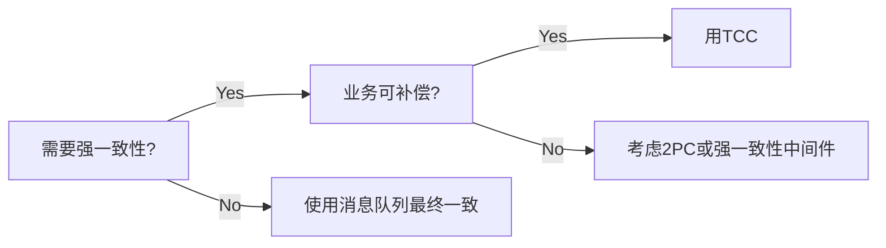

## P0面试优先级（2026）
- `P0-1` 服务拆分：领域边界、接口契约、数据归属。
- `P0-2` 服务治理：注册发现、负载均衡、超时重试、熔断限流。
- `P0-3` 分布式事务：TCC、可靠消息最终一致性、补偿机制。
- `P0-4` 可观测性：日志、指标、链路追踪与告警闭环。
- `P0-5` 可靠发布：灰度、回滚、兼容性与流量保护。

## P0常见误区修正（本页已修订）
- 微服务不是越细越好，拆分过细会提升链路复杂度。
- 重试不是万能，需配合幂等与熔断避免放大故障。
- 分布式事务要按业务一致性等级选型，不追求“全部强一致”。


# 注册中心

服务注册中⼼本质上是为了解耦服务提供者和服务消费者。为了⽀持弹性扩缩容特性，⼀个微服务的提供者的数量和分布往往是动态变化的，也是⽆法预先确定的。因此需要引⼊服务注册中⼼。

> 为了⽀持弹性扩缩容特性，需要注册中心来解决
## 原理

- 服务提供者启动，将相关服务信息主动注册到注册中⼼
- 服务消费者获取服务注册信息：
    - poll模式：服务消费者可以主动拉取可⽤的服务提供者清单
    - push模式：服务消费者订阅服务（当服务提供者有变化时，注册中⼼也会主动推送更新后的服务清单给消费者
- 服务消费者直接调⽤服务提供者

另外，注册中⼼也需要完成服务提供者的健康监控，当发现服务提供者失效时需要及时剔除；

> 服务提供者上报注册信息
> 服务消费者获取注册信息 

## 主流服务中⼼对⽐

### Zookeeper

Zookeeper本质 = 存储 + 监听通知。

Zookeeper ⽤来做服务注册中⼼，主要是因为它具有**节点变更通知功能，只要客户端监听相关服务节点，服务节点的所有变更，都能及时的通知到监听客户端**，这样作为调⽤⽅只要使⽤ Zookeeper 的客户端就能实现服务节点的订阅和变更通知功能了。 Zookeeper 可⽤性也可以，只要半数以上的选举节点存活，整个集群就是可⽤的。 

> Leader选举期间短暂不可用
### Eureka

[[Spring Cloud#Eureka]]

> AP架构，高可用

### Consul

Consul是由HashiCorp基于Go语⾔开发的⽀持多数据中⼼分布式⾼可⽤的服务发布和注册服务软件， 采⽤Raft算法保证服务的⼀致性，且⽀持健康检查。

### Nacos

Nacos是⼀个更易于构建云原⽣应⽤的动态服务发现、配置管理和服务管理平台。简单来说 Nacos 就是 注册中⼼ + 配置中⼼的组合，帮助我们解决微服务开发必会涉及到的服务注册 与发现，服务配置，服务管理等问题。 Nacos 是Spring Cloud Alibaba 核⼼组件之⼀，负责服务注册与发现，还有配置。
### 对比

|组件名|语⾔|CAP|对外暴露接⼝|
|---|---|---|---|
|Eureka|Java|AP（⾃我保护机制，保证可⽤）|HTTP|
|Consul|Go|CP|HTTP/DNS|
|Zookeeper|Java|CP|客户端|
|Nacos|Java|⽀持AP/CP切换|HTTP|

# 分布式配置中⼼
## 应⽤场景

集中式管理分布式微服务的配置信息，运行期间动态调整配置，⽐如：根据各个微服务的负载情况，动态调整数据源连接池⼤⼩。

场景总结如下：

- 集中配置管理，⼀个微服务架构中可能有成百上千个微服务（⼀次修改、到处⽣效）
- 不同环境不同配置，⽐如数据源配置在不同环境（dev,test,prod）中是不同的
- 运⾏期间可动态调整。如配置内容发⽣变化，微服务可以⾃动更新配置

## 原理
TODO

# 分布式事务
- 2PC（强一致性)）
- 3PC（强一致性)）
- TCC 方案（强一致性)）
- SAGA 方案（最终一致性）
- 本地消息表（最终一致性）
- 可靠消息最终一致性方案（最终一致性）
- 最大努力通知方案（最终一致性）


> 尽量避免使用分布式事务，尤其是强一致性分布式事务（如2PC）。优先考虑通过业务设计、架构优化来规避分布式事务。只有在业务强需求且权衡利弊后，才考虑引入。

> 选型：优先考虑异步消息队列，强一致场景再用TCC，避免使用2PC。
## 两阶段提交方案/XA 方案

所谓的 XA 方案，即两阶段提交，有一个**事务管理器**的概念，负责协调多个数据库（**资源管理器**）的事务，事务管理器先问问各个数据库你准备好了吗？如果每个数据库都回复 ok，那么就正式提交事务，在各个数据库上执行操作；如果任何其中一个数据库回答不 ok，那么就回滚事务。

这种分布式事务方案，比较适合单块应用里，跨多个库的分布式事务，而且因为严重依赖于数据库层面来搞定复杂的事务，效率很低，**不适合高并发的场景**。参考 `Spring + JTA` 就可以搞定。

- **核心流程：** 准备阶段(投票)、提交/回滚阶段。协调者(Coordinator)和参与者(Participant)的角色。
- **优点：** 数据库原生支持(如MySQL XA, Oracle XA)，标准协议。
- **缺点：**
    
    - **同步阻塞：** 参与者锁定资源直到事务结束，性能差。
    - **协调者单点故障：** 协调者宕机可能导致参与者资源长期锁定(阻塞)。
    - **数据不一致风险：** 在提交阶段，如果部分参与者收不到提交指令（网络分区），会导致部分提交部分未提交。

> 一般来说某个系统内部如果出现跨多个库的这么一个操作，是不合规的。正常规范要求**每个服务只能操作自己对应的一个数据库**。操作别的服务需要通过接口。

[](https://github.com/doocs/advanced-java/blob/main/docs/distributed-system/images/distributed-transaction-XA.png)

## 3PC- 三阶段提交

- **核心流程：** CanCommit、PreCommit、DoCommit 三个阶段。
- **改进点：** 引入`PreCommit`阶段，并在`PreCommit`后参与者进入`Prepared`状态（此时已锁定资源并准备好提交）。增加了超时机制。
- **优点：** 相比2PC，降低了阻塞范围和单点故障影响（超时后可提交或回滚）。
- **缺点：** 实现更复杂，网络开销更大，仍然存在数据不一致的可能性（如网络分区导致）。
### 为什么3PC能减少阻塞？

1. **引入PreCommit缓冲层**
    - 在`CanCommit`阶段仅进行**业务检查**（如资源是否充足），不锁定资源。
    - 只有所有参与者通过检查后，才在`PreCommit`阶段**锁定资源**，缩短了资源锁定时间。
2. **超时自动提交机制**
    - 参与者进入`PreCommit`状态后，若长时间未收到协调者指令，**超时后自动提交**。
    - 对比2PC：参与者在Prepare后无限等待，协调者宕机导致全局阻塞。
> 3PC通过**阶段拆分**和**超时提交**降低了阻塞概率，但未彻底解决一致性问题。

> 分布式系统在出现网络分区时，**任何协议都无法100%保证一致性**（由FLP不可能原理和CAP定理决定）。
## TCC 方案

TCC 的全称是： `Try` 、 `Confirm` 、 `Cancel` 。

- Try 阶段：这个阶段说的是对各个服务的资源做检测以及对资源进行**锁定或者预留**。
- Confirm 阶段：这个阶段说的是在各个服务中**执行实际的操作**。
- Cancel 阶段：如果任何一个服务的业务方法执行出错，那么这里就需要**进行补偿**，就是执行已经执行成功的业务逻辑的回滚操作。

一般来说**支付**、**交易**相关的场景，我们会用 TCC，严格保证资金的正确性。

### 三大核心问题与解决方案

| **问题**  | **原因**                                                                      | **解决方案**                                                                                                 |
| ------- | --------------------------------------------------------------------------- | -------------------------------------------------------------------------------------------------------- |
| **幂等**  | 网络重试导致Confirm/Cancel重复调用                                                    | **1. 事务ID+状态机**：  <br>- 在Try阶段生成全局唯一事务ID，记录状态（TRYING→CONFIRMED）  <br>**2. 幂等接口设计**：  <br>- 通过事务ID判断是否已执行 |
| **空回滚** | Try未执行，但Cancel被调用（如网络超时）.协调者调用 Try 时发生**网络超时**（如丢包、服务响应慢），误判 Try 失败，触发全局回滚。 | **1. 防空回滚标记**：  <br>- Try阶段插入事务记录，Cancel时检查是否存在  <br>**2. 事务状态存储**：  <br>- 无Try记录时，Cancel直接返回成功          |
| **悬挂**  | Cancel比Try先到达（Try超时重试）。Try 请求因网络延迟尚未到达参与者，Cancel 请求已先抵达。                    | **1. 事务有效期**：  <br>- 记录事务创建时间，过期事务拒绝Try  <br>**2. 状态校验**：  <br>- Try执行前检查是否有Cancel记录                     |

> 业务侵入性大，事务回滚依赖于开发者来回滚和补偿，代码量大，复杂度高。需要处理幂等、空回滚、悬挂等问题。


[
## Saga 方案

金融核心等业务可能会选择 TCC 方案，以追求强一致性和更高的并发量，而对于更多的金融核心以上的业务系统往往会选择补偿事务，补偿事务处理在 30 多年前就提出了 Saga 理论。目前业界比较公认的是采用 Saga 作为长事务的解决方案。

#### 基本原理

业务流程中每个参与者都提交本地事务，若某一个参与者失败，则补偿前面已经成功的参与者。下图左侧是正常的事务流程，当执行到 T3 时发生了错误，则开始执行右边的事务补偿流程，反向执行 T3、T2、T1 的补偿服务 C3、C2、C1，将 T3、T2、T1 已经修改的数据补偿掉。

[]

#### 使用场景

对于一致性要求高、短流程、并发高的场景，如：金融核心系统，会优先考虑 TCC 方案。而在另外一些场景下，我们并不需要这么强的一致性，只需要保证最终一致性即可。

比如很多金融核心以上的业务（渠道层、产品层、系统集成层），这些系统的特点是最终一致即可、流程多、流程长、还可能要调用其它公司的服务。这种情况如果选择 TCC 方案开发的话，一来成本高，二来无法要求其它公司的服务也遵循 TCC 模式。同时流程长，事务边界太长，加锁时间长，也会影响并发性能。

所以 Saga 模式的适用场景是：

- 业务流程长、业务流程多；
- 参与者包含其它公司或遗留系统服务，无法提供 TCC 模式要求的三个接口。

#### 优势
- 一阶段提交本地事务，无锁，高性能；
- 参与者可异步执行，高吞吐；
- 补偿服务易于实现，因为一个更新操作的反向操作是比较容易理解的。

#### 缺点

- 不保证事务的隔离性。

### 本地消息表

1. A 系统在自己本地一个事务里操作同时，插入一条数据到消息表；
2. 接着 A 系统将这个消息发送到 MQ 中去；
3. B 系统接收到消息之后，在一个事务里，往自己本地消息表里插入一条数据，同时执行其他的业务操作，如果这个消息已经被处理过了，那么此时这个事务会回滚，这样**保证不会重复处理消息**；
4. B 系统执行成功之后，就会更新自己本地消息表的状态以及 A 系统消息表的状态；
5. 如果 B 系统处理失败了，那么就不会更新消息表状态，那么此时 A 系统会定时扫描自己的消息表，如果有未处理的消息，会再次发送到 MQ 中去，让 B 再次处理；
6. 这个方案保证了最终一致性，哪怕 B 事务失败了，但是 A 会不断重发消息，直到 B 那边成功为止。

**严重依赖于数据库的消息表来管理事务**，不适合高并发场景。

[

## 可靠消息最终一致性方案

基于 MQ 来实现事务。比如 RocketMQ 就支持消息事务。

[[MQ#RocketMQ如何实现的分布式事务？]]

## 最大努力通知方案

1. 系统 A 本地事务执行完之后，发送个消息到 MQ；
2. 这里会有个专门消费 MQ 的**最大努力通知服务**，这个服务会消费 MQ 然后写入数据库中记录下来，或者是放入个内存队列也可以，接着调用系统 B 的接口；
3. 要是系统 B 执行成功就 ok 了；要是系统 B 执行失败了，那么最大努力通知服务就定时尝试重新调用系统 B，反复 N 次，最后还是不行就放弃。

## SETA的XA和AT模式
TODO
# 分布式锁

### 数据库

利用数据库的唯一约束（如唯一索引）或乐观锁（版本号/CAS）。

适用场景： 并发量很低、对性能要求不高、且已有数据库依赖的简单场景。**不推荐**

> 数据库成为单点（需主从/集群），故障切换时可能丢失锁信息或导致脑裂。
> 无自动过期： 需要客户端显式删除，如果客户端崩溃导致锁未释放，需要额外机制（如定时任务清理超时锁）处理，复杂且不实时。
> 非阻塞/重入支持弱： 需要应用层实现轮询或重入逻辑。

### Redis 分布式锁

官方叫做 `RedLock` 算法，是 Redis 官方支持的分布式锁算法。

这个分布式锁有 3 个重要的考量点：
- 互斥（只能有一个客户端获取锁）
- 不能死锁
- 容错（只要大部分 Redis 节点创建了这把锁就可以）

优点：
- **性能极高：** Redis 基于内存操作，速度非常快。
- **功能丰富：** 原生支持 TTL，简化死锁预防。Lua 脚本保证原子性。
- **成熟方案：** 有 Redisson 等成熟的客户端库封装细节（如看门狗自动续期）。

缺点：
- **非强一致：** 单点/主从异步复制下，主节点故障可能导致锁信息丢失（新主可能没有锁记录），破坏互斥性。
- **时钟依赖：** TTL 依赖客户端和 Redis 服务器的时钟大致同步。时钟漂移可能导致锁过早失效或延长持有。
- **RedLock 争议大：**
	- **性能开销：** 需要访问多个节点。
	- **复杂性：** 实现和理解更复杂。
	- **网络分区风险：** 在极端网络分区下（GC Pause），仍可能出现多个客户端同时持有锁（Martin Kleppmann 著名的反驳文章）。
	- **无共识保证：** Redis 节点间无强共识协议（如 Raft），可靠性依赖独立部署。

适用场景： **高并发、对性能要求极高、允许极小概率锁失效（需业务容忍）** 的场景。是互联网公司最常用的方案。使用 Redisson 客户端能简化开发并增强可靠性（看门狗）。

#### Redis 最普通的分布式锁

第一个最普通的实现方式，就是在 Redis 里使用 `SET key value [EX seconds] [PX milliseconds] NX` 创建一个 key，这样就算加锁。


```r
SET resource_name my_random_value PX 30000 NX
```

释放锁就是删除 key ，但是一般可以用 `lua` 脚本删除，判断 value 一样才删除：

```lua
-- 删除锁的时候，找到 key 对应的 value，跟自己传过去的 value 做比较，如果是一样的才删除。
if redis.call("get",KEYS[1]) == ARGV[1] then
    return redis.call("del",KEYS[1])
else
    return 0
end
```

#### RedLock 算法

这个场景是假设有一个 Redis cluster，有 5 个 Redis master 实例。然后执行如下步骤获取一把锁：

1. 获取当前时间戳，单位是毫秒；
2. 跟上面类似，轮流尝试在每个 master 节点上创建锁，超时时间较短，一般就几十毫秒（客户端为了获取锁而使用的超时时间比自动释放锁的总时间要小。例如，如果自动释放时间是 10 秒，那么超时时间可能在 `5~50` 毫秒范围内）；
3. 尝试在**大多数节点**上建立一个锁，比如 5 个节点就要求是 3 个节点 `n / 2 + 1` ；
4. 客户端计算建立好锁的时间，如果建立锁的时间小于超时时间，就算建立成功了；
5. 要是锁建立失败了，那么就依次之前建立过的锁删除；
6. 只要别人建立了一把分布式锁，你就得**不断轮询去尝试获取锁**。

[](https://github.com/doocs/advanced-java/blob/main/docs/distributed-system/images/redis-redlock.png)

[Redis 官方](https://redis.io/)给出了以上两种基于 Redis 实现分布式锁的方法，详细说明可以查看：[https://redis.io/topics/distlock](https://redis.io/topics/distlock) 。

### zk 分布式锁

zk 分布式锁，就是某个节点尝试**创建临时 ZNode**，此时创建成功了就获取了这个锁；这个时候别的客户端来创建锁会失败，只能**注册个监听器**监听这个锁。释放锁就是删除这个 ZNode，一旦释放掉就会通知客户端，然后有一个等待着的客户端就可以再次重新加锁。

```java
/**
 * ZooKeeperSession
 */
public class ZooKeeperSession {

    private static CountDownLatch connectedSemaphore = new CountDownLatch(1);

    private ZooKeeper zookeeper;
    private CountDownLatch latch;

    public ZooKeeperSession() {
        try {
            this.zookeeper = new ZooKeeper("192.168.31.187:2181,192.168.31.19:2181,192.168.31.227:2181", 50000, new ZooKeeperWatcher());
            try {
                connectedSemaphore.await();
            } catch (InterruptedException e) {
                e.printStackTrace();
            }

            System.out.println("ZooKeeper session established......");
        } catch (Exception e) {
            e.printStackTrace();
        }
    }

    /**
     * 获取分布式锁
     *
     * @param productId
     */
    public Boolean acquireDistributedLock(Long productId) {
        String path = "/product-lock-" + productId;

        try {
            zookeeper.create(path, "".getBytes(), Ids.OPEN_ACL_UNSAFE, CreateMode.EPHEMERAL);
            return true;
        } catch (Exception e) {
            while (true) {
                try {
                    // 相当于是给node注册一个监听器，去看看这个监听器是否存在
                    Stat stat = zk.exists(path, true);

                    if (stat != null) {
                        this.latch = new CountDownLatch(1);
                        this.latch.await(waitTime, TimeUnit.MILLISECONDS);
                        this.latch = null;
                    }
                    zookeeper.create(path, "".getBytes(), Ids.OPEN_ACL_UNSAFE, CreateMode.EPHEMERAL);
                    return true;
                } catch (Exception ee) {
                    continue;
                }
            }

        }
        return true;
    }

    /**
     * 释放掉一个分布式锁
     *
     * @param productId
     */
    public void releaseDistributedLock(Long productId) {
        String path = "/product-lock-" + productId;
        try {
            zookeeper.delete(path, -1);
            System.out.println("release the lock for product[id=" + productId + "]......");
        } catch (Exception e) {
            e.printStackTrace();
        }
    }

    /**
     * 建立 zk session 的 watcher
     */
    private class ZooKeeperWatcher implements Watcher {

        public void process(WatchedEvent event) {
            System.out.println("Receive watched event: " + event.getState());

            if (KeeperState.SyncConnected == event.getState()) {
                connectedSemaphore.countDown();
            }

            if (this.latch != null) {
                this.latch.countDown();
            }
        }

    }

    /**
     * 封装单例的静态内部类
     */
    private static class Singleton {

        private static ZooKeeperSession instance;

        static {
            instance = new ZooKeeperSession();
        }

        public static ZooKeeperSession getInstance() {
            return instance;
        }

    }

    /**
     * 获取单例
     *
     * @return
     */
    public static ZooKeeperSession getInstance() {
        return Singleton.getInstance();
    }

    /**
     * 初始化单例的便捷方法
     */
    public static void init() {
        getInstance();
    }

}
```

也可以采用另一种方式，创建临时顺序节点：

如果有一把锁，被多个人给竞争，此时多个人会排队，第一个拿到锁的人会执行，然后释放锁；后面的每个人都会去监听**排在自己前面**的那个人创建的 node 上，一旦某个人释放了锁，排在自己后面的人就会被 ZooKeeper 给通知，一旦被通知了之后，自己就获取到了锁，就可以执行代码了。

```java
public class ZooKeeperDistributedLock implements Watcher {

    private ZooKeeper zk;
    private String locksRoot = "/locks";
    private String productId;
    private String waitNode;
    private String lockNode;
    private CountDownLatch latch;
    private CountDownLatch connectedLatch = new CountDownLatch(1);
    private int sessionTimeout = 30000;

    public ZooKeeperDistributedLock(String productId) {
        this.productId = productId;
        try {
            String address = "192.168.31.187:2181,192.168.31.19:2181,192.168.31.227:2181";
            zk = new ZooKeeper(address, sessionTimeout, this);
            connectedLatch.await();
        } catch (IOException e) {
            throw new LockException(e);
        } catch (KeeperException e) {
            throw new LockException(e);
        } catch (InterruptedException e) {
            throw new LockException(e);
        }
    }

    public void process(WatchedEvent event) {
        if (event.getState() == KeeperState.SyncConnected) {
            connectedLatch.countDown();
            return;
        }

        if (this.latch != null) {
            this.latch.countDown();
        }
    }

    public void acquireDistributedLock() {
        try {
            if (this.tryLock()) {
                return;
            } else {
                waitForLock(waitNode, sessionTimeout);
            }
        } catch (KeeperException e) {
            throw new LockException(e);
        } catch (InterruptedException e) {
            throw new LockException(e);
        }
    }

    public boolean tryLock() {
        try {
            // 传入进去的locksRoot + “/” + productId
            // 假设productId代表了一个商品id，比如说1
            // locksRoot = locks
            // /locks/10000000000，/locks/10000000001，/locks/10000000002
            lockNode = zk.create(locksRoot + "/" + productId, new byte[0], ZooDefs.Ids.OPEN_ACL_UNSAFE, CreateMode.EPHEMERAL_SEQUENTIAL);

            // 看看刚创建的节点是不是最小的节点
            // locks：10000000000，10000000001，10000000002
            List<String> locks = zk.getChildren(locksRoot, false);
            Collections.sort(locks);

            if (lockNode.equals(locksRoot + "/" + locks.get(0))) {
                // 如果是最小的节点,则表示取得锁
                return true;
            }

            // 如果不是最小的节点，找到比自己小1的节点
            int previousLockIndex = -1;
            for (int i = 0; i < locks.size(); i++) {
                if (lockNode.equals(locksRoot + "/" +locks.get(i))){
                    previousLockIndex = i - 1;
                    break;
                }
            }

            this.waitNode = locks.get(previousLockIndex);
        } catch (KeeperException e) {
            throw new LockException(e);
        } catch (InterruptedException e) {
            throw new LockException(e);
        }
        return false;
    }

    private boolean waitForLock(String waitNode, long waitTime) throws InterruptedException, KeeperException {
        Stat stat = zk.exists(locksRoot + "/" + waitNode, true);
        if (stat != null) {
            this.latch = new CountDownLatch(1);
            this.latch.await(waitTime, TimeUnit.MILLISECONDS);
            this.latch = null;
        }
        return true;
    }

    public void unlock() {
        try {
            // 删除/locks/10000000000节点
            // 删除/locks/10000000001节点
            System.out.println("unlock " + lockNode);
            zk.delete(lockNode, -1);
            lockNode = null;
            zk.close();
        } catch (InterruptedException e) {
            e.printStackTrace();
        } catch (KeeperException e) {
            e.printStackTrace();
        }
    }

    public class LockException extends RuntimeException {
        private static final long serialVersionUID = 1L;

        public LockException(String e) {
            super(e);
        }

        public LockException(Exception e) {
            super(e);
        }
    }
}
```

但是，使用 zk 临时节点会存在另一个问题：由于 zk 依靠 session 定期的心跳来维持客户端，如果客户端进入长时间的 GC，可能会导致 zk 认为客户端宕机而释放锁，让其他的客户端获取锁，但是客户端在 GC 恢复后，会认为自己还持有锁，从而可能出现多个客户端同时获取到锁的情形。

针对这种情况，可以通过 JVM 调优，尽量避免长时间 GC 的情况发生。

优点：

- **强一致性：** 基于 ZAB 协议，提供强顺序一致性和高可靠性。锁信息不会在网络分区或主节点切换时丢失。
- **无过期时间概念：** 临时节点机制天然避免了死锁（客户端断开即释放）。
- **公平锁（FIFO）：** 顺序节点和 Watch 机制天然实现了公平排队。
- **原生支持 Watch：** 监听机制避免客户端无效轮询。
	
**缺点：**

- **性能相对较低：** 写操作（创建节点）需要集群内达成共识，比 Redis 慢一个数量级。
- **客户端断开处理：** 虽然临时节点会自动删除，但客户端恢复后需要重新排队获取锁（可能不是原来的位置？实际是重新创建新节点排队）。
- **“羊群效应”：** 当锁释放时，可能唤醒大量等待的客户端（监听同一个前驱节点），造成瞬时压力。可通过监听具体前驱节点缓解。
- **依赖较重：** 引入 ZK 增加了系统复杂度和运维成本。
        
适用场景： **对锁的强一致性要求极高、能接受略低性能、需要公平锁** 的场景（如金融交易、核心配置管理）。Curator 库提供了完善的分布式锁实现。

### 基于 etcd

**原理：** 类似于 ZooKeeper，但基于 Raft 共识协议。

- 利用 etcd 的 `lease`（租约）机制：创建一个带 TTL 的租约。
- 使用事务（`TXN`）尝试将 key（锁资源名）与租约绑定：`if (key.version == 0) { put(key, value, lease) }`（类似 CAS）。
- 成功则获取锁。
- 失败或超时，则监听 key 的变化（通过 Revision 或 Watch）。
- 锁持有者需定期续租（`KeepAlive`）防止租约过期。
- 客户端断开或崩溃，租约到期 key 自动删除（释放锁）。
	
**优点：**
- **强一致性：** Raft 协议保证强一致性。
- **高可用：** 设计目标就是高可用分布式键值存储。
- **原生租约/TTL：** 内置支持，比 ZK 临时节点更灵活（可续期）。
- **高效 Watch：** Watch 机制高效。
- **HTTP/gRPC API：** 接入相对方便。
        
**缺点：**
- **性能：** 写操作性能介于 Redis 和 ZK 之间（通常优于 ZK），但读操作性能很高。
- **依赖：** 需要部署和维护 etcd 集群。
- **复杂度：** 使用比 Redis 复杂，但比直接操作 ZK 简单（有客户端库封装）。
	
适用场景： **需要强一致性、高可用性，同时希望比 ZK 有更好性能和更现代 API** 的场景（如 Kubernetes 生态、服务发现、配置中心）。是 ZK 的有力竞争者。

### Redis 分布式锁和 zk 分布式锁的对比

- Redis 分布式锁，其实**需要自己不断去尝试获取锁**，比较消耗性能。
- zk 分布式锁，获取不到锁，注册个监听器即可，不需要不断主动尝试获取锁，性能开销较小。

如果是 Redis 获取锁的那个客户端出现 bug 挂了，那么只能等待超时时间之后才能释放锁；而 zk 的话，因为创建的是临时 znode，只要客户端挂了，znode 就没了，此时就自动释放锁。

**CAP 理论视角**
- Redis (AP)： 优先保证可用性和分区容忍性，在网络分区时可能牺牲一致性（锁信息丢失）。
- Zookeeper/etcd (CP)： 优先保证一致性和分区容忍性，在网络分区时可能牺牲可用性（无法写入，锁服务不可用）。

## 分布式锁选型考量

没有绝对最好的方案，只有最适合当前场景的方案。选型时需要综合考虑：

1. **一致性要求：**
    
    - **要求强一致（CP），绝对不能接受锁失效导致的数据错误？** 优先选择 **ZooKeeper 或 etcd**。
    - **可以接受极小概率的锁失效（AP），更看重性能？** **Redis (配合 Redisson)** 是主流选择。确保业务逻辑能处理这种极小概率的冲突（如幂等性设计）。
2. **性能要求：**
    - **超高并发、超低延迟？** **Redis** 通常是性能最优的选择。
    - **中等并发，可以接受一定延迟换取更强一致性？** **etcd** 通常是比 ZK 性能更好的 CP 选择。
    - **对性能要求不高？** 数据库方案理论上可行（但不推荐），ZK 也能满足。
3. **可用性要求：**
    - 所有主流方案（Redis Cluster/Sentinel, ZK Cluster, etcd Cluster）都设计为高可用。需要评估其故障切换机制和恢复时间对业务的影响。
    - Redis 在故障切换（主从）时存在锁丢失风险，ZK/etcd 在选举期间可能不可写（牺牲 A 保 C/P）。
4. **复杂性：**
    - **开发和运维简单？** **Redis (尤其使用 Redisson)** 通常是最简单的选择，开发和运维成熟度高。
    - **愿意为强一致性承担更高复杂度？** **etcd** 的 API 和运维通常比 **ZooKeeper** 更现代友好一些。数据库方案开发看似简单，但可靠性和性能陷阱多。
    - 是否有现成的客户端库支持（如 Redisson, Curator, etcd client）？
5. **现有基础设施与技术栈：**
    - 如果系统中已经大规模使用了 Redis，引入 Redis 锁成本最低。
    - 如果已经在使用 ZK（如 Dubbo 注册中心）或 etcd（如 Kubernetes），复用现有集群是自然的选择。
    - 团队对哪种技术更熟悉？
6. **功能需求：**
    - **需要公平锁？** ZK/etcd 天然支持。Redis 需要额外实现（如 Redisson 的 `RedissonFairLock`）。
    - **需要读写锁？** 主流客户端库（Redisson, Curator, etcd client）通常都支持。
    - **需要可重入锁？** 同上，客户端库通常支持。数据库方案需要自己实现计数器。

## 总结与建议

- **首选 Redis (with Redisson)：** 适用于绝大多数互联网高并发场景，性能卓越，生态成熟（Redisson 封装了锁续期、可重入、读写锁等复杂逻辑），容忍极小概率锁失效。**这是最通用、最流行的选择。**
- **强一致首选 etcd：** 当业务对锁的强一致性要求极高，且希望有比 ZK 更好的性能和更现代的 API 时，etcd 是非常好的选择，尤其在云原生环境中。
- **强一致且生态依赖 ZK：** 如果系统已深度依赖 ZK 且团队熟悉，或者需要 ZK 提供的某些特有功能，ZK 仍然是可靠的强一致锁方案。
- **避免使用数据库：** 除非并发极低且没有其他基础设施可用，否则不推荐作为分布式锁方案。

# 分布式ID


# 熔断限流

## 微服务中的雪崩效应

- 扇⼊：代表着该微服务被调⽤的次数，扇⼊⼤，说明该模块复⽤性好
- 扇出：该微服务调⽤其他微服务的个数，扇出⼤，说明业务逻辑复杂

> 扇⼊⼤是⼀个好事，扇出⼤不⼀定是好事

## 雪崩效应解决⽅案

* 服务熔断
* 服务降级
* 服务限流

### 服务熔断

**服务熔断**机制是应对雪崩效应的⼀种微服务链路保护机制。当扇出链路的某个微服务不可⽤或者响应时间太⻓时，熔断该节点微服务的调⽤，进⾏服务的降级，快速返回错误的响应信息。当检测到该节点微服务调⽤响应正常后，恢复调⽤链路。

注意：

- 服务熔断重点在“断”，**切断对下游服务的调⽤**
- 服务熔断和服务降级往往是⼀起使⽤的， Hystrix就是这样。

### 服务降级

通俗讲就是整体资源不够⽤了，先将⼀些不关紧的服务停掉（调⽤我的时候，给你返回⼀个预留的值，也叫做兜底数据），待⾼峰过去，再把那些服务打开。

服务降级⼀般是从整体考虑，就是当某个服务熔断之后，服务器将不再被调⽤，此刻客户端可以⾃⼰准备⼀个本地的fallback回调，返回⼀个缺省值，这样做，虽然服务⽔平下降，但保证核心服务可用。

### 服务限流

服务降级是当服务出问题或者影响到核⼼流程的性能时，暂时将服务屏蔽掉，待⾼峰或者问题解决后再打开；但是**有些场景并不能⽤服务降级来解决，⽐如项目中的核⼼功能**，这个时候可以结合服务限流来限制这些场景的并发/请求量限流措施也很多，⽐如

- 限制总并发数（⽐如数据库连接池、线程池）
- 限制瞬时并发数（如nginx限制瞬时并发连接数）
- 限制时间窗⼝内的平均速率（如Guava的RateLimiter、 nginx的limit_req模块，限制每秒的平均速率）
- 限制远程接⼝调⽤速率、限制MQ的消费速率等

# 我们的设计
- 注册中心  
	- 容灾
	- 对等集群
	- 配置管理
- RPC  
    - 调用方式
        - 同步调用
        - 异步调用
        - 并行调用  
    - 序列化与反序列化  
        - protobuf  
        - json  
        - thrift  
    - 通信协议
        - Http
        - TCP
- 服务熔断  
- 服务降级  
	- 屏蔽降级
	- 容错降级
- APM  
	- 接口性能KPI统计
	- 接口日志
	- 链路监控告警
- 服务路由  
	- 负载均衡
		- 随机
		- 轮询
		- 权重
		- 动态权重
	- 缓存
	- 发布订阅
- 集群容错
	- 自动切换
	- 失败通知
	- 失败缓存重试
	- 快速失败
- 流量控制
	- 静态流控
	- 动态流控
	- 分级流控
	- 并发流控
	- 连接数控制