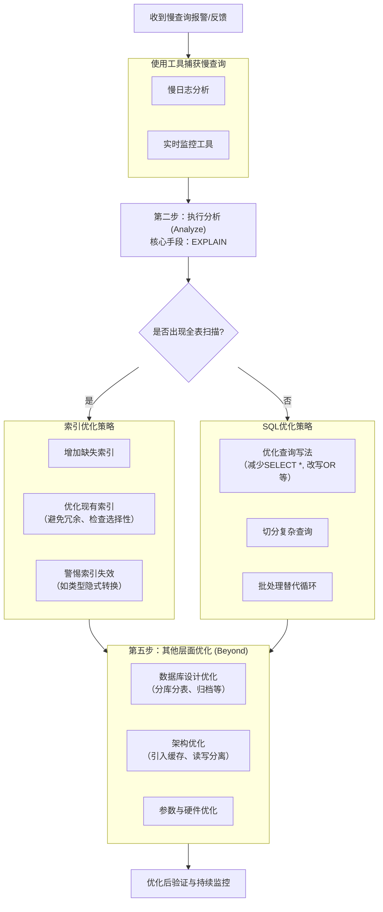

#flashcards

# 数据库基础与设计

### 三大范式

- 第一范式（原子性）：字段不可再分（如地址拆分为省/市）
- 第二范式（唯一性）：非主键列完全依赖主键（避免部分依赖）
- 第三范式：非主键列只依赖主键，无传递依赖（如订单表拆用户表）

# Mysql的逻辑架构::


# Mysql的数据写入机制::
* 建立连接（连接池、半双工）
* SQL解析（解析器，根据词法分析可知道sql语句是否是更新语句）
* 执行器（生成执行计划）
* 存储引擎（Handler API）
	* SQL语句的执行计划会被Innodb存储引擎分成微事务单元（MTR），包括读指令、写指令，就是说一个SQL语句包含读指令、写指令
		* 读指令
			* 从[Buffer Pool](#Buffer&nbsp;Pool)中通过自适应哈希索引（Innodb会根据规则给一些热点页建立自适应哈希索引，提升速度）查找数据
			* 如果Buffer Pool中没有找到所需数据对应的页，则需通过“预读”的方式从磁盘中加载到Buffer Pool中
		* 写指令
			* 写入[Undo Log](#Undo&nbsp;Log)（数据回滚）
			* 写入Redo Log Buffer（宕机数据恢复）
			* Redo Log刷盘（宕机数据恢复）
			* 写入[Change Buffer](#Change&nbsp;Buffer)（如果需要，如果写入，那么后续会合并到Buffer Pool中）
			* 写入[Buffer Pool](#Buffer&nbsp;Pool)（内存交互）
			* 写入Double Wirte Buffer并刷盘
			* 记录Bin Log（数据恢复、主从同步）
			* 提交Redo Log（[两阶段提交](#两阶段提交)）
			* 数据落盘（持久化 ）

# Mysql的数据读取机制
* 建立连接（连接池、半双工）
* 查询缓存
	* 8.0查询缓存被删除
	* 因为查询缓存的失效非常频繁，只要有对一个表的更新，这个表上所有的查询缓存都会被清空。
* SQL解析（解析器）
	* 词法分析、语法分析
* 预处理器
	*  提交sql模板和提交参数，重复sql模板只需提交一次，提升效率
* 优化器（查询优化）
	* 成本分析，找到成本最小的执行计划
* 执行器（生成执行计划）
* 存储引擎（根据执行计划调用存储引擎的Handler API）
	* 从[Buffer Pool](#Buffer&nbsp;Pool)中通过自适应哈希索引（Innodb会根据规则给一些热点页建立自适应哈希索引，提升速度）查找数据
	* 如果Buffer Pool中没有找到所需数据对应的页，则需通过“预读”的方式从磁盘中加载到Buffer Pool中
* 更新查询缓存
* 返回结果

# Innodb引擎的存储结构::

## 内存结构
* 缓冲池（Buffer Pool）
* 写缓冲区（Change Buffer）
* 自适应哈希索引（Adaptive Hash Index）
* 日志缓存区（Log Buffer）
* 锁信息区
 
### Buffer Pool

#### Page管理机制

Page根据状态可以分为三种类型:

- `free page`：空闲page，未被使用
- `clean page`：被使用page，数据没有被修改过
- `dirty page`：脏页，被使用page，数据被修改过，页中数据和磁盘的数据产生了不 一致

针对上述三种page类型，InnoDB通过三种链表结构来维护和管理

#### Free链表
表示空闲缓冲区，管理free page
#### Flush链表
表示需要刷新到磁盘的缓冲区，管理dirty page，内部page按修改时间排序。脏页既存在于flush链表，也在LRU链表中，但是两种互不影响，LRU链表负责管理page的可用性和释放，而flush链表负责管理脏页的刷盘操作。
#### LRU链表
表示正在使用的缓冲区，管理`clean page`和`dirty page`，缓冲区以 midpoint为基点，前面链表称为new列表区，存放经常访问的数据，占63%;后面的链表称为old列表区，存放使用较少数据，占37%

改进后的 LRU 算法执行流程变成了下面这样。

1. 图中状态 1，要访问数据页 P3，由于 P3 在 young 区域，因此和优化前的 LRU 算法一样，将其移到链表头部，变成状态 2。
2. 之后要访问一个新的不存在于当前链表的数据页，这时候依然是淘汰掉数据页 Pm，但是新插入的数据页 Px，是放在 LRU_old 处。
3. 处于 old 区域的数据页，每次被访问的时候都要做下面这个判断：
    - 若这个数据页在 LRU 链表中存在的时间超过了 1 秒，就把它移动到链表头部；
    - 如果这个数据页在 LRU 链表中存在的时间短于 1 秒，位置保持不变。1 秒这个时间，是由参数 innodb_old_blocks_time 控制的。其默认值是 1000，单位毫秒。

这个策略，就是为了**处理类似全表扫描的操作量身定制的**。以扫描 200G 的历史数据表为例，我们看看改进后的 LRU 算法的操作逻辑：

1. 扫描过程中，需要新插入的数据页，都被放到 old 区域 ;
2. 一个数据页里面有多条记录，这个数据页会被多次访问到，但由于是顺序扫描，这个数据页第一次被访问和最后一次被访问的时间间隔不会超过 1 秒，因此还是会被保留在 old 区域；
3. 再继续扫描后续的数据，之前的这个数据页之后也不会再被访问到，于是始终没有机会移到链表头部（也就是 young 区域），很快就会被淘汰出去。

可以看到，这个策略最大的收益，就是在扫描这个大表的过程中，虽然也用到了 Buffer Pool，但是对 young 区域完全没有影响，从而保证了 Buffer Pool 响应正常业务的查询命中率。
### Change Buffer
#### 什么是Change Buffer？::
当需要更新一个数据页时，如果数据页在内存中就直接更新，而如果这个数据页还没有在内存中的话，在不影响数据一致性的前提下，InooDB 会将这些更新操作缓存在 change buffer 中，这样就不需要从磁盘中读入这个数据页了。在下次查询需要访问这个数据页的时候，将数据页读入内存，然后执行 change buffer 中与这个页有关的操作。通过这种方式就能保证这个数据逻辑的正确性。

需要说明的是，虽然名字叫作 change buffer，实际上它是可以持久化的数据。也就是说，change buffer 在内存中有拷贝，也会被写入到磁盘上。
将 change buffer 中的操作应用到原数据页，得到最新结果的过程称为 merge。除了访问这个数据页会触发 merge 外，系统有后台线程会定期 merge。在数据库正常关闭（shutdown）的过程中，也会执行 merge 操作。

显然，如果能够将更新操作先记录在 change buffer，减少读磁盘，语句的执行速度会得到明显的提升。而且，数据读入内存是需要占用 buffer pool 的，所以这种方式还能够避免占用内存，提高内存利用率。

> 更新的时候在change buffer中更新，减少磁盘交互次数

#### 唯一索引和普通索引在更新时的不同
对于唯一索引来说，所有的更新操作都要先判断这个操作是否违反唯一性约束。比如，要插入 (4,400) 这个记录，就要先判断现在表中是否已经存在 id=4 的记录，而这必须要将数据页读入内存才能判断。如果都已经读入到内存了，那直接更新内存会更快，就没必要使用 change buffer 了。

因此，唯一索引的更新就不能使用 change buffer，实际上也只有普通索引可以使用。

change buffer 用的是 buffer pool 里的内存，因此不能无限增大。change buffer 的大小，可以通过参数 `innodb_change_buffer_max_size` 来动态设置。这个参数设置为 50 的时候，表示 change buffer 的大小最多只能占用 buffer pool 的 50%。

现在，你已经理解了 change buffer 的机制，那么我们再一起来看看**如果要在表中插入一个新记录 (4,400) 的话，InnoDB 的处理流程是怎样的。**

第一种情况是，**这个记录要更新的目标页在内存中**。这时，InnoDB 的处理流程如下：

- 对于唯一索引来说，找到 3 和 5 之间的位置，判断到没有冲突，插入这个值，语句执行结束；
- 对于普通索引来说，找到 3 和 5 之间的位置，插入这个值，语句执行结束。

这样看来，普通索引和唯一索引对更新语句性能影响的差别，只是一个判断，只会耗费微小的 CPU 时间。

但，这不是我们关注的重点。

第二种情况是，**这个记录要更新的目标页不在内存中**。这时，InnoDB 的处理流程如下：

- 对于唯一索引来说，需要将数据页读入内存，判断到没有冲突，插入这个值，语句执行结束；
- 对于普通索引来说，则是将更新记录在 change buffer，语句执行就结束了。

将数据从磁盘读入内存涉及随机 IO 的访问，是数据库里面成本最高的操作之一。change buffer 因为减少了随机磁盘访问，所以对更新性能的提升是会很明显的。

之前我就碰到过一件事儿，有个 DBA 的同学跟我反馈说，他负责的某个业务的库内存命中率突然从 99% 降低到了 75%，整个系统处于阻塞状态，更新语句全部堵住。而探究其原因后，我发现这个业务有大量插入数据的操作，而他在前一天把其中的某个普通索引改成了唯一索引。
#### change buffer 的使用场景
通过上面的分析，你已经清楚了使用 change buffer 对更新过程的加速作用，也清楚了 change buffer 只限于用在普通索引的场景下，而不适用于唯一索引。那么，现在有一个问题就是：普通索引的所有场景，使用 change buffer 都可以起到加速作用吗？

因为 merge 的时候是真正进行数据更新的时刻，而 change buffer 的主要目的就是将记录的变更动作缓存下来，所以在一个数据页做 merge 之前，change buffer 记录的变更越多（也就是这个页面上要更新的次数越多），收益就越大。

因此，对于**写多读少的业务**来说，页面在写完以后马上被访问到的概率比较小，此时 change buffer 的使用效果最好。这种业务模型常见的就是账单类、日志类的系统。

反过来，假设一个业务的更新模式是写入之后马上会做查询，那么即使满足了条件，将更新先记录在 change buffer，但之后由于马上要访问这个数据页，会立即触发 merge 过程。这样随机访问 IO 的次数不会减少，反而增加了 change buffer 的维护代价。所以，对于这种业务模式来说，change buffer 反而起到了副作用。

#### change buffer的读写过程
现在，我们要在表上执行这个插入语句：
```sql
mysql> insert into t(id,k) values(id1,k1),(id2,k2);
```
这里，我们假设当前 k 索引树的状态，查找到位置后，k1 所在的数据页在内存 (InnoDB buffer pool) 中，k2 所在的数据页不在内存中。如图所示是带 change buffer 的更新状态图。

分析这条更新语句，你会发现它涉及了四个部分：内存、redo log（ib_log_fileX）、 数据表空间（t.ibd）、系统表空间（ibdata1）。

这条更新语句做了如下的操作（按照图中的数字顺序）：

1. Page 1 在内存中，直接更新内存；
2. Page 2 没有在内存中，就在内存的 change buffer 区域，记录下“我要往 Page 2 插入一行”这个信息
3. 将上述两个动作记入 redo log 中（图中 3 和 4）。

做完上面这些，事务就可以完成了。所以，你会看到，执行这条更新语句的成本很低，就是写了两处内存，然后写了一处磁盘（两次操作合在一起写了一次磁盘），而且还是顺序写的。

同时，图中的两个虚线箭头，是后台操作，不影响更新的响应时间。

那在这之后的读请求，要怎么处理呢？

比如，我们现在要执行 `select * from t where k in (k1, k2)`。这里，我画了这两个读请求的流程图。

如果读语句发生在更新语句后不久，内存中的数据都还在，那么此时的这两个读操作就与系统表空间（ibdata1）和 redo log（ib_log_fileX）无关了。所以，我在图中就没画出这两部分。

从图中可以看到：

1. 读 Page 1 的时候，直接从内存返回。有几位同学在前面文章的评论中问到，WAL 之后如果读数据，是不是一定要读盘，是不是一定要从 redo log 里面把数据更新以后才可以返回？其实是不用的。你可以看一下图 3 的这个状态，虽然磁盘上还是之前的数据，但是这里直接从内存返回结果，结果是正确的。
2. 要读 Page 2 的时候，需要把 Page 2 从磁盘读入内存中，然后应用 change buffer 里面的操作日志，生成一个正确的版本并返回结果。

可以看到，直到需要读 Page 2 的时候，这个数据页才会被读入内存。

所以，如果要简单地对比这两个机制在提升更新性能上的收益的话，**redo log 主要节省的是随机写磁盘的 IO 消耗（转成顺序写），而 change buffer 主要节省的则是随机读磁盘的 IO 消耗。**
## 磁盘结构
* **重做日志（Redo Log）**
* 系统表空间（表空间对应磁盘ibd文件）
	* 数据字典
	* 写缓冲区（Change Buffer）
	* **撤销日志（Undo Logs）**
	* **双写缓冲区（Doublewrite Buffer）**
* 独立表空间
* 通用表空间
* 撤销表空间（Undo Tablespaces）
* 临时表空间

# Innodb数据文件::

## 文件存储结构
	一个ibd数据文件 
		-> Segment(段) 
			-> Extent(区) 
				-> Page(页) 
					-> Row(行)


由于磁盘和内存的交互以页为单位，有时候会跨页读取，会因为跨页的地址不连续，为了避免不连续的地址访问（会导致磁头移动，效率低[[IO#为什么顺序IO比随机IO快?]]），所有使用**区**来管理页，**区**是连续的1M地址，有64个页。初次创建表的时候为了避免浪费，仅仅会默认创建6个页（8.0是7个），前4个页分别保存了**表空间和区组条目信息**、**Change Buffer相关信息**、**段信息**、**索引根信息**。当页不够使用的时候，会分配页，直到分配到32个，后面会每次直接申请完整的”**区**“。

为了管理区，又有了区组，256个区为一个区组，区组是一块连续物理地址。

“**段**”是一个逻辑的概念，其包括**非叶子节点段**（对应索引树的非叶子节点用来存放索引）和**叶子节点段**（对应索引树的叶子节点用来发存放数据）。从逻辑上讲，表空间由非叶子节点段、叶子节点段等段构成。其他段例如：回滚段（Rollback Segment）、系统段（System Segment）、描述符段（Descriptor Segment）等

## 行格式
* `DYNAMIC`（默认）
	* 使用bit位来表示null值，逆序放置，因为指针是从右往左遍历的
	* 通过删除标识表示数据是否删除，删除的数据会到垃圾链表中
	* 如果text，blob行数据过大，那么就会放到“溢出页”的独立空间中，记录中存放溢出页的地址
* `REDUNDANT`（淘汰了）
* `COMPACT`（与DYNAMIC在超长字段处理上有所区别）
* `COMPRESSED`（在DYNAMIC基础上增加了压缩功能）

## 磁盘和内存的交互

**在`ibd`文件中，最重要的结构体就是“页”，是innodb中内存和磁盘交互的最小存储单元**，每次交互最少读取一个页，页内部地址是连续的（局部性原理），每个页大小16KB，并且页与B+树索引对应。

## 页结构

页类型有很多，数据结构也不一样，但都会有`File Header`和`File Trailer`

### 索引页（数据页）结构::
* File Header
	* 页号
	* 上页页号和下页页号（通过这两个字段就组成了双向链表结构）
	* 页类型（目前有十几种不同类型的页）
	* 校验和
	* ...
* 页头（Page Header）
* Infimum + supremum（首尾记录）
* User Records（[数据行](#行格式)）
	* 数据行小于等于8KB
	* 单向链表结构：通过next_record指向下一条记录的真实数据的起始位置（指针之前是其他系统字段头信息，之后是真实数据，这样可以方便查找而不需要记录头信息的长度）
	* 按照主键链接单向链表
* Free Space（空闲空间）
* Page Dictionary（记录数据行分组信息，用于快速二分查找）
* File Tailer

**页内是单向链表结构**：
```
Infimum
	-> 数据行
	-> 数据行
	-> 数据行
-> supremum
```

**页与页之间是双向链表**。

## 如何快速在索引页中查询数据？

二分查找：

在索引页结构中有一个`Page Dictionary`结构，其中存储着“**槽**”信息。每8条数据行会生成一个**槽**信息。当需要查询的时候会先通过⼆分查找确定该记录所在的槽（因为主键可能不连续），然后在到该槽中主键值最⼩的那条记录。 通过记录的next_record属性遍历该槽所在的组中的各个记录。最多查询8条记录。

## 为什么索引采用B+数结构::

### B树存在的问题？::
* 范围查询效率低（叶子节点存储的数据不是所有的数据，因为有部分数据在非叶子节点上）
* 查询效率不稳定（离根节点近的查询快，离根节点远的查询慢，不好做时间预估，因为非叶子节点上也存储数据）
* 树高度有下降空间
### B+树如何解决的？::
* 解决范围查询的问题：数据都放在了叶子节点，将叶子节点连接起来就解决了范围查询的问题
* 解决查询效率不稳定的问题：把所有数据放在叶子节点，这样每次查询会搜索固定次数，也就是树的高度
* 降低树高度的问题：由于非叶子节点不存储数据了，那么相应存储的索引数据（主键）就变多了，变相降低了树的高度

# Mysql中重要的日志文件::

## WAL

### 什么是WAL
WAL 的全称是 Write-Ahead Logging，它的关键点就是先写日志，再写磁盘。

## Undo Log

### Undo Log的作用::
* 实现事务的原子性（通过回滚）
* 实现多版本并发控制(MVCC)
	* Undo Log 中的数据可作为数据旧版本快照供其他并发事务进行快照读
### Undo Log的写入时机:
* SQL经过执行器执行的时候会在回滚段（[Undo Log Segment]()）中申请一个Undo Log页，然后根据SQL信息构建Undo Log内容，同时将其写入磁盘，保证每次操作真正数据之前，Undo Log是完整的，这样即使发生异常也可以进行撤销操作。
### Undo Log的结构:
常见的Undo Log包括增、删、改几种：
* 增：TRX_UNDO_INSERT_REC
	* 记录主键信息
* 删：TRX_UNDO_DEL_MASK_REC
	* 记录旧事务id
	* 记录旧roll_pointer
	* 记录主键信息
* 改：TRX_UNDO_UPD_EXIST_REC
	* 如果不更新主键
		* 记录旧事务id
		* 记录旧roll_pointer
		* 记录主键信息
	* 如果更新主键
		* 记录删除的Undo Log
		* 记录新增的Undo Log


### Undo Log链
每个Undo Log页中存储了一定数量的Undo Log，而Undo Log链则将这些页链接在一起，以便在需要回滚事务时能够方便地遍历和撤销修改操作。

为了节省空间提高效率，[Insert Undo Log](#Undo&nbsp;Log的结构)在提交事务后会被清除，而[Delete Undo Log](#Undo&nbsp;Log的结构)和[Update Undo Log](#Undo&nbsp;Log的结构)会被保留，用来服务[MVCC](#MVCC)。所以Undo Log页被分为两类：
* 记录Insert操作的Undo Log页
* 记录Update和Delete操作的Undo Log页

同样的Undo链也会被分为两种：
* Insert Undo链
* Update Undo链（Update + Delete）

在一个事务中，Insert相关操作会记录到Insert Undo链中，Update和Delete相关操作会记录到Update Undo链中（如果有临时表的场景，临时表会有自己单独的Insert Undo链和Update Undo链，与普通表相区分）。

当事务提交时，Undo Log链上的所有Undo Log记录将被标记为已提交，并在之后回收释放Undo链。

当发生事务回滚或系统崩溃时，MySQL可以通过遍历Undo Log链，按照相反的顺序，将Undo Log中的修改操作逆向执行，从而撤销事务对数据所做的修改。这样可以确保数据的一致性和完整性。

### 关于Undo Log的误区

Undo Log在没有事务引用的时候就可以删除掉了，他并不是用来恢复数据的，恢复数据是通过Bin Log来做的。

## Redo Log
Redo Log用于确保数据库的事务持久性和数据的一致性。事务中修改的任何数据，将最新的数据备份存储的位置(Redo Log)，被称为重做日志。

Redo Log 的生成和释放：随着事务操作的执行，就会生成Redo Log，**在事务提交时会将产生 Redo Log写入Log Buffer，并不是随着事务的提交就立刻写入磁盘文件**。等事务操作的脏页写入到磁盘之后，Redo Log 的使命也就完成了，Redo Log占用的空间就可以重用(被覆盖写入)。
### Redo Log的作用::
Redo Log 是为了实现事务的持久性而出现的产物。防止在发生故障的时间点，尚有脏页未写入表 的 IBD 文件中，在重启 MySQL 服务的时候，根据 Redo Log 进行重做，从而确保执行过的事务的持久化。
### Redo Log工作原理::

### Redo Log写入机制::
InnoDB 的 redo log 是固定大小的，比如可以配置为一组 4 个文件，每个文件的大小是 1GB，如下面这个图所示。


write pos 是当前记录的位置，一边写一边后移，写到第 3 号文件末尾后就回到 0 号文件开头。checkpoint 是当前要擦除的位置，也是往后推移并且循环的，擦除记录前要把记录更新到数据文件。

write pos 和 checkpoint 之间的是还空着的部分，可以用来记录新的操作。如果 write pos 追上 checkpoint，这时候不能再执行新的更新，得停下来先擦掉一些记录，把 checkpoint 推进一下。

有了 redo log，InnoDB 就可以保证即使数据库发生异常重启，之前提交的记录都不会丢失，这个能力称为**crash-safe**。


上图三种颜色表示三种状态分别是：
1. 存在 `redo log buffer` 中，物理上是在 MySQL 进程内存中，就是图中的红色部分；
2. 写到磁盘 (write)，但是没有持久化（fsync)，物理上是在文件系统的 `page cache` 里面，也就是图中的黄色部分；
3. 持久化到磁盘，对应的是 `hard disk`，也就是图中的绿色部分。

日志写到 redo log buffer 是很快的，wirte 到 page cache 也差不多，但是持久化到磁盘的速度就慢多了。

为了控制 redo log 的写入策略，InnoDB 提供了 `innodb_flush_log_at_trx_commit` 参数，它有三种可能取值：

1. 设置为 0 的时候，表示每次事务提交时都只是把 redo log 留在 redo log buffer 中 ;
2. 设置为 1 的时候，表示每次事务提交时都将 redo log 直接持久化到磁盘；
3. 设置为 2 的时候，表示每次事务提交时都只是把 redo log 写到 page cache。

InnoDB 有一个后台线程，每隔 1 秒，就会把 redo log buffer 中的日志，调用 write 写到文件系统的 page cache，然后调用 fsync 持久化到磁盘。

注意，事务执行中间过程的 redo log 也是直接写在 redo log buffer 中的，这些 redo log 也会被后台线程一起持久化到磁盘。也就是说，一个没有提交的事务的 redo log，也是可能已经持久化到磁盘的。

实际上，除了后台线程每秒一次的轮询操作外，还有两种场景会让一个没有提交的事务的 redo log 写入到磁盘中。

1. **redo log buffer 占用的空间即将达到 `innodb_log_buffer_size` 一半的时候，后台线程会主动写盘。注意，由于这个事务并没有提交，所以这个写盘动作只是 write，而没有调用 fsync，也就是只留在了文件系统的 page cache。
2. **另一种是，并行的事务提交的时候，顺带将这个事务的 redo log buffer 持久化到磁盘。假设一个事务 A 执行到一半，已经写了一些 redo log 到 buffer 中，这时候有另外一个线程的事务 B 提交，如果 innodb_flush_log_at_trx_commit 设置的是 1，那么按照这个参数的逻辑，事务 B 要把 redo log buffer 里的日志全部持久化到磁盘。这时候，就会带上事务 A 在 redo log buffer 里的日志一起持久化到磁盘。

这里需要说明的是，我们介绍两阶段提交的时候说过，时序上 redo log 先 prepare， 再写 binlog，最后再把 redo log commit。

如果把 innodb_flush_log_at_trx_commit 设置成 1，那么 redo log 在 prepare 阶段就要持久化一次，因为有一个崩溃恢复逻辑是要依赖于 prepare 的 redo log，再加上 binlog 来恢复的。

每秒一次后台轮询刷盘，再加上崩溃恢复这个逻辑，InnoDB 就认为 redo log 在 commit 的时候就不需要 fsync 了，只会 write 到文件系统的 page cache 中就够了。

通常我们说 MySQL 的“**双1**”配置，指的就是 `sync_binlog` 和 `innodb_flush_log_at_trx_commit` 都设置成 1。也就是说，一个事务完整提交前，需要等待两次刷盘，一次是 redo log（prepare 阶段），一次是 binlog。

这时候，你可能有一个疑问，这意味着我从 MySQL 看到的 TPS 是每秒两万的话，每秒就会写四万次磁盘。但是，我用工具测试出来，磁盘能力也就两万左右，怎么能实现两万的 TPS？

解释这个问题，就要用到组提交（group commit）机制了。
#### 组提交
这里，我需要先和你介绍日志逻辑序列号（log sequence number，LSN）的概念。LSN 是单调递增的，用来对应 redo log 的一个个写入点。每次写入长度为 length 的 redo log， LSN 的值就会加上 length。

LSN 也会写到 InnoDB 的数据页中，来确保数据页不会被多次执行重复的 redo log。关于 LSN 和 redo log、checkpoint 的关系，我会在后面的文章中详细展开。

如图 3 所示，是三个并发事务 (trx1, trx2, trx3) 在 prepare 阶段，都写完 redo log buffer，持久化到磁盘的过程，对应的 LSN 分别是 50、120 和 160。

从图中可以看到，

1. trx1 是第一个到达的，会被选为这组的 leader；
2. 等 trx1 要开始写盘的时候，这个组里面已经有了三个事务，这时候 LSN 也变成了 160；
3. trx1 去写盘的时候，带的就是 LSN=160，因此等 trx1 返回时，所有 LSN 小于等于 160 的 redo log，都已经被持久化到磁盘；
4. 这时候 trx2 和 trx3 就可以直接返回了。

所以，一次组提交里面，组员越多，节约磁盘 IOPS 的效果越好。但如果只有单线程压测，那就只能老老实实地一个事务对应一次持久化操作了。

在并发更新场景下，第一个事务写完 redo log buffer 以后，接下来这个 fsync 越晚调用，组员可能越多，节约 IOPS 的效果就越好。

为了让一次 fsync 带的组员更多，MySQL 有一个很有趣的优化：拖时间。

图中，我把“写 binlog”当成一个动作。但实际上，写 binlog 是分成两步的：

1. 先把 binlog 从 binlog cache 中写到磁盘上的 binlog 文件；
2. 调用 fsync 持久化。

MySQL 为了让组提交的效果更好，把 redo log 做 fsync 的时间拖到了步骤 1 之后。也就是说，上面的图变成了这样：

这么一来，binlog 也可以组提交了。在执行第 4 步把 binlog fsync 到磁盘时，如果有多个事务的 binlog 已经写完了，也是一起持久化的，这样也可以减少 IOPS 的消耗。

不过通常情况下第 3 步执行得会很快，所以 binlog 的 write 和 fsync 间的间隔时间短，导致能集合到一起持久化的 binlog 比较少，因此 binlog 的组提交的效果通常不如 redo log 的效果那么好。

如果你想提升 binlog 组提交的效果，可以通过设置 `binlog_group_commit_sync_delay` 和 `binlog_group_commit_sync_no_delay_count` 来实现。

1. `binlog_group_commit_sync_delay` 参数，表示延迟多少微秒后才调用 fsync;
2. `binlog_group_commit_sync_no_delay_count` 参数，表示累积多少次以后才调用 fsync。

这两个条件是或的关系，也就是说只要有一个满足条件就会调用 fsync。

所以，当 `binlog_group_commit_sync_delay` 设置为 0 的时候，`binlog_group_commit_sync_no_delay_count` 也无效了。

WAL 机制主要得益于两个方面：

1. redo log 和 binlog 都是顺序写，磁盘的顺序写比随机写速度要快；
2. 组提交机制，可以大幅度降低磁盘的 IOPS 消耗。

分析到这里，我们再来回答这个问题：**如果你的 MySQL 现在出现了性能瓶颈，而且瓶颈在 IO 上，可以通过哪些方法来提升性能呢？**

针对这个问题，可以考虑以下三种方法：

1. 设置 `binlog_group_commit_sync_delay` 和 `binlog_group_commit_sync_no_delay_count` 参数，减少 binlog 的写盘次数。这个方法是基于“额外的故意等待”来实现的，因此可能会增加语句的响应时间，但没有丢失数据的风险。
2. 将 `sync_binlog` 设置为大于 1 的值（比较常见是 100~1000）。这样做的风险是，主机掉电时会丢 binlog 日志。
3. 将 `innodb_flush_log_at_trx_commit` 设置为 2。这样做的风险是，主机掉电的时候会丢数据。

我不建议你把 `innodb_flush_log_at_trx_commit` 设置成 0。因为把这个参数设置成 0，表示 redo log 只保存在内存中，这样的话 MySQL 本身异常重启也会丢数据，风险太大。而 redo log 写到文件系统的 page cache 的速度也是很快的，所以将这个参数设置成 2 跟设置成 0 其实性能差不多，但这样做 MySQL 异常重启时就不会丢数据了，相比之下风险会更小。
#### 什么时候会把线上生产库设置成“非双 1”

以下这些场景可能设置成双1：
1. 业务高峰期。一般如果有预知的高峰期，DBA 会有预案，把主库设置成“非双 1”。
2. 备库延迟，为了让备库尽快赶上主库。
3. 用备份恢复主库的副本，应用 binlog 的过程，这个跟上一种场景类似。
4. 批量导入数据的时候。

一般情况下，把生产库改成“非双 1”配置，是设置 `innodb_flush_logs_at_trx_commit=2`、`sync_binlog=1000`。
### Redo Log的两阶段提交
#### 为什么日志需要“两阶段提交”？::

由于 redo log 和 binlog 是两个独立的逻辑，如果不用两阶段提交，要么就是先写完 redo log 再写 binlog，或者采用反过来的顺序。我们看看这两种方式会有什么问题。

```sql
update T set c=c+1 where ID=2;
```

假设当前 ID=2 的行，字段 c 的值是 0，再假设执行 update 语句过程中在写完第一个日志后，第二个日志还没有写完期间发生了 crash，会出现什么情况呢？

1. **先写 redo log 后写 binlog**。假设在 redo log 写完，binlog 还没有写完的时候，MySQL 进程异常重启。由于我们前面说过的，redo log 写完之后，系统即使崩溃，仍然能够把数据恢复回来，所以恢复后这一行 c 的值是 1。 但是由于 binlog 没写完就 crash 了，这时候 binlog 里面就没有记录这个语句。因此，之后备份日志的时候，存起来的 binlog 里面就没有这条语句。 然后你会发现，如果需要用这个 binlog 来恢复临时库的话，由于这个语句的 binlog 丢失，这个临时库就会少了这一次更新，恢复出来的这一行 c 的值就是 0，与原库的值不同。
2. **先写 binlog 后写 redo log**。如果在 binlog 写完之后 crash，由于 redo log 还没写，崩溃恢复以后这个事务无效，所以这一行 c 的值是 0。但是 binlog 里面已经记录了“把 c 从 0 改成 1”这个日志。所以，在之后用 binlog 来恢复的时候就多了一个事务出来，恢复出来的这一行 c 的值就是 1，与原库的值不同。

可以看到，如果不使用“两阶段提交”，那么数据库的状态就有可能和用它的日志恢复出来的库的状态不一致。

简单说，redo log 和 binlog 都可以用于表示事务的提交状态，而两阶段提交就是让这两个状态保持逻辑上的一致。
### Redo Log相关配置参数::
每个InnoDB存储引擎至少有1个重做日志文件组(group)，每个文件组至少有2个重做日志文件，默认为ib_logfile0和ib_logfile1。可以通过下面一组参数控制Redo Log存储:

```sql
show variables like '%innodb_log%';
```

Redo Buffer 持久化到 Redo Log 的策略，可通过 `Innodb_flush_log_at_trx_commit` 设置:

- 0
    >每秒提交 Redo buffer ->OS cache -> flush cache to disk，可能丢失一秒内的事务数 据。由后台Master线程每隔 1秒执行一次操作。
- 1(默认值)
    >每次事务提交执行 Redo Buffer -> OS cache -> flush cache to disk，最安全，性能最差的方式。
- 2
    >每次事务提交执行 Redo Buffer -> OS cache，然后由后台Master线程再每隔1秒执行OS cache -> flush cache to disk 的操作。

由于RedoLog是顺序写，就算设置为1也很快。
## Bin Log
Redo Log 是属于InnoDB引擎所特有的日志，而MySQL Server也有自己的日志，即 Binary log(二进制日志)，简称Binlog。Binlog是记录所有数据库表结构变更以及表数据修改的二进制日志，不会记录SELECT和SHOW这类操作。Binlog日志是以事件形式记录，还包含语句所执行的消耗时间。

Binlog文件名默认为“主机名_binlog-序列号”格式，例如oak_binlog-000001，也可以在配置文件 中指定名称。
### Bin Log的作用::
开启Binlog日志有以下两个最重要的使用场景。
- **主从复制**：在主库中开启Binlog功能，这样主库就可以把Binlog传递给从库，从库拿到 Binlog后实现数据恢复达到主从数据一致性。
- **数据恢复**：通过mysqlbinlog工具来恢复数据。
### Bin Log的文件记录模式
文件记录模式有STATEMENT、ROW和MIXED三种，具体含义如下：
* ROW(row-based replication, RBR)：
>日志中会记录每一行数据被修改的情况，然后在 slave端对相同的数据进行修改。
    - 优点：能清楚记录每一个行数据的修改细节，能完全实现主从数据同步和数据恢复。
    - 缺点：批量操作，会产生大量的日志，尤其是alter table会让日志暴涨。
- STATMENT(statement-based replication, SBR)：
>每一条被修改数据的SQL都会记录到 master的Binlog中，slave在复制的时候SQL进程会解析成和原来master端执行过的相同的 SQL再次执行。简称SQL语句复制。
    - 优点：日志量小，减少磁盘IO，提升存储和恢复速度
    - 缺点：在某些情况下会导致主从数据不一致，比如last_insert_id()、now()等函数。主从延迟的或者主从语句走了不同索引，也会导致两条语句作用的数据不同。
- MIXED(mixed-based replication
>以上两种模式的混合使用，MySQL 自己会判断这条 SQL 语句是否可能引起主备不一致，如果有可能就用 row 格式，否则就用 statement 格式。

因此，如果你的线上 MySQL 设置的 binlog 格式是 statement 的话，那基本上就可以认为这是一个不合理的设置。你至少应该把 binlog 的格式设置为 mixed。现在越来越多的场景要求把 MySQL 的 binlog 格式设置成 row。这么做的理由有很多，我来给你举一个可以直接看出来的好处：**恢复数据**。
### Bin Log工作原理::
以一下sql为例，我们再来看执行器和 InnoDB 引擎在执行这个简单的 update 语句时的内部流程。

```sql
update T set c=c+1 where ID=2;
```

1. 执行器先找引擎取 ID=2 这一行。ID 是主键，引擎直接用树搜索找到这一行。如果 ID=2 这一行所在的数据页本来就在内存中，就直接返回给执行器；否则，需要先从磁盘读入内存，然后再返回。
2. 执行器拿到引擎给的行数据，把这个值加上 1，比如原来是 N，现在就是 N+1，得到新的一行数据，再调用引擎接口写入这行新数据。
3. 引擎将这行新数据更新到内存中，同时将这个更新操作记录到 redo log 里面，此时 redo log 处于 prepare 状态。然后告知执行器执行完成了，随时可以提交事务。
4. 执行器生成这个操作的 binlog，并把 binlog 写入磁盘。
5. 执行器调用引擎的提交事务接口，引擎把刚刚写入的 redo log 改成提交（commit）状态，更新完成。

这里我给出这个 update 语句的执行流程图，图中浅色框表示是在 InnoDB 内部执行的，深色框表示是在执行器中执行的。

### Bin Log写入机制::
binlog 的写入逻辑比较简单：事务执行过程中，先把日志写到 binlog cache，事务提交的时候，再把 binlog cache 写到 binlog 文件中。

一个事务的 binlog 是不能被拆开的，因此不论这个事务多大，也要确保一次性写入。这就涉及到了 binlog cache 的保存问题。

系统给 `binlog cache` 分配了一片内存，每个线程一个，参数 `binlog_cache_size` 用于控制单个线程内 `binlog cache` 所占内存的大小。如果超过了这个参数规定的大小，就要暂存到磁盘。

事务提交的时候，执行器把 binlog cache 里的完整事务写入到 binlog 中，并清空 binlog cache。状态如图 1 所示。


- 可以看到，每个线程有自己 binlog cache，但是共用同一份 binlog 文件。
- 图中的 write，指的就是指把日志写入到文件系统的 page cache，并没有把数据持久化到磁盘，所以速度比较快。
- 图中的 fsync，才是将数据持久化到磁盘的操作。一般情况下，我们认为 fsync 才占磁盘的 IOPS。

write 和 fsync 的时机，是由参数 sync_binlog 控制的：

1. sync_binlog=0 的时候，表示每次提交事务都只 write，不 fsync；
2. sync_binlog=1 的时候，表示每次提交事务都会执行 fsync；
3. sync_binlog=N(N>1) 的时候，表示每次提交事务都 write，但累积 N 个事务后才 fsync。

因此，在出现 IO 瓶颈的场景里，将 sync_binlog 设置成一个比较大的值，可以提升性能。在实际的业务场景中，考虑到丢失日志量的可控性，一般不建议将这个参数设成 0，比较常见的是将其设置为 100~1000 中的某个数值。

但是，将 sync_binlog 设置为 N，对应的风险是：如果主机发生异常重启，会丢失最近 N 个事务的 binlog 日志。

## Redo Log和Bin Log的区别  

这两种日志有以下三点不同。

1. redo log 是 InnoDB 引擎特有的；binlog 是 MySQL 的 Server 层实现的，所有引擎都可以使用。
2. redo log 是物理日志，记录的是“在某个数据页上做了什么修改”；binlog 是逻辑日志，记录的是这个语句的原始逻辑，比如“给 ID=2 这一行的 c 字段加 1 ”。
3. redo log 是循环写的，空间固定会用完；binlog 是可以追加写入的。“追加写”是指 binlog 文件写到一定大小后会切换到下一个，并不会覆盖以前的日志。  

### Bin Log为什么不能保证crash-safe？::

bin Log没有Redo Log一样的check point功能，无法知道从哪一个时间点进行事务恢复，所以不能保证**crash-safe**。

# MySQL索引原理
MySQL官方对索引定义：是存储引擎用于快速查找记录的一种数据结构。需要额外开辟空间和数据维护工作。
- 索引是物理数据页存储，在数据文件中(InnoDB，ibd文件)，利用数据页(page)存储。
- 索引可以加快检索速度，但是同时也会降低增删改操作速度，索引维护需要代价。

索引涉及的理论知识：二分查找法、Hash和B+Tree。
## Hash索引结构

Hash底层实现是由Hash表来实现的，是根据键值 存储数据的结构。非常适合根据key查找value值，也就是单个key查询，或者说等值查询。其结构如下所示:

从上面结构可以看出，Hash索引可以方便的提供等值查询，但是对于范围查询就需要全表扫描了。 Hash索引在MySQL 中Hash结构主要应用在Memory原生的Hash索引 、InnoDB 自适应哈希索引。

InnoDB提供的自适应哈希索引功能强大，接下来重点描述下InnoDB 自适应哈希索引。

InnoDB自适应哈希索引是为了提升查询效率，InnoDB存储引擎会监控表上各个索引页的查询，**当 InnoDB注意到某些索引值访问非常频繁时，会在内存中基于B+Tree索引再创建一个哈希索引，使得内存中的 B+Tree 索引具备哈希索引的功能，即能够快速定值访问频繁访问的索引页**。

InnoDB自适应哈希索引：在使用Hash索引访问时，一次性查找就能定位数据，等值查询效率要优于 B+Tree。

自适应哈希索引的建立使得InnoDB存储引擎能自动根据索引页访问的频率和模式自动地为某些热点页建立哈希索引来加速访问。另外InnoDB自适应哈希索引的功能，用户只能选择开启或关闭功能，无法进行人工干涉。

## B+ Tree索引结构
MySQL数据库索引采用的是B+Tree结构，在B-Tree结构上做了优化改造。
[MySQL索引结构 (moguhu.com)](http://moguhu.com/article/detail?articleId=117)
### B-Tree结构

- 索引值和data数据分布在整棵树结构中
- 每个节点可以存放多个索引值及对应的data数据
- 树节点中的多个索引值从左到右升序排列

B树的搜索:从根节点开始，对节点内的索引值序列采用二分法查找，如果命中就结束查找。没有命中会进入子节点重复查找过程，直到所对应的的节点指针为空，或已经是叶子节点了才结束。

### B+Tree结构

- 非叶子节点不存储data数据，只存储索引值，这样便于存储更多的索引值
- 叶子节点包含了所有的索引值和data数据
- 叶子节点用指针连接，提高区间的访问性能

相比B树，B+树进行范围查找时，只需要查找定位两个节点的索引值，然后利用叶子节点的指针进行遍历即可。而B树需要遍历范围内所有的节点和数据，显然B+Tree效率高。
## MySQL的索引类型::
### 聚簇索引与辅助索引

## 索引与排序

### 排序方式

MySQL查询支持filesort和index两种方式的排序，
- filesort是先把结果查出，然后在缓存或磁盘进行排序操作，效率较低。
- index是指利用索引自动实现排序，不需另做排序操作，效率会比较高。

### 排序方式的选择

 #### **「使用index方式的排序的场景」**

ORDER BY 子句索引列组合满足索引最左前列

```sql
explain select id from user order by id; //对应(id)、(id,name)索引有效
```

WHERE子句 + ORDER BY子句索引列组合满足索引最左前缀

```sql
-- 对应(age,name)组合索引
explain select id from user where age = 18 order by name;
```

#### **「使用filesort方式的排序的场景」**

对索引列同时使用了ASC和DESC

```sql
-- 对应(age,name)组合索引
explain select id from user order by age asc,name desc;
```

WHERE子句和ORDER BY子句满足最左前缀，但where子句使用了范围查询（例如>、<、in 等）

```javascript
-- 对应(age,name)组合索引
explain select id from user where age > 10 order by name;
```

ORDER BY或者WHERE+ORDER BY索引列没有满足索引最左前缀

```sql
-- 对应(age,name)组合索引
explain select id from user order by name;
```

使用了不同的索引，MySQL每次只采用一个索引，ORDER BY涉及了两个索引

```javascript
#对应(name)、(age)两个索引
explain select id from user order by name,age;
```

WHERE子句与ORDER BY子句，使用了不同的索引

```javascript
#对应(name)、(age)索引
explain select id from user where name='tom' order by age;
```

WHERE子句或者ORDER BY子句中索引列使用了表达式，包括函数表达式

```javascript
#对应(age)索引
explain select id from user order by abs(age);
```

### 排序算法

filesort有两种排序算法：**双路排序**和**单路排序**。

- 双路排序：需要两次磁盘扫描读取，得到最终数据。第一次将排序字段读取出来，然后排序；第二次去读取其他字段数据。
- 单路排序：从磁盘查询所需的所有列数据，然后在内存排序将结果返回。

如果查询数据超出缓存 sort_buffer，会导致多次磁盘读取操作，并创建临时表，最后产生了多次IO，反而会增加负担。

解决方案：少使用select ；*增加sort_buffer_size容量和max_length_for_sort_data容量。

> 如果Explain分析SQL时Extra属性显示Using filesort，表示使用了filesort排序方式，需要优化。如果Extra属性显示Using index时，表示覆盖索引，所有操作在索引上完成。

### 索引下推

左前缀的模糊查询可以使用索引。还是上面的例子，索引`(name, age)` ，当我们 WHERE条件中使用 `name LIKE '张%' AND age = 10` 时。MySQL 5.6 及以后的版本可以对查询做下推的优化，如下图所示：

1. 首先在存储引擎层根据`name LIKE '张%'`进行过滤，有4条数据
2. 回表
3. 然后回到server层根据 `age = 10`过滤出相应的数据


1. 首先在存储引擎层根据`name LIKE '张%' and age = 10`进行过滤，有2条数据
2. 回表
3. 然后回到server层

从上图可以看出，当做了下推优化后，MySQL会减少一些不满足条件的记录进行回表操作，从一定程度上有了性能的提升

> 思考：是不是当where条件后面过滤的字段在索引中都存在的时候，才能使用索引下推（ICP）？


## 索引选择异常和处理
*  **force index**（不推荐）
* **修改语句，引导 MySQL 使用我们期望的索引**
* **在有些场景下，我们可以新建一个更合适的索引，来提供给优化器做选择，或删掉误用的索引。**

## 索引合并  

MySQL在一般情况下执行一个查询时最多只会用到单个二级索引，但不是还有特殊情况么，在这些特殊情况下也可能在一个查询中使用到多个二级索引，设计MySQL的大佬把这种使用到多个索引来完成一次查询的执行方法称之为：`index merge`，具体的索引合并算法有下面三种。  
### Intersection合并  

Intersection翻译过来的意思是交集。这里是说某个查询可以使用多个二级索引，将从多个二级索引中查询到的结果取交集  
          
```sql
SELECT * FROM single_table WHERE key1 = 'a' AND key3 = 'b';  
```
          
假设这个查询使用Intersection合并的方式执行的话，那这个过程就是这样的：  
* 从idx_key1二级索引对应的B+树中取出key1 = 'a'的相关记录。  
* 从idx_key3二级索引对应的B+树中取出key3 = 'b'的相关记录。  
* 二级索引的记录都是由索引列 + 主键构成的，所以我们可以计算出这两个结果集中id值的交集。  
* 按照上一步生成的id值列表进行回表操作，也就是从聚簇索引中把指定id值的完整用户记录取出来，返回给用户。  
          
为什么不直接使用`idx_key1`或者`idx_key3`只根据某个搜索条件去读取一个二级索引，然后回表后再过滤另外一个搜索条件呢？这里要分析一下两种查询执行方式之间需要的成本代价：

只读取一个二级索引的成本：  
* 按照某个搜索条件读取一个二级索引  
* 根据从该二级索引得到的主键值进行回表操作，然后再过滤其他的搜索条件  

读取多个二级索引之后取交集成本：  
* 按照不同的搜索条件分别读取不同的二级索引  
* 将从多个二级索引得到的主键值取交集，然后进行回表操作  

虽然读取多个二级索引比读取一个二级索引消耗性能，但是读取二级索引的操作是顺序I/O，而回表操作是随机I/O，所以如果只读取一个二级索引时需要回表的记录数特别多，而读取多个二级索引之后取交集的记录数非常少，当节省的因为回表而造成的性能损耗比访问多个二级索引带来的性能损耗更高时，读取多个二级索引后取交集比只读取一个二级索引的成本更低。  
          
可能使用索引合并的情况：  
* 情况一：二级索引列是等值匹配的情况，对于联合索引来说，在联合索引中的每个列都必须等值匹配，不能出现只匹配部分列的情况。  
* 情况二：主键列可以是范围匹配  
          
对于InnoDB的二级索引来说，记录先是按照索引列进行排序，如果该二级索引是一个联合索引，那么会按照联合索引中的各个列依次排序。而二级索引的用户记录是由索引列 + 主键构成的，二级索引列的值相同的记录可能会有好多条，这些索引列的值相同的记录又是按照主键的值进行排序的。所以重点来了，之所以在二级索引列都是等值匹配的情况下才可能使用Intersection索引合并，是因为只有在这种情况下根据二级索引查询出的结果集是按照主键值排序的。  
          
根据二级索引查询出的结果集是按照主键值排序的对使用Intersection索引合并有什么好处？别忘了Intersection索引合并会把从多个二级索引中查询出的主键值求交集，如果从各个二级索引中查询的到的结果集本身就是已经按照主键排好序的，那么求交集的过程就很easy啦。假设某个查询使用Intersection索引合并的方式从idx_key1和idx_key2这两个二级索引中获取到的主键值分别是：  
          
从idx_key1中获取到已经排好序的主键值：1、3、5  
从idx_key2中获取到已经排好序的主键值：2、3、4  

那么求交集的过程就是这样：逐个取出这两个结果集中最小的主键值，如果两个值相等，则加入最后的交集结果中，否则丢弃当前较小的主键值，再取该丢弃的主键值所在结果集的后一个主键值来比较，直到某个结果集中的主键值用完了，如果还是觉得不太明白那继续往下看：  
先取出这两个结果集中较小的主键值做比较，因为1 < 2，所以把idx_key1的结果集的主键值1丢弃，取出后边的3来比较。  因为3 > 2，所以把idx_key2的结果集的主键值2丢弃，取出后边的3来比较。  因为3 = 3，所以把3加入到最后的交集结果中，继续两个结果集后边的主键值来比较。后边的主键值也不相等，所以最后的交集结果中只包含主键值3。别看我们写的啰嗦，这个过程其实可快了，时间复杂度是O(n)，但是如果从各个二级索引中查询出的结果集并不是按照主键排序的话，那就要先把结果集中的主键值排序完再来做上面的那个过程，就比较耗时了。  
          
> 小贴士：按照有序的主键值去回表取记录有个专有名词儿，叫：Rowid Ordered Retrieval，简称ROR，以后大家在某些地方见到这个名词儿就眼熟了。  
          
另外，不仅是多个二级索引之间可以采用Intersection索引合并，索引合并也可以有聚簇索引参加，也就是我们上面写的情况二：在搜索条件中有主键的范围匹配的情况下也可以使用Intersection索引合并索引合并。为什么主键这就可以范围匹配了？还是得回到应用场景里，比如看下面这个查询：  
```sql
SELECT * FROM single_table WHERE key1 = 'a' AND id > 100;  
```
          
假设这个查询可以采用Intersection索引合并，我们理所当然的以为这个查询会分别按照id > 100这个条件从聚簇索引中获取一些记录，在通过key1 = 'a'这个条件从idx_key1二级索引中获取一些记录，然后再求交集，其实这样就把问题复杂化了，没必要从聚簇索引中获取一次记录。别忘了二级索引的记录中都带有主键值的，所以可以在从idx_key1中获取到的主键值上直接运用条件id > 100过滤就行了，这样多简单。所以涉及主键的搜索条件只不过是为了从别的二级索引得到的结果集中过滤记录罢了，是不是等值匹配不重要。  
          
当然，上面说的情况一和情况二只是发生Intersection索引合并的必要条件，不是充分条件。也就是说即使情况一、情况二成立，也不一定发生Intersection索引合并，这得看优化器的心情。优化器只有在单独根据搜索条件从某个二级索引中获取的记录数太多，导致回表开销太大，而通过Intersection索引合并后需要回表的记录数大大减少时才会使用Intersection索引合并。  
          
- 二级索引列是等值匹配的情况，，对于联合索引来说，在联合索引中的每个列都必须等值匹配，不能出现只匹配部分列的情况。  
- 主键列可以是范围匹配  
### Union合并  
Intersection是交集的意思，这适用于使用不同索引的搜索条件之间使用AND连接起来的情况；Union是并集的意思，适用于使用不同索引的搜索条件之间使用OR连接起来的情况。与Intersection索引合并类似，MySQL在某些特定的情况下才可能会使用到Union索引合并：  
          
* 情况一：二级索引列是等值匹配的情况，对于联合索引来说，在联合索引中的每个列都必须等值匹配，不能出现只出现匹配部分列的情况。  
* 情况二：主键列可以是范围匹配  
* 情况三：使用Intersection索引合并的搜索条件  

关于第三种情况， 这种情况其实也挺好理解，就是搜索条件的某些部分使用Intersection索引合并的方式得到的主键集合和其他方式得到的主键集合取交集，比方说这个查询：  

```sql
SELECT * FROM single_table WHERE key_part1 = 'a' AND key_part2 = 'b' AND key_part3 = 'c' OR (key1 = 'a' AND key3 = 'b');  
```
优化器可能采用这样的方式来执行这个查询：  
* 先按照搜索条件key1 = 'a' AND key3 = 'b'从索引idx_key1和idx_key3中使用Intersection索引合并的方式得到一个主键集合。  
* 再按照搜索条件key_part1 = 'a' AND key_part2 = 'b' AND key_part3 = 'c'从联合索引idx_key_part中得到另一个主键集合。  
* 采用Union索引合并的方式把上述两个主键集合取并集，然后进行回表操作，将结果返回给用户。  
当然，查询条件符合了这些情况也不一定就会采用Union索引合并，也得看优化器的心情。优化器只有在单独根据搜索条件从某个二级索引中获取的记录数比较少，通过Union索引合并后进行访问的代价比全表扫描更小时才会使用Union索引合并。  
        
- 二级索引列是等值匹配的情况，对于联合索引来说，在联合索引中的每个列都必须等值匹配，不能出现只出现匹配部分列的情况。  
	- 主键列可以是范围匹配  
	- 使用Intersection索引合并的搜索条件  
### Sort-Union合并  
Union索引合并的使用条件太苛刻，必须保证各个二级索引列在进行等值匹配的条件下才可能被用到，比方说下面这个查询就无法使用到Union索引合并：  
```sql
	SELECT * FROM single_table WHERE key1 < 'a' OR key3 > 'z'  
```          

这是因为根据key1 < 'a'从idx_key1索引中获取的二级索引记录的主键值不是排好序的，根据key3 > 'z'从idx_key3索引中获取的二级索引记录的主键值也不是排好序的，但是key1 < 'a'和key3 > 'z'这两个条件又特别让我们动心，所以我们可以这样：  
先根据key1 < 'a'条件从idx_key1二级索引总获取记录，并按照记录的主键值进行排序  
再根据key3 > 'z'条件从idx_key3二级索引总获取记录，并按照记录的主键值进行排序  
因为上述的两个二级索引主键值都是排好序的，剩下的操作和Union索引合并方式就一样了。  
我们把上述这种先按照二级索引记录的主键值进行排序，之后按照Union索引合并方式执行的方式称之为Sort-Union索引合并，很显然，这种Sort-Union索引合并比单纯的Union索引合并多了一步对二级索引记录的主键值排序的过程。  
          
为什么有Sort-Union索引合并，就没有Sort-Intersection索引合并么？  
是的，的确没有Sort-Intersection索引合并这么一说，Sort-Union的适用场景是单独根据搜索条件从某个二级索引中获取的记录数比较少，这样即使对这些二级索引记录按照主键值进行排序的成本也不会太高，而Intersection索引合并的适用场景是单独根据搜索条件从某个二级索引中获取的记录数太多，导致回表开销太大，合并后可以明显降低回表开销，但是如果加入Sort-Intersection后，就需要为大量的二级索引记录按照主键值进行排序，这个成本可能比回表查询都高了，所以也就没有引入Sort-Intersection这个玩意儿。  
          
    
- 联合索引替代Intersection索引合并  
  ```sql
          SELECT * FROM single_table WHERE key1 = 'a' AND key3 = 'b';  
```

这个查询之所以可能使用Intersection索引合并的方式执行，还不是因为idx_key1和idx_key3是两个单独的B+树索引，你要是把这两个列搞一个联合索引，那直接使用这个联合索引就把事情搞定了，何必用什么索引合并呢，就像这样：  
          
```sql
ALTER TABLE single_table drop index idx_key1, idx_key3, add index idx_key1_key3(key1, key3);
```

# 创建索引需要注意哪些问题？

1. 索引应该建在查询应用频繁的字段在用于 where 判断、 order 排序和 join 的(on)字段上创建索引。

2. 索引的个数应该适量，索引需要占用空间；更新时候也需要维护。

3. 区分度低的字段，例如性别，不要建索引。离散度太低的字段，扫描的行数降低的有限。

4. 频繁更新的值，不要作为主键或者索引。维护索引文件需要成本；还会导致页分裂，IO次数增多。

5. 组合索引把散列性高(区分度高)的值放在前面。为了满足最左前缀匹配原则

6. 创建组合索引，而不是修改单列索引。组合索引代替多个单列索引（对于单列索引，MySQL基本只能使用一个索引，所以经常使用多个条件查询时更适合使用组合索引）

7. 过长的字段，使用前缀索引。当字段值比较长的时候，建立索引会消耗很多的空间，搜索起来也会很慢。我们可以通过截取字段的前面一部分内容建立索引，这个就叫前缀索引。

# 索引在哪些情况下会失效？

- 如何字段类型是字符串，where时一定用引号。（隐式转换）
- like通配符可能导致索引失效。（前模糊）
- 联合索引，查询时的条件列不是联合索引中的第一个列，索引失效。（最左匹配）
- 在索引列上使用mysql的内置函数，索引失效。（内置函数）
- 对索引列运算（如，`+`、`-`、`*`、`/`），索引失效。(运算)
- 索引字段上使用（！= 或者 < >，not in）时，可能会导致索引失效。
- 索引字段上使用is null， is not null，可能导致索引失效。
- 连接查询查询关联的字段编码格式不一样，可能导致索引失效。（编码）
- mysql估计使用全表扫描要比使用索引快，则不使用索引。

# Mysql的事务
## 事务的基本特性
* 原子性（Atomicity）：确保事务操作的完整性，要么全部成功，要么全部失败。
* 一致性（Consistency）：确保了事务的执行不会使数据违反数据库中定义的约束、规则和完整性限制。
* 隔离性（Isolation）：并发执行的事务之间互不干扰，每个事务独立于其他事务。
* 持久性（Durability）：确保了事务提交后所做的修改是永久的，并且可以抵御系统故障或崩溃。
## Mysql如何保证ACID特性::
* 保证原子性：
	* [Undo Log](#Undo&nbsp;Log的作用)
* 保证隔离性：
	* [锁](#Mysql的锁)：写写隔离
	* [MVCC](#MVCC)：读写隔离
* 保证持久性：
	* [Redo Log](#Redo&nbsp;Log)
	* Double Write
* 保证一致性：
	* 保证原子性
	* 保证隔离性
	* 保证持久性

## 事务的隔离级别有哪些::
1. **读未提交（Read Uncommitted）**：允许一个事务读取其他事务尚未提交的数据。
    - 可能会出现脏读（Dirty Read）和不可重复读（Non-Repeatable Read）问题。
2. **读已提交（Read Committed）**：保证一个事务只能读取到其他事务已经提交的数据。
    - 防止脏读，但仍可能出现不可重复读问题。
3. **可重复读（Repeatable Read）**：在一个事务中多次读取同一数据时，保证返回的结果是一致的。
    - 防止脏读和不可重复读，但仍可能出现幻读（Phantom Read）问题。
4. **串行化（Serializable）**：
    - 强制所有事务串行执行，避免并发操作。。
    - 可以解决脏读、不可重复读和幻读等问题，但会降低并发性能。、

## Mysql如何通过锁和MVCC机制实现隔离级别的？::

* 读未提交
	* 读取
		* 锁：不做任何加锁处理
		* MVCC：**当前读，读取版本链中最新的记录**
		* 会出现脏读、不可重复读、幻读
	* 更新
		* 锁：事务开始时加共享行锁（共享读、排他写），结束后释放，这样在事务未提交时可以读取
* 读已提交
	* 读取
		* 锁：不做任何加锁处理
		* MVCC：**快照读，按照MVCC机制读取符合[Read View](#MVCC)要求**（事务每次Select操作都会创建一个新的Read View）的版本数据。
		* 会出现不可重复读、幻读
	* 更新
		* 锁：事务开始时加排他行锁（排他读、排他写），结束后释放，这样在事务未提交时不可读取
* 可重复读
	* 读取
		* 锁：不做任何加锁处理
		* MVCC：快照读，事务第一个Select的时候创建一个Read View，后续的查询都用这一个Read View进行判断
	* 更新
		* 锁：加Next-key行锁，[可解决一部分幻读问题](#MVCC能解决幻读问题吗？)
* 串行化
	* 读取：
		* 锁：加共享表锁
		* MVCC：读取最新数据
	* 更新：
		* 锁：加排他表锁

## 为什么建议你尽量不要使用长事务？::

长事务意味着系统里面会存在很老的事务视图。由于这些事务随时可能访问数据库里面的任何数据，所以这个事务提交之前，数据库里面它可能用到的回滚记录都必须保留，这就会导致大量占用存储空间。

在 MySQL 5.5 及以前的版本，回滚日志是跟数据字典一起放在 ibdata 文件里的，即使长事务最终提交，回滚段被清理，文件也不会变小。有可能会出现数据只有 20GB，而回滚段有 200GB 的库。最终只能为了清理回滚段，重建整个库。

除了对回滚段的影响，长事务还占用锁资源，也可能拖垮整个库。
# Mysql的锁
锁是实现事务写写隔离性的一种方式。

## 数据结构

锁存在Innodb的内存的一块区域中，其结构如下：
* 上锁事务的信息：记录哪个事务持有锁
* 被锁的索引信息：可能锁在聚簇索引/二级索引上
* 锁的类型和模式信息
	* **lock_mode**
		* LOCK_S：共享锁（读锁）
			* `lock in share mode`
		* LOCK_X：独占锁（写锁）
			* `for update`
		* LOCK_IS：共享意向锁
		* LOCK_IX：共享独占锁
		* LOCK_AUTO_INC：自增锁
	* **lock_type**
		* LOCK_TABLE：也就是当第5个比特位置为1时，表示表级锁  
		- LOCK_REC：也就是当第6个比特位置为1时，表示行级锁  
		- LOCK_ORDINARY：表示next-key锁  
		- LOCK_GAP：第10个比特位置为1时，表示gap锁  
		- LOCK_REC_NOT_GAP：第11个比特位置为1时，表示正经记录锁  
		- LOCK_INSERT_INTENTION：第12个比特位置为1时，表示插入意向锁  
		- 其他的类型  
		- LOCK_WAIT：第9个比特位置为1时，表示is_waiting为true，也就是当前事务尚未获取到锁，处在等待状态；当这个比特位为0时，表示is_waiting为false，也就是当前事务获取锁成功
	* **rec_lock_type**
		* LOCK_REC_NOT_GAP：精准行锁，只锁行
		* LOCK_GAP：间隙锁，锁行与行的间隙
		* LOCK_ORDINARY：NEXT_KEY锁 = LOCK_REC_NOT_GAP + LOCK_GAP；锁行的同时又锁行的间隙
		* LOCK_INSERT_INTENTION：插入意向锁，共享锁
* 其他特有信息
* 一堆比特位

## 意向表锁

IS、IX锁是表级锁，它们的提出仅仅为了在之后加表级别的S锁和X锁时可以快速判断表中的记录是否被上锁，以避免用遍历的方式来查看表中有没有上锁的记录，也就是说其实IS锁和IX锁是兼容的，IX锁和IX锁是兼容的

## 间隙锁和Next-Key Lock
### 什么是间隙锁
* 左开右闭
### 什么是next-key lock
next-key lock = 间隙锁 + 行锁

## 加锁规则（版本5.X - 8.0.13）
* 加锁的基本单位是`next-key lock`,`next-key lock`是左开右闭的。
* 查询过程中访问到的对象才会加锁。
* 索引上的等值查询，给唯一索引加锁的时候， `next-key lock`退化为行锁。
* 索引上的等值查询，向右遍历时且最后一个值不满足等值条件的时候，`next-key lock`退化为间隙锁。
* 唯一索引上的范围查询会访问到不满足条件的第一个值为止。

## 并发事务

- 读-读情况  
	- 并发事务相继读取相同的记录，不会引起什么问题  
- 写-写情况  
	在这种情况下会发生脏写的问题，任何一种隔离级别都不允许这种问题的发生。所以在多个未提交事务相继对一条记录做改动时，需要让它们排队执行，这个排队的过程其实是通过锁来实现的。这个所谓的锁其实是一个内存中的结构，在事务执行前本来是没有锁的，也就是说一开始是没有锁结构和记录进行关联的  
	当一个事务想对这条记录做改动时，首先会看看内存中有没有与这条记录关联的锁结构，当没有的时候就会在内存中生成一个锁结构与之关联。比方说事务T1要对这条记录做改动，就需要生成一个锁结构与之关联  
	- 并发事务相继对相同的记录做出改动  
		- 脏写  
- 读-写或写-读情况  
	- 脏读
	- 不可重复读
	- 幻读
### 解决并发事务带来问题的两种基本方式  

很明显，采用MVCC方式的话，读-写操作彼此并不冲突，性能更高，采用加锁方式的话，读-写操作彼此需要排队执行，影响性能。一般情况下我们当然愿意采用MVCC来解决读-写操作并发执行的问题，但是业务在某些特殊情况下，要求必须采用加锁的方式执行，那也是没有办法的事。  
    
- 方案一：读操作利用多版本并发控制（MVCC），写操作进行加锁  
        所谓的MVCC就是通过生成一个ReadView，然后通过ReadView找到符合条件的记录版本（历史版本是由undo日志构建的），其实就像是在生成ReadView的那个时刻做了一次时间静止（就像用相机拍了一个快照），查询语句只能读到在生成ReadView之前已提交事务所做的更改，在生成ReadView之前未提交的事务或者之后才开启的事务所做的更改是看不到的。而写操作肯定针对的是最新版本的记录，读记录的历史版本和改动记录的最新版本本身并不冲突，也就是采用MVCC时，读-写操作并不冲突。  
- 方案二：读、写操作都采用加锁的方式  
        如果我们的一些业务场景不允许读取记录的旧版本，而是每次都必须去读取记录的最新版本，比方在银行存款的事务中，你需要先把账户的余额读出来，然后将其加上本次存款的数额，最后再写到数据库中。在将账户余额读取出来后，就不想让别的事务再访问该余额，直到本次存款事务执行完成，其他事务才可以访问账户的余额。这样在读取记录的时候也就需要对其进行加锁操作，这样也就意味着读操作和写操作也像写-写操作那样排队执行。
 # MVCC
MVCC（Multi-Version Concurrency Control）是实现事务读写隔离性的另一种方式。

## MVCC 如何实现事务隔离性的？

* Undo Log版本链
	* 通过数据行的`roll_pointer`指针指向Undo Log，会形成一条Undo Log版本链。
* Read View：读视图
## 什么是Read View::

Read View是一个视图内存结构，在执行Select语句时，会生成一个Read View，其中包含Undo Log版本链的一些统计值，包括：
* `m_ids`：所有没有提交的事务
* `min_trx_id`：集合中最小事务id，即版本链尾的事务id
* `max_trx_id`：下一个要分配的事务id，即版本链头的事务id + 1
* `create_trx_id`：创建该Read View的事务id
### 如何根据Read View确定事务执行期间可以看到哪些数据版本？::

首先，为了找到那个数据版本是当前事务可以访问的，就需要从版本链头到版本链尾进行判断，直到找到一个可以访问的版本。每个版本进行判断时的规则如下：
* 如果被访问版本的 trx_id 属性值小于`min_trx_id`，表明被访问版本的事务在生成 Read View 前已经提交，所以该版本可以被当前事务访问。
* 如果被访问版本的 trx_id 属性值大于`max_trx_id`：，表明被访问版本的事务在生成 Read View 后才生成，所以该版本不可以被当前事务访问。
* 如果被访问版本的 trx_id 属性值在`min_trx_id`和`max_trx_id`之间，那就需要判断一下 trx_id 属性值是不是在 m_ids 列表中，如果在，说明创建 ReadView 时生成该版本的事务还是活跃的，该版本不可以被访问；如果不在，说明创建 ReadView 时生成该版本的事务已经被提交，该版本可以被访问。


## MVCC能解决幻读问题吗？
配合Next-key锁能解决一部分幻读问题，但不能完全解决幻读问题。
https://zhuanlan.zhihu.com/p/564735312

# 执行计划
## Explain各字段含义
- id：SELECT 查询的标识符. 每个 SELECT 都会自动分配一个唯一的标识符
- select_type：SELECT 查询的类型。
- table：查询的是哪个表
- partitions：匹配的分区
- type：join 类型
- possible_keys：此次查询中可能选用的索引
- key：此次查询中确切使用到的索引.
- ref：哪个字段或常数与 key 一起被使用
- rows：显示此查询一共扫描了多少行. 这个是一个估计值
- filtered：表示where查询条件过滤数据后剩余的百分比
- extra：额外的信息

## type有哪些类型以及其含义？::

type按照效率由高到底排序：

**`system` > `const` > `eq_ref` > `ref` > `index_merge` > `range` > `index` > `all`**

`all`类型因为是全表扫描, 因此在相同的查询条件下, 它是速度最慢的.而 `index` 类型的查询虽然不是全表扫描, 但是它扫描了所有的索引, 因此比 `all` 类型的稍快.后面的几种类型都是利用了索引来查询数据, 因此可以过滤部分或大部分数据, 因此查询效率就比较高了。

- `system`: 表中只有一条数据. 这个类型是特殊的 `const` 类型.(出现在MySIAM)
- `const`: 针对主键或唯一索引的等值查询扫描, 最多只返回一行数据. const 查询速度非常快, 因为它仅仅读取一次即可.
- `eq_ref`: 此类型通常出现在多表的 join 查询, 表示对于前表的每一个结果, 都只能匹配到后表的一行结果. 并且查询的比较操作通常是 `=`, 查询效率较高. 例如:
	```sql
	SELECT * FROM user_info, order_info WHERE user_info.id = order_info.user_id`
	```
- `ref`: 此类型通常出现在多表的 join 查询, 针对于非唯一或非主键索引, 或者是使用了 `最左前缀` 规则索引的查询.
    例如下面这个例子中, 就使用到了 `ref` 类型的查询:
    ```SQL
    EXPLAIN SELECT * FROM user_info, order_info WHERE user_info.id = order_info.user_id AND order_info.user_id = 5
    ```
- `range`: 表示使用索引范围查询, 通过索引字段范围获取表中部分数据记录. 这个类型通常出现在 =, <>, >, >=, <, <=, IS NULL, <=>, BETWEEN, IN() 操作中.
    当 `type` 是 `range` 时, 那么 EXPLAIN 输出的 `ref` 字段为 NULL, 并且 `key_len` 字段是此次查询中使用到的索引的最长的那个。
    ```sql
    EXPLAIN SELECT * FROM user_info WHERE id BETWEEN 2 AND 8
    ```

- `index`: 表示全索引扫描(full index scan), 和 ALL 类型类似, 只不过 ALL 类型是全表扫描, 而 index 类型则仅仅扫描所有的索引, 而不扫描数据.
    `index` 类型通常出现在: 所要查询的数据直接在索引树中就可以获取到, 而不需要扫描数据. 当是这种情况时, Extra 字段 会显示 `Using index`.
    ```sql
    EXPLAIN SELECT name FROM  user_info
    ```

- `ALL`: 表示全表扫描, 在全表扫描时, possible_keys 和 key 字段都是 NULL, 表示没有使用到索引, 并且 rows 十分巨大, 因此整个查询效率是十分低下的。
## Extra表示的各种含义
以下是常用的Extra表示的含义：
- **Using index**：表示查询使用了覆盖索引（Covering Index），即只需通过索引就可以满足查询需求，无需回表访问数据行。
- **Using index condition**：表示查询使用了索引条件（[Index Condition Pushdown]()），即对于某些过滤条件，MySQL会通过索引先进行过滤，然后再进行进一步的处理。
- **Using where**：表示查询使用了WHERE子句进行过滤。（**需要优化**）
- Using MRR（Multi-Range Read）：说明该查询使用了多范围读取优化策略来执行范围查询，并且使用了MRR算法来提高查询性能。
- **Using join buffer (Block Nested Loop)**：表示查询使用了连接缓冲区，这种情况下使用了块嵌套循环算法进行连接操作。例如：A表有索引的字段和B表无索引的字段关联
- **Using join buffer (Batch Key Access)**：表示使用批量键访问算法进行联接操作。 
- **Using temporary**：表示在查询执行期间需要创建临时表来存储中间结果。这通常发生在排序、分组或连接操作中（**需要优化，增加索引**）。
- **Using filesort**：表示查询需要执行文件排序操作，即无法利用索引或排序缓存直接完成排序，而是需要将结果写入临时文件并进行排序（**需要优化，增加order by联合索引**）。

# 主从架构（高可用）

## Mysql主从复制原理是什么？::

主库将变更写入 binlog 日志，然后从库连接到主库之后，从库有一个 IO 线程，将主库的 binlog 日志拷贝到自己本地，写入一个 relay 中继日志中。接着从库中有一个 SQL 线程会从中继日志读取 binlog，然后执行 binlog 日志中的内容，也就是在自己本地再次执行一遍 SQL，这样就可以保证自己跟主库的数据是一样的。


主库接收到客户端的更新请求后，执行内部事务的更新逻辑，同时写 binlog。备库 B 跟主库 A 之间维持了一个长连接。主库 A 内部有一个线程dump_thread，专门用于服务备库 B 的这个长连接。一个事务日志同步的完整过程是这样的：
1. 在备库 B 上通过 change master 命令，设置主库 A 的 IP、端口、用户名、密码，以及要从哪个位置开始请求 binlog，这个位置包含文件名和日志偏移量。
2. 在备库 B 上执行 start slave 命令，这时候备库会启动两个线程，就是图中的 io_thread 和 sql_thread。其中 io_thread 负责与主库建立连接。
3. 主库 A 校验完用户名、密码后，开始按照备库 B 传过来的位置，从本地读取 binlog，发给 B。
4. 备库 B 拿到 binlog 后，写到本地文件，称为中转日志（relay log）。
5. sql_thread 读取中转日志，解析出日志里的命令，并执行。

这里需要说明，后来由于多线程复制方案的引入，sql_thread 演化成为了多个线程。

这里有一个非常重要的一点，就是从库同步主库数据的过程是串行化的，也就是说主库上并行的操作，在从库上会串行执行。所以这就是一个非常重要的点了，由于从库从主库拷贝日志以及串行执行 SQL 的特点，在高并发场景下，从库的数据一定会比主库慢一些，是**有延时**的。所以经常出现，刚写入主库的数据可能是读不到的，要过几十毫秒，甚至几百毫秒才能读取到。

而且这里还有另外一个问题，就是如果主库突然宕机，然后恰好数据还没同步到从库，那么有些数据可能在从库上是没有的，有些数据可能就丢失了。

所以 MySQL 实际上在这一块有两个机制，一个是**半同步复制**，用来解决主库数据丢失问题；一个是**并行复制**，用来解决主从同步延时问题。

这个所谓**半同步复制**，也叫 `semi-sync` 复制，指的就是主库写入 binlog 日志之后，就会将**强制**此时立即将数据同步到从库，从库将日志写入自己本地的 relay log 之后，接着会返回一个 ack 给主库，主库接收到**至少一个从库**的 ack 之后才会认为写操作完成了。

所谓**并行复制**，指的是从库开启多个线程，并行读取 relay log 中不同库的日志，然后**并行重放不同库的日志**，这是库级别的并行。

## Mysql如何保证主从一致性？::
TODO
## Mysql主从复制有哪些同步方式？::
- 全同步复制
    >在主节点上写入的数据，在从服务器上都同步完了以后才会给客户端返回成功消息。相对来说比较安全，比较靠谱。但是返回信息的时间比较慢
- 异步复制
    >在主节点接收到客户端发送的数据就给客户端返回执行成功的消息。
    >然后再开始在从上面同步，数据可能会丢失。MySQL主从集群默认采用的是一种异步复制的机制。主服务在执行用户提交的事务后，写入binlog日志，然后就给客户端返回一个成功的响应了。而binlog会由一个dump线程异步发送给Slave从服务。
- 半同步复制
    >在接收到客户端发送的数据，主节点会将数据同步到至少一台从节点以后再给客户端发送执行成功的消息。
    >这种半同步复制相比异步复制，能够有效的提高数据的安全性。但是这种安全性也不是绝对的，他只保证事务提交后的binlog至少传输到了一个从库，并且并不保证从库应用这个事务的binlog是成功的。另一方面，半同步复制机制也会造成一定程度的延迟，这个延迟时间最少是一个TCP/IP请求往返的时间。整个服务的性能是会有所下降的。而当从服务出现问题时，主服务需要等待的时间就会更长，要等到从服务的服务恢复或者请求超时才能给用户响应。

## MySQL 主从同步延时问题

我们通过 MySQL 命令：

```sql
show slave status
```

查看 `Seconds_Behind_Master` ，可以看到从库复制主库的数据落后了几 ms。
### 为什么会出现主从延迟
* 本身从库同步就是单线程的
* 主机压力大，备机配置太差，跟不上消费速度
* 大事务
* 大表DDL
### 主从延迟会带来什么问题？如何解决？::
* 主备切换时间变长
	* 可用性优先策略：直接切换，但会导致数据不一致
	* 可靠性优先策略：等到`Seconds_Behind_Master=0`切换，导致主库长时间不可用
* 读写分离的场景会导致查不到数据
	* 特殊场景直连主库读

一般来说，如果主从延迟较为严重，还有以下解决方案：
- 分库，将一个主库拆分为多个主库，每个主库的写并发就减少了几倍，此时主从延迟可以忽略不计。
- 打开 MySQL 支持的并行复制，多个库并行复制。如果说某个库的写入并发就是特别高，单库写并发达到了 2000/s，并行复制还是没意义。
- 业务上，关键业务读写主库。

## 备库并行复制能力

并行复制能力，我们要关注的是图中黑色的两个箭头。一个箭头代表了客户端写入主库，另一箭头代表的是备库上 sql_thread 执行中转日志（relay log）。如果用箭头的粗细来代表并行度的话，那么真实情况就如图 1 所示，第一个箭头要明显粗于第二个箭头。

在主库上，影响并发度的原因就是各种锁了。由于 InnoDB 引擎支持行锁，除了所有并发事务都在更新同一行（热点行）这种极端场景外，它对业务并发度的支持还是很友好的。所以，你在性能测试的时候会发现，并发压测线程 32 就比单线程时，总体吞吐量高。

而日志在备库上的执行，就是图中备库上 sql_thread 更新数据 (DATA) 的逻辑。如果是用单线程的话，就会导致备库应用日志不够快，造成主备延迟。

在官方的 5.6 版本之前，MySQL 只支持单线程复制，由此在主库并发高、TPS 高时就会出现严重的主备延迟问题。

从单线程复制到最新版本的多线程复制，中间的演化经历了好几个版本。接下来，我就跟你说说 MySQL 多线程复制的演进过程。其实说到底，所有的多线程复制机制，都是要把图 1 中只有一个线程的 sql_thread，拆成多个线程，也就是都符合下面的这个模型：

图中，coordinator 就是原来的 sql_thread, 不过现在它不再直接更新数据了，只负责读取中转日志和分发事务。真正更新日志的，变成了 worker 线程。而 work 线程的个数，就是由参数 `slave_parallel_workers` 决定的。根据我的经验，把这个值设置为 8~16 之间最好（32 核物理机的情况），毕竟备库还有可能要提供读查询，不能把 CPU 都吃光了。

接下来，你需要先思考一个问题：事务能不能按照轮询的方式分发给各个 worker，也就是第一个事务分给 worker_1，第二个事务发给 worker_2 呢？

其实是不行的。因为，事务被分发给 worker 以后，不同的 worker 就独立执行了。但是，由于 CPU 的调度策略，很可能第二个事务最终比第一个事务先执行。而如果这时候刚好这两个事务更新的是同一行，也就意味着，同一行上的两个事务，在主库和备库上的执行顺序相反，会导致主备不一致的问题。

接下来，请你再设想一下另外一个问题：同一个事务的多个更新语句，能不能分给不同的 worker 来执行呢？

答案是，也不行。举个例子，一个事务更新了表 t1 和表 t2 中的各一行，如果这两条更新语句被分到不同 worker 的话，虽然最终的结果是主备一致的，但如果表 t1 执行完成的瞬间，备库上有一个查询，就会看到这个事务“更新了一半的结果”，破坏了事务逻辑的隔离性。

所以，coordinator 在分发的时候，需要满足以下这两个基本要求：

1. **不能造成更新覆盖。这就要求更新同一行的两个事务，必须被分发到同一个 worker 中**。
2. **同一个事务不能被拆开，必须放到同一个 worker 中**。

各个版本的多线程复制，都遵循了这两条基本原则。接下来，我们就看看各个版本的并行复制策略。
#### MySQL 5.5 版本的并行复制策略
官方 MySQL 5.5 版本是不支持并行复制的。但是，在 2012 年的时候，我自己服务的业务出现了严重的主备延迟，原因就是备库只有单线程复制。然后，我就先后写了两个版本的并行策略。

这里，我给你介绍一下这两个版本的并行策略，即**按表分发策略**和**按行分发策略**，以帮助你理解 MySQL 官方版本并行复制策略的迭代。
##### 按表分发策略

按表分发事务的基本思路是，**如果两个事务更新不同的表，它们就可以并行。因为数据是存储在表里的，所以按表分发，可以保证两个 worker 不会更新同一行**。

当然，如果有跨表的事务，还是要把两张表放在一起考虑的。如图所示，就是按表分发的规则。

可以看到，每个 worker 线程对应一个 hash 表，用于保存当前正在这个 worker 的“执行队列”里的事务所涉及的表。hash 表的 key 是“库名. 表名”，value 是一个数字，表示队列中有多少个事务修改这个表。

在有事务分配给 worker 时，事务里面涉及的表会被加到对应的 hash 表中。worker 执行完成后，这个表会被从 hash 表中去掉。

图 3 中，hash_table_1 表示，现在 worker_1 的“待执行事务队列”里，有 4 个事务涉及到 db1.t1 表，有 1 个事务涉及到 db2.t2 表；hash_table_2 表示，现在 worker_2 中有一个事务会更新到表 t3 的数据。

假设在图中的情况下，coordinator 从中转日志中读入一个新事务 T，这个事务修改的行涉及到表 t1 和 t3。

现在我们用事务 T 的分配流程，来看一下分配规则。

1. 由于事务 T 中涉及修改表 t1，而 worker_1 队列中有事务在修改表 t1，事务 T 和队列中的某个事务要修改同一个表的数据，这种情况我们说事务 T 和 worker_1 是冲突的。
2. 按照这个逻辑，顺序判断事务 T 和每个 worker 队列的冲突关系，会发现事务 T 跟 worker_2 也冲突。
3. 事务 T 跟多于一个 worker 冲突，coordinator 线程就进入等待。
4. 每个 worker 继续执行，同时修改 hash_table。假设 hash_table_2 里面涉及到修改表 t3 的事务先执行完成，就会从 hash_table_2 中把 db1.t3 这一项去掉。
5. 这样 coordinator 会发现跟事务 T 冲突的 worker 只有 worker_1 了，因此就把它分配给 worker_1。
6. coordinator 继续读下一个中转日志，继续分配事务。

也就是说，每个事务在分发的时候，跟所有 worker 的冲突关系包括以下三种情况：

1. 如果跟所有 worker 都不冲突，coordinator 线程就会把这个事务分配给最空闲的 woker;
2. 如果跟多于一个 worker 冲突，coordinator 线程就进入等待状态，直到和这个事务存在冲突关系的 worker 只剩下 1 个；
3. 如果只跟一个 worker 冲突，coordinator 线程就会把这个事务分配给这个存在冲突关系的 worker。

这个按表分发的方案，在多个表负载均匀的场景里应用效果很好。但是，如果碰到热点表，比如所有的更新事务都会涉及到某一个表的时候，所有事务都会被分配到同一个 worker 中，就变成单线程复制了。
##### 按行分发策略

要解决热点表的并行复制问题，就需要一个按行并行复制的方案。按行复制的核心思路是：**如果两个事务没有更新相同的行，它们在备库上可以并行执行**。显然，这个模式要求 binlog 格式必须是 row。

这时候，我们判断一个事务 T 和 worker 是否冲突，用的就规则就不是“修改同一个表”，而是“修改同一行”。

按行复制和按表复制的数据结构差不多，也是为每个 worker，分配一个 hash 表。只是要实现按行分发，这时候的 key，就必须是“库名 + 表名 + 唯一键的值”。

但是，这个“唯一键”只有主键 id 还是不够的，我们还需要考虑下面这种场景，表 t1 中除了主键，还有唯一索引。
**相比于按表并行分发策略，按行并行策略在决定线程分发的时候，需要消耗更多的计算资源。**你可能也发现了，这两个方案其实都有一些约束条件：

1. 要能够从 binlog 里面解析出表名、主键值和唯一索引的值。也就是说，主库的 binlog 格式必须是 row；
2. 表必须有主键；
3. 不能有外键。表上如果有外键，级联更新的行不会记录在 binlog 中，这样冲突检测就不准确。

但，好在这三条约束规则，本来就是 DBA 之前要求业务开发人员必须遵守的线上使用规范，所以这两个并行复制策略在应用上也没有碰到什么麻烦。

对比按表分发和按行分发这两个方案的话，按行分发策略的并行度更高。不过，如果是要操作很多行的大事务的话，按行分发的策略有两个问题：

1. 耗费内存。比如一个语句要删除 100 万行数据，这时候 hash 表就要记录 100 万个项。
2. 耗费 CPU。解析 binlog，然后计算 hash 值，对于大事务，这个成本还是很高的。

所以，我在实现这个策略的时候会设置一个阈值，单个事务如果超过设置的行数阈值（比如，如果单个事务更新的行数超过 10 万行），就暂时退化为单线程模式，退化过程的逻辑大概是这样的：

1. coordinator 暂时先 hold 住这个事务；
2. 等待所有 worker 都执行完成，变成空队列；
3. coordinator 直接执行这个事务；
4. 恢复并行模式。

### MySQL 5.6 版本的并行复制策略
官方 MySQL5.6 版本，支持了并行复制，只是支持的粒度是按库并行。理解了上面介绍的按表分发策略和按行分发策略，你就理解了，用于决定分发策略的 hash 表里，key 就是数据库名。

这个策略的并行效果，取决于压力模型。如果在主库上有多个 DB，并且各个 DB 的压力均衡，使用这个策略的效果会很好。

相比于按表和按行分发，这个策略有两个优势：

1. 构造 hash 值的时候很快，只需要库名；而且一个实例上 DB 数也不会很多，不会出现需要构造 100 万个项这种情况。
2. 不要求 binlog 的格式。因为 statement 格式的 binlog 也可以很容易拿到库名。

但是，如果你的主库上的表都放在同一个 DB 里面，这个策略就没有效果了；或者如果不同 DB 的热点不同，比如一个是业务逻辑库，一个是系统配置库，那也起不到并行的效果。

理论上你可以创建不同的 DB，把相同热度的表均匀分到这些不同的 DB 中，强行使用这个策略。不过据我所知，由于需要特地移动数据，这个策略用得并不多。

### MariaDB 的并行复制策略

我给你介绍了 redo log 组提交 (group commit) 优化， 而 MariaDB 的并行复制策略利用的就是这个特性：

1. 能够在同一组里提交的事务，一定不会修改同一行；
2. 主库上可以并行执行的事务，备库上也一定是可以并行执行的。

在实现上，MariaDB 是这么做的：

1. 在一组里面一起提交的事务，有一个相同的 commit_id，下一组就是 commit_id+1；
2. commit_id 直接写到 binlog 里面；
3. 传到备库应用的时候，相同 commit_id 的事务分发到多个 worker 执行；
4. 这一组全部执行完成后，coordinator 再去取下一批。

当时，这个策略出来的时候是相当惊艳的。因为，之前业界的思路都是在“分析 binlog，并拆分到 worker”上。而 MariaDB 的这个策略，目标是“模拟主库的并行模式”。

但是，这个策略有一个问题，它并没有实现“真正的模拟主库并发度”这个目标。在主库上，一组事务在 commit 的时候，下一组事务是同时处于“执行中”状态的。

如图 5 所示，假设了三组事务在主库的执行情况，你可以看到在 trx1、trx2 和 trx3 提交的时候，trx4、trx5 和 trx6 是在执行的。这样，在第一组事务提交完成的时候，下一组事务很快就会进入 commit 状态。

而按照 MariaDB 的并行复制策略，备库上的执行效果如图所示。

可以看到，在备库上执行的时候，要等第一组事务完全执行完成后，第二组事务才能开始执行，这样系统的吞吐量就不够。

另外，这个方案很容易被大事务拖后腿。假设 trx2 是一个超大事务，那么在备库应用的时候，trx1 和 trx3 执行完成后，就只能等 trx2 完全执行完成，下一组才能开始执行。这段时间，只有一个 worker 线程在工作，是对资源的浪费。

不过即使如此，这个策略仍然是一个很漂亮的创新。因为，它对原系统的改造非常少，实现也很优雅。

### MySQL 5.7 的并行复制策略
在 MariaDB 并行复制实现之后，官方的 MySQL5.7 版本也提供了类似的功能，由参数 `slave-parallel-type` 来控制并行复制策略：

1. 配置为 DATABASE，表示使用 MySQL 5.6 版本的按库并行策略；
2. 配置为 LOGICAL_CLOCK，表示的就是类似 MariaDB 的策略。不过，MySQL 5.7 这个策略，针对并行度做了优化。这个优化的思路也很有趣儿。

你可以先考虑这样一个问题：同时处于“执行状态”的所有事务，是不是可以并行？

答案是，不能。

因为，这里面可能有由于锁冲突而处于锁等待状态的事务。如果这些事务在备库上被分配到不同的 worker，就会出现备库跟主库不一致的情况。

而上面提到的 MariaDB 这个策略的核心，是“所有处于 commit”状态的事务可以并行。事务处于 commit 状态，表示已经通过了锁冲突的检验了。

这时候，你可以再回顾一下两阶段提交。

其实，不用等到 commit 阶段，只要能够到达 redo log prepare 阶段，就表示事务已经通过锁冲突的检验了。

因此，MySQL 5.7 并行复制策略的思想是：

1. 同时处于 prepare 状态的事务，在备库执行时是可以并行的；
2. 处于 prepare 状态的事务，与处于 commit 状态的事务之间，在备库执行时也是可以并行的。

binlog 的组提交的时候，有两个参数：

1. `binlog_group_commit_sync_delay` 参数，表示延迟多少微秒后才调用 fsync;
2. `binlog_group_commit_sync_no_delay_count` 参数，表示累积多少次以后才调用 fsync。

这两个参数是用于故意拉长 binlog 从 write 到 fsync 的时间，以此减少 binlog 的写盘次数。在 MySQL 5.7 的并行复制策略里，它们可以用来制造更多的“同时处于 prepare 阶段的事务”。这样就增加了备库复制的并行度。

也就是说，这两个参数，既可以“故意”让主库提交得慢些，又可以让备库执行得快些。在 MySQL 5.7 处理备库延迟的时候，可以考虑调整这两个参数值，来达到提升备库复制并发度的目的。
### MySQL 5.7.22 的并行复制策略

在 2018 年 4 月份发布的 MySQL 5.7.22 版本里，MySQL 增加了一个新的并行复制策略，基于 WRITESET 的并行复制。

相应地，新增了一个参数 `binlog-transaction-dependency-tracking`，用来控制是否启用这个新策略。这个参数的可选值有以下三种。

1. COMMIT_ORDER，表示的就是前面介绍的，根据同时进入 prepare 和 commit 来判断是否可以并行的策略。
2. WRITESET，表示的是对于事务涉及更新的每一行，计算出这一行的 hash 值，组成集合 writeset。如果两个事务没有操作相同的行，也就是说它们的 writeset 没有交集，就可以并行。
3. WRITESET_SESSION，是在 WRITESET 的基础上多了一个约束，即在主库上同一个线程先后执行的两个事务，在备库执行的时候，要保证相同的先后顺序。

当然为了唯一标识，这个 hash 值是通过“库名 + 表名 + 索引名 + 值”计算出来的。如果一个表上除了有主键索引外，还有其他唯一索引，那么对于每个唯一索引，insert 语句对应的 writeset 就要多增加一个 hash 值。

你可能看出来了，这跟我们前面介绍的基于 MySQL 5.5 版本的按行分发的策略是差不多的。不过，MySQL 官方的这个实现还是有很大的优势：

1. writeset 是在主库生成后直接写入到 binlog 里面的，这样在备库执行的时候，不需要解析 binlog 内容（event 里的行数据），节省了很多计算量；
2. 不需要把整个事务的 binlog 都扫一遍才能决定分发到哪个 worker，更省内存；
3. 由于备库的分发策略不依赖于 binlog 内容，所以 binlog 是 statement 格式也是可以的。

因此，MySQL 5.7.22 的并行复制策略在通用性上还是有保证的。

当然，对于“表上没主键”和“外键约束”的场景，WRITESET 策略也是没法并行的，也会暂时退化为单线程模型。
# 分库分表
## 分库和分表是为了解决什么问题？::
* 分表：缩小磁盘扫描范围
* 分库：提高数据库并行处理能力

##  如何分库分表？::
* 根据范围分（比如按照时间分）
	* 会出现数据倾斜，尾部热点问题
	* 但是扩容不需要迁移数据
* 根据哈希分（分片key的hash）
	* 范围查询的时候需要查询每个分表
	* 扩容需要迁移数据，需要提前预估好数据量

## 分库分表会带来哪些新问题？::
* 分布式事务问题
* 跨库join问题
* 跨节点分页查询（聚合查询）
	* ES
* 全局主键ID自增问题（由于分表会导致不同表ID重复）
	* 雪花算法、Leaf
* 扩容问题
	* 范围分表容易扩容，但存在尾部热点问题
	* Hash分表极难扩容，建议改为一致性Hash，迁移难度大
## 分区表
对于server层是一个表，对于innodb引擎层是多个表（多个idb文件）。可以保证事务，但是单库分区，

### 分区策略
每当第一次访问一个分区表的时候，MySQL 需要把所有的分区都访问一遍。一个典型的报错情况是这样的：如果一个分区表的分区很多，比如超过了 1000 个，而 MySQL 启动的时候，open_files_limit 参数使用的是默认值 1024，那么就会在访问这个表的时候，由于需要打开所有的文件，导致打开表文件的个数超过了上限而报错。
#### MyISAM分区策略
分区表使用的分区策略，我们称为通用分区策略（generic partitioning），每次访问分区都由 server 层控制。通用分区策略，是 MySQL 一开始支持分区表的时候就存在的代码，在文件管理、表管理的实现上很粗糙，因此有比较严重的性能问题。即上面的报错就是基于MyISAM引擎报的错

#### InnoDB的分区策略
InnoDB 引擎引入了本地分区策略（native partitioning）。这个策略是在 InnoDB 内部自己管理打开分区的行为。并且在5.7.17后就不推荐使用MyISAM；而从8.0开始直接就不允许建立MyISAM的分区表了

## 如何实现分库分表？::
* Mycat
* sharding-jdbc
### Mycat
#### Mycat能做什么？::
* 读写分离
* 数据分片，分库分表
	* 垂直拆分
	* 水平拆分
* 多数据源整合

TODO
### sharding-jdbc
TODO
# 问题
## 自增id用完怎么办？::

* 表定义自增id
	* int：4个字节
	* bigint unsigned：8个字节
	* 达到上限之后不会在增长，插入会报主键冲突。
* 没定义自增主键
	* row_id：6个字节
	* 达到上限会从0开始，所以会发生数据覆盖问题，所以我们更应该自定义主键，主键冲突比数据覆盖更容易接受。
* XID：redo log和binlog关联的字段
	* Xid 是redo log 和 binlog 的共同字段，来标识一个事务；
	* Xid 由MySQL 内部维护的一个全局变量 global_query_id 来生成，基于内存生成所以在 MySQL 重启的时候会消失，但是重启之后也会生成新的 binlog 所以只需要保证在一个 binlog 中没有重复的 Xid 即可；
	* 理论上会重复，实际不太可能
* trx_id
	* InnoDB 的 trx_id 也就是 MVCC 实现使用的事务 ID；
	* 该 ID 是会持久化的，所以当超过 ID 最大值之后，就会重新生成 0 的 trx_id，而此时，因为 MVCC 的实现，会导致该数据可见造成脏读；
* thread_id
	* 每新建一个连接，就会生成一个对应的 thread_id，通过内存中一个变量来进行递增；
	* 会将所有 thread_id 保存在数组中，当达到上限，从0开始，一直循环寻找已经被删除的 thread_id 也就是释放连接的现场，复用 thread_id；

## 自增键为什么不是连续的？::

### 自增键存储在哪里
* MyISAM保存在数据文件中
* MYSQL：在5.7及以前版本，自增键是没有持久化的，保存在内存中每次重启后都会找最大的值然后+1作为下次的；8.0版本之后就保存在redo log中了
### 自增值修改机制
* 当某个列为是自增列，下一个自增值是下面的策略实现的
	* 如果插入数据时 id 字段指定为 0、null 或未指定值，那么就把这个表当前的 AUTO_INCREMENT 值填到自增字段；
	* 如果插入数据时 id 字段指定了具体的值，就直接使用语句里指定的值。根据要插入的值与自增值的大小关系，自增值会得到相对应的更新；如果插入值小于当前自增值，自增值不变；如果大于等于则修改当前自增值为新的自增值
* 新的自增值的生成策略
	* 从auto_increment_offset开始，以auto_increment_increment为步长，持续叠加，直到找到第一个大于 X 的值，作为新的自增值。
	* 当一主多从，要求多写时，会让auto_increment_increment设置成2，防止备库的主键id冲突
	* 当auto_increment_offset 和 auto_increment_increment都是1的时候，新的自增值生成逻辑很简单，就是：
		* 如果准备插入的值 >= 当前自增值，新的自增值就是“准备插入的值 +1”
		* 否则，自增值不变
### 为什么自增值不连续
1. 唯一键冲突导致自增值不连续
	这个原因主要就是自增值的赋值和自增行为在插入记录时是处于发现冲突之前的，也就是因为唯一键导致插入失败，但是自增值已经增长了，下一次插入记录就会发现自增值不连续了
2. 事务回滚导致不连续
	```sql
	insert into t values(null, 1, 1);
	begin;
	-- 这句回滚后，自增值已经完成自增
	insert into t values(null, 2, 2);
	rollback;
	insert into t values(null, 2, 2);
	-- 插入的行是(3,2,2)
	```

> 自增值为什么不能回退
	也许你会想为什么回滚事务的时候，不会自增值也给设置成原先的呢？MySQL这样设置的原因是为了提高性能
	在多并发的场景下，如果两个事务并发的执行，一步一步的进行完成自增键逻辑的增加，但是其中一个事务发生唯一键冲突，如果能够回退主键值，你就会发现，原先没有数据的主键位置，已经有值了，继续插入又会报主键冲突
	解决主键冲突，这时在支持自增值回退的前提下
	* 第一个就是事先检查，这个太耗资源了不采取
	* 第二个把自增 id 的锁范围扩大，必须等到一个事务执行完成并提交，下一个事务才能再申请自增 id。这个方法的问题，就是锁的粒度太大，系统并发能力大大下降。
	可见在支持自增值回退的前提下会大大影响性能，所以干脆不支持回退。所以才只保证了自增 id 是递增的，但不保证是连续的。


3. 自增锁的优化（第三种原因，主要就是自增id申请策略）
	在5.0之前MySQL采用的是直到语句执行完才释放自增锁，而到了5.0之后则根据一个参数的值而定innodb_autoinc_lock_mode，默认为1
	* 设置为0，采取5.0之前的策略
	* 设置为1，分两种情况，普通insert拿了就释放；批量`insert ... select、replace … select 和 load data 语句`，是等语句执行完在释放
	* 设置为2，所有的申请自增主键的动作都是申请后就释放锁。
	为什么采用默认时，对于批量的语句还是会等到执行完才释放
	原因就是为了数据一致性，当不等执行完就释放，在高并发下的插入会出现我们表面意义上的不一致，但在逻辑意义上又是一致的，下面举个例子
	
	如果SessionB不等insert…select执行完就释放，会出现下面的数据
	* session B 先插入了两个记录，(1,1,1)、(2,2,2)；
	* 然后，session A 来申请自增 id 得到 id=3，插入了（3,5,5)；
	* 之后，session B 继续执行，插入两条记录 (4,3,3)、 (5,4,4)。
	* https://img-blog.csdnimg.cn/107fa087612744988f332f39f1c5b470.png
	虽然语义上没有要求id与c是一致的，但是由于binlog的存在，要么先记A，要么先记B，无论那种顺序在备库执行的时候都是按照递增的方式，也就是说最后就导致了数据不一致
	
	一种就是等类似这种语句执行完在释放自增锁，
	另一种就是在 binlog 里面把插入数据的操作都如实记录进来，到备库执行的时候，不再依赖于自增主键去生成。这种情况，其实就是 innodb_autoinc_lock_mode 设置为 2，同时 binlog_format 设置为 row。（生产环境下推荐这种）
	
	为什么普通insert就不用等执行完在释放呢，这是因为普通insert对于插入的记录数是已知的，拿到锁申请对应数量就好了，而批量则对于这个过程是未知的，那么需要一个申请一个呢？如果有10万个要进行10万次申请？
	
	MySQL中的申请策略，在这种策略下，提前申请的值会被浪费，自然而然会出现不连贯
	* 语句执行过程中，第一次申请自增 id，会分配 1 个；
	* 1 个用完以后，这个语句第二次申请自增 id，会分配 2 个；
	* 2 个用完以后，还是这个语句，第三次申请自增 id，会分配 4 个；
	* 依此类推，同一个语句去申请自增 id，每次申请到的自增 id 个数都是上一次的两倍。

## 慢查询

### 产生慢查询的原因
* 索引没有设计好
* SQL语句没写好
* Mysql选错了索引

## 到底可不可以使用join？

### Index Nested-Loop Join

```sql
select * from t1 straight_join t2 on (t1.a=t2.a);
```
如果直接使用 join 语句，MySQL 优化器可能会选择表 t1 或 t2 作为驱动表，这样会影响我们分析 SQL 语句的执行过程。所以，为了便于分析执行过程中的性能问题，我改用 straight_join 让 MySQL 使用固定的连接方式执行查询，这样优化器只会按照我们指定的方式去 join。在这个语句里，t1 是驱动表，t2 是被驱动表。

现在，我们来看一下这条语句的 explain 结果。

可以看到，在这条语句里，被驱动表 t2 的字段 a 上有索引，join 过程用上了这个索引，因此这个语句的执行流程是这样的：

1. 从表 t1 中读入一行数据 R；
2. 从数据行 R 中，取出 a 字段到表 t2 里去查找；
3. 取出表 t2 中满足条件的行，跟 R 组成一行，作为结果集的一部分；
4. 重复执行步骤 1 到 3，直到表 t1 的末尾循环结束。

这个过程是先遍历表 t1，然后根据从表 t1 中取出的每行数据中的 a 值，去表 t2 中查找满足条件的记录。在形式上，这个过程就跟我们写程序时的嵌套查询类似，并且可以用上被驱动表的索引，所以我们称之为“Index Nested-Loop Join”，简称 NLJ。

它对应的流程图如下所示：

在这个流程里：

1. 对驱动表 t1 做了全表扫描，这个过程需要扫描 100 行；
2. 而对于每一行 R，根据 a 字段去表 t2 查找，走的是树搜索过程。由于我们构造的数据都是一一对应的，因此每次的搜索过程都只扫描一行，也是总共扫描 100 行；
3. 所以，整个执行流程，总扫描行数是 200。

现在我们知道了这个过程，再试着回答一下文章开头的两个问题。

先看第一个问题：**能不能使用 join?**

假设不使用 join，那我们就只能用单表查询。我们看看上面这条语句的需求，用单表查询怎么实现。

1. 执行`select * from t1`，查出表 t1 的所有数据，这里有 100 行；
2. 循环遍历这 100 行数据：
    - 从每一行 R 取出字段 a 的值 $R.a；
    - 执行`select * from t2 where a=$R.a`；
    - 把返回的结果和 R 构成结果集的一行。

可以看到，在这个查询过程，也是扫描了 200 行，但是总共执行了 101 条语句，比直接 join 多了 100 次交互。除此之外，客户端还要自己拼接 SQL 语句和结果。显然，这么做还不如直接 join 好。
> join比多次查询可以减少和数据库的交互次数

我们再来看看第二个问题：**怎么选择驱动表？**

在这个 join 语句执行过程中，驱动表是走全表扫描，而被驱动表是走树搜索。

假设被驱动表的行数是 M。每次在被驱动表查一行数据，要先搜索索引 a，再搜索主键索引。每次搜索一棵树近似复杂度是以 2 为底的 M 的对数，记为 log2M，所以在被驱动表上查一行的时间复杂度是 2\*log2M。

假设驱动表的行数是 N，执行过程就要扫描驱动表 N 行，然后对于每一行，到被驱动表上匹配一次。

因此整个执行过程，近似复杂度是 N + N\*2\*log2M。

显然，N 对扫描行数的影响更大，因此应该让小表来做驱动表。

> 如果你没觉得这个影响有那么“显然”， 可以这么理解：N 扩大 1000 倍的话，扫描行数就会扩大 1000 倍；而 M 扩大 1000 倍，扫描行数扩大不到 10 倍。

到这里小结一下，通过上面的分析我们得到了两个结论：

1. **使用 join 语句，性能比强行拆成多个单表执行 SQL 语句的性能要好**；
2. **如果使用 join 语句的话，需要让小表做驱动表**。

但是，你需要注意，**这个结论的前提是“可以使用被驱动表的索引”**。

接下来，我们再看看被驱动表用不上索引的情况。

### Simple Nested-Loop Join

现在，我们把 SQL 语句改成这样：
```sql
select * from t1 straight_join t2 on (t1.a=t2.b);
```

由于表 t2 的字段 b 上没有索引，因此再用图 2 的执行流程时，每次到 t2 去匹配的时候，就要做一次全表扫描。

你可以先设想一下这个问题，继续使用图 2 的算法，是不是可以得到正确的结果呢？如果只看结果的话，这个算法是正确的，而且这个算法也有一个名字，叫做“Simple Nested-Loop Join”。

但是，这样算来，这个 SQL 请求就要扫描表 t2 多达 100 次，总共扫描 `100*1000=10 万行`。

这还只是两个小表，如果 t1 和 t2 都是 10 万行的表（当然了，这也还是属于小表的范围），就要扫描 100 亿行，这个算法看上去太“笨重”了。

当然，MySQL 也没有使用这个 Simple Nested-Loop Join 算法，而是使用了另一个叫作“Block Nested-Loop Join”的算法，简称 BNL。

### Block Nested-Loop Join
这时候，被驱动表上没有可用的索引，算法的流程是这样的：

1. 把表 t1 的数据读入线程内存 join_buffer 中，由于我们这个语句中写的是 select ，因此是把整个表 t1 放入了内存；
2. 扫描表 t2，把表 t2 中的每一行取出来，跟 join_buffer 中的数据做对比，满足 join 条件的，作为结果集的一部分返回。

这个过程的流程图如下：

对应地，这条 SQL 语句的 explain 结果如下所示：

可以看到，在这个过程中，对表 t1 和 t2 都做了一次全表扫描，因此总的扫描行数是 1100。由于 join_buffer 是以无序数组的方式组织的，因此对表 t2 中的每一行，都要做 100 次判断，总共需要在内存中做的判断次数是：100\*1000=10 万次。

前面我们说过，如果使用 Simple Nested-Loop Join 算法进行查询，扫描行数也是 10 万行。因此，从时间复杂度上来说，这两个算法是一样的。但是，Block Nested-Loop Join 算法的这 10 万次判断是内存操作，速度上会快很多，性能也更好。

接下来，我们来看一下，在这种情况下，应该选择哪个表做驱动表。

假设小表的行数是 N，大表的行数是 M，那么在这个算法里：

1. 两个表都做一次全表扫描，所以总的扫描行数是 M+N；
2. 内存中的判断次数是 M\*N。

可以看到，调换这两个算式中的 M 和 N 没差别，因此这时候选择大表还是小表做驱动表，执行耗时是一样的。

然后，你可能马上就会问了，这个例子里表 t1 才 100 行，要是表 t1 是一个大表，join_buffer 放不下怎么办呢？

join_buffer 的大小是由参数 join_buffer_size 设定的，默认值是 256k。**如果放不下表 t1 的所有数据话，策略很简单，就是分段放。**我把 join_buffer_size 改成 1200，再执行：

```sql
select * from t1 straight_join t2 on (t1.a=t2.b);
```
执行过程就变成了：

1. 扫描表 t1，顺序读取数据行放入 join_buffer 中，放完第 88 行 join_buffer 满了，继续第 2 步；
2. 扫描表 t2，把 t2 中的每一行取出来，跟 join_buffer 中的数据做对比，满足 join 条件的，作为结果集的一部分返回；
3. 清空 join_buffer；
4. 继续扫描表 t1，顺序读取最后的 12 行数据放入 join_buffer 中，继续执行第 2 步。

执行流程图也就变成这样：

图中的步骤 4 和 5，表示清空 join_buffer 再复用。

这个流程才体现出了这个算法名字中“Block”的由来，表示“分块去 join”。

可以看到，这时候由于表 t1 被分成了两次放入 join_buffer 中，导致表 t2 会被扫描两次。虽然分成两次放入 join_buffer，但是判断等值条件的次数还是不变的，依然是 (88+12)\*1000=10 万次。

我们再来看下，在这种情况下驱动表的选择问题。

假设，驱动表的数据行数是 N，需要分 K 段才能完成算法流程，被驱动表的数据行数是 M。

注意，这里的 K 不是常数，N 越大 K 就会越大，因此把 K 表示为λ\*N，显然λ的取值范围是 (0,1)。

所以，在这个算法的执行过程中：

1. 扫描行数是 `N+λ\*N*M`；
2. 内存判断 `N*M` 次。

显然，内存判断次数是不受选择哪个表作为驱动表影响的。而考虑到扫描行数，在 M 和 N 大小确定的情况下，N 小一些，整个算式的结果会更小。

所以结论是，应该让小表当驱动表。

当然，你会发现，在 N+λ\*N\*M 这个式子里，λ才是影响扫描行数的关键因素，这个值越小越好。

刚刚我们说了 N 越大，分段数 K 越大。那么，N 固定的时候，什么参数会影响 K 的大小呢？（也就是λ的大小）答案是 join_buffer_size。join_buffer_size 越大，一次可以放入的行越多，分成的段数也就越少，对被驱动表的全表扫描次数就越少。

这就是为什么，你可能会看到一些建议告诉你，如果你的 join 语句很慢，就把 join_buffer_size 改大。

第一个问题：**能不能使用 join 语句？**

1. **如果可以使用 Index Nested-Loop Join 算法，也就是说可以用上被驱动表上的索引，其实是没问题的；**
2. **如果使用 Block Nested-Loop Join 算法**，扫描行数就会过多。尤其是在大表上的 join 操作，这样可能要扫描被驱动表很多次，会占用大量的系统资源。**所以这种 join 尽量不要用**。

所以**你在判断要不要使用 join 语句时，就是看 explain 结果里面，Extra 字段里面有没有出现“Block Nested Loop”字样**。

第二个问题是：如果要使用 join，应该选择大表做驱动表还是选择小表做驱动表？

1. **如果是 Index Nested-Loop Join 算法，应该选择小表做驱动表**；
2. **如果是 Block Nested-Loop Join 算法**：
    - **在 join_buffer_size 足够大的时候，是一样的**；
    - **在 join_buffer_size 不够大的时候（这种情况更常见），应该选择小表做驱动表**。

所以，这个问题的结论就是，**总是应该使用小表做驱动表**。

当然了，这里我需要说明下，**什么叫作“小表”**。

我们前面的例子是没有加条件的。如果我在语句的 where 条件加上 t2.id<=50 这个限定条件，再来看下这两条语句：

```csharp
select * from t1 straight_join t2 on (t1.b=t2.b) where t2.id<=50;
select * from t2 straight_join t1 on (t1.b=t2.b) where t2.id<=50;
```

注意，为了让两条语句的被驱动表都用不上索引，所以 join 字段都使用了没有索引的字段 b。

但如果是用第二个语句的话，join_buffer 只需要放入 t2 的前 50 行，显然是更好的。所以这里，“t2 的前 50 行”是那个相对小的表，也就是“小表”。

我们再来看另外一组例子：

```csharp
select t1.b,t2.* from  t1  straight_join t2 on (t1.b=t2.b) where t2.id<=100;
select t1.b,t2.* from  t2  straight_join t1 on (t1.b=t2.b) where t2.id<=100;
```

这个例子里，表 t1 和 t2 都是只有 100 行参加 join。但是，这两条语句每次查询放入 join_buffer 中的数据是不一样的：

- 表 t1 只查字段 b，因此如果把 t1 放到 join_buffer 中，则 join_buffer 中只需要放入 b 的值；
- 表 t2 需要查所有的字段，因此如果把表 t2 放到 join_buffer 中的话，就需要放入三个字段 id、a 和 b。

这里，我们应该选择表 t1 作为驱动表。也就是说在这个例子里，“只需要一列参与 join 的表 t1”是那个相对小的表。

所以，更准确地说，**在决定哪个表做驱动表的时候，应该是两个表按照各自的条件过滤，过滤完成之后，计算参与 join 的各个字段的总数据量，数据量小的那个表，就是“小表”，应该作为驱动表。**

## 如何优化join语句

* 基于回表的优化
	* MRR
* 循环嵌套链接（NLJ）
	* Batched Key Access
* 基于块的循环嵌套链接(BNL)
	* 临时表 + 索引 = BKA
* hash存储
	* hash join

## 临时表
TODO
### 为什么临时表可以重名？
### 什么时候会使用内部临时表？
#### union 执行流程
#### group by 执行流程
```SQL
select id%10 as m, count(*) as c from t1 group by m;
```
这个语句的逻辑是把表 t1 里的数据，按照 id%10 进行分组统计，并按照 m 的结果排序后输出。它的 explain 结果如下：

在 Extra 字段里面，我们可以看到三个信息：

- Using index，表示这个语句使用了覆盖索引，选择了索引 a，不需要回表；
- Using temporary，表示使用了临时表；
- Using filesort，表示需要排序。

这个语句的执行流程是这样的：

1. 创建内存临时表，表里有两个字段 m 和 c，主键是 m；
2. 扫描表 t1 的索引 a，依次取出叶子节点上的 id 值，计算 id%10 的结果，记为 x；
    - 如果临时表中没有主键为 x 的行，就插入一个记录 (x,1);
    - 如果表中有主键为 x 的行，就将 x 这一行的 c 值加 1；
3. 遍历完成后，再根据字段 m 做排序，得到结果集返回给客户端。


其中，临时表的排序过程就是图 6 中虚线框内的过程。
如果你的需求并不需要对结果进行排序，那你可以在 SQL 语句末尾增加 order by null，也就是改成：
```sql
select id%10 as m, count(*) as c from t1 group by m order by null;
```
这样就跳过了最后排序的阶段，直接从临时表中取数据返回。

由于表 t1 中的 id 值是从 1 开始的，因此返回的结果集中第一行是 id=1；扫描到 id=10 的时候才插入 m=0 这一行，因此结果集里最后一行才是 m=0。

这个例子里由于临时表只有 10 行，内存可以放得下，因此全程只使用了内存临时表。但是，内存临时表的大小是有限制的，参数 tmp_table_size 就是控制这个内存大小的，默认是 16M。

如果我执行下面这个语句序列：

```csharp
set tmp_table_size=1024;
select id%100 as m, count(*) as c from t1 group by m order by null limit 10;
```

把内存临时表的大小限制为最大 1024 字节，并把语句改成 id % 100，这样返回结果里有 100 行数据。但是，这时的内存临时表大小不够存下这 100 行数据，也就是说，执行过程中会发现内存临时表大小到达了上限（1024 字节）。

那么，这时候就会把内存临时表转成磁盘临时表，磁盘临时表默认使用的引擎是 InnoDB。
#### group by 优化方法
##### 索引
可以看到，不论是使用内存临时表还是磁盘临时表，group by 逻辑都需要构造一个带唯一索引的表，执行代价都是比较高的。如果表的数据量比较大，上面这个 group by 语句执行起来就会很慢，我们有什么优化的方法呢？

要解决 group by 语句的优化问题，你可以先想一下这个问题：执行 group by 语句为什么需要临时表？

group by 的语义逻辑，是统计不同的值出现的个数。但是，由于每一行的 id%100 的结果是无序的，所以我们就需要有一个临时表，来记录并统计结果。

那么，如果扫描过程中可以保证出现的数据是有序的，是不是就简单了呢？

假设，现在有一个类似图 10 的这么一个数据结构，我们来看看 group by 可以怎么做。

可以看到，如果可以确保输入的数据是有序的，那么计算 group by 的时候，就只需要从左到右，顺序扫描，依次累加。也就是下面这个过程：

- 当碰到第一个 1 的时候，已经知道累积了 X 个 0，结果集里的第一行就是 (0,X);
- 当碰到第一个 2 的时候，已经知道累积了 Y 个 1，结果集里的第二行就是 (1,Y);

按照这个逻辑执行的话，扫描到整个输入的数据结束，就可以拿到 group by 的结果，不需要临时表，也不需要再额外排序。

你一定想到了，InnoDB 的索引，就可以满足这个输入有序的条件。

在 MySQL 5.7 版本支持了 generated column 机制，用来实现列数据的关联更新。你可以用下面的方法创建一个列 z，然后在 z 列上创建一个索引（如果是 MySQL 5.6 及之前的版本，你也可以创建普通列和索引，来解决这个问题）。

```sql
alter table t1 add column z int generated always as(id % 100), add index(z);
```

这样，索引 z 上的数据就是类似图 10 这样有序的了。上面的 group by 语句就可以改成：

```csharp
select z, count(*) as c from t1 group by z;
```

优化后的 group by 语句的 explain 结果，如下图所示：

从 Extra 字段可以看到，这个语句的执行不再需要临时表，也不需要排序了。
##### 直接排序
所以，如果可以通过加索引来完成 group by 逻辑就再好不过了。但是，如果碰上不适合创建索引的场景，我们还是要老老实实做排序的。那么，这时候的 group by 要怎么优化呢？

如果我们明明知道，一个 group by 语句中需要放到临时表上的数据量特别大，却还是要按照“先放到内存临时表，插入一部分数据后，发现内存临时表不够用了再转成磁盘临时表”，看上去就有点儿傻。

那么，我们就会想了，MySQL 有没有让我们直接走磁盘临时表的方法呢？

答案是，有的。

在 group by 语句中加入 SQL_BIG_RESULT 这个提示（hint），就可以告诉优化器：这个语句涉及的数据量很大，请直接用磁盘临时表。

MySQL 的优化器一看，磁盘临时表是 B+ 树存储，存储效率不如数组来得高。所以，既然你告诉我数据量很大，那从磁盘空间考虑，还是直接用数组来存吧。

因此，下面这个语句

```sql
select SQL_BIG_RESULT id%100 as m, count(*) as c from t1 group by m;
```

的执行流程就是这样的：

1. 初始化 sort_buffer，确定放入一个整型字段，记为 m；
2. 扫描表 t1 的索引 a，依次取出里面的 id 值, 将 id%100 的值存入 sort_buffer 中；
3. 扫描完成后，对 sort_buffer 的字段 m 做排序（如果 sort_buffer 内存不够用，就会利用磁盘临时文件辅助排序）；
4. 排序完成后，就得到了一个有序数组。

根据有序数组，得到数组里面的不同值，以及每个值的出现次数。这一步的逻辑，你已经从前面的图 10 中了解过了。

下面两张图分别是执行流程图和执行 explain 命令得到的结果。


从 Extra 字段可以看到，这个语句的执行没有再使用临时表，而是直接用了排序算法。

基于上面的 union、union all 和 group by 语句的执行过程的分析，我们来回答文章开头的问题：MySQL 什么时候会使用内部临时表？

1. 如果语句执行过程可以一边读数据，一边直接得到结果，是不需要额外内存的，否则就需要额外的内存，来保存中间结果；
2. join_buffer 是无序数组，sort_buffer 是有序数组，临时表是二维表结构；
3. 如果执行逻辑需要用到二维表特性，就会优先考虑使用临时表。比如我们的例子中，union 需要用到唯一索引约束， group by 还需要用到另外一个字段来存累积计数。
####  group by 使用的指导原则：

1. 如果对 group by 语句的结果没有排序要求，要在语句后面加 order by null；
2. 尽量让 group by 过程用上表的索引，确认方法是 explain 结果里没有 Using temporary 和 Using filesort；
3. 如果 group by 需要统计的数据量不大，尽量只使用内存临时表；也可以通过适当调大 tmp_table_size 参数，来避免用到磁盘临时表；
4. 如果数据量实在太大，使用 SQL_BIG_RESULT 这个提示，来告诉优化器直接使用排序算法得到 group by 的结果。
## order by 是如何工作的？::
### 全字段排序

我们拿以下sql为例：
```sql
select city,name,age from t where city='杭州' order by name limit 1000 ;
```
为避免全表扫描，我们需要在 city 字段加上索引。

在 city 字段上创建索引之后，我们用 explain 命令来看看这个语句的执行情况。

Extra 这个字段中的“Using filesort”表示的就是需要排序，MySQL 会给每个线程分配一块内存用于排序，称为 sort_buffer。

为了说明这个 SQL 查询语句的执行过程，我们先来看一下 city 这个索引的示意图。

从图中可以看到，满足 city=‘杭州’条件的行，是从 ID_X 到 ID_(X+N) 的这些记录。

通常情况下，这个语句执行流程如下所示 ：

1. 初始化 sort_buffer，确定放入 name、city、age 这三个字段；
2. 从索引 city 找到第一个满足 city=‘杭州’条件的主键 id，也就是图中的 ID_X；
3. 到主键 id 索引取出整行，取 name、city、age 三个字段的值，存入 sort_buffer 中；
4. 从索引 city 取下一个记录的主键 id；
5. 重复步骤 3、4 直到 city 的值不满足查询条件为止，对应的主键 id 也就是图中的 ID_Y；
6. 对 sort_buffer 中的数据按照字段 name 做快速排序；
7. 按照排序结果取前 1000 行返回给客户端。

我们暂且把这个排序过程，称为全字段排序。

图中“按 name 排序”这个动作，可能在内存中完成，也可能需要使用外部排序，这取决于排序所需的内存和参数 sort_buffer_size。

sort_buffer_size，就是 MySQL 为排序开辟的内存（sort_buffer）的大小。如果要排序的数据量小于 sort_buffer_size，排序就在内存中完成。但如果排序数据量太大，内存放不下，则不得不利用磁盘临时文件辅助排序。
### rowid 排序
在上面这个算法过程里面，只对原表的数据读了一遍，剩下的操作都是在 sort_buffer 和临时文件中执行的。但这个算法有一个问题，就是如果查询要返回的字段很多的话，那么 sort_buffer 里面要放的字段数太多，这样内存里能够同时放下的行数很少，要分成很多个临时文件，排序的性能会很差。

所以如果单行很大，这个方法效率不够好。

那么，**如果 MySQL 认为排序的单行长度太大会怎么做呢？**

接下来，我来修改一个参数，让 MySQL 采用另外一种算法。
```sql
SET max_length_for_sort_data = 16;
```
max_length_for_sort_data，是 MySQL 中专门控制用于排序的行数据的长度的一个参数。它的意思是，如果单行的长度超过这个值，MySQL 就认为单行太大，要换一个算法。

city、name、age 这三个字段的定义总长度是 36，我把 max_length_for_sort_data 设置为 16，我们再来看看计算过程有什么改变。

新的算法放入 sort_buffer 的字段，只有要排序的列（即 name 字段）和主键 id。

但这时，排序的结果就因为少了 city 和 age 字段的值，不能直接返回了，整个执行流程就变成如下所示的样子：

1. 初始化 sort_buffer，确定放入两个字段，即 name 和 id；
2. 从索引 city 找到第一个满足 city=‘杭州’条件的主键 id，也就是图中的 ID_X；
3. 到主键 id 索引取出整行，取 name、id 这两个字段，存入 sort_buffer 中；
4. 从索引 city 取下一个记录的主键 id；
5. 重复步骤 3、4 直到不满足 city=‘杭州’条件为止，也就是图中的 ID_Y；
6. 对 sort_buffer 中的数据按照字段 name 进行排序；
7. 遍历排序结果，取前 1000 行，并按照 id 的值回到原表中取出 city、name 和 age 三个字段返回给客户端。

这个执行流程的示意图如下，我把它称为 rowid 排序。

对比图 3 的全字段排序流程图你会发现，rowid 排序多访问了一次表 t 的主键索引，就是步骤 7。

需要说明的是，最后的“结果集”是一个逻辑概念，实际上 MySQL 服务端从排序后的 sort_buffer 中依次取出 id，然后到原表查到 city、name 和 age 这三个字段的结果，不需要在服务端再耗费内存存储结果，是直接返回给客户端的。
### 全字段排序 VS rowid 排序

如果 MySQL 实在是担心排序内存太小，会影响排序效率，才会采用 rowid 排序算法，这样排序过程中一次可以排序更多行，但是需要再回到原表去取数据。

如果 MySQL 认为内存足够大，会优先选择全字段排序，把需要的字段都放到 sort_buffer 中，这样排序后就会直接从内存里面返回查询结果了，不用再回到原表去取数据。

这也就体现了 MySQL 的一个设计思想：**如果内存够，就要多利用内存，尽量减少磁盘访问。**

对于 InnoDB 表来说，rowid 排序会要求回表多造成磁盘读，因此不会被优先选择。

这个结论看上去有点废话的感觉，但是你要记住它，下一篇文章我们就会用到。

看到这里，你就了解了，MySQL 做排序是一个成本比较高的操作。那么你会问，是不是所有的 order by 都需要排序操作呢？如果不排序就能得到正确的结果，那对系统的消耗会小很多，语句的执行时间也会变得更短。

其实，并不是所有的 order by 语句，都需要排序操作的。从上面分析的执行过程，我们可以看到，MySQL 之所以需要生成临时表，并且在临时表上做排序操作，**其原因是原来的数据都是无序的。**

你可以设想下，如果能够保证从 city 这个索引上取出来的行，天然就是按照 name 递增排序的话，是不是就可以不用再排序了呢？

确实是这样的。

所以，我们可以在这个市民表上创建一个 city 和 name 的联合索引，对应的 SQL 语句是：

```sql
alter table t add index city_user(city, name);
```

作为与 city 索引的对比，我们来看看这个索引的示意图。

在这个索引里面，我们依然可以用树搜索的方式定位到第一个满足 city=‘杭州’的记录，并且额外确保了，接下来按顺序取“下一条记录”的遍历过程中，只要 city 的值是杭州，name 的值就一定是有序的。

这样整个查询过程的流程就变成了：

1. 从索引 (city,name) 找到第一个满足 city=‘杭州’条件的主键 id；
2. 到主键 id 索引取出整行，取 name、city、age 三个字段的值，作为结果集的一部分直接返回；
3. 从索引 (city,name) 取下一个记录主键 id；
4. 重复步骤 2、3，直到查到第 1000 条记录，或者是不满足 city=‘杭州’条件时循环结束。

可以看到，这个查询过程不需要临时表，也不需要排序。接下来，我们用 explain 的结果来印证一下。

从图中可以看到，Extra 字段中没有 Using filesort 了，也就是不需要排序了。而且由于 (city,name) 这个联合索引本身有序，所以这个查询也不用把 4000 行全都读一遍，只要找到满足条件的前 1000 条记录就可以退出了。也就是说，在我们这个例子里，只需要扫描 1000 次。

既然说到这里了，我们再往前讨论，**这个语句的执行流程有没有可能进一步简化呢？覆盖索引。

这里我们可以再稍微复习一下。**覆盖索引是指，索引上的信息足够满足查询请求，不需要再回到主键索引上去取数据。**

按照覆盖索引的概念，我们可以再优化一下这个查询语句的执行流程。

针对这个查询，我们可以创建一个 city、name 和 age 的联合索引，对应的 SQL 语句就是：

```sql
alter table t add index city_user_age(city, name, age);
```

这时，对于 city 字段的值相同的行来说，还是按照 name 字段的值递增排序的，此时的查询语句也就不再需要排序了。这样整个查询语句的执行流程就变成了：

1. 从索引 (city,name,age) 找到第一个满足 city=‘杭州’条件的记录，取出其中的 city、name 和 age 这三个字段的值，作为结果集的一部分直接返回；
2. 从索引 (city,name,age) 取下一个记录，同样取出这三个字段的值，作为结果集的一部分直接返回；
3. 重复执行步骤 2，直到查到第 1000 条记录，或者是不满足 city=‘杭州’条件时循环结束。

然后，我们再来看看 explain 的结果。

可以看到，Extra 字段里面多了“Using index”，表示的就是使用了覆盖索引，性能上会快很多。
## count(\*)的实现方式

在不同的 MySQL 引擎中，`count(*)` 有不同的实现方式。

- MyISAM 引擎把一个表的总行数存在了磁盘上，因此执行`count(*)` 的时候会直接返回这个数，效率很高；
- 而 InnoDB 引擎就麻烦了，它执行 `count(*)` 的时候，需要把数据一行一行地从引擎里面读出来，然后累积计数。

这里需要注意的是，我们在这篇文章里讨论的是没有过滤条件的 `count(*)`，如果加了 where 条件的话，MyISAM 表也是不能返回得这么快的。

那**为什么 InnoDB 不跟 MyISAM 一样，也把数字存起来呢？**

这是因为即使是在同一个时刻的多个查询，由于多版本并发控制（MVCC）的原因，InnoDB 表“应该返回多少行”也是不确定的。这里，我用一个算 `count(*)` 的例子来为你解释一下。

假设表 t 中现在有 10000 条记录，我们设计了三个用户并行的会话。

- 会话 A 先启动事务并查询一次表的总行数；
- 会话 B 启动事务，插入一行后记录后，查询表的总行数；
- 会话 C 先启动一个单独的语句，插入一行记录后，查询表的总行数。

我们假设从上到下是按照时间顺序执行的，同一行语句是在同一时刻执行的。


图 1 会话 A、B、C 的执行流程

你会看到，在最后一个时刻，三个会话 A、B、C 会同时查询表 t 的总行数，但拿到的结果却不同。

这和 InnoDB 的事务设计有关系，可重复读是它默认的隔离级别，在代码上就是通过多版本并发控制，也就是 MVCC 来实现的。每一行记录都要判断自己是否对这个会话可见，因此对于 `count(*) `请求来说，InnoDB 只好把数据一行一行地读出依次判断，可见的行才能够用于计算“基于这个查询”的表的总行数。

### innodb在执行 `count(*)` 操作的优化

你知道的，InnoDB 是索引组织表，主键索引树的叶子节点是数据，而普通索引树的叶子节点是主键值。所以，普通索引树比主键索引树小很多。对于 `count(*) `这样的操作，遍历哪个索引树得到的结果逻辑上都是一样的。因此，MySQL 优化器会找到最小的那棵树来遍历。**在保证逻辑正确的前提下，尽量减少扫描的数据量，是数据库系统设计的通用法则之一。**

如果你用过 `show table status` 命令的话，就会发现这个命令的输出结果里面也有一个 `TABLE_ROWS` 用于显示这个表当前有多少行，这个命令执行挺快的，那这个 `TABLE_ROWS` 能代替 `count(*) `吗？

索引统计的值是通过采样来估算的。实际上，TABLE_ROWS 就是从这个采样估算得来的，因此它也很不准。有多不准呢，官方文档说误差可能达到 40% 到 50%。**所以，show table status 命令显示的行数也不能直接使用。**

到这里我们小结一下：

- **MyISAM 表虽然 `count(*) `很快，但是不支持事务；**
- **`show table status` 命令虽然返回很快，但是不准确；**
- **InnoDB 表直接 `count(*)` 会遍历全表，虽然结果准确，但会导致性能问题。**

如果你现在有一个页面经常要显示交易系统的操作记录总数，到底应该怎么办呢？答案是，我们只能自己计数。

* 用缓存系统保存计数
	> 数据一致性问题
* 在数据库保存计数
### 不同的 count 用法
下面的讨论是基于 InnoDB 引擎的。
首先你要清楚 count() 的语义。count() 是一个聚合函数，对于返回的结果集，一行行地判断，如果 count 函数的参数不是 NULL，累计值就加 1，否则不加。最后返回累计值。

所以，`count(*)`、`count(主键 id)` 和` count(1)` 都表示返回满足条件的结果集的总行数；而 `count(字段）`，则表示返回满足条件的数据行里面，参数“字段”不为 NULL 的总个数。

至于分析性能差别的时候，你可以记住这么几个原则：

1. server 层要什么就给什么；
2. InnoDB 只给必要的值；
3. 现在的优化器只优化了` count(*)` 的语义为“取行数”，其他“显而易见”的优化并没有做。

这是什么意思呢？接下来，我们就一个个地来看看。

**对于` count(主键 id)` 来说**，InnoDB 引擎会遍历整张表，把每一行的 id 值都取出来，返回给 server 层。server 层拿到 id 后，判断是不可能为空的，就按行累加。

**对于 count(1) 来说**，InnoDB 引擎遍历整张表，但不取值。server 层对于返回的每一行，放一个数字“1”进去，判断是不可能为空的，按行累加。

单看这两个用法的差别的话，你能对比出来，count(1) 执行得要比 count(主键 id) 快。因为从引擎返回 id 会涉及到解析数据行，以及拷贝字段值的操作。

**对于 count(字段) 来说**：

1. 如果这个“字段”是定义为 not null 的话，一行行地从记录里面读出这个字段，判断不能为 null，按行累加；
2. 如果这个“字段”定义允许为 null，那么执行的时候，判断到有可能是 null，还要把值取出来再判断一下，不是 null 才累加。

也就是前面的第一条原则，server 层要什么字段，InnoDB 就返回什么字段。

**但是 `count(*)` 是例外**，并不会把全部字段取出来，而是专门做了优化，不取值。`count(*)`肯定不是 null，按行累加。

看到这里，你一定会说，优化器就不能自己判断一下吗，主键 id 肯定非空啊，为什么不能按照 `count(*)` 来处理，多么简单的优化啊。

当然，MySQL 专门针对这个语句进行优化，也不是不可以。但是这种需要专门优化的情况太多了，而且 MySQL 已经优化过 `count(*)` 了，你直接使用这种用法就可以了。

所以结论是：按照效率排序的话，`count(字段)`  < `count(主键 id)` < `count(1)`  ≈ `count(*)`，所以我建议你，尽量使用 `count(*)`。

## Multi-Range Read 优化

Multi-Range Read 优化 (MRR)主要目的是尽量使用顺序读盘。

我们先来回顾一下“回表”的概念。回表是指，InnoDB 在普通索引 a 上查到主键 id 的值后，再根据一个个主键 id 的值到主键索引上去查整行数据的过程。


我们先来看看这个问题。假设，我执行这个语句：

```csharp
select * from t1 where a>=1 and a<=100;
```

主键索引是一棵 B+ 树，在这棵树上，每次只能根据一个主键 id 查到一行数据。因此，回表肯定是一行行搜索主键索引的，基本流程如图 1 所示
如果随着 a 的值递增顺序查询的话，id 的值就变成随机的，那么就会出现随机访问，性能相对较差。虽然“按行查”这个机制不能改，但是调整查询的顺序，还是能够加速的。

**因为大多数的数据都是按照主键递增顺序插入得到的，所以我们可以认为，如果按照主键的递增顺序查询的话，对磁盘的读比较接近顺序读，能够提升读性能。**

这，就是 MRR 优化的设计思路。此时，语句的执行流程变成了这样：

1. 根据索引 a，定位到满足条件的记录，将 id 值放入 read_rnd_buffer 中 ;
2. 将 read_rnd_buffer 中的 id 进行递增排序；
3. 排序后的 id 数组，依次到主键 id 索引中查记录，并作为结果返回。

这里，`read_rnd_buffer` 的大小是由 `read_rnd_buffer_size` 参数控制的。如果步骤 1 中，`read_rnd_buffer` 放满了，就会先执行完步骤 2 和 3，然后清空 `read_rnd_buffer`。之后继续找索引 a 的下个记录，并继续循环。

另外需要说明的是，如果你想要稳定地使用 MRR 优化的话，需要设置`set optimizer_switch="mrr_cost_based=off"`。（官方文档的说法，是现在的优化器策略，判断消耗的时候，会更倾向于不使用 MRR，把 mrr_cost_based 设置为 off，就是固定使用 MRR 了。）
下面两幅图就是使用了 MRR 优化后的执行流程和 explain 结果。


从图 3 的 explain 结果中，我们可以看到 Extra 字段多了 Using MRR，表示的是用上了 MRR 优化。而且，由于我们在 read_rnd_buffer 中按照 id 做了排序，所以最后得到的结果集也是按照主键 id 递增顺序的，也就是与图 1 结果集中行的顺序相反。

**MRR 能够提升性能的核心**在于，这条查询语句在索引 a 上做的是一个范围查询（也就是说，这是一个多值查询），可以得到足够多的主键 id。这样通过排序以后，再去主键索引查数据，才能体现出“顺序性”的优势。

## Batched Key Access

MySQL 在 5.6 版本后开始引入的 Batched Key Access(BKA) 算法了。这个 BKA 算法是对 NLJ 算法的优化。

我们再来看看上一篇文章中用到的 NLJ 算法的流程图：

NLJ 算法执行的逻辑是：从驱动表 t1，一行行地取出 a 的值，再到被驱动表 t2 去做 join。也就是说，对于表 t2 来说，每次都是匹配一个值。这时，MRR 的优势就用不上了。

那怎么才能一次性地多传些值给表 t2 呢？方法就是，从表 t1 里一次性地多拿些行出来，一起传给表 t2。

既然如此，我们就把表 t1 的数据取出来一部分，先放到一个临时内存。这个临时内存不是别人，就是 `join_buffer`。

通过上一篇文章，我们知道 join_buffer 在 BNL 算法里的作用，是暂存驱动表的数据。但是在 NLJ 算法里并没有用。那么，我们刚好就可以复用 join_buffer 到 BKA 算法中。

如图 5 所示，是上面的 NLJ 算法优化后的 BKA 算法的流程。

图中，我在 join_buffer 中放入的数据是 P1~P100，表示的是只会取查询需要的字段。当然，如果 join buffer 放不下 P1~P100 的所有数据，就会把这 100 行数据分成多段执行上图的流程。

那么，这个 BKA 算法到底要怎么启用呢？

如果要使用 BKA 优化算法的话，你需要在执行 SQL 语句之前，先设置

```bash
set optimizer_switch='mrr=on,mrr_cost_based=off,batched_key_access=on';
```

其中，前两个参数的作用是要启用 MRR。这么做的原因是，BKA 算法的优化要依赖于 MRR。
## 全表扫描
全表扫描实际上是直接扫描表的主键索引，服务端并不需要保存一个完整的结果集。取数据和发数据的流程是这样的：

1. 获取一行，写到 `net_buffer` 中。这块内存的大小是由参数 `net_buffer_length` 定义的，默认是 16k。
2. 重复获取行，直到 `net_buffer` 写满，调用网络接口发出去。
3. 如果发送成功，就清空 `net_buffer`，然后继续取下一行，并写入 `net_buffer`。
4. 如果发送函数返回 `EAGAIN` 或 `WSAEWOULDBLOCK`，就表示本地网络栈（`socket send buffer`）写满了，进入等待。直到网络栈重新可写，再继续发送。

也就是说，**MySQL 是“边读边发的”**，这个概念很重要。这就意味着，如果客户端接收得慢，会导致 MySQL 服务端由于结果发不出去，这个事务的执行时间变长。
如果客户端使用–quick 参数，会使用 `mysql_use_result` 方法。这个方法是读一行处理一行。假设有一个业务的逻辑比较复杂，每读一行数据以后要处理的逻辑如果很慢，就会导致客户端要过很久才会去取下一行数据，可能就会出现事务的执行时间变长的情况。

因此，**对于正常的线上业务来说，如果一个查询的返回结果不会很多的话，我都建议你使用 `mysql_store_result` 这个接口，直接把查询结果保存到本地内存。**

## 为什么表数据删掉一半，表文件大小不变？
### 数据删除流程

假设，我们要删掉 R4 这个记录，**InnoDB 引擎只会把 R4 这个记录标记为删除**。如果之后要再插入一个 ID 在 300 和 600 之间的记录时，可能会复用这个位置。但是，**磁盘文件的大小并不会缩小。**

现在，你已经知道了 InnoDB 的数据是按页存储的，那么如果我们删掉了一个数据页上的所有记录，会怎么样？

答案是，整个数据页就可以被复用了。

但是，**数据页的复用跟记录的复用是不同的。**

记录的复用，只限于符合范围条件的数据。比如上面的这个例子，R4 这条记录被删除后，如果插入一个 ID 是 400 的行，可以直接复用这个空间。但如果插入的是一个 ID 是 800 的行，就不能复用这个位置了。

而当整个页从 B+ 树里面摘掉以后，可以复用到任何位置。以图 1 为例，如果将数据页 page A 上的所有记录删除以后，page A 会被标记为可复用。这时候如果要插入一条 ID=50 的记录需要使用新页的时候，page A 是可以被复用的。

如果相邻的两个数据页利用率都很小，系统就会把这两个页上的数据合到其中一个页上，另外一个数据页就被标记为可复用。

进一步地，**如果我们用 delete 命令把整个表的数据删除呢？结果就是，所有的数据页都会被标记为可复用。但是磁盘上，文件不会变小**。

你现在知道了，**delete 命令其实只是把记录的位置，或者数据页标记为了“可复用”，但磁盘文件的大小是不会变的**。也就是说，通过 delete 命令是不能回收表空间的。这些可以复用，而没有被使用的空间，看起来就像是“空洞”。

实际上，**不止是删除数据会造成空洞，插入数据也会。**

如果数据是按照索引递增顺序插入的，那么索引是紧凑的。**但如果数据是随机插入的，就可能造成索引的数据页分裂。**

假设图 1 中 page A 已经满了，这时我要再插入一行数据，会怎样呢？

可以看到，由于 page A 满了，再插入一个 ID 是 550 的数据时，就不得不再申请一个新的页面 page B 来保存数据了。页分裂完成后，page A 的末尾就留下了空洞（注意：实际上，可能不止 1 个记录的位置是空洞）。

另外，更新索引上的值，可以理解为删除一个旧的值，再插入一个新值。不难理解，这也是会造成空洞的。

也就是说，经过大量增删改的表，都是可能是存在空洞的。所以，如果能够把这些空洞去掉，就能达到收缩表空间的目的。而重建表，就可以达到这样的目的。
### 重建表
试想一下，如果你现在有一个表 A，需要做空间收缩，为了把表中存在的空洞去掉，你可以怎么做呢？

你可以新建一个与表 A 结构相同的表 B，然后按照主键 ID 递增的顺序，把数据一行一行地从表 A 里读出来再插入到表 B 中。

由于表 B 是新建的表，所以表 A 主键索引上的空洞，在表 B 中就都不存在了。显然地，表 B 的主键索引更紧凑，数据页的利用率也更高。如果我们把表 B 作为临时表，数据从表 A 导入表 B 的操作完成后，用表 B 替换 A，从效果上看，就起到了收缩表 A 空间的作用。

这里，你可以使用 `alter table A engine=InnoDB` 命令来重建表。在 MySQL 5.5 版本之前，这个命令的执行流程跟我们前面描述的差不多，区别只是这个临时表 B 不需要你自己创建，MySQL 会自动完成转存数据、交换表名、删除旧表的操作。

显然，花时间最多的步骤是往临时表插入数据的过程，如果在这个过程中，有新的数据要写入到表 A 的话，就会造成数据丢失。因此，在整个 DDL 过程中，表 A 中不能有更新。也就是说，这个 DDL 不是 Online 的。

而在**MySQL 5.6 版本开始引入的 Online DDL，对这个操作流程做了优化。**

我给你简单描述一下引入了 Online DDL 之后，重建表的流程：

1. 建立一个临时文件，扫描表 A 主键的所有数据页；
2. 用数据页中表 A 的记录生成 B+ 树，存储到临时文件中；
3. 生成临时文件的过程中，将所有对 A 的操作记录在一个日志文件（row log）中，对应的是图中 state2 的状态；
4. 临时文件生成后，将日志文件中的操作应用到临时文件，得到一个逻辑数据上与表 A 相同的数据文件，对应的就是图中 state3 的状态；
5. 用临时文件替换表 A 的数据文件。

可以看到，与图 3 过程的不同之处在于，由于日志文件记录和重放操作这个功能的存在，这个方案在重建表的过程中，允许对表 A 做增删改操作。这也就是 Online DDL 名字的来源。

DDL 之前是要拿 MDL 写锁的，这样还能叫 Online DDL 吗？

确实，图 4 的流程中，alter 语句在启动的时候需要获取 MDL 写锁，但是这个写锁在真正拷贝数据之前就退化成读锁了。

为什么要退化呢？为了实现 Online，MDL 读锁不会阻塞增删改操作。

那为什么不干脆直接解锁呢？为了保护自己，禁止其他线程对这个表同时做 DDL。

而对于一个大表来说，Online DDL 最耗时的过程就是拷贝数据到临时表的过程，这个步骤的执行期间可以接受增删改操作。所以，相对于整个 DDL 过程来说，锁的时间非常短。对业务来说，就可以认为是 Online 的。

需要补充说明的是，上述的这些重建方法都会扫描原表数据和构建临时文件。对于很大的表来说，这个操作是很消耗 IO 和 CPU 资源的。因此，如果是线上服务，你要很小心地控制操作时间。如果想要比较安全的操作的话，我推荐你使用 GitHub 开源的 gh-ost 来做。

### Online 和 inplace
说到 Online，我还要再和你澄清一下它和另一个跟 DDL 有关的、容易混淆的概念 inplace 的区别。

你可能注意到了，在图中，我们把表 A 中的数据导出来的存放位置叫作 tmp_table。这是一个临时表，是在 server 层创建的。

根据表 A 重建出来的数据是放在“tmp_file”里的，这个临时文件是 InnoDB 在内部创建出来的。整个 DDL 过程都在 InnoDB 内部完成。对于 server 层来说，没有把数据挪动到临时表，是一个“原地”操作，这就是“inplace”名称的来源。

所以，我现在问你，如果你有一个 1TB 的表，现在磁盘间是 1.2TB，能不能做一个 inplace 的 DDL 呢？

答案是不能。因为，tmp_file 也是要占用临时空间的。

我们重建表的这个语句 alter table t engine=InnoDB，其实隐含的意思是：

```sql
alter table t engine=innodb,ALGORITHM=inplace;
```

跟 inplace 对应的就是拷贝表的方式了，用法是：

```sql
alter table t engine=innodb,ALGORITHM=copy;
```

当你使用 ALGORITHM=copy 的时候，表示的是强制拷贝表，对应的流程就是上图的操作过程。

但我这样说你可能会觉得，inplace 跟 Online 是不是就是一个意思？

其实不是的，只是在重建表这个逻辑中刚好是这样而已。

比如，如果我要给 InnoDB 表的一个字段加全文索引，写法是：

```sql
alter table t add FULLTEXT(field_name);
```

这个过程是 inplace 的，但会阻塞增删改操作，是非 Online 的。

如果说这两个逻辑之间的关系是什么的话，可以概括为：

1. DDL 过程如果是 Online 的，就一定是 inplace 的；
2. 反过来未必，也就是说 inplace 的 DDL，有可能不是 Online 的。截止到 MySQL 8.0，添加全文索引（FULLTEXT index）和空间索引 (SPATIAL index) 就属于这种情况。

optimize table、analyze table 和 alter table 这三种方式重建表的区别。这里，我顺便再简单和你解释一下。

- 从 MySQL 5.6 版本开始，alter table t engine = InnoDB（也就是 recreate）默认的就是上面图的流程了；
- analyze table t 其实不是重建表，只是对表的索引信息做重新统计，没有修改数据，这个过程中加了 MDL 读锁；
- optimize table t 等于 recreate+analyze。
## 执行一个 update 语句以后，我再去执行 hexdump 命令直接查看 ibd 文件内容，为什么没有看到数据有改变呢？

这可能是因为 WAL 机制的原因。update 语句执行完成后，InnoDB 只保证写完了 redo log、内存，可能还没来得及将数据写到磁盘。

## 为什么 binlog cache 是每个线程自己维护的，而 redo log buffer 是全局共用的？

MySQL 这么设计的主要原因是，binlog 是不能“被打断的”。一个事务的 binlog 必须连续写，因此要整个事务完成后，再一起写到文件里。

而 redo log 并没有这个要求，中间有生成的日志可以写到 redo log buffer 中。redo log buffer 中的内容还能“搭便车”，其他事务提交的时候可以被一起写到磁盘中。

## 事务执行期间，还没到提交阶段，如果发生 crash 的话，redo log 肯定丢了，这会不会导致主备不一致呢？

回答：不会。因为这时候 binlog 也还在 binlog cache 里，没发给备库。crash 以后 redo log 和 binlog 都没有了，从业务角度看这个事务也没有提交，所以数据是一致的。

## 如果 binlog 写完盘以后发生 crash，这时候还没给客户端答复就重启了。等客户端再重连进来，发现事务已经提交成功了，这是不是 bug？

不是。

你可以设想一下更极端的情况，整个事务都提交成功了，redo log commit 完成了，备库也收到 binlog 并执行了。但是主库和客户端网络断开了，导致事务成功的包返回不回去，这时候客户端也会收到“网络断开”的异常。这种也只能算是事务成功的，不能认为是 bug。

实际上数据库的 crash-safe 保证的是：

1. 如果客户端收到事务成功的消息，事务就一定持久化了；
2. 如果客户端收到事务失败（比如主键冲突、回滚等）的消息，事务就一定失败了；
3. 如果客户端收到“执行异常”的消息，应用需要重连后通过查询当前状态来继续后续的逻辑。此时数据库只需要保证内部（数据和日志之间，主库和备库之间）一致就可以了。

## 大批写入 和 大批插入的时候，mysql会有什么问题？

TODO

## Mysql 数据库 CPU飙升怎么解决？

可能的原因：
* sql不合理（慢sql）
* 批量操作（批量插入、更新、查询）

排查过程：

1. 使用top命令观察，确定是mysqld导致还是其他原因。
2. 如果是mysqld导致的，show processlist，查看session情况，确定是不是有消耗资源的sql在运行。
3. 找出消耗高的sql，看看执行计划，索引是否确实，查询数据是否过大。

处理：

1. kill 掉这些线程（同时观察CPU使用率是否下降）
2. 进行相应调整（比如加索引、改sql、修改内存参数）
3. 重新执行这些sql

其他情况：

也有可能是单个sql消耗资源不多，但是突然有大量的session链接进来导致cpu飙升，这种情况需要和业务一起分析链接激增的原因，做出相应调整，比如限制连接数等。

## Where和Having的区别？
|特性|WHERE|HAVING|
|---|---|---|
|**作用对象**|表的原始行记录 (Rows)|分组后的结果组 (Groups)，通常由 `GROUP BY` 创建|
|**执行时机**|在 `GROUP BY` 和聚合计算 **之前**|在 `GROUP BY` 和聚合计算 **之后**|
|**能否使用聚合函数**|**否**（在过滤条件中不能直接用 `SUM`, `AVG`, `COUNT` 等）|**是**（常用聚合函数结果作为过滤条件）|
|**典型使用场景**|过滤不符合条件的单个记录，如 `WHERE salary > 50000`|过滤不符合聚合条件的分组，如 `HAVING AVG(salary) > 60000`|
|**是否依赖 `GROUP BY`**|不依赖（可单独使用）|通常依赖（除非单独用于过滤聚合结果）|

## InnoDB和MyISAM的区别
todo

## union和union all的区别
todo

# 数据库连接池配置

* **maxActive**  
	>数据库连接池的最大连接数，一般是根据系统并发量来设置，设置为0表示无限制 
* **maxIdle**  
	>表示数据库的最大空闲连接数，表示即使没有数据库连接时，连接池中的连接数量最大也可以保持在maxIdle,设置为0表示无限制  
* **minIdle**  
	>表述数据库的最小空闲连接数，表示数据库中连接池中应该保存的最小的连接个数，当小于这个个数时，数据库会创建连接补充进去  
* **initialSize**  
	>数据库初始化连接的个数，在系统第一次对数据库进行操作时初始化连接个数，因此一般第一次连接都比较慢 
* **maxWait**  
	>等待连接的最长时间，单位为毫秒，当超过这个时间时系统会抛异常，设置为-1时表示无限制等待，直到超时为止  
* **removeAbandonedTimeout**  
	>活动连接的最大空闲时间，单位为秒，当超过这个空闲时间时，会由removeAbandoned释放到连接池中，针对那些没有正常close的连接  
* **removeAbandoned**  
	>是否清楚已超过removeAbandonedTimeout的无效连接，如果设置为true，则会将那些超出活动连接的最大空闲时间的连接释放到连接池中  
* **minEvictableIdleTimeMillis**  
	>空闲连接的最小可空闲时间，单位为毫秒，当超过这个时间时，会将该空闲连接释放掉  
* **timeBetweenEvictionRunsMillis / minEvictableIdleTimeMillis**  
	>每timeBetweenEvictionRunsMillis时间检查一遍连接池中的空闲连接，单位为毫秒，将超出 minEvictableIdleTimeMillis的连接释放掉，直到连接个数到minIdle为止


**连接池基本原理**

1. 服务启动时建立连接池对象
2. 预先在缓冲池中放入一定数量的连接，当需要建立数据库连接时，只需从“缓冲池”中取出一个，使用完毕之后再放回去。 省略创建连接和销毁连接的过程（TCP连接建立时的三次握手和销毁时的四次握手）
3. 设定连接池最大连接数来防止系统无尽地与数据库连接。
4. 通过连接池的管理机制监视数据库的连接的数量、使用情况，为系统开发、测试及性能调整提供依据。
5. 访问服务完成，释放连接（此时的释放连接，并非真正关闭，而是将其放入空闲队列中。如实际空闲连接数大于初始空闲连接数则释放连接）
6. 服务停止释放连接池对象

# 如何做慢查询优化？

整个过程可以概括为：**“先定位后分析，先索引后SQL，先内部后外部”**。





##### 第一步：精准定位 (Identify) - 找到目标

首先要确定到底是哪些SQL语句慢。绝对不能靠猜！我主要使用以下工具：

1. **慢查询日志 (Slow Query Log)**：这是最根本、最直接的工具。通过配置`long_query_time`参数（例如设为0.5秒），MySQL会自动将执行时间超过该阈值的所有SQL记录下来。然后使用`mysqldumpslow`或`pt-query-digest`（Percona Toolkit）这样的工具来分析慢日志文件，进行统计和排序，快速找到“最拖后腿”的SQL。
2. **实时监控/性能Schema (Performance Schema)**：在MySQL 5.7及以上版本，`sys`库和`performance_schema`提供了强大的实时性能数据。我可以直接查询SQL来找出当前消耗资源多的查询。
    - 例如：`SELECT * FROM sys.statement_analysis LIMIT 10;` 这个查询可以快速列出消耗最大的SQL。
3. **APM工具**：如SkyWalking、Arthas等，它们可以集成到应用中，从应用端追踪慢SQL，并结合业务代码定位问题。

##### 第二步：执行分析 (Analyze) - 使用 EXPLAIN

找到慢SQL后，绝不盲目优化。我会使用`EXPLAIN`或者`EXPLAIN FORMAT=JSON`来查看MySQL执行该语句的**详细执行计划**。这是优化的核心步骤，重点关注以下字段：

- **type**：这是**访问类型**，是性能判断的关键。从好到坏大致是：
    - `system` > `const` > `eq_ref` > `ref` > `range` > `index` > `ALL`
    - 如果看到`ALL`（全表扫描）或者`index`（全索引扫描），就需要高度警惕了。
- **possible_keys** & **key**：`possible_keys`显示可能用到的索引，`key`显示实际使用的索引。如果`key`为NULL，说明没有使用索引。
- **rows**：MySQL预估为了找到结果需要扫描的行数。这个值越大越糟糕。
- **Extra**：包含非常重要的额外信息。
    - `Using filesort`：意味着MySQL无法利用索引进行排序，而是使用了外部排序。通常需要优化。
    - `Using temporary`：意味着MySQL需要创建临时表来处理查询，常见于GROUP BY和ORDER BY操作。性能杀手。
    - `Using where`：表示在存储引擎检索行后进行过滤。如果`rows`很大而结果集很小，说明索引过滤性不好。

##### 第三步：索引优化 (Index) - 最常见的优化手段

根据`EXPLAIN`的结果，80%的慢查询可以通过索引优化来解决。

1. **为WHERE条件列和JOIN的列创建索引**：这是最基本的原则。
2. **考虑索引的顺序（最左前缀原则）**：建立联合索引时，将选择性高（唯一值多）的列放在左边。
3. **避免冗余和重复索引**：例如已经有了`(a, b)`联合索引，再建一个单独的`(a)`索引就是冗余的。
4. **索引选择性**：某个字段值重复率非常高（例如“性别”只有男/女），为其建索引的意义不大，因为数据库优化器可能仍然会选择全表扫描。
5. **警惕索引失效**：
    - 对索引列进行函数操作（如`WHERE YEAR(create_time) = 2023`）。
    - 使用`!=`、`NOT IN`。
    - 索引列发生数据类型隐式转换（如字符串列用数字查询）。
    - 以通配符开头的`LIKE`查询（`LIKE '%abc'`）。

##### 第四步：SQL语句优化 (SQL) - 改写查询

如果索引已经无法再做文章，就需要审视SQL语句本身了。

1. **避免`SELECT *`**：只取需要的字段。减少网络传输和数据量，尤其当表中有TEXT/BLOB字段时。
2. **优化JOIN操作**：
    - 确保JOIN的列上有索引。
    - 小表驱动大表（在MySQL中，LEFT JOIN左表是驱动表，INNER JOIN由优化器决定）。
3. **分解大查询**：将一个大的复杂查询分解成多个小的简单查询。MySQL的设计更擅长连接和简单查询。
4. **使用批处理**：避免在循环中写数据库，改用批量INSERT/UPDATE。
5. **合理使用子查询**：在MySQL 5.6之前，子查询性能很差，通常可以改写为JOIN。新版本有所改善，但仍需用`EXPLAIN`验证。

##### 第五步：其他层面优化 (Beyond)

如果SQL和索引已经无可优化，但性能仍不达标，就要从更宏观的层面考虑：

1. **数据库设计优化**：
    - **分库分表**：当单表数据量过大（千万级甚至亿级）时，考虑水平拆分或垂直拆分。
    - **归档旧数据**：将历史冷数据迁移到其他存储中，减小单表体积。
2. **架构优化**：
    - **引入缓存**：使用Redis/Memcached等缓存热点数据，减轻数据库压力。
    - **读写分离**：使用主从复制，将读请求分流到从库，减轻主库压力（这正是我们上一个话题讨论的内容）。
3. **数据库参数调优**：调整`innodb_buffer_pool_size`（InnoDB缓冲池，通常设置为物理内存的70-80%）、连接数等参数。这需要对MySQL内部机制有深入了解，需谨慎操作。

##### 总结

我的慢查询优化方法论是一个**闭环过程**：  
**定位 (Identify) -> 分析 (Analyze) -> 优化 (Optimize) -> 验证 (Verify)**。

优化完成后，必须再次使用`EXPLAIN`查看执行计划是否改善，并在测试环境进行性能测试。最后，将优化措施部署到生产环境，并持续监控慢查询日志，确保优化有效且没有引入新问题。

记住，**数据是变化的，优化是一个持续的过程**。今天高效的索引可能因为数据量的增长和分布的变化，在明天就会失效。