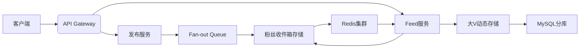

## 如何进行系统设计？::

### 整体思路
* 明确功能需求与范围
	* 要做哪些功能
	* 做到什么程度
* 估算与规模
	* QPS预估
	* 用户量，假设10亿
	* 10亿 * 10% = 1亿 DAU日活
	* 1亿 * 10% 同时在线 1000万 QPS
	* 多少条数据，假设每条数据500B需要多少存储，需要多少带宽
* 高层架构
	* 勾勒出核心组件及其交互，说明技术选型理由。
* 深入设计核心模块
	* 聚焦最关键、最复杂的部分（如短链生成、重定向）
* 解决难点与权衡
	* 讨论设计中遇到的挑战（如高并发读、ID生成）以及你如何权衡不同方案。
* 考虑扩展性、容错等
	* 考系统如何应对增长和故障。
* 收尾与总结
	* 简要回顾关键设计点，或提出可能的优化方向。
* 画图，系统设计图
	* 交互方式
		* 长连接
		* 短链接
		* MQ
	* 尝试分块
		* stateful  有状态， 缓存（redis, zk）记录状态
		* statless 无状态， 负载均衡水平扩展

### 高并发系统设计思路
* 系统拆分
	* 利用服务拆分，每个服务对应一个数据库，间接提升了并发量
	* 不同服务做针对性的服务配置，提升并发量
* 缓存
	* 利用了缓存支持的并发高的优势
* MQ
	* 利用了MQ削峰的特性，将请求挤压到队列中平滑处理，提高并发
* 分库分表
	* 分库可以增多库的连接
	* 分表可以处理数据量问题
* 读写分离
	* 利用机器配置提升数据库性能
	* 增加从库来提高写的并发度
* ES
	* ES相较数据库支持并发高
	* 扩容增加并发度
### 高可用系统设计思路

### 可拓展系统设计思路
## 幂等设计 
* MQ的幂等
* JOB执行的幂等
## 短链系统设计

> 请你设计一个类似TinyURL的短链服务

### 澄清需求与范围 (Crucial!)

“好的，设计一个短链系统。为了确保设计方向正确，我想先和您确认一下核心需求和范围：

#### 核心功能

- 缩短
	- `(longUrl) -> shortUrl`：用户输入一个长URL，系统生成并返回一个对应的短URL（如 `https://short.com/abc123`)。
- 重定向
	- `(shortUrl) -> longUrl`：用户访问短URL，系统将其重定向（HTTP 301/302）到原始的长URL。
>可选内容
>* `自定义短码`：用户能否指定自定义短码（如 `https://short.com/mybrand`)？（这里要确认！）
>* `链接过期时间`：短链接是否需要设置有效期？（这里要确认！）
>* `访问统计`：是否需要记录短链接的点击次数、时间、来源等？（这里要确认！）
		
#### 非功能性需求 (至关重要！)

- **延迟：** 重定向操作的延迟要求是多少？尤其是P99延迟？（例如 < 100ms）
- **可用性：** 系统需要多高的可用性？（例如 99.9%，意味着一年宕机时间约8.76小时）
- **一致性：** 短链创建后，是否要求立即在所有服务器上都可用（强一致）？还是允许短暂延迟（最终一致）？
- **持久性：** 生成的短链映射关系绝对不能丢失（高可靠性）。
- **可扩展性：** 系统需要支撑多大的规模？例如：
	- 日活跃用户（DAU）：1000万？
	- 每天创建短链数：500万？（平均约 60 QPS 写）
	- 每天重定向请求数：5亿？（平均约 5800 QPS 读，峰值可能更高）
	- 数据存储量：假设每个映射记录 500字节，每天500万条 => 2.5GB/天 => 每月75GB，每年约900GB。假设保存5年 => 约4.5TB。_（这些数字可以根据面试官调整，关键是展示估算能力）_
- **安全性：** 需要防止恶意创建（刷量）、短码猜测攻击吗？”
		
> 面试官可能会回答你的问题，例如：“核心功能就是生成和重定向，不需要自定义和统计。可用性99.9%，重定向延迟P99<100ms。数据量按你估算的规模来，需要持久化不能丢。安全方面考虑基本的防刷就行。”

### 高层架构设计 (画出白板/草图)

“基于这些需求，我构想的高层架构主要包含以下组件：

- **Web 服务器/API 网关：**
	
	- 使用 **Spring Boot** 开发，提供 RESTful API。
	- 接收 `/shorten` (POST) 和 `/redirect/{shortCode}` (GET) 请求。
	- 处理认证、限流（防刷）、请求路由。
	- _选型理由：_ Java生态成熟，Spring Boot开发高效，易于集成其他组件。
- **短链生成服务 (核心逻辑)：**
	
	- 实现 `shorten` API 的核心业务逻辑。
	- 负责生成唯一的短码（Short Code）。
	- 将 `短码 <-> 长URL` 的映射关系持久化。
- **重定向服务：**
	
	- 实现 `redirect` API 的核心逻辑。
	- 根据短码查找对应的长URL。
	- 返回 HTTP 301（永久重定向）或 302（临时重定向）响应。
- **数据存储层：**
	
	- **主数据库 (持久化存储)：** 需要一个可靠、持久化存储映射关系的地方。考虑使用 **MySQL**。
		
		- _表设计：_ `short_urls` 表
			- `id` (BIGINT, 主键)
			- `short_code` (VARCHAR(10), UNIQUE INDEX) *// 短码，如 'abc123'，必须唯一*
			- `long_url` (TEXT) _// 原始长URL_
			- `created_at` (DATETIME)
			- `expires_at` (DATETIME, 可选)
		- _选型理由：_ ACID事务保证数据一致性，成熟稳定，易于操作。虽然写QPS(60)不高，但读QPS(5800)较高，需要优化。
	- **缓存层 (加速读取)：** 为了满足极低延迟（<100ms）和高读QPS(5800)的要求，**必须引入缓存**。选用 **Redis**。
		
		- 存储 `短码 -> 长URL` 的映射。
		- _选型理由：_ 内存存储，极快（微秒级），支持高并发，Java有成熟客户端（Jedis, Lettuce）。
- **(可选) 唯一ID生成器：** 如果短码需要全局唯一且可扩展的生成方式，可能需要一个独立服务（如基于Snowflake算法）。

### 深入设计核心模块
#### 短码生成与存储

##### 如何生成短码？

“短码需要全局唯一、尽可能短（如6-8字符）、生成速度快。常见方案有：

- **a. 哈希（如MD5/SHA1） + Base62编码：**
	- 对长URL计算哈希（MD5结果128位，过长），取部分（如前6字节），用 `[a-zA-Z0-9]` 共62个字符编码成字符串（6字节 => 8字符Base62）。
	- **问题：** 哈希冲突（不同长URL生成相同短码）。**解决方案：**
		- 检测冲突（查DB），如果冲突，在长URL后加盐（如随机数/时间戳）重新哈希。
		- _权衡：_ 实现简单，但冲突处理增加延迟和复杂度，盐可能改变URL语义。
- **b. 全局唯一ID生成器 + Base62编码：**
	- 使用一个**分布式唯一ID生成器**（如 **Snowflake算法**）生成一个全局唯一的64位整数ID。
	- 将这个整数ID用Base62编码得到一个短字符串（如123456789 -> "8M0kX"）。
	- **优点：** 绝对唯一（依赖ID生成器），无冲突，速度快，可预测长度。
	- **缺点：** 生成的短码是连续的/可预测（可能被遍历），需要额外ID生成服务。
- **c. 预生成随机短码池：**
	- 离线批量生成大量随机唯一短码存入DB。
	- 服务需要短码时，从池中取一个标记为已用。
	- **优点：** 分配极快（内存操作）。
	- **缺点：** 管理复杂（预生成、补充池），存在浪费，启动慢。
- **我的选择与理由：**
	
	- “**我倾向于方案b：基于Snowflake ID + Base62编码。** 原因：
		- **无冲突：** 核心需求要求映射关系不能丢，哈希冲突处理在高峰期可能成为瓶颈。
		- **高性能低延迟：** Snowflake生成ID非常快（本地生成，无需网络调用），Base62编码是本地计算。
		- **可扩展：** Snowflake是分布式设计，能支撑高TPS。
		- **长度可控：** 根据ID范围可以精确控制短码长度（例如64位ID Base62后约11字符，但我们可以只用低N位，或者用更短的ID如53位）。
		- _应对可预测性：_ 虽然连续，但短码本身没有敏感信息。如果安全性要求高，可以在编码后做一次简单的混淆（比如字符置换）。真正的安全应靠限流和监控。”
                
##### 存储与缓存策略 (Write & Read Path)

- **写入路径 (`/shorten`):**
	
	1. 用户POST长URL到API Gateway。
	2. Gateway做基本校验和限流（如一个用户每分钟最多创建100条）。
	3. 短链生成服务调用ID生成器获取唯一ID。
	4. 将ID进行Base62编码得到短码 `shortCode`。
	5. 将 `(shortCode, longUrl, ...)` 记录**写入MySQL**。_（主库）_
	6. 将 `shortCode -> longUrl` **写入Redis**，设置合理TTL（例如24小时，应对后续读取高峰）。
	7. 返回生成的短URL `https://short.com/`。
	- _权衡：_ 先写DB还是先写缓存？这里选择**先写DB，成功后写缓存**（Cache-Aside / Lazy Loading）。保证DB是权威数据源。写缓存失败可以容忍（下次读会从DB加载），但写DB失败不能返回成功。
- **读取路径 (`/redirect/:shortCode`):**
	
	1. 用户访问短链，GET请求到达API Gateway。
	2. Gateway可能做一层简单的本地缓存（如Guava Cache，缓存热点短码）。
	3. 重定向服务用 `shortCode` **查询Redis**。
	4. **如果Redis命中：** 直接获取 `longUrl`，返回301重定向响应。**极快！**
	5. **如果Redis未命中 (Cache Miss):**
		- 查询 **MySQL**（从库或主库，根据一致性要求）获取 `longUrl`。
		- 如果MySQL中找到，将 `shortCode -> longUrl` **写回Redis**（设置TTL），然后返回重定向。
		- 如果MySQL中也找不到，返回404错误。
	- _优化与问题：_
		
		- **缓存穿透：** 大量请求访问**不存在**的 `shortCode`，会穿透Redis打垮MySQL。
			- **解决方案：** 在Redis中为“查无此码”的结果也设置一个**空值占位符**（如 `shortCode: null`）并设置一个较短TTL（如30秒）。或者使用**布隆过滤器**（Bloom Filter）在查询Redis/MySQL前快速判断 `shortCode` 是否**绝对不存在**（有轻微误判率）。
		- **缓存雪崩：** 大量缓存在同一时间过期，导致请求瞬间涌向DB。
			- **解决方案：** 为缓存的TTL设置一个随机范围（如基础TTL + 随机0-10分钟）。
		- **缓存一致性：** 如果长URL需要更新（虽然短链系统一般不更新），需要**失效**Redis中的旧缓存。本例场景更新极少，暂时忽略此问题。

### 深入设计核心模块
#### 重定向与高可用

- **重定向类型：**
    - “使用 **HTTP 301 (Moved Permanently)**。浏览器和搜索引擎会永久记住这个重定向，后续请求会直接访问长URL，减轻我们的服务器压力。如果链接可能失效（比如有有效期），则用 **HTTP 302 (Found)** 或 **307 (Temporary Redirect)**。”
- **应对高并发读 (5800 QPS):**
    - **Redis集群：** 单台Redis可能成为瓶颈或单点故障。使用 **Redis Cluster** 进行分片和复制，支撑高QPS和高可用。Java客户端（如Lettuce）支持Cluster模式。
    - **MySQL读写分离：**
        - 写操作（创建短链）走主库（Master）。
        - 读操作（重定向时缓存未命中查库）走多个从库（Slaves），分摊读压力。
        - 使用 **数据库中间件**（如ShardingSphere JDBC）或 **Spring框架** 配置读写分离。
    - **服务无状态化 + 水平扩展：**
        - API Gateway、短链生成服务、重定向服务都设计成**无状态**。
        - 部署在多个实例上（如K8s Pods）。
        - 前端使用**负载均衡器**（如Nginx, AWS ALB）分发流量。
        - **服务发现：** 使用 **Spring Cloud Netflix Eureka** 或 **Alibaba Nacos** 进行服务注册与发现，LB动态获取可用实例列表。
- **高可用性 (HA) 设计：**
    
    - **冗余：** 所有关键组件（服务、Redis、MySQL）都部署多个副本。
    - **故障转移：**
        - **Redis：** 使用Redis Sentinel监控主节点，自动故障切换（Failover）。
        - **MySQL：** 配置主从复制（Replication），使用MHA或RDS自带的高可用方案进行主库故障转移。
        - **服务：** LB和服务发现会剔除不健康的实例。
    - **容错机制：**
        - **熔断：** 在重定向服务调用Redis或MySQL时，使用 **Resilience4j** 或 **Sentinel** 配置熔断器。如果下游服务（如某个Redis分片或MySQL从库）故障率高，快速失败（直接返回错误或降级），避免线程阻塞和资源耗尽，保护系统整体可用性。熔断器在故障恢复后自动半开探测。
        - **降级：** 极端情况下（如DB完全不可用），重定向服务是否可以依赖**仅缓存**工作一段时间（牺牲部分新创建或冷门短链的可用性）？需要根据业务容忍度评估。
        - **限流：** 在API Gateway层对 `/shorten` 和 `/redirect` 进行限流（Rate Limiting），防止突发流量或恶意攻击打垮系统。使用 **Guava RateLimiter**（单机）或 **Sentinel/Redis**（分布式）实现。
            

### 扩展性与其他考量

- **数据存储扩展：**
    - **MySQL分库分表：** 如果数据量持续增长（如达到TB级），单库单表性能下降。需要分片（Sharding）。
        - **分片键：** 使用 `short_code` 的哈希值（`hash(short_code) % N`）或 `id`（Snowflake ID通常包含时间戳，可能导致热点）作为分片键。`short_code` 作为查询条件更直接。
        - **方案：** 使用 **ShardingSphere** 或 **Vitess** 等中间件透明化分片逻辑。
- **监控与告警：**
    - **指标收集：** 使用 **Micrometer** 集成到Spring Boot应用，暴露JVM、HTTP请求、Redis/MySQL调用延迟、错误率等指标到 **Prometheus**。
    - **日志收集：** 使用 **ELK Stack**（Elasticsearch, Logstash, Kibana）或 **SLS** 收集和分析应用日志、访问日志。
    - **链路追踪：** 使用 **Jaeger** 或 **Zipkin** + **Spring Cloud Sleuth** 追踪请求在微服务间的流转，定位性能瓶颈。
    - **告警：** 基于Prometheus指标和日志错误模式设置告警（如Redis缓存命中率下降、MySQL延迟升高、5xx错误增多），通知到值班人员。
- **安全性：**
    - **防刷：** API Gateway层对 `/shorten` 接口进行严格限流（用户维度、IP维度）。
    - **短码猜测：** Base62编码的短码空间很大（6位有 ~568亿种可能），猜测有效短码概率极低。如果特别敏感，可以增加短码长度或引入访问频率限制。
    - **恶意URL：** 可以集成URL安全检测服务（如Google Safe Browsing API）在创建时检查长URL是否恶意。

### 收尾与总结

- “总结一下，这个短链系统的核心设计点包括：
    
    - 明确需求，特别是高读QPS、低延迟重定向、高可用性。
    - 采用 **Spring Boot微服务架构**，组件职责分离（Gateway, 生成服务, 重定向服务）。
    - 使用 **Snowflake ID + Base62** 生成唯一、无冲突的短码。
    - **MySQL** 作为权威持久化存储，**Redis** 作为缓存加速重定向读取（Cache-Aside模式）。
    - 针对**高并发读**，采用 **Redis Cluster分片**、**MySQL读写分离**、**服务无状态化水平扩展**。
    - 保障**高可用**，通过 **Redis Sentinel**、**MySQL主从复制与故障转移**、服务注册发现、**熔断（Resilience4j/Sentinel）** 和 **限流**。
    - 处理了 **缓存穿透（布隆过滤器/空值缓存）** 和 **缓存雪崩（随机TTL）**。
    - 考虑了未来**数据增长的分库分表（ShardingSphere）** 方案。
    - 建立了**监控告警（Prometheus+ELK+Jaeger）**体系。
- **可能的优化方向：**
    - 如果访问统计是强需求，如何设计？（提示：使用消息队列Kafka异步收集点击事件，由专门的分析服务消费入库）。
    - 全球部署，使用CDN和地理就近的Redis/DB实例降低重定向延迟。
    - 探索更节省存储的数据库方案（如专门为KV设计的数据库）。

## Feed
### 需求澄清与场景定义

1. **核心功能**：
    
    - `发布动态`：用户可发布图文/视频动态（Tweet/Post）。
    - `关注/取关`：用户可单向关注他人（无需互关）。
    - `生成Feed流`：用户首页展示关注者动态，按时间倒序排列。
    - `点赞/评论`：基础互动能力。
        
2. **非功能性需求**（假设面试官未明确，需主动确认）：
    
    - **低延迟**：Feed加载延迟 ≤ 200ms（用户体验核心）。
    - **高可用**：99.99%可用性（故障自动转移）。
    - **最终一致性**：新动态允许秒级延迟出现在粉丝Feed中。
    - **数据规模**（假设）：
        
        - 日活用户（DAU）5亿，人均关注200人。
        - 日均发帖量：5亿 * 0.2条/天 = 1亿条。
        - 日均Feed读取：5亿 * 10次/天 = 50亿次。
        - **估算QPS**：
            - 写QPS：1亿/86400 ≈ 1,160
            - 读QPS：50亿/86400 ≈ 58,000 （**读远高于写**）。

### 架构设计：推拉结合模式（Hybrid Model）

这是工业界标准解法（Twitter/微博均采用）59。核心思想：**普通用户用推，大V用户用拉**。

#### 整体架构图

#### 核心组件与技术选型

1. **动态存储（发件箱）**：
    
    - **存储内容**：所有用户发布的原始动态（PostID, 用户ID, 内容, 时间等）。
    - **选型**：**MySQL分库分表 + Redis缓存**。
        - 分片策略：按`用户ID Hash`（确保同一用户动态存储在相同分片）。
        - 缓存热点动态（如大V最新帖）。
2. **粉丝关系存储**：
    - **存储内容**：关注关系（用户A → 用户B）。
    - **选型**：**图数据库（Neo4j）或 MySQL**。
        - 高频查询：获取用户的粉丝列表（推模式用）和关注列表（拉模式用）。
3. **Feed收件箱（核心！）**：
    - **存储内容**：普通用户动态的预聚合列表（按时间排序）。
    - **选型**：**Redis Sorted Set**（ZSET）。
        
        - Key: `Timeline:{用户ID}`
        - Value: `{动态ID}`
        - Score: 时间戳（用于排序）。
            
4. **大V动态存储**：
    
    - **存储内容**：粉丝数 > 1万的用户动态（避免推模式扩散）。
    - **选型**：**MySQL分库 + 本地缓存**（如Guava Cache）。
        
5. **消息队列（Fan-out Queue）**：
    
    - **作用**：异步推送普通用户的动态到粉丝收件箱。
    - **选型**：**Kafka**（支持高吞吐、削峰填谷）。

### 工作流程详解

#### 场景1：用户发动态（写路径）

1. 用户发帖 → 写入**动态存储**（MySQL）。
2. **判断用户类型**：
    - **普通用户**：查询其粉丝列表 → 将动态ID写入Kafka。
    - **大V用户**：仅写入动态存储，**不触发推送**。
3. **异步消费者**：从Kafka读取消息 → 将动态ID插入每个粉丝的Redis ZSET（`ZADD Timeline:{粉丝ID} {时间戳} {动态ID}`）。

#### 场景2：用户刷新Feed（读路径）

1. 用户请求Feed → **查询两部分数据**：
    - **普通用户动态**：直接从Redis ZSET读取（`ZREVRANGE Timeline:{用户ID} 0 30`）→ 返回动态ID列表。
    - **大V动态**：遍历关注列表中的大V → 从大V存储中拉取最新动态（并行查询）5。
2. **合并排序**：将两部分动态按时间戳合并 → 截取前N条返回。
3. **填充动态内容**：根据动态ID批量查询缓存/数据库 → 返回完整动态。

### 关键问题与优化策略

#### 问题1：大V动态拉取导致高延迟

- **优化1：缓存大V最新动态**  
    使用Redis缓存大V最近100条动态，避免频繁查库。
- **优化2：并行拉取**  
    对关注的大V并发请求，减少总耗时（线程池配置）。
    

#### 问题2：Redis ZSET存储膨胀

- **优化：冷热分离**
    - 热数据：最近3天的动态存Redis。
    - 冷数据：历史动态存MySQL/HBase，滚动加载。

#### 问题3：新用户冷启动

- **策略**：推荐默认关注热门大V + 预加载缓存9。

#### 问题4：一致性保障

- **最终一致性**：通过消息队列保证异步推送成功，监控延迟告警5。

### 扩展性设计

1. **分库分表**：
    
    - 动态表按`用户ID % 1024`分片。
    - 收件箱按`用户ID`分片存储Redis集群810。
2. **缓存分层**：
    
    - L1：本地缓存（Caffeine）存储个人最新Feed。
    - L2：Redis集群存储全量收件箱。
    - L3：MySQL/HBase 冷数据9。
3. **降级方案**：
    
    - 大V服务故障 → 仅返回普通用户动态（牺牲部分内容）。
    - Redis故障 → 降级读MySQL收件箱（延迟升高）。

> 如何体现设计深度
> 1. **主动对比方案**：
    > “推模式写扩散适合普通用户，但大V会导致写风暴；拉模式读扩散适合大V，但普通用户会引发多次查询。因此混合模式是平衡点。”
2. **数据驱动设计**：
    > “根据DAU 5亿估算读QPS 5.8万，Redis集群需支撑>10万QPS，因此设计3主6从集群+Proxy。”
3. **关注工程细节**：
    > “Kafka分区分区键用发布者ID，保证同一用户的动态顺序写入相同分区，避免乱序。” 
### 总结：Feed流设计的核心逻辑

|**设计维度**|**关键决策**|**依据**|
|---|---|---|
|同步模式|推拉结合（普通推，大V拉）|平衡读写压力59|
|收件箱存储|Redis ZSET|高性能排序+分页|
|动态存储分片|按用户ID Hash|避免热点38|
|一致性模型|最终一致性|容忍秒级延迟5|

## 秒杀系统设计

* 页面静态化（CDN）
* 秒杀按钮限制
	* 点击频次
* 读多写少
	* 库存预热（商品id，名称，规格，库存）
		* cache aside高并发缓存击穿问题
		* 注意预热缓存过期时间
	* 查询缓存（Redis集群）
* 库存问题
	* 超卖问题
		* sql行锁（乐观锁，性能低）
		* redis（lua原子性+ 乐观锁）
	* 未支付库存回滚问题
		* 延迟消息
* mq削峰
	* 秒杀成功，mq消息下单
		* 保证消息发送成功
			* 消息表+job轮询重试
* 接口防刷
	* 限流
		* redis + 用户id限流
		* ip限流（误杀）
		* 接口限流
		* 验证码
		* 或者提高门槛，比如会员参与，限制等级等等
* 平滑流量
	* 比如12306提前售票
## 数据同步系统设计

### 背景
服务融合，做数据迁移

### 问题
* 如何做数据同步方案？
* 数据同步如何保证数据的一致性？
* 数据不一致如何做数据订正？

### 方案选型

| 方案       | 优点                                                                                                                                                                    | 缺点                                                                                                         |
| -------- | --------------------------------------------------------------------------------------------------------------------------------------------------------------------- | ---------------------------------------------------------------------------------------------------------- |
| 同步工具     | 1. 要求新老表数据结构一致 2. 大部分工具需要收费                                                                                                                                        | 无开发量、操作简单、接入快速                                                                                             |
| 双写       | 1. 对业务逻辑侵入性大 2. 分布式事务 3. 大批量数据同步会降低业务系统性能                                                                                                                       | 1. 配置简单 2. 实现简单                                                                                         |
| binlog解析 | 1. 新老数据需要做转换逻辑处理,容易转换错误，造成数据不一致.，数据转换过程需要关注一些业务逻辑. 2. 数据延迟，业务系统批量补录可能会导致数据更新量超过系统处理峰值，导致数据延迟 3. 采用数据库抽离的方式投入较大，需要在源数据库和目标数据库之间部署一个系统实时抽取数据(目前中间件已支持) 4. 数据丢失 | 1. 新老系统代码0侵入. 2. 相比双写不需要考虑业务上的幂等、一致性等复杂情况 3. 日志解析同步方式实现了实时与准实时的同步能力，延迟可以控制在毫秒级别   4. 对业务系统性能影响比较小 |

我们的诉求：
1. 支持新老表结构不同的数据同步
2. 对业务代码侵入低
3. 对线上系统影响低

结论：采用**数据库日志解析同步***，保证系统可回切。

### 方案设计
#### 同步的数据组成:

 * 增量数据
 * 存量数据(近3个月内的)

#### 数据同步主要分为3个阶段

1. 增量数据监听binlog同步到pg库。
2. 存量数据由hive同步到kafka再由业务系统消费消息同步到pg。
3. 灰度全量切流后，停止数据同步。

#### 数据同步监控&告警

* 记录数据同步成功、失败的埋点数据, 基于埋点数据配置监控及告警。 
* 监控维度包含3块(增量、核对、订正)。
* 监控粒度支持到具体的表。

### 增量数据同步

#### 数据正向同步

#### 数据逆向同步

### 存量数据同步

 1. 先执行hive数据计算任务(hive -> hive)将自定义sql查询出来的数据同步到hive中转表。
1. 中转表数据同步完后,再执行hive数据交换任务(hive -> kafka)。
2. 在存量数据同步过程中，可以进行限流控制,防止打爆数据库。

#### 详细流程

### 数据订正流程

### 数据同步要注意的问题
1. 循环同步问题
	> 通过增加标识字段解决
2. binlog同步期间要注意限流
3. 实现过程要增加开关控制，出现异常可空消费处理
4. 数据不一致，需进行数据订正时，订正规则如下：
        ● 一方有数据一方无数据 ：则无数据一方新增
        ● 两方数据不一致：update_time最新记录为准
        ● 两方数据不一致，update_time一致：以一方(老库)为准
 5. 比对数据有差异的情况下，执行乐观锁来更新数据，带上更新时间的比较条件where update_time < = #{updateTime}  
 6. 数据核对会使用分布式锁，防止并发过程导致数据不一致, 采用分布式锁可保证数据最终一致性, 同时支持失败重试。
### 思考

 1、上述数据同步完全依赖于binlog消息, 如果此链路宕机无法消费到binlog消息,那么该怎么升级技术方案来达到不影响数据同步?

2、如何保证数据同步过程中不丢数据?

个人观点: 可以在新老业务系统发送各自的数据同步延迟消息来解决, 通过双链路保证数据的完整性,双链路丢失同一条数据的概率极低,可以认为忽略不计. 这样做的缺点是业务系统有代码侵入.如果对数据完整性敏感以及数据同步跨度周期长建议采用双链路方案最可靠。

### 总结

1、上述主要解决如何实现数据同步，以及数据同步的过程中，关于数据一致性、数据订正等问题解决方案。实际开发中必然还会出现更多的问题,这里需要注意怎么做到同步的可靠性及稳定性.

2、数据同步过程需要考虑限流及降级,不要影响服务的稳定性.

3、存量数据同步由于数据量大需要避开业务高峰期再执行.