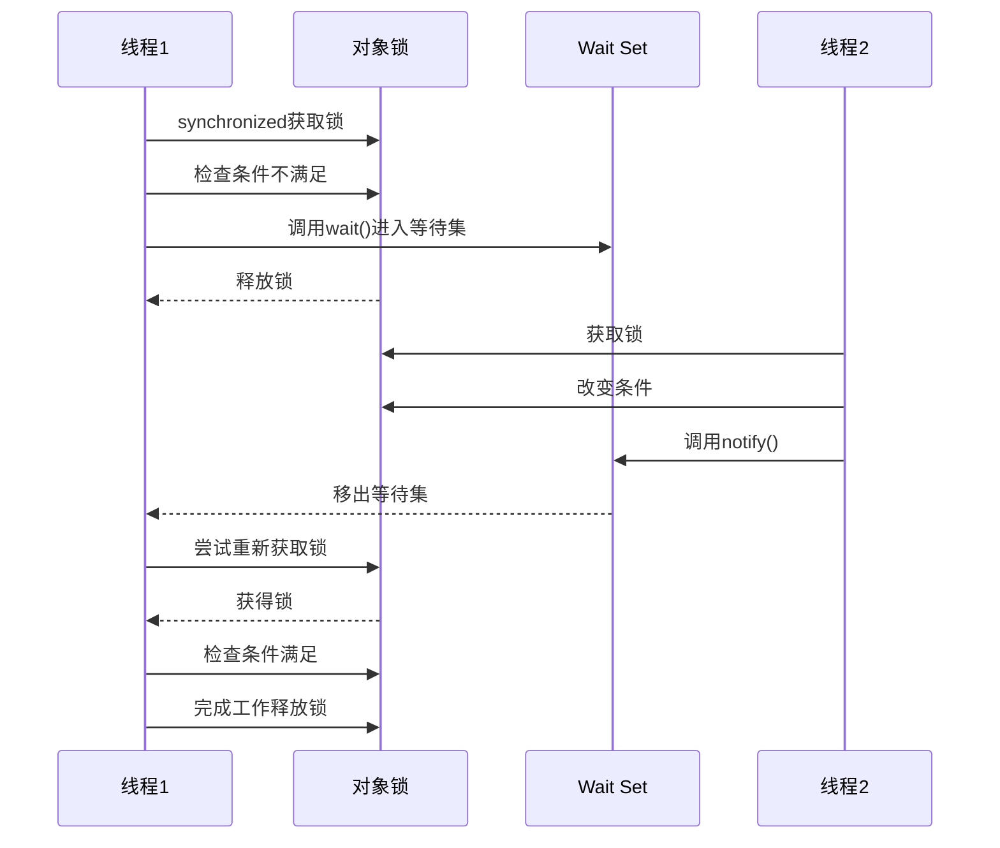

## Java

### 基础

#### 1. 重载和重写有什么区别？
#### 2. 你研究过什么框架源码或原理？
### 集合
#### 1. HashMap 扩容流程？为什么长度是 2 的幂？
保证 `(n-1) & hash` 均匀分布（二进制位全 1），减少哈希冲突。
####  2. HashMap 线程不安全例子？
并发 put 导致数据覆盖；Java 7 并发扩容死循环。
#### 3. CHM 如何保证线程安全？
Java 8 用 `CAS`（无锁初始化/计数）+ `synchronized`（桶锁） + `volatile`（可见性）。
#### CHM 的 get() 需要加锁吗？
不需要，通过 `volatile` 变量保证可见性。
#### CHM 的 size() 是准确的吗？
不一定（并发更新时），但实际误差很小（`CounterCell` 分段统计）。
#### 为什么 CHM 不允许 null 键/值？
避免二义性（如 `get(key)` 返回 null 时，无法区分是不存在还是值为 null）。
#### CHM 在 Java 7 和 8 的区别？
Java 7 用分段锁（锁粒度粗），Java 8 用桶锁 + CAS（锁粒度细，并发度更高）。
#### 链表转红黑树的阈值为什么是 8？
遵循泊松分布，链表长度 ≥8 的概率极低（`0.00000006`），避免不必要的树化开销。
### 并发

#### 1. 线程的生命周期
>1. **新建状态（New）**：当一个线程对象被创建时，它处于新建状态。此时线程对象已经被创建，但还没有开始运行。
>2. **就绪状态（Runnable）**：当线程调用start()方法后，线程进入就绪状态。此时线程已经准备好运行，但可能还没有被分配到CPU时间片。
>3. **运行状态（Running）**：当线程获得CPU时间片并开始执行时，线程进入运行状态。此时线程正在执行任务。
>4. **阻塞状态（Blocked）**：当线程因为某些原因无法继续执行时，线程进入阻塞状态。阻塞状态可以分为多种类型，如等待I/O、等待锁、等待信号等。
>5. **等待状态（Waiting）**：当线程需要等待某些条件满足时，线程进入等待状态。等待状态可以通过wait()方法、join()方法等实现。
>6. **计时等待状态（Timed Waiting）**：当线程需要等待一定时间或者等待某些条件满足时，线程进入计时等待状态。计时等待状态可以通过sleep()方法、wait(timeout)方法等实现。
>7. **终止状态（Terminated）**：当线程完成了任务或者因为异常等原因退出时，线程进入终止状态。此时线程的生命周期结束。
#### 2. 为什么生产消费模型中，条件判断用while不用if？
>因为在多核处理器环境中，Signal唤醒操作可能会激活多于一个线程（阻塞在条件变量上的线程），使得多个调用等待的线程返回。所以用while循环对condition多次判断，可以避免这种虚假唤醒。
#### 3. 如何优雅的停止线程？如何强制关掉线程？
#### 4. 为什么不加volatile就会一直卡死呢
#### 5. join方法
#### 6. 多线程死锁分析
#### 7. 生产者消费者模型
##### **使用 `synchronized` + `wait()` + `notifyAll()`（最基础）：**
```java
import java.util.LinkedList;
import java.util.Queue;

public class ProducerConsumerSync {
    private static final int BUFFER_SIZE = 5;
    private final Queue<Integer> buffer = new LinkedList<>();
    private int count = 1;
    private final int MAX_VALUE = 100;

    public static void main(String[] args) {
        ProducerConsumerSync pc = new ProducerConsumerSync();
        
        // 创建多个生产者和消费者
        for (int i = 0; i < 3; i++) {
            new Thread(pc::produce, "生产者-" + (i + 1)).start();
        }
        
        for (int i = 0; i < 2; i++) {
            new Thread(pc::consume, "消费者-" + (i + 1)).start();
        }
    }

    public void produce() {
        while (true) {
            synchronized (this) {
                // 缓冲区满时等待
                while (buffer.size() == BUFFER_SIZE) {
                    try {
                        System.out.println(Thread.currentThread().getName() + ": 缓冲区已满，等待中...");
                        wait();
                    } catch (InterruptedException e) {
                        Thread.currentThread().interrupt();
                    }
                }
                
                // 停止条件
                if (count > MAX_VALUE) {
                    notifyAll(); // 唤醒其他线程
                    return;
                }
                
                // 生产数据
                buffer.offer(count);
                System.out.println(Thread.currentThread().getName() + " 生产了: " + count + 
                                  " | 缓冲区大小: " + buffer.size());
                count++;
                
                // 通知消费者
                notifyAll();
            }
            
            // 模拟生产耗时
            try {
                Thread.sleep(100);
            } catch (InterruptedException e) {
                Thread.currentThread().interrupt();
            }
        }
    }

    public void consume() {
        while (true) {
            synchronized (this) {
                // 缓冲区空时等待
                while (buffer.isEmpty()) {
                    try {
                        System.out.println(Thread.currentThread().getName() + ": 缓冲区为空，等待中...");
                        wait();
                    } catch (InterruptedException e) {
                        Thread.currentThread().interrupt();
                    }
                }
                
                // 消费数据
                int value = buffer.poll();
                System.out.println(Thread.currentThread().getName() + " 消费了: " + value + 
                                  " | 缓冲区大小: " + buffer.size());
                
                // 通知生产者
                notifyAll();
                
                // 停止条件
                if (value == MAX_VALUE) {
                    return;
                }
            }
            
            // 模拟消费耗时
            try {
                Thread.sleep(150);
            } catch (InterruptedException e) {
                Thread.currentThread().interrupt();
            }
        }
    }
}
```

- 定义一个固定大小的缓冲区类（通常用数组或队列实现）。
	
- 在`put`方法中：用`synchronized`保护临界区。如果缓冲区满，则调用`wait()`让当前生产者线程等待。当放入数据后，调用`notifyAll()`唤醒可能正在等待的消费者线程。
	
- 在`take`方法中：用`synchronized`保护临界区。如果缓冲区空，则调用`wait()`让当前消费者线程等待。当取出数据后，调用`notifyAll()`唤醒可能正在等待的生产者线程。

**技术要点分析：**

1. **同步机制**：使用 `synchronized` 关键字保证对缓冲区的互斥访问
    
2. **线程通信**：`wait()` 让线程等待，`notifyAll()` 唤醒所有等待线程
    
3. **条件检查**：使用 `while` 循环检查条件（避免虚假唤醒）
    
4. **锁对象**：使用 `this` 作为监视器对象
    
5. **多生产者/消费者**：通过多个线程实现并发生产消费
    

**潜在问题：**

- `notifyAll()` 会唤醒所有等待线程，包括同类型线程，可能导致不必要的上下文切换
    
- 无法精确控制唤醒特定类型的线程

>为什么用`while`检查条件而不是`if`？为什么通常用`notifyAll()`而不是`notify()`？(答：防止虚假唤醒；`notify()`可能只唤醒同类型的线程导致死锁)。
	
##### **使用 `Lock` + `Condition`（更灵活）：**
```java
import java.util.LinkedList;
import java.util.Queue;
import java.util.concurrent.locks.Condition;
import java.util.concurrent.locks.Lock;
import java.util.concurrent.locks.ReentrantLock;

public class ProducerConsumerLock {
    private static final int BUFFER_SIZE = 5;
    private final Queue<Integer> buffer = new LinkedList<>();
    private int count = 1;
    private final int MAX_VALUE = 100;
    
    private final Lock lock = new ReentrantLock();
    private final Condition notFull = lock.newCondition();
    private final Condition notEmpty = lock.newCondition();

    public static void main(String[] args) {
        ProducerConsumerLock pc = new ProducerConsumerLock();
        
        // 创建多个生产者和消费者
        for (int i = 0; i < 3; i++) {
            new Thread(pc::produce, "生产者-" + (i + 1)).start();
        }
        
        for (int i = 0; i < 2; i++) {
            new Thread(pc::consume, "消费者-" + (i + 1)).start();
        }
    }

    public void produce() {
        while (true) {
            lock.lock();
            try {
                // 缓冲区满时等待
                while (buffer.size() == BUFFER_SIZE) {
                    System.out.println(Thread.currentThread().getName() + ": 缓冲区已满，等待中...");
                    notFull.await();
                }
                
                // 停止条件
                if (count > MAX_VALUE) {
                    notEmpty.signalAll(); // 唤醒消费者
                    return;
                }
                
                // 生产数据
                buffer.offer(count);
                System.out.println(Thread.currentThread().getName() + " 生产了: " + count + 
                                  " | 缓冲区大小: " + buffer.size());
                count++;
                
                // 通知消费者
                notEmpty.signal();
            } catch (InterruptedException e) {
                Thread.currentThread().interrupt();
            } finally {
                lock.unlock();
            }
            
            // 模拟生产耗时
            try {
                Thread.sleep(100);
            } catch (InterruptedException e) {
                Thread.currentThread().interrupt();
            }
        }
    }

    public void consume() {
        while (true) {
            lock.lock();
            try {
                // 缓冲区空时等待
                while (buffer.isEmpty()) {
                    System.out.println(Thread.currentThread().getName() + ": 缓冲区为空，等待中...");
                    notEmpty.await();
                }
                
                // 消费数据
                int value = buffer.poll();
                System.out.println(Thread.currentThread().getName() + " 消费了: " + value + 
                                  " | 缓冲区大小: " + buffer.size());
                
                // 通知生产者
                notFull.signal();
                
                // 停止条件
                if (value == MAX_VALUE) {
                    return;
                }
            } catch (InterruptedException e) {
                Thread.currentThread().interrupt();
            } finally {
                lock.unlock();
            }
            
            // 模拟消费耗时
            try {
                Thread.sleep(150);
            } catch (InterruptedException e) {
                Thread.currentThread().interrupt();
            }
        }
    }
}
```

- 引入`ReentrantLock`和它创建的`Condition`对象（例如`notFull`, `notEmpty`）。
	
- 在`put`方法中：加锁。缓冲区满时，调用`notFull.await()`等待。放入数据后，调用`notEmpty.signal()`或`notEmpty.signalAll()`唤醒一个或所有等待的消费者。
	
- 在`take`方法中：加锁。缓冲区空时，调用`notEmpty.await()`等待。取出数据后，调用`notFull.signal()`或`notFull.signalAll()`唤醒一个或所有等待的生产者。
	
- **面试要点：** 相比`synchronized`有什么优势？(答：更细粒度的锁控制、可中断、可尝试获取锁、公平锁、多个等待条件)。`signal()`和`signalAll()`的选择策略。

**技术要点分析：**

1. **显式锁**：使用 `ReentrantLock` 替代 `synchronized`
    
2. **条件变量**：创建两个 `Condition` 对象分别管理生产者和消费者的等待队列
    
    - `notFull`: 缓冲区不满条件（生产者等待）
        
    - `notEmpty`: 缓冲区不空条件（消费者等待）
        
3. **精确唤醒**：
    
    - 生产者唤醒消费者：`notEmpty.signal()`
        
    - 消费者唤醒生产者：`notFull.signal()`
        
4. **锁释放**：在 `finally` 块中确保锁被释放
    

**优势：**

- 避免不必要的唤醒（只唤醒需要的线程类型）
    
- 更细粒度的控制（可中断、超时等待等）
    
- 支持公平锁策略

##### **使用 `BlockingQueue`（最简单、最推荐）：**
```java
import java.util.concurrent.BlockingQueue;
import java.util.concurrent.ExecutorService;
import java.util.concurrent.Executors;
import java.util.concurrent.LinkedBlockingQueue;
import java.util.concurrent.TimeUnit;
import java.util.concurrent.atomic.AtomicInteger;

public class ProducerConsumerBlockingQueue {
    private static final int BUFFER_SIZE = 5;
    private final BlockingQueue<Integer> buffer = new LinkedBlockingQueue<>(BUFFER_SIZE);
    private final AtomicInteger count = new AtomicInteger(1);
    private final int MAX_VALUE = 100;
    private volatile boolean running = true;

    public static void main(String[] args) {
        ProducerConsumerBlockingQueue pc = new ProducerConsumerBlockingQueue();
        pc.start();
    }

    public void start() {
        // 创建线程池
        ExecutorService executor = Executors.newFixedThreadPool(5);
        
        // 启动3个生产者
        for (int i = 0; i < 3; i++) {
            executor.submit(this::produce);
        }
        
        // 启动2个消费者
        for (int i = 0; i < 2; i++) {
            executor.submit(this::consume);
        }
        
        // 添加关闭钩子
        Runtime.getRuntime().addShutdownHook(new Thread(() -> {
            running = false;
            executor.shutdown();
            try {
                if (!executor.awaitTermination(5, TimeUnit.SECONDS)) {
                    executor.shutdownNow();
                }
            } catch (InterruptedException e) {
                executor.shutdownNow();
                Thread.currentThread().interrupt();
            }
        }));
    }

    public void produce() {
        while (running) {
            try {
                int value = count.getAndIncrement();
                
                // 停止条件
                if (value > MAX_VALUE) {
                    running = false;
                    return;
                }
                
                // 阻塞式放入（当队列满时自动等待）
                buffer.put(value);
                System.out.println(Thread.currentThread().getName() + " 生产了: " + value + 
                                  " | 缓冲区大小: " + buffer.size());
                
                // 模拟生产耗时
                Thread.sleep(100);
            } catch (InterruptedException e) {
                Thread.currentThread().interrupt();
                running = false;
            }
        }
    }

    public void consume() {
        while (running || !buffer.isEmpty()) {
            try {
                // 阻塞式获取（当队列空时自动等待）
                Integer value = buffer.poll(100, TimeUnit.MILLISECONDS);
                
                if (value == null) continue; // 超时返回null
                
                System.out.println(Thread.currentThread().getName() + " 消费了: " + value + 
                                  " | 缓冲区大小: " + buffer.size());
                
                // 停止条件
                if (value == MAX_VALUE) {
                    running = false;
                    return;
                }
                
                // 模拟消费耗时
                Thread.sleep(150);
            } catch (InterruptedException e) {
                Thread.currentThread().interrupt();
                running = false;
            }
        }
    }
}
```

- Java并发包(`java.util.concurrent`)提供了现成的阻塞队列实现，如`ArrayBlockingQueue`(有界)、`LinkedBlockingQueue`(可选有界/无界)、`PriorityBlockingQueue`等。
	
- **生产者：** 调用`queue.put(item)`或`queue.offer(item, timeout, unit)`。如果队列满，`put`会阻塞直到有空间；`offer`可以设置超时或立即返回。
	
- **消费者：** 调用`queue.take()`或`queue.poll(timeout, unit)`。如果队列空，`take`会阻塞直到有元素；`poll`可以设置超时或立即返回。
	
- **面试要点：** 这是最简洁高效的方式。面试官会期望你优先提到这个方案。需要了解不同`BlockingQueue`实现的特性（有界/无界、排序、底层结构）。

**技术要点分析：**

1. **阻塞队列**：使用 `LinkedBlockingQueue` 作为线程安全的缓冲区
    
2. **自动阻塞**：
    
    - `put()`：队列满时自动阻塞生产者
        
    - `take()`/`poll()`：队列空时自动阻塞消费者
        
3. **线程池管理**：使用 `ExecutorService` 管理生产者和消费者线程
    
4. **原子操作**：使用 `AtomicInteger` 保证计数器的线程安全
    
5. **优雅关闭**：
    
    - 使用 `volatile` 标志位控制循环
        
    - 添加关闭钩子确保线程池正确关闭
        
    - 消费者在关闭后继续处理剩余任务
        

**优势：**

- 代码简洁，减少手动同步逻辑
    
- 内置线程安全机制
    
- 支持容量限制和超时控制
    
- 易于扩展和维护
##### 对比
| **特性**       | **synchronized版** | **Lock+Condition版**    | **BlockingQueue版** |
| ------------ | ----------------- | ---------------------- | ------------------ |
| **锁机制**      | 内置锁               | 显式锁                    | 队列内部锁              |
| **线程通信**     | wait/notifyAll    | Condition.signal/await | 队列内部阻塞机制           |
| **精确唤醒**     | ❌ (notifyAll唤醒所有) | ✅ (可定向唤醒)              | ✅ (队列自动管理)         |
| **代码复杂度**    | 中等                | 中等                     | 简单                 |
| **扩展性**      | 有限                | 高                      | 高                  |
| **异常处理**     | 基本                | 灵活                     | 灵活                 |
| **适用场景**     | 简单场景              | 需要精细控制的场景              | 生产环境推荐             |
| **多生产者/消费者** | 需要手动处理            | 需要手动处理                 | 自动处理               |
| **缓冲区实现**    | 手动实现              | 手动实现                   | 内置实现               |
| **性能**       | 中等                | 较高                     | 高                  |
#### 8. 多生产者多消费者中 wait、notify的问题

1. **`notify()` 的唤醒不确定性（导致死锁或饥饿）**

    >当调用 `notify()` 时，JVM 会**随机唤醒一个等待线程**（无法指定生产者/消费者）。  
    **多生产多消费时可能唤醒错误类型的线程**：
    - 缓冲区空时，消费者应被唤醒，但可能唤醒生产者（生产者发现缓冲区满又继续等待）。
    - 缓冲区满时，生产者应被唤醒，但可能唤醒消费者（消费者发现缓冲区空又继续等待）。
    - 结果：所有线程陷入等待（死锁），或部分线程长期得不到执行（饥饿）。
2. **`notifyAll()` 的性能开销（惊群效应）**
    >改用 `notifyAll()` 虽可避免死锁（唤醒所有线程），但会引发**惊群效应（Thundering Herd）**：
    
    - 例如：一个生产者放入数据后调用 `notifyAll()`，会唤醒**所有等待的生产者和消费者**。
    - 消费者抢到锁并消费数据后，其他被唤醒的线程（生产者/消费者）**重新检查条件失败**，再次进入等待。
    - 结果：大量无效的线程唤醒/上下文切换，**CPU 资源浪费**。
#### 3. **条件判断必须用 `while`（避免虚假唤醒）**

- **问题**：  
    即使正确使用 `notifyAll()`，仍需用 `while` 代替 `if` 检查条件（如 `while (buffer.isEmpty())`）。  
    原因：
    
    - **虚假唤醒（Spurious Wakeup）**：线程可能在没有收到 `notify()` 时被唤醒（JVM 规范允许）。
        
    - **多线程竞争**：被唤醒的线程重新竞争锁时，条件可能已被其他线程改变（如多个消费者竞争消费最后一个数据）。
#### 9. sleep和wait的区别
| **特性**   | **`Thread.sleep()`** | **`Object.wait()`**                |
| -------- | -------------------- | ---------------------------------- |
| **所属类**  | `Thread`类的静态方法       | `Object`类的实例方法                     |
| **锁释放**  | ❌ **不释放锁**           | ✅ **释放锁**                          |
| **调用位置** | 任意位置                 | 必须在`synchronized`代码块内              |
| **唤醒机制** | 超时自动唤醒 / 中断唤醒        | `notify()`/`notifyAll()` / 超时 / 中断 |
| **用途**   | 单纯暂停当前线程             | 线程间通信（如生产者-消费者）                    |
#### 10. Runtime钩子程序配合线程使用
Runtime 钩子程序（Shutdown Hooks）是 Java 提供的一种在 JVM 关闭前执行清理操作的机制，与线程配合使用可以实现优雅关闭、资源清理等关键功能。


```java
// 添加关闭钩子
Runtime.getRuntime().addShutdownHook(new Thread(() -> {
    System.out.println("执行清理操作...");
    // 清理代码
}));
```

1. 通知线程优雅停止

	```java
	
	volatile boolean running = true;
	
	public static void main(String[] args) {
	    // 创建后台工作线程
	    Thread worker = new Thread(() -> {
	        while (running) {
	            // 执行任务
	            System.out.println("Working...");
	            try { Thread.sleep(1000); } catch (InterruptedException e) {}
	        }
	        System.out.println("Worker thread exited gracefully");
	    });
	    worker.start();
	
	    // 注册关闭钩子
	    Runtime.getRuntime().addShutdownHook(new Thread(() -> {
	        System.out.println("Shutdown signal received");
	        running = false;  // 通知工作线程停止
	        
	        // 等待工作线程结束
	        try {
	            worker.join(5000);  // 最多等待5秒
	            if (worker.isAlive()) {
	                System.out.println("Worker not responding, forcing exit");
	            }
	        } catch (InterruptedException e) {
	            Thread.currentThread().interrupt();
	        }
	    }));
	}
	```
2. 线程池的优雅关闭

```java

ExecutorService threadPool = Executors.newFixedThreadPool(4);

public void start() {
    // 添加关闭钩子
    Runtime.getRuntime().addShutdownHook(new Thread(() -> {
        System.out.println("Shutting down thread pool...");
        
        // 第一步：停止接受新任务
        threadPool.shutdown();
        
        try {
            // 第二步：等待现有任务完成
            if (!threadPool.awaitTermination(10, TimeUnit.SECONDS)) {
                // 第三步：强制取消正在执行的任务
                threadPool.shutdownNow();
                
                // 再次等待
                if (!threadPool.awaitTermination(5, TimeUnit.SECONDS)) {
                    System.err.println("Thread pool did not terminate");
                }
            }
        } catch (InterruptedException e) {
            threadPool.shutdownNow();
            Thread.currentThread().interrupt();
        }
    }));
    
    // 提交任务到线程池...
}
```

##### 应用场景

###### 1. 资源清理与释放

```java

Runtime.getRuntime().addShutdownHook(new Thread(() -> {
    // 关闭数据库连接池
    if (dataSource != null) {
        dataSource.close();
        System.out.println("Database connections closed");
    }
    
    // 删除临时文件
    cleanTempFiles();
    
    // 释放网络资源
    releaseNetworkResources();
}));
```

2. 状态持久化

```
java

// 内存缓存服务
Map<String, Object> cache = new ConcurrentHashMap<>();

Runtime.getRuntime().addShutdownHook(new Thread(() -> {
    System.out.println("Persisting cache to disk...");
    try {
        // 将内存缓存写入文件
        try (ObjectOutputStream oos = new ObjectOutputStream(
             new FileOutputStream("cache.dat"))) {
            oos.writeObject(cache);
        }
    } catch (IOException e) {
        System.err.println("Failed to persist cache: " + e.getMessage());
    }
}));
```

3. 服务注销

```java

// 在服务注册中心注册服务
registerWithServiceRegistry();

Runtime.getRuntime().addShutdownHook(new Thread(() -> {
    System.out.println("Unregistering from service registry...");
    try {
        unregisterFromServiceRegistry();
    } catch (Exception e) {
        System.err.println("Service unregistration failed: " + e.getMessage());
    }
}));
```

4. 监控指标上报

```java

Runtime.getRuntime().addShutdownHook(new Thread(() -> {
    // 收集最终指标
    Map<String, Number> finalMetrics = collectMetrics();
    
    // 上报到监控系统
    reportMetrics(finalMetrics);
    
    System.out.println("Final metrics reported");
}));
```

## 使用注意事项

1. **钩子线程必须快速完成**
    
    - JVM 不会无限期等待钩子完成
        
    - 默认超时时间约为 30 秒（不同 JVM 实现可能不同）
        
2. **避免死锁**
    
```java
    
    Runtime.getRuntime().addShutdownHook(new Thread(() -> {
        // 错误示例：在钩子中同步等待其他钩子
        synchronized(someLock) {
            // 可能死锁
        }
    }));
    ```
    
3. **线程安全**
    
    ```java
    
    // 正确使用 volatile 或原子变量
    private volatile boolean shutdownFlag = false;
    
    Runtime.getRuntime().addShutdownHook(new Thread(() -> {
        shutdownFlag = true;  // 通知其他线程
    }));
    ```
    
4. **钩子执行顺序**
    
    - 多个钩子的执行顺序**不确定**
        
    - 重要钩子应设计为独立执行
        
5. **无法阻止 JVM 关闭**
    
    - 钩子只能执行清理，不能取消关闭过程
        
    - 强制关闭（kill -9）不会触发钩子
        

## 高级模式：分层关闭

```java

public class GracefulShutdownManager {
    private final List<Runnable> shutdownTasks = new ArrayList<>();
    private final List<Thread> hooks = new ArrayList<>();
    
    public void addShutdownTask(Runnable task) {
        shutdownTasks.add(task);
    }
    
    public void initialize() {
        Thread hook = new Thread(() -> {
            System.out.println("Starting graceful shutdown...");
            ExecutorService executor = Executors.newFixedThreadPool(
                Math.min(4, shutdownTasks.size()));
            
            // 并行执行所有关闭任务
            List<Future<?>> futures = new ArrayList<>();
            for (Runnable task : shutdownTasks) {
                futures.add(executor.submit(task));
            }
            
            // 等待所有任务完成
            for (Future<?> future : futures) {
                try {
                    future.get(10, TimeUnit.SECONDS);
                } catch (Exception e) {
                    System.err.println("Shutdown task failed: " + e.getMessage());
                }
            }
            
            executor.shutdown();
            System.out.println("Shutdown complete");
        });
        
        Runtime.getRuntime().addShutdownHook(hook);
        hooks.add(hook);
    }
    
    // 可选的：手动触发关闭
    public void shutdown() {
        for (Thread hook : hooks) {
            // 模拟JVM关闭
            hook.start();
        }
    }
}
    ```

##### 实际应用建议

1. **关键系统组件**：数据库连接池、消息队列消费者、网络服务器
2. **状态型服务**：缓存服务、配置中心客户端
3. **批处理系统**：确保当前批次处理完成
4. **监控系统**：上报最终状态指标

#### 11. 线程中如何捕获异常，普通的try-catch无法捕获
在 Java 中，线程内的异常处理需要特别注意：**普通的 `try-catch` 无法捕获其他线程中的异常**。这是因为每个线程有独立的执行栈，异常只能被当前线程捕获。以下是详细说明和解决方案：
##### **为什么普通 try-catch 无法捕获线程异常？**

```java

public static void main(String[] args) {
    try {
        // 启动新线程（子线程）
        new Thread(() -> {
            throw new RuntimeException("子线程异常！");
        }).start();
        
    } catch (Exception e) {
        // 这里无法捕获子线程的异常！
        System.out.println("捕获异常: " + e.getMessage());
    }
}
```

**结果**：子线程的异常会直接导致线程终止，并打印错误栈，但主线程的 `catch` 块不会执行。

##### **正确捕获线程异常的 3 种方法**

#### ✅ 方法 1：在线程内部使用 `try-catch`

直接在 `run()` 方法中处理异常：

```java

new Thread(() -> {
    try {
        throw new RuntimeException("子线程异常！");
    } catch (Exception e) {
        System.out.println("子线程内部捕获: " + e.getMessage()); // 能捕获
    }
}).start();
```

#### ✅ 方法 2：设置 `UncaughtExceptionHandler`

为线程设置未捕获异常处理器：

```java

Thread thread = new Thread(() -> {
    throw new RuntimeException("子线程异常！");
});

// 设置异常处理器
thread.setUncaughtExceptionHandler((t, e) -> {
    System.out.println("捕获线程 " + t.getName() + " 的异常: " + e.getMessage());
});

thread.start();
```

#### ✅ 方法 3：使用全局默认处理器（可选）

捕获所有线程的未处理异常：

```java

Thread.setDefaultUncaughtExceptionHandler((t, e) -> {
    System.out.println("全局捕获: " + e.getMessage());
});
```

##### **线程池中的异常处理**

使用 `ExecutorService` 时，异常处理方式不同：

- **`submit()` 提交任务**：异常被封装到 `Future` 对象中，调用 `future.get()` 时抛出。
- **`execute()` 提交任务**：需通过 `UncaughtExceptionHandler` 处理。
    

**示例**：

```java

ExecutorService executor = Executors.newSingleThreadExecutor();

// 方式 1: submit() + Future
Future<?> future = executor.submit(() -> {
    throw new RuntimeException("线程池异常！");
});
try {
    future.get(); // 这里抛出 ExecutionException（包装原始异常）
} catch (Exception e) {
    System.out.println("捕获: " + e.getCause().getMessage());
}

// 方式 2: 设置线程工厂的异常处理器
ExecutorService executorWithHandler = Executors.newSingleThreadExecutor(r -> {
    Thread t = new Thread(r);
    t.setUncaughtExceptionHandler((thread, ex) -> {
        System.out.println("线程池捕获: " + ex.getMessage());
    });
    return t;
});
executorWithHandler.execute(() -> {
    throw new RuntimeException("线程池异常！");
});
```

##### 关键总结

|场景|能否用普通 try-catch|解决方案|
|---|---|---|
|当前线程内异常|✅ 能|直接使用 `try-catch`|
|**其他线程内异常**|❌ **不能**|`UncaughtExceptionHandler`|
|线程池任务异常|❌ 不能|`Future.get()` 或自定义处理器|

> 始终记住：异常的作用域是线程独立的。跨线程异常必须通过线程自身的机制处理。
#### 12. 自定义个boolean锁
```java
public class SimpleBooleanLock {
    private boolean isLocked = false;  // 锁状态标志
    
    // 获取锁（阻塞直到成功）
    public synchronized void lock() throws InterruptedException {
        while (isLocked) {
            // 如果锁已被占用，当前线程进入等待
            wait();
        }
        // 成功获取锁
        isLocked = true;
    }
    
    // 释放锁
    public synchronized void unlock() {
        isLocked = false;
        notifyAll();  // 唤醒所有等待线程
    }
    
    // 尝试获取锁（非阻塞）
    public synchronized boolean tryLock() {
        if (!isLocked) {
            isLocked = true;
            return true;
        }
        return false;
    }
}
```
AQS版本
```java
import java.util.concurrent.TimeUnit;
import java.util.concurrent.locks.AbstractQueuedSynchronizer;
import java.util.concurrent.locks.Condition;
import java.util.concurrent.locks.Lock;

public class BooleanLock implements Lock {
    // 内部同步器
    private final Sync sync;
    
    // 构造函数 - 默认为非公平锁
    public BooleanLock() {
        this(false);
    }
    
    // 构造函数 - 可选择公平/非公平锁
    public BooleanLock(boolean fair) {
        sync = fair ? new FairSync() : new NonfairSync();
    }
    
    // 内部同步器基类
    private abstract static class Sync extends AbstractQueuedSynchronizer {
        // 锁是否被占用
        final boolean isLocked() {
            return getState() == 1;
        }
        
        // 尝试获取锁
        protected boolean tryAcquire(int acquires) {
            assert acquires == 1;
            if (compareAndSetState(0, 1)) {
                setExclusiveOwnerThread(Thread.currentThread());
                return true;
            }
            return false;
        }
        
        // 尝试释放锁
        protected boolean tryRelease(int releases) {
            assert releases == 1;
            if (getState() == 0) throw new IllegalMonitorStateException();
            setExclusiveOwnerThread(null);
            setState(0);
            return true;
        }
        
        // 创建条件变量
        final ConditionObject newCondition() {
            return new ConditionObject();
        }
    }
    
    // 非公平锁实现
    private static class NonfairSync extends Sync {
        // 非公平锁尝试获取
        protected boolean tryAcquire(int acquires) {
            return super.tryAcquire(acquires);
        }
    }
    
    // 公平锁实现
    private static class FairSync extends Sync {
        // 公平锁尝试获取
        protected boolean tryAcquire(int acquires) {
            if (!hasQueuedPredecessors() && super.tryAcquire(acquires)) {
                return true;
            }
            return false;
        }
    }
    
    // 加锁（阻塞直到获取）
    @Override
    public void lock() {
        sync.acquire(1);
    }
    
    // 尝试加锁（非阻塞）
    @Override
    public boolean tryLock() {
        return sync.tryAcquire(1);
    }
    
    // 可中断的加锁
    @Override
    public void lockInterruptibly() throws InterruptedException {
        sync.acquireInterruptibly(1);
    }
    
    // 带超时的尝试加锁
    @Override
    public boolean tryLock(long timeout, TimeUnit unit) throws InterruptedException {
        return sync.tryAcquireNanos(1, unit.toNanos(timeout));
    }
    
    // 解锁
    @Override
    public void unlock() {
        sync.release(1);
    }
    
    // 创建条件变量
    @Override
    public Condition newCondition() {
        return sync.newCondition();
    }
    
    // 检查锁是否被占用
    public boolean isLocked() {
        return sync.isLocked();
    }
    
    // 获取持有锁的线程
    public Thread getOwner() {
        return sync.getExclusiveOwnerThread();
    }
    
    // 获取等待队列长度
    public int getQueueLength() {
        return sync.getQueueLength();
    }
    
    // 测试用例
    public static void main(String[] args) {
        final BooleanLock lock = new BooleanLock(true); // 创建公平锁
        
        Runnable task = () -> {
            String name = Thread.currentThread().getName();
            try {
                System.out.println(name + " 尝试获取锁");
                lock.lock();
                System.out.println(name + " 获取锁成功");
                System.out.println("持有锁的线程: " + lock.getOwner().getName());
                System.out.println("等待队列长度: " + lock.getQueueLength());
                
                // 模拟工作
                Thread.sleep(1000);
                
            } catch (InterruptedException e) {
                e.printStackTrace();
            } finally {
                lock.unlock();
                System.out.println(name + " 释放锁");
            }
        };
        
        // 启动3个线程竞争锁
        new Thread(task, "Thread-1").start();
        new Thread(task, "Thread-2").start();
        new Thread(task, "Thread-3").start();
        
        // 测试非阻塞尝试
        new Thread(() -> {
            if (lock.tryLock()) {
                try {
                    System.out.println("Thread-4 通过tryLock获取锁");
                } finally {
                    lock.unlock();
                }
            } else {
                System.out.println("Thread-4 tryLock失败");
            }
        }, "Thread-4").start();
    }
}
```
#### 13. 线程池线程管理 ： 自动扩容+拒绝策略 + 闲时回收
#### 14. waitset
1. 1、所有对象都有一个waitset，用来存放调用了该对象的wait()方法之后进入block状态的线程
2.  2、线程进入block状态后，需要其它线程调用notify()方法进行唤醒。被唤醒后需要重新排队获取锁，因此不会立马执行
3.  3、线程从waitset中被唤醒的顺序不一定是FIFO
4.  4、线程被唤醒后，不会立马被执行，需要排队抢锁。线程wait后会进行代码地址记录，当线程被唤醒抢到锁后会从记录的地址继续执行。
5. 为什么wait要在同步代码块里，因为，waitset存放等待的线程，waitset在对象上，所以要对对象加锁，才知道对哪个waitset里的线程进行阻塞或唤醒？

Wait Set 是 Java 对象监视器（Monitor）机制的核心组成部分，每个 Java 对象都关联着一个**隐式监视器**，这个监视器包含两个关键集合：

1. **Entry Set（入口集）**：存储等待获取对象锁的线程
    
2. **Wait Set（等待集）**：存储调用 `wait()` 方法后释放锁并进入等待状态的线程
    

Diagram

Code

##### Wait Set 的工作原理

###### 1. 进入 Wait Set 的时机

当线程执行以下操作时进入 Wait Set：

java

synchronized (lock) {
    while (!condition) {
        lock.wait(); // 线程释放锁并进入 Wait Set
    }
    // 条件满足后继续执行
}

###### 2. 离开 Wait Set 的条件

线程从 Wait Set 中被移除的条件：

- 其他线程调用 `lock.notify()` 或 `lock.notifyAll()`
    
- 等待超时（如果使用了 `wait(timeout)`）
    
- 线程被中断（`interrupt()`）
    

###### 3. 状态转换过程

Diagram

Code

##### Wait Set 与锁的关系

###### 1. 相互依赖

- **锁是进入 Wait Set 的前提**：线程必须先持有锁才能调用 `wait()`
    
- **Wait Set 是锁的配套机制**：提供比简单锁更精细的线程协调能力
    

###### 2. 协作流程



###### 3. 关键区别

|特性|锁（synchronized）|Wait Set|
|---|---|---|
|目的|互斥访问共享资源|线程间协调通信|
|状态改变|线程阻塞（Blocked）|线程等待（Waiting/Timed Waiting）|
|资源释放|同步块结束自动释放|调用wait()时立即释放|
|唤醒机制|无自动唤醒|需要notify/notifyAll唤醒|
|使用场景|简单互斥|条件等待的生产者-消费者模式|

##### 实际应用：生产者-消费者模型

```java

class Buffer {
    private final Queue<Integer> queue = new LinkedList<>();
    private final int CAPACITY = 5;
    private final Object lock = new Object();
    
    // 生产者
    public void produce(int item) throws InterruptedException {
        synchronized (lock) {
            while (queue.size() == CAPACITY) {
                lock.wait(); // 进入 Wait Set
            }
            queue.add(item);
            lock.notifyAll(); // 唤醒消费者
        }
    }
    
    // 消费者
    public int consume() throws InterruptedException {
        synchronized (lock) {
            while (queue.isEmpty()) {
                lock.wait(); // 进入 Wait Set
            }
            int item = queue.poll();
            lock.notifyAll(); // 唤醒生产者
            return item;
        }
    }
}
```

##### Wait Set 的高级特性

###### 1. 虚假唤醒（Spurious Wakeup）

- 现象：线程可能在没有 `notify` 的情况下被唤醒
    
- 防护：**必须**在条件检查时使用 `while` 循环而非 `if`
    

```java

// 正确写法
while (!condition) {
    lock.wait();
}

// 危险写法（可能因虚假唤醒导致错误）
if (!condition) {
    lock.wait();
}
```

###### 2. 多条件等待

使用 `ReentrantLock` 和 `Condition` 实现更精细的等待控制：

```java

class AdvancedBuffer {
    private final ReentrantLock lock = new ReentrantLock();
    private final Condition notFull = lock.newCondition();
    private final Condition notEmpty = lock.newCondition();
    
    public void produce(int item) throws InterruptedException {
        lock.lock();
        try {
            while (queue.size() == CAPACITY) {
                notFull.await(); // 进入条件等待集
            }
            queue.add(item);
            notEmpty.signal(); // 精确唤醒消费者
        } finally {
            lock.unlock();
        }
    }
}
```

###### 3. Wait Set 与线程中断

当等待线程被中断时：

1. 线程从 Wait Set 中移除
    
2. 重新获取锁（可能阻塞）
    
3. 抛出 `InterruptedException`
    
4. 中断状态被清除
    

**最佳实践**：

```java

try {
    while (!condition) {
        lock.wait();
    }
} catch (InterruptedException e) {
    // 恢复中断状态（保持可中断性）
    Thread.currentThread().interrupt();
    // 处理中断逻辑
}
```

##### 性能与最佳实践

1. **优先使用 notifyAll()**
    
    - 简单安全，避免信号丢失
        
    - 在明确优化场景下再用 notify()
        
2. **超时等待防死锁**
    
```
    java
    
    synchronized(lock) {
        long remaining = TimeUnit.SECONDS.toNanos(5);
        while (!condition && remaining > 0) {
            remaining = lock.wait(remaining);
        }
    }
```
    
3. **避免嵌套监视器锁死**
    
    - 典型症状：线程A持有锁X等待锁Y，线程B持有锁Y等待锁X
        
    - 解决方案：按固定顺序获取锁或使用 `ReentrantLock.tryLock()`
        
4. **监控 Wait Set**
    
    bash
    
    # 使用jstack查看等待线程
    `jstack <pid> | grep -A 1 'in Object.wait()'`
    

##### 总结：Wait Set 在并发系统中的核心作用

Wait Set 机制实现了线程间的**有状态协作**，解决了简单锁机制无法处理的复杂同步问题。它与锁的关系可概括为：

1. **锁是基础**：提供互斥访问能力
    
2. **Wait Set 是增强**：提供基于条件的线程调度
    
3. **两者协同**：构成 Java 并发编程的基石
    

理解 Wait Set 的工作原理，能帮助开发者设计出更高效、更健壮的并发系统，避免常见的死锁、活锁和资源竞争问题。在实际应用中，应：

- 优先使用 `java.util.concurrent` 工具类
    
- 当必须使用底层机制时，严格遵循 `while + wait` 范式
    
- 考虑超时和中断处理，增强系统鲁棒性
#### 15. **volatile关键字在多线程三个特性角度：**  
1. **一旦一个共享变量被volatile修饰，具备以下含义：**  
2. **1.保证了不同线程间的可见性**  
3. **2.禁止对其进行重排序，也就是保证了有序性**  
4. 3.**并未保证原子性**
#### 16. volatile关键字实质：  
1. **1.保证重排序的时候不会把后面的指令放到屏障的前面，也不会把前面的放到后面**  
2. **2.强制对缓存的修改操作会立刻写入主存**  
3. **3.如果是写操作，它会导致其他CPU中的缓存失效**
#### 17. 一个线程如果对变量只有读操作，没有写操作，由于JMM的原因，那这个变量不会直接刷到主内存
#### 18. JMM
#### 19. 解决缓存不一致的问题
	1. 总线锁
	2. 缓存一致性协议
#### 20. 原子性：8中原子性操作，注意a = b不是原子性，虽然是复制但是是两条指令read b; assign a;
#### 21. 可见性：volatile， 锁
#### 22. 有序性：happens-before原则
#### 23. A a = new A(); 这行代码中的引用、对象、class对象都在内存中的什么位置?
	1. a在栈中
	2. A对象在堆中
	3. A.class对象在堆中，这个对象作为访问方法区数据的外部接口
	4. A的类元数据在方法区中
#### 24. future设计
#### 25. 单线程的指令重排序和多线程的指令重排序
	1. 单线程的指令重排序不会对结果造成影响
	2. 多线程下发生指令重排序可能会造成错误的结果
#### 26. 线程上下文加载器打破双亲委派机制
#### 27. 多线程设计模式
1. 观察者
2. 单线程设计模式
3. 读写锁分离
4. 不可变对象
5. Future设计模式
6. Guarded suspension
7. Threadlocal
8. 多线程上下文设计模式
9. balking设计模式
10. 生产消费模式
11. count down
12. thread-per-message
13. two phase temination
14. work thread
	1. Worker-Thread 和 Producer-Consumer设计模式区别不是很大，Worker-Thread中用Channel封装了queue和消费线程
15. 多线程active objects
#### 28. 原子类
#### 29. cas存在的问题，aba
#### 30. unsafe
1. 底层的CPU指令
	1. cmpxchg1：compareAndSwapInt
	2. cmpxchg：compareAndSwapLong
	3. xchg1：putOrderedInt
	4. cmpxchgq：compareAndSwapObject
	5. lock1：volatile
	6. membar-acquire
#### 31. exchanger：只适合2个线程
#### 32. StampedLock
#### 33. complationService

#### 34. complatableFuture
#### 35. `synchronized` 和 `Lock` 的区别？如何选择？
    
#### 36. 什么是可重入锁？为什么需要它？
* **可重入锁（Reentrant Lock）** 的核心价值在于解决线程**重复获取同一把锁**时的死锁问题，并支持更灵活的同步控制。
- **问题场景**：  
	若线程已持有锁 A，当其再次尝试获取锁 A 时（如递归调用或同步方法嵌套调用），**不可重入锁**会导致线程无限等待自己释放锁，从而形成死锁。
- **可重入锁的解决方案**：  
	允许同一线程多次获取同一把锁（内部通过计数器实现）。每次获取锁计数器+1，释放时计数器-1，归零时真正释放锁。
1. **防止自死锁**：确保线程嵌套获取同一锁时不阻塞自身。
2. **支持递归/嵌套调用**：保障代码逻辑的自然表达。
3. **扩展同步控制能力**：提供 `synchronized` 不具备的高级功能（如公平性、条件变量）。
4. **灵活性与性能优化**：通过手动锁管理，可更精细地控制并发行为。
#### 37. 公平锁和非公平锁有什么区别？`ReentrantLock` 默认是什么？为什么默认是非公平的？
#### 38. 什么是读写锁？适用于什么场景？`ReentrantReadWriteLock` 的规则是什么？
#### 28. `Condition` 接口有什么用？和 `Object.wait()/notify()` 有什么区别？
理解Lock的Condition需要从多线程协作的本质出发，它解决了传统`synchronized`+`wait/notify`机制的关键痛点。下面我将从底层原理到实际应用全面解析Condition机制。
##### Condition是什么？

- **条件队列**：每个Condition对象维护一个独立的等待队列
- **精准唤醒机制**：不同于`notifyAll()`的"广播唤醒"，Condition支持"定向唤醒"
- **多路等待**：允许同一锁上的不同线程在不同条件下等待
##### 与传统wait/notify对比

|**特性**|**synchronized + wait/notify**|**Lock + Condition**|
|---|---|---|
|等待队列数量|1个（所有线程在同一队列等待）|多个（每个Condition独立队列）|
|唤醒方式|notify随机唤醒，notifyAll唤醒所有|signal定向唤醒指定队列的线程|
|条件判断|单一条件|多条件精细控制|
|超时控制|有限支持|支持多种超时模式|
|中断响应|基础支持|增强中断控制|
##### 为什么需要多个Condition？

###### 2.1 生产者-消费者问题中的痛点

在传统模型中：

```java

synchronized(lock) {
    while (bufferFull) {
        lock.wait(); // 生产者和消费者在同一队列等待
    }
    // ...生产...
    lock.notifyAll(); // 唤醒所有线程（包括不需要的生产者）
}
```

问题：

1. **无效唤醒**：生产者唤醒其他生产者
    
2. **惊群效应**：唤醒所有线程导致不必要的竞争
    
3. **性能损耗**：大量上下文切换开销
    

##### 2.2 多Condition解决方案

```java

// 生产者
lock.lock();
try {
    while (bufferFull) {
        notFull.await(); // 只在notFull条件上等待
    }
    // ...生产...
    notEmpty.signal(); // 精准唤醒消费者
} finally {
    lock.unlock();
}

// 消费者
lock.lock();
try {
    while (bufferEmpty) {
        notEmpty.await(); // 只在notEmpty条件上等待
    }
    // ...消费...
    notFull.signal(); // 精准唤醒生产者
} finally {
    lock.unlock();
}
```

优势：

- **精准匹配**：生产者只唤醒消费者，消费者只唤醒生产者
- **零无效唤醒**：避免无关线程被唤醒
- **减少竞争**：只有真正能执行的线程参与锁竞争
##### Condition底层原理

###### 3.1 AQS框架中的Condition实现
```me
graph TD
    A[AbstractQueuedSynchronizer] --> B[ConditionObject]
    B --> C1[等待队列]
    B --> C2[等待队列]
    B --> C3[等待队列]
    
    D[ReentrantLock] --> E[同步队列]
    
    C1 --> F1[线程Node]
    C1 --> F2[线程Node]
    
    E --> G1[线程Node]
    E --> G2[线程Node]
    
    style C1 fill:#f9f,stroke:#333
    style C2 fill:#f9f,stroke:#333
    style C3 fill:#f9f,stroke:#333
    style E fill:#bbf,stroke:#333
```
##### 3.2 核心数据结构：

1. **同步队列**：存放等待锁的线程（AQS维护）
    
2. **条件队列**：每个Condition维护独立的FIFO等待队列
    

##### 3.3 await()工作流程：

1. 创建新Node加入条件队列
    
2. 完全释放锁（考虑重入情况）
    
3. 进入阻塞状态
    
4. 被signal后移入同步队列
    
5. 在同步队列中竞争锁
    

##### 3.4 signal()工作流程：

1. 将条件
2. 将该节点转移到同步队列尾部
3. 唤醒该节点的线程
##### Condition的高级特性
###### 可中断与不可中断
```java
// 不可中断等待
void await() throws InterruptedException;

// 不可中断等待
void awaitUninterruptibly();

// 带超时的可中断等待
long awaitNanos(long nanosTimeout) throws InterruptedException;
boolean await(long time, TimeUnit unit) throws InterruptedException;
```
###### 公平性与非公平性
Condition的公平性与关联的Lock一致：
```java
// 公平锁的Condition
Lock fairLock = new ReentrantLock(true);
Condition fairCondition = fairLock.newCondition();

// 非公平锁的Condition
Lock unfairLock = new ReentrantLock(false);
Condition unfairCondition = unfairLock.newCondition();
```
###### 条件谓词检查
正确使用模式：
```java
lock.lock();
try {
    // 必须用while循环检查条件
    while (!conditionPredicate()) {
        condition.await();
    }
    // 执行条件满足后的操作
} finally {
    lock.unlock();
}
```
##### 多Condition应用场景
###### 复杂资源池管理
```java
class ConnectionPool {
    private final Lock lock = new ReentrantLock();
    
    // 不同等待条件
    private final Condition hasAvailableConnection = lock.newCondition();
    private final Condition allConnectionsReleased = lock.newCondition();
    
    public Connection getConnection() {
        lock.lock();
        try {
            while (pool.isEmpty()) {
                hasAvailableConnection.await();
            }
            return pool.removeFirst();
        } finally {
            lock.unlock();
        }
    }
    
    public void releaseConnection(Connection conn) {
        lock.lock();
        try {
            pool.addLast(conn);
            hasAvailableConnection.signal();
            
            if (pool.size() == maxSize) {
                allConnectionsReleased.signal();
            }
        } finally {
            lock.unlock();
        }
    }
    
    public void waitForAllRelease() throws InterruptedException {
        lock.lock();
        try {
            while (pool.size() < maxSize) {
                allConnectionsReleased.await();
            }
        } finally {
            lock.unlock();
        }
    }
}
```
###### 多阶段任务协调
```java
class ParallelTask {
    private final Lock lock = new ReentrantLock();
    private final Condition phase1Done = lock.newCondition();
    private final Condition phase2Done = lock.newCondition();
    
    public void execute() {
        // 阶段1工作线程
        new Thread(() -> {
            lock.lock();
            try {
                // 执行阶段1任务...
                phase1Done.signalAll();
            } finally {
                lock.unlock();
            }
        }).start();
        
        // 阶段2工作线程
        new Thread(() -> {
            lock.lock();
            try {
                while (!phase1Completed) {
                    phase1Done.await();
                }
                // 执行阶段2任务...
                phase2Done.signal();
            } finally {
                lock.unlock();
            }
        }).start();
        
        // 主控线程
        lock.lock();
        try {
            while (!phase2Completed) {
                phase2Done.await();
            }
            // 执行最终操作
        } finally {
            lock.unlock();
        }
    }
}
```
##### Condition的工程实践

###### 6.1 最佳实践原则

1. **总是与Lock配对使用**：Condition必须绑定到特定Lock
    
2. **在循环中检查条件**：防止虚假唤醒
    
3. **signal优先于signalAll**：减少不必要的唤醒
    
4. **清理状态**：await返回后重新检查共享状态
    
5. **超时保护**：避免永久等待
    

###### 6.2 性能优化技巧
```java
// 优化前：每次signalAll
notEmpty.signalAll();

// 优化后：仅当必要时才signalAll
if (buffer.size() == 1) { // 从空变为非空
    notEmpty.signal();
} else if (buffer.size() == capacity) { // 从非满变为满
    notFull.signal();
}
```
###### 6.3 错误处理模式
```java
lock.lock();
try {
    while (!condition) {
        if (Thread.interrupted()) {
            throw new InterruptedException();
        }
        try {
            condition.await();
        } catch (InterruptedException ie) {
            // 重新设置中断状态
            Thread.currentThread().interrupt();
            // 执行中断处理逻辑
            handleInterruption();
            // 根据业务决定是否继续等待
            if (shouldContinueWaiting()) {
                continue;
            } else {
                break;
            }
        }
    }
} finally {
    lock.unlock();
}
```

##### Condition与Object监视器对比

|**对比维度**|**Object监视器**|**Condition**|
|---|---|---|
|等待队列数量|单队列|多队列|
|精准唤醒|不支持|支持|
|超时控制|有限支持|丰富支持|
|等待可中断|基础支持|增强控制|
|公平性|不可控|与Lock一致|
|条件谓词|单一|多个|
|实现复杂度|简单|较高|
|适用场景|简单同步|复杂同步|
##### 总结：为什么Condition如此重要？

1. **解决多条件等待问题**：为每种等待条件创建独立队列
    
2. **实现精准线程唤醒**：避免无关线程的无效唤醒
    
3. **提升系统性能**：减少上下文切换和锁竞争
    
4. **增强程序可读性**：显式条件谓词提高代码可维护性
    
5. **提供高级控制**：支持定时、中断等复杂场景
    

在Java并发编程中，Condition代表了线程间通信的精细化控制能力，它是构建高效、复杂并发系统的基石。当面对多条件同步、精准唤醒需求时，Condition提供的多等待队列机制是传统Object监视器无法替代的解决方案。

> 通过合理使用Condition，开发者可以构建出响应更快、资源利用率更高、更易于维护的并发系统，特别适合高性能服务器、资源池、任务调度等复杂场景。

#### 29. 什么是死锁？产生死锁的必要条件是什么？如何避免死锁？（要求能写一个死锁的例子）

[[Java#死锁（Deadlock）]]

#### 30. 如何定位死锁？

[[Java#死锁（Deadlock）]]


#### 31. `volatile` 关键字有什么用？它能保证原子性吗？
#### 32. 有哪些常见的锁优化手段？（减少持有时间、减小粒度、锁分离、锁粗化、无锁）
#### 33. 了解 `AQS` 吗？（如果简历写了熟悉并发包，大概率会问）它在 `ReentrantLock`、`ReentrantReadWriteLock`、`CountDownLatch` 等类中扮演什么角色？（核心思想：维护一个状态变量和一个 FIFO 线程等待队列，通过 CAS 操作状态）
#### 34. `CountDownLatch`、`CyclicBarrier`、`Semaphore` 的作用和区别？（虽然不是严格意义的锁，但属于并发工具，常考）
#### 35. 如何实现一个线程安全的单例模式？（涉及 `synchronized`、DCL + `volatile`、静态内部类、枚举等多种方式及其优缺点）
#### 36. ThreadLocal主要是做什么的？
#### 37. 他是强引用还是弱引用？
#### 38. synchronized的锁升级知道吗？
#### 39. 什么情况下会到偏向锁？什么情况下到轻量级锁？
#### 40. 用户态和内核态有什么区别？
#### 41. synchronized加到静态方法上锁的什么？加到实例方法呢？
#### 42. volitile能简单讲一下吗？怎么保证可见性的？

### stream
#### 1. stream是并行流还是串行流？
#### 2. 并行流的原理能讲一下吗？
#### 3. 并行流为什么有线程安全问题？能讲一下吗？

### Unsafe
#### 1. 有没有做过Netty中间件
#### 2. 直接内存了解吗？底层用的哪个类
#### 3. Unsafe里面的一些方法用过哪些
#### 4. 没有无参构造怎么用unsafe反序列化对象
关于Java中的直接内存、`Unsafe`类及其在反序列化中的应用，我来详细解释一下：

##### 1. 直接内存（堆外内存）

- **了解**：直接内存是Java堆之外的内存区域（如通过`malloc`分配的Native Memory）。
    
- **管理类**：
    
    - **核心类：`java.nio.DirectByteBuffer`**
        
    - **底层分配/释放**：虽然`DirectByteBuffer`是入口，但其内部真正分配和释放内存是通过`sun.misc.Unsafe`类实现的。
        
    - **分配过程**：
        
        1. 调用`Unsafe.allocateMemory(long size)`分配原生内存。
            
        2. 使用`Unsafe.setMemory`初始化内存（通常置零）。
            
        3. 创建`Cleaner`对象（通过`Unsafe`或`DirectByteBuffer`构造函数内部机制），当`DirectByteBuffer`被GC回收时，`Cleaner`会触发`Unsafe.freeMemory`释放内存。
            

##### 2. `Unsafe`类 (`sun.misc.Unsafe`)

- **定位**：一个提供**底层、不安全操作**的内部类。它允许绕过Java的安全限制（内存管理、对象构造、CAS、内存屏障等）。
    
- **获取实例**：不能直接`new`。通常通过反射获取单例实例：
    
    java
    
    Field theUnsafe = Unsafe.class.getDeclaredField("theUnsafe");
    theUnsafe.setAccessible(true);
    Unsafe unsafe = (Unsafe) theUnsafe.get(null);
    

###### 常用 `Unsafe` 方法

- **内存操作**：
    
    - `long allocateMemory(long bytes)`：分配原生内存。
        
    - `void freeMemory(long address)`：释放分配的内存。
        
    - `void setMemory(Object o, long offset, long bytes, byte value)` / `void setMemory(long address, long bytes, byte value)`：设置内存区域的值。
        
    - `byte getByte(long address)` / `void putByte(long address, byte x)`：在指定内存地址读写单个字节（类似方法用于其他基本类型）。
        
    - `Object getObject(Object o, long offset)` / `void putObject(Object o, long offset, Object x)`：在对象字段偏移量处读写对象引用。
        
    - `long objectFieldOffset(Field f)`：获取对象中某个字段的偏移地址（用于后续`get/put`操作）。
        
    - `int arrayBaseOffset(Class arrayClass)`：获取数组类第一个元素的偏移量。
        
    - `int arrayIndexScale(Class arrayClass)`：获取数组中每个元素的大小。
        
- **对象操作**：
    
    - `Object allocateInstance(Class cls)`：**关键方法！** 分配一个对象实例但**不调用任何构造函数**（包括无参构造）。这就是绕过构造函数的途径。
        
    - `void monitorEnter(Object o)` / `void monitorExit(Object o)`：原始监视器操作（类似`synchronized`底层）。
        
- **并发与原子操作**：
    
    - `boolean compareAndSwapObject(Object o, long offset, Object expected, Object x)` (以及`Int`, `Long`版本)：CAS操作的核心。
        
    - `void putOrderedObject(Object o, long offset, Object x)` (以及`Int`, `Long`版本)：延迟可见性的写入。
        
    - `void fullFence()` / `void loadFence()` / `void storeFence()`：内存屏障，控制指令重排序和内存可见性。
        
- **系统操作**：
    
    - `int addressSize()`：返回指针大小（通常4或8字节）。
        
    - `int pageSize()`：返回系统内存页大小。
        

##### 3. 无参构造 + `Unsafe` 反序列化对象

标准的Java反序列化（`ObjectInputStream.readObject()`）要求目标类有一个可访问的无参构造函数（或实现了`Serializable`且没有显式声明构造函数的类）。**`Unsafe.allocateInstance()` 提供了一种绕过此限制的方法。**

###### 原理

1. **跳过构造函数**：`Unsafe.allocateInstance(Class cls)` 直接在内存中为`cls`类分配空间并返回一个“空壳”对象。**它不执行任何构造函数中的代码（初始化字段、副作用等）。**
    
2. **手动填充字段**：反序列化框架（或你自己）需要：
    
    - 获取目标类的所有非瞬态(`non-transient`)字段的`Field`对象。
        
    - 使用`Unsafe.objectFieldOffset(Field f)`获取每个字段在对象内部的偏移量。
        
    - 从输入流中读取序列化后的字段值。
        
    - 使用对应的`Unsafe.putXXX(Object o, long offset, XXX value)`方法（如`putInt`, `putObject`, `putLong`等），根据字段的类型，将读取到的值直接“注入”到通过`allocateInstance`创建的对象实例的相应内存位置。
        

###### 示例步骤 (简化概念)

java

// 1. 获取 Unsafe 实例 (通过反射，如前所示)
Unsafe unsafe = ...;

// 2. 假设 clazz 是你想反序列化的类 (没有无参构造)
Class clazz = SomeClassWithNoDefaultConstructor.class;

// 3. 使用 Unsafe 创建实例，跳过所有构造函数
Object obj = unsafe.allocateInstance(clazz);

// 4. 反序列化流程 (伪代码)
try (DataInputStream in = ...) {
    // 遍历所有需要反序列化的字段
    for (Field field : getSerializableFields(clazz)) {
        field.setAccessible(true);
        long offset = unsafe.objectFieldOffset(field); // 获取字段偏移量

        // 根据字段类型从流中读取值
        Object value = readValueFromStream(in, field.getType());

        // 使用 Unsafe 将值直接设置到对象内存中
        if (field.getType() == int.class) {
            unsafe.putInt(obj, offset, (Integer) value);
        } else if (field.getType() == long.class) {
            unsafe.putLong(obj, offset, (Long) value);
        } else if (field.getType() == Object.class) {
            unsafe.putObject(obj, offset, value);
        } // ... 处理其他基本类型和引用类型
    }
}
return obj;

###### 重要注意事项与风险

1. **初始化不完整**：构造函数负责初始化对象状态（设置默认值、建立不变式、分配资源）。跳过它可能导致对象处于不一致或不安全的状态（字段是默认值`0`/`null`/`false`），引发`NullPointerException`或其他逻辑错误。
    
2. **`final` 字段**：Java规范保证`final`字段在构造函数完成后即初始化且不可变。`Unsafe.putXXX`可以强制修改`final`字段（即使在构造函数完成后），但这破坏了Java内存模型（JMM）的保证，可能导致不可预测的行为（如其他线程看到修改前后不一致的值）。非常危险！
    
3. **安全性**：`Unsafe`本身是内部API，不同JDK版本行为可能不同或消失（如JDK 9+模块化后更受限）。使用它使代码不可移植且脆弱。
    
4. **复杂性**：手动管理偏移量和类型转换极易出错，且需要深入理解JVM对象内存布局。
    
5. **资源管理**：如果对象在构造函数中持有需要释放的资源（文件句柄、Socket），跳过构造会导致这些资源未被获取，反序列化后对象可能无法正常工作。如果对象在构造函数之外持有资源，跳过构造可能导致资源泄漏（因为负责释放资源的代码可能在析构函数/`finalize`中，但对象从未完全初始化）。
    
6. **框架使用**：像`Kryo`、`FST`等高性能序列化库在配置下（如`kryo.setInstantiatorStrategy(new Kryo.DefaultInstantiatorStrategy(new StdInstantiatorStrategy()));`）内部可能使用类似`Unsafe`或`Objenesis`（它封装了各种绕过构造的技术）的机制来创建无构造函数的对象实例，然后填充字段。
    

##### 总结

- **直接内存**的核心管理类是`DirectByteBuffer`，底层通过`Unsafe.allocateMemory/freeMemory`操作原生内存。
    
- **`Unsafe`** 是进行底层、不安全操作的“后门”类，提供了直接内存分配/释放、对象实例化（不调用构造）、字段偏移访问、CAS、内存屏障等功能。
    
- **绕过无参构造反序列化**：利用`Unsafe.allocateInstance(Class)`创建对象实例（不调用任何构造），然后通过`Unsafe.putXXX`方法结合字段偏移量，将从流中读取的字段值直接“注射”到对象内存中。
    
- **强烈警告**：使用`Unsafe`（尤其是`allocateInstance`和修改`final`字段）是**极其危险**的操作，会破坏Java语言的安全性和内存模型保证，可能导致难以调试的Bug、JVM崩溃和安全漏洞。**除非你非常清楚自己在做什么（如编写底层框架），并且完全理解其后果，否则应严格避免在生产代码中直接使用`Unsafe`。** 优先考虑标准序列化机制或使用成熟的反序列化库（如`Kryo`, `Jackson`）的配置选项来处理无参构造问题。官方从Java 9开始也在逐步用更安全的`VarHandle`和`MethodHandle` API替代部分`Unsafe`功能。

### 新特性

#### 1. Java的新特性有哪些？
## JVM
#### 1. JVM运行时数据区有哪些部分组成，哪些是线程私有的？
#### 2. 类加载器有哪几种？
#### 3. tomcat为什么要自定义类加载器？
* 打破双亲委派：tomcat可以部署多个应用，多个应用同名的类要加载多次。
* 通过自定义类加载器实现了热部署功能。
#### 4. 你遇到过都是OOM的哪些类的溢出情况？
#### 5. 对于这种内存溢出你主要用什么工具？比如什么命令啊？

## Spring

#### 1. Spring如何解决循环依赖问题？
#### 2. Spring循环依赖是解决的什么情况下的循环依赖？构造方法的情况可以么？为什么？
#### 3. 多例的bean怎么解决循环依赖的？
#### 4. 你看的开源框架，有哪些点你觉得设计的不错？
#### 5. SpringBoot怎么实现的自动装配？
## Mysql


#### 1. 你做慢查询优化都是从哪些方面做起的？
#### 2. 如何实现mysql的读写分离？MySQL主从复制原理的是啥？如何解决mysql主从同步的延时问题？
#### 3. 为什么要分库分表（设计高并发系统的时候，数据库层面该如何设计）？用过哪些分库分表中间件？不同的分库分表中间件都有什么优点和缺点？你们具体是如何对数据库如何进行垂直拆分或水平拆分的？
#### 4. 现在有一个未分库分表的系统，未来要分库分表，如何设计才可以让系统从未分库分表动态切换到分库分表上？
#### 5. 如何设计可以动态扩容缩容的分库分表方案？
#### 6. 分库分表之后，id主键如何处理？

## Mybatis

#### 1. Mybatis拦截器怎么做？
#### 2. Mybatis的一级缓存用过吗？
## MQ

#### 1. 为什么使用消息队列啊？消息队列有什么优点和缺点啊？kafka、rocketmq都有什么优点和缺点啊？
#### 2. 如何保证消息队列的高可用啊？
#### 3. 如何保证消息不被重复消费啊?（如何进行消息队列的幂等性问题）？
#### 4. 如何保证消息的可靠性传输（如何处理消息丢失的问题）？
#### 5. 如何保证消息的顺序性？
#### 6. 如何解决消息队列的延时以及过期失效问题？消息队列满了以后该怎么处理？有几百万消息持续积压几小时，说说怎么解决？
#### 7. 如果让你写一个消息队列，该如何进行架构设计啊？说一下你的思路

## Redis

#### 1. 为什么要使用Redis做缓存？  
#### 2. 为什么Redis单线程模型效率也能那么高？  
#### 3. Redis6.0为什么要引入多线程呢？  
#### 4. 讲一讲Redis常见数据结构以及使用场景  
#### 5. Redis的Key，Value有大小限制吗？
#### 6. Redis存储hash的话用什么命令？
#### 7. 如果想把set存到集群里怎么做？
#### 8. Redis什么时候底层数据结构会发生变化？
#### 9. keys命令和scan命令有什么区别？
#### 10. pipeline有什么好处，为什么要用 pipeline？  
#### 11. Redis 持久化方式有哪些？以及有什么区别？  
#### 12. 什么是Redis事务？原理是什么？  
#### 13. 如何在100个亿URL中快速判断某URL是否存在？  
#### 14. 统计高并发网站每个网页每天的 UV 数据，结合Redis你会如何实现？  
#### 15. 说一说Redis的Key和Value的数据结构组织?  
#### 16. 渐进式rehash听过没？讲一讲！  
#### 17. 讲一讲Redis分布式锁的实现  
#### 18. Redlock听过没？讲一讲！  
#### 19. 什么是缓存击穿？该如何解决  
#### 20. 什么是缓存穿透？该如何解决  
#### 21. 什么是缓存雪崩？该如何解决  
#### 22. 什么是BigKey？该如何解决  
#### 23. 什么是热点Key？该如何解决  
#### 24. Redis某个热点key在某一个分片上，这种数据倾斜的问题怎么解决的？
#### 25. redis过期策略都有哪些？LRU 算法知道吗？  
	1. 和普通的LRU不一样  
#### 26. 讲一讲Redis缓存的数据一致性问题和处理方案
#### 27. 在项目中缓存是如何使用的？缓存如果使用不当会造成什么后果？
#### 28. 如何保证Redis高并发、高可用、持久化？Redis的主从复制原理能介绍一下么？Redis的哨兵原理能介绍一下么？
#### 29. Redis的持久化有哪几种方式？不同的持久化机制都有什么优缺点？持久化机制具体底层是如何实现的？
#### 30. Redis集群模式的工作原理能说一下么？在集群模式下，Redis的key是如何寻址的？分布式寻址都有哪些算法？了解一致性hash算法吗？如何动态增加和删除一个节点？
#### 31. Redis的并发竞争问题是什么？如何解决这个问题？了解Redis事务的CAS方案吗？
#### 32. 生产环境中的redis是怎么部署的？
#### 33. Redis分布式锁怎么做的？
#### 34. Redision红锁原理
#### 35. 超卖问题怎么解决？串行？串行的话你的性能不就浪费了吗？
#### 36. Redis的lua的表达式有研究过吗？讲讲

## ElasticSearch

#### 1. es的分布式架构原理能说一下么（es是如何实现分布式的啊）？
#### 2. es写入数据的工作原理是什么啊？es查询数据的工作原理是什么啊？底层的lucene介绍一下呗？倒排索引了解吗？
#### 3. es在数据量很大的情况下（数十亿级别）如何提高查询效率啊？
#### 4. es生产集群的部署架构是什么？每个索引的数据量大概有多少？每个索引大概有多少个分片？

## Zookeeper

#### 1. Zookeeper如果做事件发布会有什么问题？
## 微服务

#### 1. 一个请求调用过程中，在微服务系统中是如何流转的？
#### 2. 为什么要进行系统拆分？如何进行系统拆分？拆分后如何通信？
#### 3. 分布式服务接口的幂等性如何设计（比如不能重复扣款）？
#### 4. 分布式服务接口请求的顺序性如何保证？
#### 5. 如何自己设计一个rpc框架？
#### 6. 使用Redis如何设计分布式锁？使用Zookeeper来设计分布式锁可以吗？这两种分布式锁的实现方式哪种效率比较高？
#### 7. 分布式事务了解吗？你们如何解决分布式事务问题的？TCC如果出现网络连不通怎么办？XA的一致性如何保证？
#### 8. 集群部署时的分布式session如何实现？
#### 9. 如何限流？在工作中是怎么做的？说一下具体的实现？
#### 10. 如何进行熔断？熔断框架都有哪些？具体实现原理知道吗？
#### 11. 如何进行降级？
#### 12. Eureka和ZK的CAP讨论
1. 
#### 13. Guava如何做分布式缓存的
#### 14. 讲一下你对SpringCloud的一些组件的了解？
#### 15. 这些相关的组件哪些组件停止维护了？
#### 16. 他们停止维护了，你们有没有想过换一下？
#### 17. 工作中你有遇到过什么高并发的场景么？
#### 18. 你们压力测试有吗？

## Linux
### 常用命令
```
service服务名start
service服务名stop
service服务名restart
service服务名reload
service服务名status

#查看服务的方法 /etc/init.d/ 服务名
#通过 chkconfig 命令设置自启动
#查看服务 chkconfig -list l grepXXX

chkconfig -level 5 服务名on

systemctl start 服务名(xxx.service
systemct restart 服务名(xxxx.service)
systemctl stop 服务名(xxxx.service)
systemctl reload 服务名(xxxx.service)
systemctl status 服务名(xxxx.service)

#查看服务的方法 /usr/lib/systemd/system
#查看服务的命令

systemctl list-unit-files
systemctl --type service

#通过systemctl命令设置自启动

自启动systemctl enable service_ _name
不自启动systemctl disable service_ name

```

## 项目

#### 1. 你项目都用了什么技术？
#### 2. 项目中有什么难点？

## Git

## 其他
##### **1. SDK和API有什么区别？为什么要有SDK这个东西？他解决了什么问题吗**
##### **2. 数据交换如何实现**？
	source: JDBC、OSS、HDFS
	target: JDBC、Hbase、Redis、MQ、ES
##### **3. 服务对接方式**
##### **4. 数据：冷热，表拆分，表结构稳定**
##### **5. 方案设计需要注意哪些问题**
	服务对接方式：
	rpc、消息，如果我们关注某些数据，这些数据要么rpc获取，要么这些数据用消息推送过来
##### 6. RPC和Http的区别
Rpc包括http。目前常见的有基于TCP的RPC通信方式，有基于Http的通信方式。gRpc是基于Http/2的，相较于传统的Http1.1增加了多路复用、头部压缩、二进制传输等功能，传输效率相对较高。

##### **7. 单工、半双工、全双工通信模式**
* 单工
	* 通信是单向的
	* 数据只能在一个方向上流动，发送方可以发送数据，接收方只能接收数据
	* 广播系统，如无线电或电视广播
* 半双工
	* 允许双向通信，但一次只能有一个方向的数据流动
	* 发送方和接收方可以交换数据，但在同一时间内只能有一个方向的数据传输
	* 半双工通信通常用于对讲机和早期计算机通信
* 全双工
	* 允许双向通信，并且发送方和接收方可以同时发送和接收数据。
	* 提供了最高的通信效率，因为他允许数据在两个方向上同时流动
	* 全双工通信广泛应用于现代网络和电话系统

### Dubbo相关

1. 为什么要进行系统拆分？如何进行系统拆分？拆分后不用dubbo可以吗？
2. 说一下的dubbo的工作原理？注册中心挂了可以继续通信吗？
3. dubbo支持哪些序列化协议？说一下hessian的数据结构？PB知道吗？为什么PB的效率是最高的？
4. dubbo负载均衡策略和高可用策略都有哪些？动态代理策略呢？
5. dubbo的spi思想是什么？
6. 如何基于dubbo进行服务治理、服务降级、失败重试以及超时重试？


