## Java

### 基础

#### 1. 重载和重写有什么区别？
| 特性   | 重载 (Overload)           | 重写 (Override)                        |
| ---- | ----------------------- | ------------------------------------ |
| 发生位置 | **同一个类中**               | **存在继承关系的父子类之间**                     |
| 方法签名 | **必须不同**（参数列表：类型、个数、顺序） | **必须相同**（方法名、参数列表）                   |
| 返回值  | **可以不同**                | **必须兼容**（相同或是父类返回类型的子类型）             |
| 访问权限 | **可以不同**                | **不能比父类更严格**                         |
| 核心目的 | **统一入口，处理不同输入**         | **实现多态，子类定制行为**                      |
| 绑定时期 | **编译期**（根据引用类型和参数决定）    | **运行期**（根据实际对象类型决定）                  |
| 关键限制 | 与返回值无关；发生在同类            | 不能重写 `private/final/static`；发生在继承关系中 |
#### 2. 你研究过什么框架源码或原理？
TODO
### 集合
#### 1. HashMap 扩容流程？为什么长度是 2 的幂？
保证 `(n-1) & hash` 均匀分布（二进制位全 1），减少哈希冲突。
####  2. HashMap 线程不安全例子？
并发 put 导致数据覆盖；Java 7 并发扩容死循环。
#### 3. ConcurrentHashMap如何保证线程安全？
Java 8 用 `CAS`（无锁初始化/计数）+ `synchronized`（桶锁） + `volatile`（可见性）。
#### 4. ConcurrentHashMap 的 get() 需要加锁吗？
不需要，通过 `volatile` 变量保证可见性。
#### 5. ConcurrentHashMap 的 size() 是准确的吗？
不一定（并发更新时），但实际误差很小（`CounterCell` 分段统计）。
#### 6. 为什么 ConcurrentHashMap 不允许 null 键/值？
避免二义性（如 `get(key)` 返回 null 时，无法区分是不存在还是值为 null）。
#### 7. ConcurrentHashMap 在 Java 7 和 8 的区别？
Java 7 用分段锁（锁粒度粗），Java 8 用桶锁 + CAS（锁粒度细，并发度更高）。
#### 8. 链表转红黑树的阈值为什么是 8？
遵循泊松分布，链表长度 ≥8 的概率极低（`0.00000006`），避免不必要的树化开销。
### 并发

#### 1. 线程的生命周期
>1. **新建状态（New）**：当一个线程对象被创建时，它处于新建状态。此时线程对象已经被创建，但还没有开始运行。
>2. **就绪状态（Runnable）**：当线程调用start()方法后，线程进入就绪状态。此时线程已经准备好运行，但可能还没有被分配到CPU时间片。
>3. **运行状态（Running）**：当线程获得CPU时间片并开始执行时，线程进入运行状态。此时线程正在执行任务。
>4. **阻塞状态（Blocked）**：当线程因为某些原因无法继续执行时，线程进入阻塞状态。阻塞状态可以分为多种类型，如等待I/O、等待锁、等待信号等。
>5. **等待状态（Waiting）**：当线程需要等待某些条件满足时，线程进入等待状态。等待状态可以通过wait()方法、join()方法等实现。
>6. **计时等待状态（Timed Waiting）**：当线程需要等待一定时间或者等待某些条件满足时，线程进入计时等待状态。计时等待状态可以通过sleep()方法、wait(timeout)方法等实现。
>7. **终止状态（Terminated）**：当线程完成了任务或者因为异常等原因退出时，线程进入终止状态。此时线程的生命周期结束。
#### 2. 为什么生产消费模型中，条件判断用while不用if？
>因为在多核处理器环境中，Signal唤醒操作可能会激活多于一个线程（阻塞在条件变量上的线程），使得多个调用等待的线程返回。所以用while循环对condition多次判断，可以避免这种虚假唤醒。
#### 3. 如何优雅的停止线程？如何强制关掉线程？

##### 优雅的停止线程

1. **设置终止标志：** 使用 `volatile boolean` 变量作为停止请求信号（确保可见性）。
2. **轮询检查标志：** 在线程的 `run()` 方法**关键执行点**（如循环条件、任务间隙）检查该标志。
3. **响应中断：** 如果线程可能阻塞在 `wait()`, `sleep()`, `join()` 或 I/O 操作上，**捕获 `InterruptedException`**，在异常处理中设置标志并退出。
4. **清理资源：** 在退出前释放锁、关闭文件/网络连接等。
###### 通用模板
* 最佳实践：用 `CompletableFuture` 或响应式编程替代原生线程管理，规避中断问题。
* 其次，优先采用终端标识的方法。需要在catch中恢复中断标识
	```java
	// 90% 场景的通用模板
	public void run() {
	    try {
	        while (!Thread.currentThread().isInterrupted()) {
	            performTask();
	            TimeUnit.MILLISECONDS.sleep(100); // 可中断阻塞
	        }
	    } catch (InterruptedException e) {
	        Thread.currentThread().interrupt(); // 恢复中断状态
	    } finally {
	        releaseResources(); // 确保资源释放
	    }
	}
	```
* 其次如果业务操作包含不可终端内容，则使用自定义标识的方式
	```java
	// 自定义标识 + 资源关闭
	private volatile boolean stopped = false;
	private ServerSocket server;
	
	public void run() {
	    try {
	        server = new ServerSocket(8080);
	        while (!stopped) { // 必须用自定义标识
	            Socket client = server.accept(); // 阻塞且不响应中断
	            handle(client);
	        }
	    } catch (IOException e) {
	        if (!stopped) log.error("Error", e); // 非正常停止才报错
	    }
	}
	
	public void stop() {
	    stopped = true;
	    try {
	        server.close(); // 强制关闭资源唤醒阻塞
	    } catch (IOException ignored) {}
	}
	```

> 本质： 请求线程自行退出，而非强行终止。依赖线程主动配合检查终止信号。

###### 为什么要恢复中断标识？

当线程在阻塞状态（如 `sleep()`）中被中断时，JVM 会**抛出 `InterruptedException`**，**同时清除中断状态**（将 `isInterrupted()` 重置为 `false`）

这导致一个问题：**中断请求信息丢失了！** 因为`InterruptedException` 只表示“**曾经**被中断过”，异常处理后，中断状态已变为 `false`，后续代码无法感知中断请求

`Thread.currentThread().interrupt()` 的作用**重新标记中断状态！**  这行代码手动将当前线程的中断状态**再次设置为 `true`**，相当于说：“我知道中断发生了，但这个中断请求仍然有效，请继续传递下去！”

比如以下场景，需要感知中断：
```java
public void worker() throws InterruptedException {
    try {
        Thread.sleep(1000); // 阻塞操作
    } catch (InterruptedException e) {
        // 不恢复中断状态 → 错误！
        System.out.println("被中断，但继续运行..."); 
    }
}

public void run() {
    while (!Thread.interrupted()) {
        worker(); // 调用可能阻塞的方法
    }
}
```
##### 强制停止线程
1. `Thread.stop()` (已废弃 - ⚠️极度危险！)
2. `Thread.suspend()` 和 `Thread.resume()` (已废弃 - ⚠️危险)
3. 将线程设置为守护线程 (Daemon Thread) + 主线程退出
4. 终极手段：停止整个进程 (`System.exit()`)

#### 4. 为什么不加volatile就会一直卡死呢
#### 5. join方法
#### 6. 多线程死锁分析
#### 7. 生产者消费者模型
##### 使用 `synchronized` + `wait()` + `notifyAll()`（最基础）：
```java
import java.util.LinkedList;
import java.util.Queue;

public class ProducerConsumerSync {
    private static final int BUFFER_SIZE = 5;
    private final Queue<Integer> buffer = new LinkedList<>();
    private int count = 1;
    private final int MAX_VALUE = 100;

    public static void main(String[] args) {
        ProducerConsumerSync pc = new ProducerConsumerSync();
        
        // 创建多个生产者和消费者
        for (int i = 0; i < 3; i++) {
            new Thread(pc::produce, "生产者-" + (i + 1)).start();
        }
        
        for (int i = 0; i < 2; i++) {
            new Thread(pc::consume, "消费者-" + (i + 1)).start();
        }
    }

    public void produce() {
        while (true) {
            synchronized (this) {
                // 缓冲区满时等待
                while (buffer.size() == BUFFER_SIZE) {
                    try {
                        System.out.println(Thread.currentThread().getName() + ": 缓冲区已满，等待中...");
                        wait();
                    } catch (InterruptedException e) {
                        Thread.currentThread().interrupt();
                    }
                }
                
                // 停止条件
                if (count > MAX_VALUE) {
                    notifyAll(); // 唤醒其他线程
                    return;
                }
                
                // 生产数据
                buffer.offer(count);
                System.out.println(Thread.currentThread().getName() + " 生产了: " + count + 
                                  " | 缓冲区大小: " + buffer.size());
                count++;
                
                // 通知消费者
                notifyAll();
            }
            
            // 模拟生产耗时
            try {
                Thread.sleep(100);
            } catch (InterruptedException e) {
                Thread.currentThread().interrupt();
            }
        }
    }

    public void consume() {
        while (true) {
            synchronized (this) {
                // 缓冲区空时等待
                while (buffer.isEmpty()) {
                    try {
                        System.out.println(Thread.currentThread().getName() + ": 缓冲区为空，等待中...");
                        wait();
                    } catch (InterruptedException e) {
                        Thread.currentThread().interrupt();
                    }
                }
                
                // 消费数据
                int value = buffer.poll();
                System.out.println(Thread.currentThread().getName() + " 消费了: " + value + 
                                  " | 缓冲区大小: " + buffer.size());
                
                // 通知生产者
                notifyAll();
                
                // 停止条件
                if (value == MAX_VALUE) {
                    return;
                }
            }
            
            // 模拟消费耗时
            try {
                Thread.sleep(150);
            } catch (InterruptedException e) {
                Thread.currentThread().interrupt();
            }
        }
    }
}
```

**潜在问题：**

- `notifyAll()` 会唤醒所有等待线程，包括同类型线程，可能导致不必要的上下文切换
- 无法精确控制唤醒特定类型的线程

>为什么用`while`检查条件而不是`if`？为什么通常用`notifyAll()`而不是`notify()`？(答：防止虚假唤醒；`notify()`可能只唤醒同类型的线程导致死锁)。
##### 使用 `Lock` + `Condition`（更灵活）：
```java
import java.util.LinkedList;
import java.util.Queue;
import java.util.concurrent.locks.Condition;
import java.util.concurrent.locks.Lock;
import java.util.concurrent.locks.ReentrantLock;

public class ProducerConsumerLock {
    private static final int BUFFER_SIZE = 5;
    private final Queue<Integer> buffer = new LinkedList<>();
    private int count = 1;
    private final int MAX_VALUE = 100;
    
    private final Lock lock = new ReentrantLock();
    private final Condition notFull = lock.newCondition();
    private final Condition notEmpty = lock.newCondition();

    public static void main(String[] args) {
        ProducerConsumerLock pc = new ProducerConsumerLock();
        
        // 创建多个生产者和消费者
        for (int i = 0; i < 3; i++) {
            new Thread(pc::produce, "生产者-" + (i + 1)).start();
        }
        
        for (int i = 0; i < 2; i++) {
            new Thread(pc::consume, "消费者-" + (i + 1)).start();
        }
    }

    public void produce() {
        while (true) {
            lock.lock();
            try {
                // 缓冲区满时等待
                while (buffer.size() == BUFFER_SIZE) {
                    System.out.println(Thread.currentThread().getName() + ": 缓冲区已满，等待中...");
                    notFull.await();
                }
                
                // 停止条件
                if (count > MAX_VALUE) {
                    notEmpty.signalAll(); // 唤醒消费者
                    return;
                }
                
                // 生产数据
                buffer.offer(count);
                System.out.println(Thread.currentThread().getName() + " 生产了: " + count + 
                                  " | 缓冲区大小: " + buffer.size());
                count++;
                
                // 通知消费者
                notEmpty.signal();
            } catch (InterruptedException e) {
                Thread.currentThread().interrupt();
            } finally {
                lock.unlock();
            }
            
            // 模拟生产耗时
            try {
                Thread.sleep(100);
            } catch (InterruptedException e) {
                Thread.currentThread().interrupt();
            }
        }
    }

    public void consume() {
        while (true) {
            lock.lock();
            try {
                // 缓冲区空时等待
                while (buffer.isEmpty()) {
                    System.out.println(Thread.currentThread().getName() + ": 缓冲区为空，等待中...");
                    notEmpty.await();
                }
                
                // 消费数据
                int value = buffer.poll();
                System.out.println(Thread.currentThread().getName() + " 消费了: " + value + 
                                  " | 缓冲区大小: " + buffer.size());
                
                // 通知生产者
                notFull.signal();
                
                // 停止条件
                if (value == MAX_VALUE) {
                    return;
                }
            } catch (InterruptedException e) {
                Thread.currentThread().interrupt();
            } finally {
                lock.unlock();
            }
            
            // 模拟消费耗时
            try {
                Thread.sleep(150);
            } catch (InterruptedException e) {
                Thread.currentThread().interrupt();
            }
        }
    }
}
```

**优势：**

- 避免不必要的唤醒（只唤醒需要的线程类型）
- 更细粒度的控制（可中断、超时等待等）
- 支持公平锁策略

##### 使用 `BlockingQueue`（最简单、最推荐）：
```java
import java.util.concurrent.BlockingQueue;
import java.util.concurrent.ExecutorService;
import java.util.concurrent.Executors;
import java.util.concurrent.LinkedBlockingQueue;
import java.util.concurrent.TimeUnit;
import java.util.concurrent.atomic.AtomicInteger;

public class ProducerConsumerBlockingQueue {
    private static final int BUFFER_SIZE = 5;
    private final BlockingQueue<Integer> buffer = new LinkedBlockingQueue<>(BUFFER_SIZE);
    private final AtomicInteger count = new AtomicInteger(1);
    private final int MAX_VALUE = 100;
    private volatile boolean running = true;

    public static void main(String[] args) {
        ProducerConsumerBlockingQueue pc = new ProducerConsumerBlockingQueue();
        pc.start();
    }

    public void start() {
        // 创建线程池
        ExecutorService executor = Executors.newFixedThreadPool(5);
        
        // 启动3个生产者
        for (int i = 0; i < 3; i++) {
            executor.submit(this::produce);
        }
        
        // 启动2个消费者
        for (int i = 0; i < 2; i++) {
            executor.submit(this::consume);
        }
        
        // 添加关闭钩子
        Runtime.getRuntime().addShutdownHook(new Thread(() -> {
            running = false;
            executor.shutdown();
            try {
                if (!executor.awaitTermination(5, TimeUnit.SECONDS)) {
                    executor.shutdownNow();
                }
            } catch (InterruptedException e) {
                executor.shutdownNow();
                Thread.currentThread().interrupt();
            }
        }));
    }

    public void produce() {
        while (running) {
            try {
                int value = count.getAndIncrement();
                
                // 停止条件
                if (value > MAX_VALUE) {
                    running = false;
                    return;
                }
                
                // 阻塞式放入（当队列满时自动等待）
                buffer.put(value);
                System.out.println(Thread.currentThread().getName() + " 生产了: " + value + 
                                  " | 缓冲区大小: " + buffer.size());
                
                // 模拟生产耗时
                Thread.sleep(100);
            } catch (InterruptedException e) {
                Thread.currentThread().interrupt();
                running = false;
            }
        }
    }

    public void consume() {
        while (running || !buffer.isEmpty()) {
            try {
                // 阻塞式获取（当队列空时自动等待）
                Integer value = buffer.poll(100, TimeUnit.MILLISECONDS);
                
                if (value == null) continue; // 超时返回null
                
                System.out.println(Thread.currentThread().getName() + " 消费了: " + value + 
                                  " | 缓冲区大小: " + buffer.size());
                
                // 停止条件
                if (value == MAX_VALUE) {
                    running = false;
                    return;
                }
                
                // 模拟消费耗时
                Thread.sleep(150);
            } catch (InterruptedException e) {
                Thread.currentThread().interrupt();
                running = false;
            }
        }
    }
}
```

**优势：**

- 代码简洁，减少手动同步逻辑
- 内置线程安全机制
- 支持容量限制和超时控制
- 易于扩展和维护
##### 对比
| **特性**       | **synchronized版** | **Lock+Condition版**    | **BlockingQueue版** |
| ------------ | ----------------- | ---------------------- | ------------------ |
| **锁机制**      | 内置锁               | 显式锁                    | 队列内部锁              |
| **线程通信**     | wait/notifyAll    | Condition.signal/await | 队列内部阻塞机制           |
| **精确唤醒**     | ❌ (notifyAll唤醒所有) | ✅ (可定向唤醒)              | ✅ (队列自动管理)         |
| **代码复杂度**    | 中等                | 中等                     | 简单                 |
| **扩展性**      | 有限                | 高                      | 高                  |
| **异常处理**     | 基本                | 灵活                     | 灵活                 |
| **适用场景**     | 简单场景              | 需要精细控制的场景              | 生产环境推荐             |
| **多生产者/消费者** | 需要手动处理            | 需要手动处理                 | 自动处理               |
| **缓冲区实现**    | 手动实现              | 手动实现                   | 内置实现               |
| **性能**       | 中等                | 较高                     | 高                  |
#### 8. 多生产者多消费者中 wait、notify的问题

1. **`notify()` 的唤醒不确定性（导致死锁或饥饿）**

    >当调用 `notify()` 时，JVM 会**随机唤醒一个等待线程**（无法指定生产者/消费者）。**多生产多消费时可能唤醒错误类型的线程**：所有线程陷入等待（死锁），或部分线程长期得不到执行（饥饿）。
2. **`notifyAll()` 的性能开销（惊群效应）**
    >改用 `notifyAll()` 虽可避免死锁（唤醒所有线程），但会引发**惊群效应（Thundering Herd）**：例如：一个生产者放入数据后调用 `notifyAll()`，会唤醒**所有等待的生产者和消费者**。消费者抢到锁并消费数据后，其他被唤醒的线程（生产者/消费者）**重新检查条件失败**，再次进入等待。结果：大量无效的线程唤醒/上下文切换，**CPU 资源浪费**。
3. **条件判断必须用 `while`（避免虚假唤醒）**

#### 9. sleep和wait的区别
| **特性**   | **`Thread.sleep()`** | **`Object.wait()`**                |
| -------- | -------------------- | ---------------------------------- |
| **所属类**  | `Thread`类的静态方法       | `Object`类的实例方法                     |
| **锁释放**  | ❌ **不释放锁**           | ✅ **释放锁**                          |
| **调用位置** | 任意位置                 | 必须在`synchronized`代码块内              |
| **唤醒机制** | 超时自动唤醒 / 中断唤醒        | `notify()`/`notifyAll()` / 超时 / 中断 |
| **用途**   | 单纯暂停当前线程             | 线程间通信（如生产者-消费者）                    |
#### 10. Runtime钩子程序配合线程使用
Runtime 钩子程序（Shutdown Hooks）是 Java 提供的一种在 JVM 关闭前执行清理操作的机制，与线程配合使用可以实现优雅关闭、资源清理等关键功能。

```java
// 添加关闭钩子
Runtime.getRuntime().addShutdownHook(new Thread(() -> {
    System.out.println("执行清理操作...");
    // 清理代码
}));
```

##### 应用场景
###### 通知线程优雅停止

```java
volatile boolean running = true;

public static void main(String[] args) {
	// 创建后台工作线程
	Thread worker = new Thread(() -> {
		while (running) {
			// 执行任务
			System.out.println("Working...");
			try { Thread.sleep(1000); } catch (InterruptedException e) {}
		}
		System.out.println("Worker thread exited gracefully");
	});
	worker.start();

	// 注册关闭钩子
	Runtime.getRuntime().addShutdownHook(new Thread(() -> {
		System.out.println("Shutdown signal received");
		running = false;  // 通知工作线程停止
		
		// 等待工作线程结束
		try {
			worker.join(5000);  // 最多等待5秒
			if (worker.isAlive()) {
				System.out.println("Worker not responding, forcing exit");
			}
		} catch (InterruptedException e) {
			Thread.currentThread().interrupt();
		}
	}));
}
```
###### 线程池的优雅关闭

```java
ExecutorService threadPool = Executors.newFixedThreadPool(4);

public void start() {
	// 添加关闭钩子
	Runtime.getRuntime().addShutdownHook(new Thread(() -> {
		System.out.println("Shutting down thread pool...");
		
		// 第一步：停止接受新任务
		threadPool.shutdown();
		
		try {
			// 第二步：等待现有任务完成
			if (!threadPool.awaitTermination(10, TimeUnit.SECONDS)) {
				// 第三步：强制取消正在执行的任务
				threadPool.shutdownNow();
				
				// 再次等待
				if (!threadPool.awaitTermination(5, TimeUnit.SECONDS)) {
					System.err.println("Thread pool did not terminate");
				}
			}
		} catch (InterruptedException e) {
			threadPool.shutdownNow();
			Thread.currentThread().interrupt();
		}
	}));
	
	// 提交任务到线程池...
}
```

###### 资源清理与释放

```java
Runtime.getRuntime().addShutdownHook(new Thread(() -> {
    // 关闭数据库连接池
    if (dataSource != null) {
        dataSource.close();
        System.out.println("Database connections closed");
    }
    
    // 删除临时文件
    cleanTempFiles();
    
    // 释放网络资源
    releaseNetworkResources();
}));
```
###### 状态持久化

```java

// 内存缓存服务
Map<String, Object> cache = new ConcurrentHashMap<>();

Runtime.getRuntime().addShutdownHook(new Thread(() -> {
    System.out.println("Persisting cache to disk...");
    try {
        // 将内存缓存写入文件
        try (ObjectOutputStream oos = new ObjectOutputStream(
             new FileOutputStream("cache.dat"))) {
            oos.writeObject(cache);
        }
    } catch (IOException e) {
        System.err.println("Failed to persist cache: " + e.getMessage());
    }
}));
```
###### 服务注销

```java
// 在服务注册中心注册服务
registerWithServiceRegistry();

Runtime.getRuntime().addShutdownHook(new Thread(() -> {
    System.out.println("Unregistering from service registry...");
    try {
        unregisterFromServiceRegistry();
    } catch (Exception e) {
        System.err.println("Service unregistration failed: " + e.getMessage());
    }
}));
```
###### 监控指标上报

```java

Runtime.getRuntime().addShutdownHook(new Thread(() -> {
    // 收集最终指标
    Map<String, Number> finalMetrics = collectMetrics();
    
    // 上报到监控系统
    reportMetrics(finalMetrics);
    
    System.out.println("Final metrics reported");
}));
```

##### 使用注意事项

1. **钩子线程必须快速完成**
    - JVM 不会无限期等待钩子完成
    - 默认超时时间约为 30 秒（不同 JVM 实现可能不同）
2. **避免死锁**
	```java
    Runtime.getRuntime().addShutdownHook(new Thread(() -> {
        // 错误示例：在钩子中同步等待其他钩子
        synchronized(someLock) {
            // 可能死锁
        }
    }));
    ```
    
3. **线程安全**
    ```java
    // 正确使用 volatile 或原子变量
    private volatile boolean shutdownFlag = false;
    
    Runtime.getRuntime().addShutdownHook(new Thread(() -> {
        shutdownFlag = true;  // 通知其他线程
    }));
    ```
    
4. **钩子执行顺序**
    - 多个钩子的执行顺序**不确定**
    - 重要钩子应设计为独立执行
5. **无法阻止 JVM 关闭**
    - 钩子只能执行清理，不能取消关闭过程
    - 强制关闭（kill -9）不会触发钩子

#### 11. 线程中如何捕获异常，普通的try-catch无法捕获

在 Java 中，线程内的异常处理需要特别注意：**普通的 `try-catch` 无法捕获其他线程中的异常**。这是因为每个线程有独立的执行栈，异常只能被当前线程捕获。以下是详细说明和解决方案：
##### **为什么普通 try-catch 无法捕获线程异常？**

```java

public static void main(String[] args) {
    try {
        // 启动新线程（子线程）
        new Thread(() -> {
            throw new RuntimeException("子线程异常！");
        }).start();
        
    } catch (Exception e) {
        // 这里无法捕获子线程的异常！
        System.out.println("捕获异常: " + e.getMessage());
    }
}
```

结果：子线程的异常会直接导致线程终止，并打印错误栈，但主线程的 `catch` 块不会执行。

##### 正确捕获线程异常的 3 种方法

###### 方法 1：在线程内部使用 `try-catch`

直接在 `run()` 方法中处理异常：

```java

new Thread(() -> {
    try {
        throw new RuntimeException("子线程异常！");
    } catch (Exception e) {
        System.out.println("子线程内部捕获: " + e.getMessage()); // 能捕获
    }
}).start();
```

###### 方法 2：设置 `UncaughtExceptionHandler`

为线程设置未捕获异常处理器：

```java

Thread thread = new Thread(() -> {
    throw new RuntimeException("子线程异常！");
});

// 设置异常处理器
thread.setUncaughtExceptionHandler((t, e) -> {
    System.out.println("捕获线程 " + t.getName() + " 的异常: " + e.getMessage());
});

thread.start();
```

###### 方法 3：使用全局默认处理器（可选）

捕获所有线程的未处理异常：

```java

Thread.setDefaultUncaughtExceptionHandler((t, e) -> {
    System.out.println("全局捕获: " + e.getMessage());
});
```

##### 线程池中的异常处理

使用 `ExecutorService` 时，异常处理方式不同：

- **`submit()` 提交任务**：异常被封装到 `Future` 对象中，调用 `future.get()` 时抛出。
- **`execute()` 提交任务**：需通过 `UncaughtExceptionHandler` 处理。

```java

ExecutorService executor = Executors.newSingleThreadExecutor();

// 方式 1: submit() + Future
Future<?> future = executor.submit(() -> {
    throw new RuntimeException("线程池异常！");
});
try {
    future.get(); // 这里抛出 ExecutionException（包装原始异常）
} catch (Exception e) {
    System.out.println("捕获: " + e.getCause().getMessage());
}

// 方式 2: 设置线程工厂的异常处理器
ExecutorService executorWithHandler = Executors.newSingleThreadExecutor(r -> {
    Thread t = new Thread(r);
    t.setUncaughtExceptionHandler((thread, ex) -> {
        System.out.println("线程池捕获: " + ex.getMessage());
    });
    return t;
});
executorWithHandler.execute(() -> {
    throw new RuntimeException("线程池异常！");
});
```

##### 关键总结

|场景|能否用普通 try-catch|解决方案|
|---|---|---|
|当前线程内异常|✅ 能|直接使用 `try-catch`|
|**其他线程内异常**|❌ **不能**|`UncaughtExceptionHandler`|
|线程池任务异常|❌ 不能|`Future.get()` 或自定义处理器|

> 始终记住：异常的作用域是线程独立的。跨线程异常必须通过线程自身的机制处理。

#### 12. 自定义个boolean锁

```java
public class SimpleBooleanLock {
    private boolean isLocked = false;  // 锁状态标志
    
    // 获取锁（阻塞直到成功）
    public synchronized void lock() throws InterruptedException {
        while (isLocked) {
            // 如果锁已被占用，当前线程进入等待
            wait();
        }
        // 成功获取锁
        isLocked = true;
    }
    
    // 释放锁
    public synchronized void unlock() {
        isLocked = false;
        notifyAll();  // 唤醒所有等待线程
    }
    
    // 尝试获取锁（非阻塞）
    public synchronized boolean tryLock() {
        if (!isLocked) {
            isLocked = true;
            return true;
        }
        return false;
    }
}
```
AQS版本
```java
import java.util.concurrent.TimeUnit;
import java.util.concurrent.locks.AbstractQueuedSynchronizer;
import java.util.concurrent.locks.Condition;
import java.util.concurrent.locks.Lock;

public class BooleanLock implements Lock {
    // 内部同步器
    private final Sync sync;
    
    // 构造函数 - 默认为非公平锁
    public BooleanLock() {
        this(false);
    }
    
    // 构造函数 - 可选择公平/非公平锁
    public BooleanLock(boolean fair) {
        sync = fair ? new FairSync() : new NonfairSync();
    }
    
    // 内部同步器基类
    private abstract static class Sync extends AbstractQueuedSynchronizer {
        // 锁是否被占用
        final boolean isLocked() {
            return getState() == 1;
        }
        
        // 尝试获取锁
        protected boolean tryAcquire(int acquires) {
            assert acquires == 1;
            if (compareAndSetState(0, 1)) {
                setExclusiveOwnerThread(Thread.currentThread());
                return true;
            }
            return false;
        }
        
        // 尝试释放锁
        protected boolean tryRelease(int releases) {
            assert releases == 1;
            if (getState() == 0) throw new IllegalMonitorStateException();
            setExclusiveOwnerThread(null);
            setState(0);
            return true;
        }
        
        // 创建条件变量
        final ConditionObject newCondition() {
            return new ConditionObject();
        }
    }
    
    // 非公平锁实现
    private static class NonfairSync extends Sync {
        // 非公平锁尝试获取
        protected boolean tryAcquire(int acquires) {
            return super.tryAcquire(acquires);
        }
    }
    
    // 公平锁实现
    private static class FairSync extends Sync {
        // 公平锁尝试获取
        protected boolean tryAcquire(int acquires) {
            if (!hasQueuedPredecessors() && super.tryAcquire(acquires)) {
                return true;
            }
            return false;
        }
    }
    
    // 加锁（阻塞直到获取）
    @Override
    public void lock() {
        sync.acquire(1);
    }
    
    // 尝试加锁（非阻塞）
    @Override
    public boolean tryLock() {
        return sync.tryAcquire(1);
    }
    
    // 可中断的加锁
    @Override
    public void lockInterruptibly() throws InterruptedException {
        sync.acquireInterruptibly(1);
    }
    
    // 带超时的尝试加锁
    @Override
    public boolean tryLock(long timeout, TimeUnit unit) throws InterruptedException {
        return sync.tryAcquireNanos(1, unit.toNanos(timeout));
    }
    
    // 解锁
    @Override
    public void unlock() {
        sync.release(1);
    }
    
    // 创建条件变量
    @Override
    public Condition newCondition() {
        return sync.newCondition();
    }
    
    // 检查锁是否被占用
    public boolean isLocked() {
        return sync.isLocked();
    }
    
    // 获取持有锁的线程
    public Thread getOwner() {
        return sync.getExclusiveOwnerThread();
    }
    
    // 获取等待队列长度
    public int getQueueLength() {
        return sync.getQueueLength();
    }
    
    // 测试用例
    public static void main(String[] args) {
        final BooleanLock lock = new BooleanLock(true); // 创建公平锁
        
        Runnable task = () -> {
            String name = Thread.currentThread().getName();
            try {
                System.out.println(name + " 尝试获取锁");
                lock.lock();
                System.out.println(name + " 获取锁成功");
                System.out.println("持有锁的线程: " + lock.getOwner().getName());
                System.out.println("等待队列长度: " + lock.getQueueLength());
                
                // 模拟工作
                Thread.sleep(1000);
                
            } catch (InterruptedException e) {
                e.printStackTrace();
            } finally {
                lock.unlock();
                System.out.println(name + " 释放锁");
            }
        };
        
        // 启动3个线程竞争锁
        new Thread(task, "Thread-1").start();
        new Thread(task, "Thread-2").start();
        new Thread(task, "Thread-3").start();
        
        // 测试非阻塞尝试
        new Thread(() -> {
            if (lock.tryLock()) {
                try {
                    System.out.println("Thread-4 通过tryLock获取锁");
                } finally {
                    lock.unlock();
                }
            } else {
                System.out.println("Thread-4 tryLock失败");
            }
        }, "Thread-4").start();
    }
}
```
#### 13. 线程池线程管理 ： 自动扩容+拒绝策略 + 闲时回收
#### 14. waitset
1. 1、所有对象都有一个waitset，用来存放调用了该对象的wait()方法之后进入block状态的线程
2.  2、线程进入block状态后，需要其它线程调用notify()方法进行唤醒。被唤醒后需要重新排队获取锁，因此不会立马执行
3.  3、线程从waitset中被唤醒的顺序不一定是FIFO
4.  4、线程被唤醒后，不会立马被执行，需要排队抢锁。线程wait后会进行代码地址记录，当线程被唤醒抢到锁后会从记录的地址继续执行。
5. 为什么wait要在同步代码块里，因为，waitset存放等待的线程，waitset在对象上，所以要对对象加锁，才知道对哪个waitset里的线程进行阻塞或唤醒？

Wait Set 是 Java 对象监视器（Monitor）机制的核心组成部分，每个 Java 对象都关联着一个**隐式监视器**，这个监视器包含两个关键集合：

1. **Entry Set（入口集）**：存储等待获取对象锁的线程
    
2. **Wait Set（等待集）**：存储调用 `wait()` 方法后释放锁并进入等待状态的线程
    

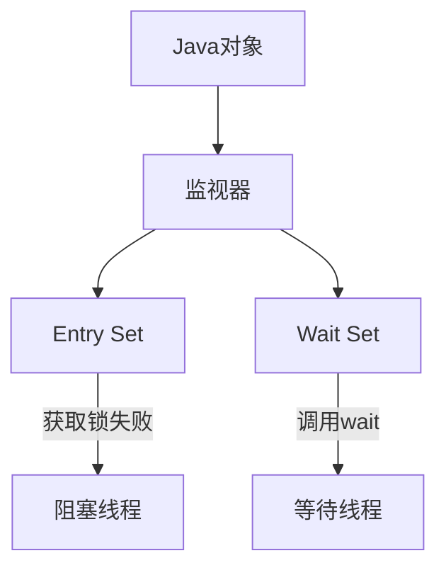

##### Wait Set 的工作原理

###### 1. 进入 Wait Set 的时机

当线程执行以下操作时进入 Wait Set：

```java

synchronized (lock) {
    while (!condition) {
        lock.wait(); // 线程释放锁并进入 Wait Set
    }
    // 条件满足后继续执行
}
```

###### 2. 离开 Wait Set 的条件

线程从 Wait Set 中被移除的条件：

- 其他线程调用 `lock.notify()` 或 `lock.notifyAll()`
    
- 等待超时（如果使用了 `wait(timeout)`）
    
- 线程被中断（`interrupt()`）
    

###### 3. 状态转换过程

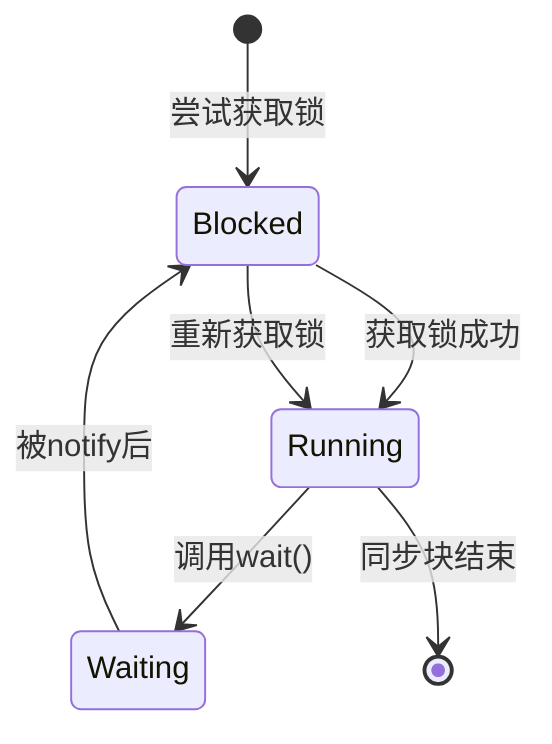

##### Wait Set 与锁的关系

###### 1. 相互依赖

- **锁是进入 Wait Set 的前提**：线程必须先持有锁才能调用 `wait()`
    
- **Wait Set 是锁的配套机制**：提供比简单锁更精细的线程协调能力
    

###### 2. 协作流程

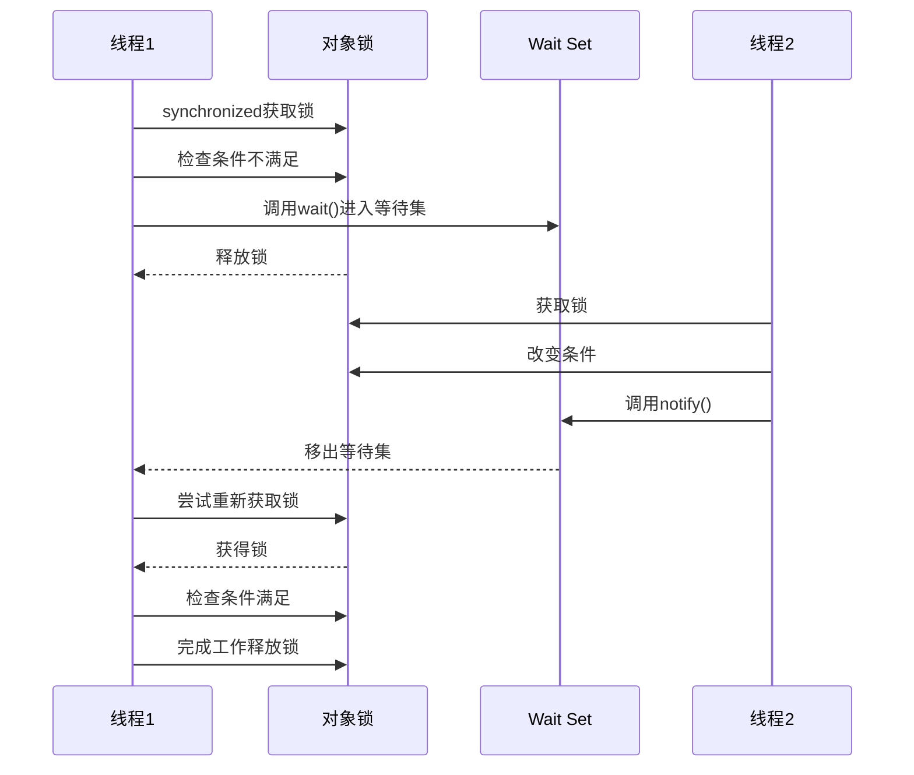

###### 3. 关键区别

|特性|锁（synchronized）|Wait Set|
|---|---|---|
|目的|互斥访问共享资源|线程间协调通信|
|状态改变|线程阻塞（Blocked）|线程等待（Waiting/Timed Waiting）|
|资源释放|同步块结束自动释放|调用wait()时立即释放|
|唤醒机制|无自动唤醒|需要notify/notifyAll唤醒|
|使用场景|简单互斥|条件等待的生产者-消费者模式|

##### 实际应用：生产者-消费者模型

```java

class Buffer {
    private final Queue<Integer> queue = new LinkedList<>();
    private final int CAPACITY = 5;
    private final Object lock = new Object();
    
    // 生产者
    public void produce(int item) throws InterruptedException {
        synchronized (lock) {
            while (queue.size() == CAPACITY) {
                lock.wait(); // 进入 Wait Set
            }
            queue.add(item);
            lock.notifyAll(); // 唤醒消费者
        }
    }
    
    // 消费者
    public int consume() throws InterruptedException {
        synchronized (lock) {
            while (queue.isEmpty()) {
                lock.wait(); // 进入 Wait Set
            }
            int item = queue.poll();
            lock.notifyAll(); // 唤醒生产者
            return item;
        }
    }
}
```

##### Wait Set 的高级特性

###### 1. 虚假唤醒（Spurious Wakeup）

- 现象：线程可能在没有 `notify` 的情况下被唤醒
    
- 防护：**必须**在条件检查时使用 `while` 循环而非 `if`
    

```java

// 正确写法
while (!condition) {
    lock.wait();
}

// 危险写法（可能因虚假唤醒导致错误）
if (!condition) {
    lock.wait();
}
```

###### 2. 多条件等待

使用 `ReentrantLock` 和 `Condition` 实现更精细的等待控制：

```java

class AdvancedBuffer {
    private final ReentrantLock lock = new ReentrantLock();
    private final Condition notFull = lock.newCondition();
    private final Condition notEmpty = lock.newCondition();
    
    public void produce(int item) throws InterruptedException {
        lock.lock();
        try {
            while (queue.size() == CAPACITY) {
                notFull.await(); // 进入条件等待集
            }
            queue.add(item);
            notEmpty.signal(); // 精确唤醒消费者
        } finally {
            lock.unlock();
        }
    }
}
```

###### 3. Wait Set 与线程中断

当等待线程被中断时：

1. 线程从 Wait Set 中移除
    
2. 重新获取锁（可能阻塞）
    
3. 抛出 `InterruptedException`
    
4. 中断状态被清除
    

**最佳实践**：

```java

try {
    while (!condition) {
        lock.wait();
    }
} catch (InterruptedException e) {
    // 恢复中断状态（保持可中断性）
    Thread.currentThread().interrupt();
    // 处理中断逻辑
}
```

##### 性能与最佳实践

1. **优先使用 notifyAll()**
    
    - 简单安全，避免信号丢失
        
    - 在明确优化场景下再用 notify()
        
2. **超时等待防死锁**
    
```java
    
    synchronized(lock) {
        long remaining = TimeUnit.SECONDS.toNanos(5);
        while (!condition && remaining > 0) {
            remaining = lock.wait(remaining);
        }
    }
```
    
3. **避免嵌套监视器锁死**
    
    - 典型症状：线程A持有锁X等待锁Y，线程B持有锁Y等待锁X
        
    - 解决方案：按固定顺序获取锁或使用 `ReentrantLock.tryLock()`
        
4. **监控 Wait Set**
    
    bash
    
    # 使用jstack查看等待线程
    `jstack <pid> | grep -A 1 'in Object.wait()'`
    


#### 15. **volatile关键字在多线程三个特性角度：**  
1. **一旦一个共享变量被volatile修饰，具备以下含义：**  
2. **1.保证了不同线程间的可见性**  
3. **2.禁止对其进行重排序，也就是保证了有序性**  
4. 3.**并未保证原子性**
#### 16. volatile关键字实质：  
1. **1.保证重排序的时候不会把后面的指令放到屏障的前面，也不会把前面的放到后面**  
2. **2.强制对缓存的修改操作会立刻写入主存**  
3. **3.如果是写操作，它会导致其他CPU中的缓存失效**
#### 17. 一个线程如果对变量只有读操作，没有写操作，由于JMM的原因，那这个变量不会直接刷到主内存
#### 18. JMM
#### 19. 解决缓存不一致的问题
	1. 总线锁
	2. 缓存一致性协议
#### 20. 原子性：8中原子性操作，注意a = b不是原子性，虽然是复制但是是两条指令read b; assign a;
#### 21. 可见性：volatile， 锁
#### 22. 有序性：happens-before原则
#### 23. A a = new A(); 这行代码中的引用、对象、class对象都在内存中的什么位置?
1. a在栈中
2. A对象在堆中
3. A.class对象在堆中，这个对象作为访问方法区数据的外部接口
4. A的类元数据在方法区中
#### 24. future设计
#### 25. 单线程的指令重排序和多线程的指令重排序
1. 单线程的指令重排序不会对结果造成影响
2. 多线程下发生指令重排序可能会造成错误的结果
#### 26. 线程上下文加载器打破双亲委派机制
[[JVM#如何打破双亲委派机制?]]
#### 27. 多线程设计模式
1. 观察者
2. 单线程设计模式
3. 读写锁分离
4. 不可变对象
5. Future设计模式
6. Guarded suspension
7. Threadlocal
8. 多线程上下文设计模式
9. balking设计模式
10. 生产消费模式
11. count down
12. thread-per-message
13. two phase temination
14. work thread
	1. Worker-Thread 和 Producer-Consumer设计模式区别不是很大，Worker-Thread中用Channel封装了queue和消费线程
15. 多线程active objects
#### 28. 原子类
#### 29. cas存在的问题，aba
[[Java#CAS]]
#### 30. unsafe
1. 底层的CPU指令
	1. cmpxchg1：compareAndSwapInt
	2. cmpxchg：compareAndSwapLong
	3. xchg1：putOrderedInt
	4. cmpxchgq：compareAndSwapObject
	5. lock1：volatile
	6. membar-acquire
#### 31. exchanger：只适合2个线程
#### 32. StampedLock
#### 33. complationService

#### 34. ComplatableFuture
[[Concurrent programming#CompletableFuture]]
#### 35. `synchronized` 和 `Lock` 的区别？如何选择？
[[Java#ReentrantLock和synchronized有什么区别]]
#### 36. 什么是可重入锁？为什么需要它？
* **可重入锁（Reentrant Lock）** 的核心价值在于解决线程**重复获取同一把锁**时的死锁问题，并支持更灵活的同步控制。
- **问题场景**：  
	若线程已持有锁 A，当其再次尝试获取锁 A 时（如递归调用或同步方法嵌套调用），**不可重入锁**会导致线程无限等待自己释放锁，从而形成死锁。
- **可重入锁的解决方案**：  
	允许同一线程多次获取同一把锁（内部通过计数器实现）。每次获取锁计数器+1，释放时计数器-1，归零时真正释放锁。
1. **防止自死锁**：确保线程嵌套获取同一锁时不阻塞自身。
2. **支持递归/嵌套调用**：保障代码逻辑的自然表达。
3. **扩展同步控制能力**：提供 `synchronized` 不具备的高级功能（如公平性、条件变量）。
4. **灵活性与性能优化**：通过手动锁管理，可更精细地控制并发行为。
#### 37. 公平锁和非公平锁有什么区别？`ReentrantLock` 默认是什么？为什么默认是非公平的？
#### 38. 什么是读写锁？适用于什么场景？`ReentrantReadWriteLock` 的规则是什么？
#### 28. `Condition` 接口有什么用？和 `Object.wait()/notify()` 有什么区别？
[[Java#`Condition` 接口]]
##### Condition是什么？

- **条件队列**：每个Condition对象维护一个独立的等待队列
- **精准唤醒机制**：不同于`notifyAll()`的"广播唤醒"，Condition支持"定向唤醒"
- **多路等待**：允许同一锁上的不同线程在不同条件下等待
##### 与传统wait/notify对比

|**特性**|**synchronized + wait/notify**|**Lock + Condition**|
|---|---|---|
|等待队列数量|1个（所有线程在同一队列等待）|多个（每个Condition独立队列）|
|唤醒方式|notify随机唤醒，notifyAll唤醒所有|signal定向唤醒指定队列的线程|
|条件判断|单一条件|多条件精细控制|
|超时控制|有限支持|支持多种超时模式|
|中断响应|基础支持|增强中断控制|
##### 为什么需要多个Condition？

###### 生产者-消费者问题中的痛点

在传统模型中：

```java
synchronized(lock) {
    while (bufferFull) {
        lock.wait(); // 生产者和消费者在同一队列等待
    }
    // ...生产...
    lock.notifyAll(); // 唤醒所有线程（包括不需要的生产者）
}
```

问题：

1. **无效唤醒**：生产者唤醒其他生产者
2. **惊群效应**：唤醒所有线程导致不必要的竞争
3. **性能损耗**：大量上下文切换开销

###### 多Condition解决方案

```java

// 生产者
lock.lock();
try {
    while (bufferFull) {
        notFull.await(); // 只在notFull条件上等待
    }
    // ...生产...
    notEmpty.signal(); // 精准唤醒消费者
} finally {
    lock.unlock();
}

// 消费者
lock.lock();
try {
    while (bufferEmpty) {
        notEmpty.await(); // 只在notEmpty条件上等待
    }
    // ...消费...
    notFull.signal(); // 精准唤醒生产者
} finally {
    lock.unlock();
}
```

优势：

- **精准匹配**：生产者只唤醒消费者，消费者只唤醒生产者
- **零无效唤醒**：避免无关线程被唤醒
- **减少竞争**：只有真正能执行的线程参与锁竞争
##### Condition底层原理

###### AQS框架中的Condition实现
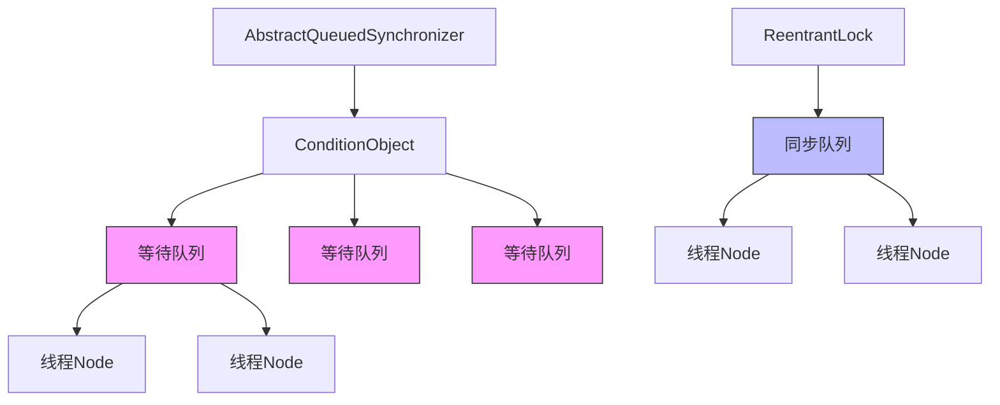
###### 核心数据结构：

1. **同步队列**：存放等待锁的线程（AQS维护）
2. **条件队列**：每个Condition维护独立的FIFO等待队列

###### await()工作流程：

1. 创建新Node加入条件队列
2. 完全释放锁（考虑重入情况）
3. 进入阻塞状态
4. 被signal后移入同步队列
5. 在同步队列中竞争锁

###### signal()工作流程：

1. 将条件
2. 将该节点转移到同步队列尾部
3. 唤醒该节点的线程
##### Condition的高级特性
###### 可中断与不可中断
```java
// 不可中断等待
void await() throws InterruptedException;

// 不可中断等待
void awaitUninterruptibly();

// 带超时的可中断等待
long awaitNanos(long nanosTimeout) throws InterruptedException;
boolean await(long time, TimeUnit unit) throws InterruptedException;
```
###### 公平性与非公平性
Condition的公平性与关联的Lock一致：
```java
// 公平锁的Condition
Lock fairLock = new ReentrantLock(true);
Condition fairCondition = fairLock.newCondition();

// 非公平锁的Condition
Lock unfairLock = new ReentrantLock(false);
Condition unfairCondition = unfairLock.newCondition();
```
###### 条件谓词检查
正确使用模式：
```java
lock.lock();
try {
    // 必须用while循环检查条件
    while (!conditionPredicate()) {
        condition.await();
    }
    // 执行条件满足后的操作
} finally {
    lock.unlock();
}
```
##### 多Condition应用场景
###### 复杂资源池管理
```java
class ConnectionPool {
    private final Lock lock = new ReentrantLock();
    
    // 不同等待条件
    private final Condition hasAvailableConnection = lock.newCondition();
    private final Condition allConnectionsReleased = lock.newCondition();
    
    public Connection getConnection() {
        lock.lock();
        try {
            while (pool.isEmpty()) {
                hasAvailableConnection.await();
            }
            return pool.removeFirst();
        } finally {
            lock.unlock();
        }
    }
    
    public void releaseConnection(Connection conn) {
        lock.lock();
        try {
            pool.addLast(conn);
            hasAvailableConnection.signal();
            
            if (pool.size() == maxSize) {
                allConnectionsReleased.signal();
            }
        } finally {
            lock.unlock();
        }
    }
    
    public void waitForAllRelease() throws InterruptedException {
        lock.lock();
        try {
            while (pool.size() < maxSize) {
                allConnectionsReleased.await();
            }
        } finally {
            lock.unlock();
        }
    }
}
```
###### 多阶段任务协调
```java
class ParallelTask {
    private final Lock lock = new ReentrantLock();
    private final Condition phase1Done = lock.newCondition();
    private final Condition phase2Done = lock.newCondition();
    
    public void execute() {
        // 阶段1工作线程
        new Thread(() -> {
            lock.lock();
            try {
                // 执行阶段1任务...
                phase1Done.signalAll();
            } finally {
                lock.unlock();
            }
        }).start();
        
        // 阶段2工作线程
        new Thread(() -> {
            lock.lock();
            try {
                while (!phase1Completed) {
                    phase1Done.await();
                }
                // 执行阶段2任务...
                phase2Done.signal();
            } finally {
                lock.unlock();
            }
        }).start();
        
        // 主控线程
        lock.lock();
        try {
            while (!phase2Completed) {
                phase2Done.await();
            }
            // 执行最终操作
        } finally {
            lock.unlock();
        }
    }
}
```
##### Condition的工程实践

###### 最佳实践原则

1. **总是与Lock配对使用**：Condition必须绑定到特定Lock
2. **在循环中检查条件**：防止虚假唤醒
3. **signal优先于signalAll**：减少不必要的唤醒
4. **清理状态**：await返回后重新检查共享状态
5. **超时保护**：避免永久等待
###### 性能优化技巧
```java
// 优化前：每次signalAll
notEmpty.signalAll();

// 优化后：仅当必要时才signalAll
if (buffer.size() == 1) { // 从空变为非空
    notEmpty.signal();
} else if (buffer.size() == capacity) { // 从非满变为满
    notFull.signal();
}
```
###### 错误处理模式
```java
lock.lock();
try {
    while (!condition) {
        if (Thread.interrupted()) {
            throw new InterruptedException();
        }
        try {
            condition.await();
        } catch (InterruptedException ie) {
            // 重新设置中断状态
            Thread.currentThread().interrupt();
            // 执行中断处理逻辑
            handleInterruption();
            // 根据业务决定是否继续等待
            if (shouldContinueWaiting()) {
                continue;
            } else {
                break;
            }
        }
    }
} finally {
    lock.unlock();
}
```

##### Condition与Object监视器对比

|**对比维度**|**Object监视器**|**Condition**|
|---|---|---|
|等待队列数量|单队列|多队列|
|精准唤醒|不支持|支持|
|超时控制|有限支持|丰富支持|
|等待可中断|基础支持|增强控制|
|公平性|不可控|与Lock一致|
|条件谓词|单一|多个|
|实现复杂度|简单|较高|
|适用场景|简单同步|复杂同步|
##### 为什么Condition如此重要？

1. **解决多条件等待问题**：为每种等待条件创建独立队列
2. **实现精准线程唤醒**：避免无关线程的无效唤醒
3. **提升系统性能**：减少上下文切换和锁竞争
4. **增强程序可读性**：显式条件谓词提高代码可维护性
5. **提供高级控制**：支持定时、中断等复杂场景

#### 29. 什么是死锁？产生死锁的必要条件是什么？如何避免死锁？（要求能写一个死锁的例子）

[[Java#死锁（Deadlock）]]

#### 30. 如何定位死锁？

[[Java#死锁（Deadlock）]]

#### 31. `volatile` 关键字有什么用？它能保证原子性吗？怎么保证可见性的？
[[Java#volatile]]
#### 32. 有哪些常见的锁优化手段？（减少持有时间、减小粒度、锁分离、锁粗化、无锁）
[[Java#日常使用锁的最佳实践？]]
#### 33. 了解 `AQS` 吗？它在 `ReentrantLock`、`ReentrantReadWriteLock`、`CountDownLatch` 等类中扮演什么角色？
[[Java#AQS]]
#### 34. `CountDownLatch`、`CyclicBarrier`、`Semaphore` 的作用和区别？
| **特性**    | `CountDownLatch`   | `CyclicBarrier`    | `Semaphore`          |
| --------- | ------------------ | ------------------ | -------------------- |
| **核心作用**  | **等待事件完成**         | **线程相互等待**         | **控制资源访问数量**         |
| **计数器方向** | 递减 (countDown)     | 递增 (await)         | 增减 (acquire/release) |
| **重用性**   | ❌ 一次性              | ✅ 可循环使用            | ✅ 可循环使用              |
| **重置机制**  | 无                  | 自动重置               | 手动控制                 |
| **触发动作**  | 外部事件驱动 (countDown) | 所有线程到达屏障           | 资源获取/释放              |
| **阻塞对象**  | 调用 `await()` 的线程   | 所有调用 `await()` 的线程 | 获取不到资源的线程            |
| **典型场景**  | 启动准备、多任务汇总         | 分阶段任务、并行计算汇总       | 连接池、限流               |
| **异常处理**  | 计数不可逆              | 可设置屏障动作            | 许可可释放                |
##### 选型

|**需求场景**|**推荐工具**|**理由**|
|---|---|---|
|主线程等待多个子任务完成|`CountDownLatch`|简单高效，一次性使用|
|多阶段并行计算（如 MapReduce）|`CyclicBarrier`|自动重置，分阶段协同|
|限流（API调用、连接池）|`Semaphore`|精确控制并发数|
|线程相互等待后同时开始|`CyclicBarrier`|天然支持多线程同步启动|
|等待初始化完成|`CountDownLatch`|比 `CyclicBarrier` 更轻量|

**黄金法则：**

- 需要 **等待事件** → `CountDownLatch`
- 需要 **线程协同** → `CyclicBarrier`
- 需要 **控制流量** → `Semaphore`

#### 35. 如何实现一个线程安全的单例模式？
[[Design Patterns#单例模式]]
#### 36. ThreadLocal主要是做什么的？他是强引用还是弱引用？
[[Java#ThreadLocal]]
#### 38. synchronized的锁升级知道吗？什么情况下会到偏向锁？什么情况下到轻量级锁？
[[Java#说一说锁升级过程]]
#### 40. 用户态和内核态有什么区别？
| **特性**   | **用户态 (User Mode)**  | **内核态 (Kernel Mode)**                   |
| -------- | -------------------- | --------------------------------------- |
| **权限等级** | 低特权级（Ring 3）         | 高特权级（Ring 0）                            |
| **执行主体** | 应用程序（如 Java 程序、浏览器）  | 操作系统内核（如 Linux Kernel、Windows NTOSKRNL） |
| **资源访问** | 仅能访问受限资源（需通过内核“代理”）  | 直接访问所有硬件（CPU、内存、磁盘、网卡等）                 |
| **安全性**  | 无法执行危险操作（防止应用程序崩溃系统） | 可执行任何指令（包括底层硬件操作）                       |
| **崩溃影响** | 仅崩溃自身进程              | 可能导致整个系统崩溃（蓝屏/内核 panic）                 |
| **典型操作** | 数学计算、字符串处理、业务逻辑      | 内存分配、进程调度、文件读写、网络通信                     |
> 为什么需要区分两种模式？
> * 安全性（核心目的）：保证内核安全
> * 稳定性：用户程序崩溃仅影响自身进程（内核会回收资源），而内核崩溃会导致整个系统宕机。
> * 抽象化硬件：内核提供统一的系统调用（System Call）接口，应用程序无需关心硬件差异（如不同型号的网卡驱动）
##### 举例
1. **Java 程序读取文件**
    
	```java
    FileInputStream file = new FileInputStream("data.txt"); // 触发 open() 系统调用
    file.read(); // 触发 read() 系统调用 → 切换到内核态
    ```
    - JVM 在用户态执行，但 `read()` 需内核从磁盘读取数据。
2. **创建线程**
    
    ```java
    new Thread(() -> {}).start(); // 触发 clone() 系统调用
    ```
    - 线程创建由内核管理（调度、栈分配），需切换到内核态。
3. **网络请求**
    
    ```java
    Socket socket = new Socket("host", 80); // 触发 socket() + connect() 系统调用
    ```
    - 网卡操作必须由内核驱动完成。

### stream
#### 1. stream是并行流还是串行流？
#### 2. 并行流的原理能讲一下吗？
#### 3. 并行流为什么有线程安全问题？能讲一下吗？

### Unsafe
#### 1. 有没有做过Netty中间件
#### 2. 直接内存了解吗？底层用的哪个类
#### 3. Unsafe里面的一些方法用过哪些
#### 4. 没有无参构造怎么用unsafe反序列化对象
关于Java中的直接内存、`Unsafe`类及其在反序列化中的应用，我来详细解释一下：

##### 1. 直接内存（堆外内存）

- **了解**：直接内存是Java堆之外的内存区域（如通过`malloc`分配的Native Memory）。
    
- **管理类**：
    
    - **核心类：`java.nio.DirectByteBuffer`**
        
    - **底层分配/释放**：虽然`DirectByteBuffer`是入口，但其内部真正分配和释放内存是通过`sun.misc.Unsafe`类实现的。
        
    - **分配过程**：
        
        1. 调用`Unsafe.allocateMemory(long size)`分配原生内存。
            
        2. 使用`Unsafe.setMemory`初始化内存（通常置零）。
            
        3. 创建`Cleaner`对象（通过`Unsafe`或`DirectByteBuffer`构造函数内部机制），当`DirectByteBuffer`被GC回收时，`Cleaner`会触发`Unsafe.freeMemory`释放内存。
            

##### 2. `Unsafe`类 (`sun.misc.Unsafe`)

- **定位**：一个提供**底层、不安全操作**的内部类。它允许绕过Java的安全限制（内存管理、对象构造、CAS、内存屏障等）。
    
- **获取实例**：不能直接`new`。通常通过反射获取单例实例：
    
    java
    
    Field theUnsafe = Unsafe.class.getDeclaredField("theUnsafe");
    theUnsafe.setAccessible(true);
    Unsafe unsafe = (Unsafe) theUnsafe.get(null);
    

###### 常用 `Unsafe` 方法

- **内存操作**：
    
    - `long allocateMemory(long bytes)`：分配原生内存。
        
    - `void freeMemory(long address)`：释放分配的内存。
        
    - `void setMemory(Object o, long offset, long bytes, byte value)` / `void setMemory(long address, long bytes, byte value)`：设置内存区域的值。
        
    - `byte getByte(long address)` / `void putByte(long address, byte x)`：在指定内存地址读写单个字节（类似方法用于其他基本类型）。
        
    - `Object getObject(Object o, long offset)` / `void putObject(Object o, long offset, Object x)`：在对象字段偏移量处读写对象引用。
        
    - `long objectFieldOffset(Field f)`：获取对象中某个字段的偏移地址（用于后续`get/put`操作）。
        
    - `int arrayBaseOffset(Class arrayClass)`：获取数组类第一个元素的偏移量。
        
    - `int arrayIndexScale(Class arrayClass)`：获取数组中每个元素的大小。
        
- **对象操作**：
    
    - `Object allocateInstance(Class cls)`：**关键方法！** 分配一个对象实例但**不调用任何构造函数**（包括无参构造）。这就是绕过构造函数的途径。
        
    - `void monitorEnter(Object o)` / `void monitorExit(Object o)`：原始监视器操作（类似`synchronized`底层）。
        
- **并发与原子操作**：
    
    - `boolean compareAndSwapObject(Object o, long offset, Object expected, Object x)` (以及`Int`, `Long`版本)：CAS操作的核心。
        
    - `void putOrderedObject(Object o, long offset, Object x)` (以及`Int`, `Long`版本)：延迟可见性的写入。
        
    - `void fullFence()` / `void loadFence()` / `void storeFence()`：内存屏障，控制指令重排序和内存可见性。
        
- **系统操作**：
    
    - `int addressSize()`：返回指针大小（通常4或8字节）。
        
    - `int pageSize()`：返回系统内存页大小。
        

##### 3. 无参构造 + `Unsafe` 反序列化对象

标准的Java反序列化（`ObjectInputStream.readObject()`）要求目标类有一个可访问的无参构造函数（或实现了`Serializable`且没有显式声明构造函数的类）。**`Unsafe.allocateInstance()` 提供了一种绕过此限制的方法。**

###### 原理

1. **跳过构造函数**：`Unsafe.allocateInstance(Class cls)` 直接在内存中为`cls`类分配空间并返回一个“空壳”对象。**它不执行任何构造函数中的代码（初始化字段、副作用等）。**
    
2. **手动填充字段**：反序列化框架（或你自己）需要：
    
    - 获取目标类的所有非瞬态(`non-transient`)字段的`Field`对象。
        
    - 使用`Unsafe.objectFieldOffset(Field f)`获取每个字段在对象内部的偏移量。
        
    - 从输入流中读取序列化后的字段值。
        
    - 使用对应的`Unsafe.putXXX(Object o, long offset, XXX value)`方法（如`putInt`, `putObject`, `putLong`等），根据字段的类型，将读取到的值直接“注入”到通过`allocateInstance`创建的对象实例的相应内存位置。
        

###### 示例步骤 (简化概念)

java

// 1. 获取 Unsafe 实例 (通过反射，如前所示)
Unsafe unsafe = ...;

// 2. 假设 clazz 是你想反序列化的类 (没有无参构造)
Class clazz = SomeClassWithNoDefaultConstructor.class;

// 3. 使用 Unsafe 创建实例，跳过所有构造函数
Object obj = unsafe.allocateInstance(clazz);

// 4. 反序列化流程 (伪代码)
try (DataInputStream in = ...) {
    // 遍历所有需要反序列化的字段
    for (Field field : getSerializableFields(clazz)) {
        field.setAccessible(true);
        long offset = unsafe.objectFieldOffset(field); // 获取字段偏移量

        // 根据字段类型从流中读取值
        Object value = readValueFromStream(in, field.getType());

        // 使用 Unsafe 将值直接设置到对象内存中
        if (field.getType() == int.class) {
            unsafe.putInt(obj, offset, (Integer) value);
        } else if (field.getType() == long.class) {
            unsafe.putLong(obj, offset, (Long) value);
        } else if (field.getType() == Object.class) {
            unsafe.putObject(obj, offset, value);
        } // ... 处理其他基本类型和引用类型
    }
}
return obj;

###### 重要注意事项与风险

1. **初始化不完整**：构造函数负责初始化对象状态（设置默认值、建立不变式、分配资源）。跳过它可能导致对象处于不一致或不安全的状态（字段是默认值`0`/`null`/`false`），引发`NullPointerException`或其他逻辑错误。
    
2. **`final` 字段**：Java规范保证`final`字段在构造函数完成后即初始化且不可变。`Unsafe.putXXX`可以强制修改`final`字段（即使在构造函数完成后），但这破坏了Java内存模型（JMM）的保证，可能导致不可预测的行为（如其他线程看到修改前后不一致的值）。非常危险！
    
3. **安全性**：`Unsafe`本身是内部API，不同JDK版本行为可能不同或消失（如JDK 9+模块化后更受限）。使用它使代码不可移植且脆弱。
    
4. **复杂性**：手动管理偏移量和类型转换极易出错，且需要深入理解JVM对象内存布局。
    
5. **资源管理**：如果对象在构造函数中持有需要释放的资源（文件句柄、Socket），跳过构造会导致这些资源未被获取，反序列化后对象可能无法正常工作。如果对象在构造函数之外持有资源，跳过构造可能导致资源泄漏（因为负责释放资源的代码可能在析构函数/`finalize`中，但对象从未完全初始化）。
    
6. **框架使用**：像`Kryo`、`FST`等高性能序列化库在配置下（如`kryo.setInstantiatorStrategy(new Kryo.DefaultInstantiatorStrategy(new StdInstantiatorStrategy()));`）内部可能使用类似`Unsafe`或`Objenesis`（它封装了各种绕过构造的技术）的机制来创建无构造函数的对象实例，然后填充字段。
    

##### 总结

- **直接内存**的核心管理类是`DirectByteBuffer`，底层通过`Unsafe.allocateMemory/freeMemory`操作原生内存。
    
- **`Unsafe`** 是进行底层、不安全操作的“后门”类，提供了直接内存分配/释放、对象实例化（不调用构造）、字段偏移访问、CAS、内存屏障等功能。
    
- **绕过无参构造反序列化**：利用`Unsafe.allocateInstance(Class)`创建对象实例（不调用任何构造），然后通过`Unsafe.putXXX`方法结合字段偏移量，将从流中读取的字段值直接“注射”到对象内存中。
    
- **强烈警告**：使用`Unsafe`（尤其是`allocateInstance`和修改`final`字段）是**极其危险**的操作，会破坏Java语言的安全性和内存模型保证，可能导致难以调试的Bug、JVM崩溃和安全漏洞。**除非你非常清楚自己在做什么（如编写底层框架），并且完全理解其后果，否则应严格避免在生产代码中直接使用`Unsafe`。** 优先考虑标准序列化机制或使用成熟的反序列化库（如`Kryo`, `Jackson`）的配置选项来处理无参构造问题。官方从Java 9开始也在逐步用更安全的`VarHandle`和`MethodHandle` API替代部分`Unsafe`功能。

### 新特性

#### 1. Java的新特性有哪些？
## JVM
#### 1. JVM运行时数据区有哪些部分组成，哪些是线程私有的？
#### 2. 类加载器有哪几种？
#### 3. tomcat为什么要自定义类加载器？
* 打破双亲委派：tomcat可以部署多个应用，多个应用同名的类要加载多次。
* 通过自定义类加载器实现了热部署功能。
#### 4. 你遇到过都是OOM的哪些类的溢出情况？
#### 5. 对于这种内存溢出你主要用什么工具？比如什么命令啊？

## Spring

#### 1. Spring如何解决循环依赖问题？
#### 2. Spring循环依赖是解决的什么情况下的循环依赖？构造方法的情况可以么？为什么？
#### 3. 多例的bean怎么解决循环依赖的？
#### 4. 你看的开源框架，有哪些点你觉得设计的不错？
#### 5. SpringBoot怎么实现的自动装配？
## Mysql


#### 1. 你做慢查询优化都是从哪些方面做起的？
#### 2. 如何实现mysql的读写分离？MySQL主从复制原理的是啥？如何解决mysql主从同步的延时问题？
#### 3. 为什么要分库分表（设计高并发系统的时候，数据库层面该如何设计）？用过哪些分库分表中间件？不同的分库分表中间件都有什么优点和缺点？你们具体是如何对数据库如何进行垂直拆分或水平拆分的？
#### 4. 现在有一个未分库分表的系统，未来要分库分表，如何设计才可以让系统从未分库分表动态切换到分库分表上？
#### 5. 如何设计可以动态扩容缩容的分库分表方案？
#### 6. 分库分表之后，id主键如何处理？

## Mybatis

#### 1. Mybatis拦截器怎么做？
#### 2. Mybatis的一级缓存用过吗？
## MQ

#### 1. 为什么使用消息队列啊？消息队列有什么优点和缺点啊？kafka、rocketmq都有什么优点和缺点啊？
#### 2. 如何保证消息队列的高可用啊？
#### 3. 如何保证消息不被重复消费啊?（如何进行消息队列的幂等性问题）？
#### 4. 如何保证消息的可靠性传输（如何处理消息丢失的问题）？
#### 5. 如何保证消息的顺序性？
#### 6. 如何解决消息队列的延时以及过期失效问题？消息队列满了以后该怎么处理？有几百万消息持续积压几小时，说说怎么解决？
#### 7. 如果让你写一个消息队列，该如何进行架构设计啊？说一下你的思路

## Redis

#### 1. 为什么要使用Redis做缓存？  

* 解决性能瓶颈（核心价值）
	- **磁盘 I/O vs 内存 I/O**
	- **减少数据库压力**：“热点数据”
	- **Redis 的响应速度**：单机 QPS（每秒查询率）可以达到 10万+ 级别
- 丰富的数据结构（独特优势）
	- **String（字符串）**：缓存简单的键值对，如用户 token、计数器、验证码。
	- **Hash（哈希）**：完美用于缓存对象，如用户信息（`user:1000 {name: "Alice", age: 30}`），可以单独获取或修改某个字段，非常高效。
	- **List（列表）**：实现简单的消息队列、最新消息排行、粉丝列表等。
	- **Set（集合）**：存储唯一值，用于好友推荐、共同关注、抽奖去重等。
	- **Sorted Set（有序集合）**：带权重的集合，完美实现排行榜、延迟队列、带分数的热门列表等。
	- **其他**：Bitmaps（位图，用于统计日活）、HyperLogLog（基数统计，用于UV统计）、GEO（地理位置）等。
* 提升并发与扩展性
	- **高并发支撑**：单机 Redis 就能支撑极高的并发读取请求，是构建高并发系统的基石。
	- **垂直与水平扩展**：
	    - **垂直扩展**：Redis 支持集群模式（Cluster），可以将数据分片（sharding）到多个节点上，实现数据的水平扩展，突破单机内存限制。
	    - **主从复制**：通过主从（Master-Slave）复制，可以实现读写分离。写请求在主节点执行，读请求在多个从节点执行，极大地提升了系统的读并发能力。
	- **缓解“惊群效应”**：在面对大量同时到达的请求（例如热点商品抢购）时，Redis 可以作为一个统一的“闸口”，避免所有请求瞬间压垮数据库。

* 高可用与持久化
	- **高可用**：通过 Redis Sentinel（哨兵）模式，可以实现主节点的自动故障转移（Failover），当主节点宕机时，能自动将一个从节点提升为主节点，继续提供服务，保证服务的可用性。
	- **持久化**：虽然缓存数据可以丢失，但 Redis 仍然提供了两种持久化机制（RDB 和 AOF），可以将内存中的数据异步保存到磁盘上。这意味着在重启后可以从磁盘恢复数据，避免了冷启动时对数据库的巨大冲击，也使得 Redis 可以承担一些对数据可靠性要求不是极端苛刻的场景。

**总结**

| 原因          | 说明                               | 带来的好处                |
| ----------- | -------------------------------- | -------------------- |
| **极致性能**    | 基于内存操作，单机超高QPS                   | 降低延迟，提升用户体验，支撑高并发    |
| **丰富数据结构**  | 支持String, Hash, List, Set, ZSet等 | 灵活缓存复杂数据，减少应用层计算和I/O |
| **高可用与扩展**  | 支持主从复制、哨兵、集群模式                   | 保证服务可靠性，轻松实现水平扩展     |
| **缓解数据库压力** | 阻挡大部分读请求，避免数据库过载                 | 保护核心数据库，提升系统整体稳定性    |

#### 2. 为什么Redis单线程模型效率也能那么高？  

**Redis 是一种基于内存的、操作原语的数据库，其性能瓶颈主要在于网络 I/O 和内存访问速度，而不是 CPU。单线程模型巧妙地避免了多线程的上下文切换和竞争条件开销，从而在核心操作上达到了惊人的性能。**


* 核心操作是内存级别的，速度极快
* 避免了多线程的复杂性和竞争开销
* 采用 I/O 多路复用技术处理并发连接
	**Redis 的单线程指的是执行 Redis 命令、操作内存数据的模块是单线程的**。但是，Redis 处理网络 I/O（即接收成千上万个客户端的连接和请求）并不是单线程阻塞的。它使用了高性能的 **I/O 多路复用技术**（在 Linux 上通常是 `epoll`），使得一个线程就可以高效地管理成千上万个网络连接。
* 数据结构高效且专用
	其底层数据结构（如简单动态字符串 SDS、跳跃表、压缩列表等）都是经过精心设计和优化的，非常适合在内存中进行快速操作。单线程模型可以毫无顾忌地使用这些数据结构，而不必担心线程安全问题。


> 单线程模型的潜在问题及 Redis 的应对策略
> **如果某个命令执行过慢，会阻塞后续所有命令**。例如执行一个 `keys *` 命令（生产环境严禁使用），或者一个复杂度为 O(N) 且 N 很大的命令，会导致整个 Redis 服务器在一段时间内无法响应其他请求。
> Redis 通过多种方式来缓解这个问题：
	1. **将耗时的操作异步化**：从 Redis 4.0 开始，支持了**惰性删除**（`UNLINK` 命令）和 `FLUSHDB ASYNC`、`FLUSHALL ASYNC` 等异步操作。当删除一个非常大的键（如一个包含百万元素的 Hash）时，不会在主线程中直接删除，而是将其交给后台线程异步处理，避免主线程阻塞。
	2. **使用多线程处理某些后台任务**：在 Redis 6.0 之后，**引入了多线程来处理网络 I/O**（注意：**命令执行依然是单线程的**）。对于大型企业版（Redis Enterprise）甚至引入了多线程来处理计算密集型任务。这表明 Redis 也在与时俱进，在保持核心简单性的前提下，在非核心路径上谨慎地使用多线程来提升性能。

**总结**

|原因|解释|
|---|---|
|**内存操作**|核心操作在内存中进行，速度极快，CPU 不是瓶颈。|
|**避免竞争开销**|单线程无需锁和同步机制，避免了多线程的上下文切换和竞争带来的巨大开销。|
|**I/O 多路复用**|使用 `epoll` 等技术高效处理海量网络连接，I/O 性能不是瓶颈。|
|**高效数据结构**|专为内存和单线程环境设计的数据结构，操作极其高效。|

#### 3. Redis6.0为什么要引入多线程呢？  
Redis 6.0 引入多线程是一个重要的演进，主要是为了**解决网络I/O瓶颈，提升对多核CPU的利用率，从而在高并发场景下获得更高的吞吐量**。值得注意的是，它的多线程并非用于命令执行，**命令的执行依然保持单线程**，这就巧妙避免了传统多线程数据库面临的复杂并发控制问题。


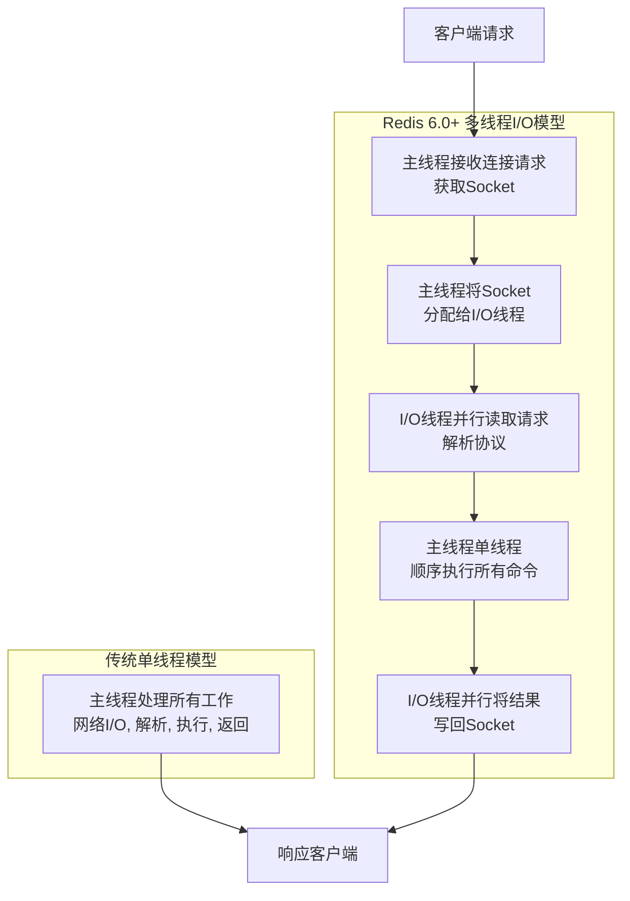

上图展示了Redis 6.0多线程I/O模型的核心流程。主线程接收连接后，将繁重的网络数据读写和协议解析任务分配给多个I/O线程并行处理，而核心的命令执行工作仍由主线程单线程完成137。

这种设计带来了以下好处：

- **提升吞吐量**：尤其是在连接数多、传输数据量大的场景下，性能提升显著，**吞吐量可提升一倍甚至更高**57。
- **降低延迟**：并行化的I/O处理减少了请求在队列中的等待时间6。
- **充分利用多核**：将网络I/O这类CPU密集型任务分摊到多个CPU核心上346。


Redis 6.0的多线程默认是关闭的，需要手动在 `redis.conf` 配置文件中开启并设置线程数135：

1. **启用多线程I/O**：
    ```bash
    io-threads-do-reads yes
    ```
2. **设置I/O线程数量**（非常重要）：
    ```bash
    
    io-threads 4
    ```
    ⚠️ **设置建议**：134
    
    - 线程数应**小于**CPU核数。例如，4核CPU建议设为2或3，8核CPU建议设为6。
    - 线程数**不是越多越好**，超过8个收益不大，可能反而因为线程调度带来额外开销。
    - 仅在**CPU已成为瓶颈**（如Redis实例本身已消耗大量CPU）且**网络流量大**的场景下才建议开启。对于绝大多数应用，单线程或许已然足够。

### 🔒 如何解决线程安全问题

Redis 6.0的多线程模型通过架构设计，从根本上规避了复杂的线程安全问题：

- **命令执行仍为单线程**：这是最关键的一点。所有客户端的命令最终都会回到主线程，被**串行、原子地**执行。这意味着所有数据操作（如`SET`, `GET`, `LPUSH`等）、Lua脚本、事务都无需担心并发冲突和数据竞争。
- **I/O线程职责单一**：I/O线程**仅负责读写Socket和解析协议**，不执行任何实际命令，不接触数据存储逻辑。它们处理的是原始的字节数据，解析好后交给主线程。
- **无锁设计**：由于I/O线程不操作共享数据（内存数据结构），命令执行又是单线程，因此核心路径上几乎不需要锁机制。

### 📊 多线程适用场景

多线程I/O在以下场景能带来更明显的性能提升1：

- **大量持久连接**：需要同时处理数万个客户端连接时。
- **高带宽需求**：传输大Key（如10KB以上的哈希或列表）或进行批量操作时。
- **网络I/O成为瓶颈时**：当发现Redis的CPU占用还不高，但吞吐量已经上不去时。
    

> 通过让多个线程分担繁重的网络读写任务，解放主线程，让其更专注于执行命令。

#### 4. 讲一讲Redis常见数据结构以及使用场景  
#### 5. Redis的Key，Value有大小限制吗？
#### 6. Redis存储hash的话用什么命令？
#### 7. 如果想把set存到集群里怎么做？
#### 8. Redis什么时候底层数据结构会发生变化？
#### 9. keys命令和scan命令有什么区别？
#### 10. pipeline有什么好处，为什么要用 pipeline？  
#### 11. Redis 持久化方式有哪些？以及有什么区别？  
#### 12. 什么是Redis事务？原理是什么？  
#### 13. 如何在100个亿URL中快速判断某URL是否存在？  
#### 14. 统计高并发网站每个网页每天的 UV 数据，结合Redis你会如何实现？  
#### 15. 说一说Redis的Key和Value的数据结构组织?  
#### 16. 渐进式rehash听过没？讲一讲！  
#### 17. 讲一讲Redis分布式锁的实现  
#### 18. Redlock听过没？讲一讲！  
#### 19. 什么是缓存击穿？该如何解决  
#### 20. 什么是缓存穿透？该如何解决  
#### 21. 什么是缓存雪崩？该如何解决  
#### 22. 什么是BigKey？该如何解决  
#### 23. 什么是热点Key？该如何解决  
#### 24. Redis某个热点key在某一个分片上，这种数据倾斜的问题怎么解决的？
#### 25. redis过期策略都有哪些？LRU 算法知道吗？  
	1. 和普通的LRU不一样  
#### 26. 讲一讲Redis缓存的数据一致性问题和处理方案
#### 27. 在项目中缓存是如何使用的？缓存如果使用不当会造成什么后果？
#### 28. 如何保证Redis高并发、高可用、持久化？Redis的主从复制原理能介绍一下么？Redis的哨兵原理能介绍一下么？
#### 29. Redis的持久化有哪几种方式？不同的持久化机制都有什么优缺点？持久化机制具体底层是如何实现的？
#### 30. Redis集群模式的工作原理能说一下么？在集群模式下，Redis的key是如何寻址的？分布式寻址都有哪些算法？了解一致性hash算法吗？如何动态增加和删除一个节点？
#### 31. Redis的并发竞争问题是什么？如何解决这个问题？了解Redis事务的CAS方案吗？
#### 32. 生产环境中的redis是怎么部署的？
#### 33. Redis分布式锁怎么做的？
#### 34. Redision红锁原理
#### 35. 超卖问题怎么解决？串行？串行的话你的性能不就浪费了吗？
#### 36. Redis的lua的表达式有研究过吗？讲讲

## ElasticSearch

#### 1. es的分布式架构原理能说一下么（es是如何实现分布式的啊）？
[[ES#ES的分布式架构原理]]
#### 2. es写入数据的工作原理是什么啊？es查询数据的工作原理是什么啊？底层的lucene介绍一下呗？倒排索引了解吗？
[[ES#Lucene 介绍]]
[[ES#什么是倒排索引？]]
##### 一、 Elasticsearch 写入数据的工作原理 (Indexing)

ES 的写入过程是其分布式、高可靠性的核心体现。主要步骤如下：

1. **客户端请求：**
    - 客户端向 **任意一个ES节点**（通常成为**协调节点 - Coordinating Node**）发送一个 `PUT` 或 `POST` 请求（如 `PUT /my_index/_doc/1`），携带要索引的文档内容（JSON）。
2. **路由计算：**
    - 协调节点根据文档ID (`_id`) 或请求中指定的 `routing` 参数，使用哈希函数计算文档应该存储在哪个**主分片 (Primary Shard)** 上。公式本质是：`shard_num = hash(_routing) % number_of_primary_shards`。
    - 协调节点确定目标索引（`my_index`）和目标主分片（假设是 `P0`）。
3. **转发请求：**
    - 协调节点查看集群状态（知道哪个节点持有主分片 `P0`），将写入请求**转发**给持有该主分片的**数据节点 (Data Node)**。这个节点现在充当 **主分片节点 (Primary Node)** 的角色。
4. **主分片节点处理：**
    - **Lucene 写入 (内存 & 文件系统缓存)：** 主分片节点接收到请求后，首先将文档操作（索引、更新、删除）写入其管理的 **Lucene 索引**。
        - 文档被**分词、分析**，构建**倒排索引**和**正排数据**（Doc Values）。
        - 这些更改**首先发生在内存缓冲区 (In-memory Buffer)** 和 **Lucene 的 Translog (事务日志)** 中。
        - 此时文档**还不能被搜索到**（因为还在内存缓冲区）。
    - **写入 Translog (关键！)：** 在更改被应用到内存缓冲区的同时，操作会被**同步（默认）** 追加写入到 **Translog** 文件中。Translog 是磁盘上的追加写入日志，用于保证操作的持久化。**这是数据安全的关键点**，即使节点宕机，重启后也能通过重放 Translog 恢复未持久化的数据。
5. **并发复制到副本分片：**
    - 主分片节点在处理完本地 Lucene 操作和 Translog 写入后，会**并行地**将相同的写入请求**转发**给该主分片的所有 **副本分片 (Replica Shards)** 所在的节点（**副本分片节点 - Replica Node**）。
    - 副本分片节点执行**完全相同的步骤**：将文档写入自己的内存缓冲区、写入自己的 Translog。它们也会返回成功或失败给主分片节点。
    - 主分片节点需要等待**一定数量**的副本分片（包括它自己）的确认。这个数量由 `wait_for_active_shards` 参数控制（默认为 1，即只需主分片成功即可返回；可配置为 `all` 或 `quorum` 等）。
6. **主分片节点响应：**
    - 一旦主分片节点**自身操作成功**并且**收到了足够数量副本分片的成功响应**，它就向协调节点发送一个成功响应。
7. **协调节点响应客户端：**
    - 协调节点接收到主分片节点的成功响应后，将成功结果返回给客户端。此时客户端知道文档已被安全接收。
8. **Refresh (刷新 - 使文档可搜索)：**
    - 默认情况下，新写入的文档**不会立即出现在搜索结果中**。Lucene 的索引写入（内存缓冲区）需要被 **Refresh** 操作处理。
    - Refresh 操作：
        - 将**内存缓冲区**中的文档清空。
        - 创建一个**新的、不可变的 Lucene 段 (Segment)** 并将其**打开**使其包含的文档**变得可被搜索**。
        - 这个操作**开销相对较大**，因此 ES 默认 **1 秒**执行一次（可通过 `index.refresh_interval` 配置）。这就是 ES 被称为 **近实时 (Near Real-Time, NRT)** 搜索的原因——写入后约 1 秒即可搜索到。
9. **Flush (刷盘 - 持久化到磁盘)：**
    - 为了确保数据最终安全持久化到磁盘（而不仅仅在 Translog 和文件系统缓存中），ES 会定期执行 **Flush** 操作（或者当 Translog 达到一定大小时触发）。
    - Flush 操作：
        - 触发一次 **Lucene Commit**：将所有内存中的段（包括 Refresh 产生的和未提交的）**安全地写入磁盘**，确保物理文件的一致性。这会调用 `fsync`。
        - **清空当前的 Translog**：因为 Commit 已经将数据安全写入磁盘，这些操作记录不再需要。
        - 创建一个**新的、空的 Translog**。
    - Flush 是确保数据持久化、释放内存和 Translog 空间的关键操作，但比 Refresh 开销**大得多**。
**总结写入流程关键点：**
- **路由转发：** 请求经协调节点路由到正确的主分片节点。
- **近实时 (NRT)：** 由定期的 **Refresh** 实现（默认1秒），使文档可搜索。
- **数据安全：** 核心依赖 **Translog**（同步写保证宕机可恢复）和定期的 **Flush**（物理持久化）。
- **高可靠：** 通过 **主-副本复制模型**，在多个节点上保留数据副本。主分片等待足够副本确认后才响应客户端成功。
- **分布式协调：** 主分片节点负责协调副本分片的写入。
##### 二、 Elasticsearch 查询数据的工作原理 (Searching)

ES 的查询过程是其分布式并行处理能力的核心体现。最常见的两阶段查询流程 (`query_then_fetch`) 如下：
1. **客户端请求：**
    - 客户端向 **任意一个 ES 节点**（协调节点）发送一个搜索请求（如 `GET /my_index/_search?q=title:elasticsearch` 或复杂的 DSL 查询）。
2. **查询解析与分发 (Query Phase - 查询阶段)：**
    - 协调节点**解析**查询请求（解析 DSL 或 Query String）。
    - 协调节点确定请求涉及哪些**索引**（`my_index`），以及这些索引的**所有主分片和副本分片**（假设 `my_index` 有 3 个主分片 P0, P1, P2，每个主分片有 1 个副本 R0, R1, R2）。
    - 协调节点将**查询请求广播 (Broadcast)** 给**所有相关分片**（P0, P1, P2, R0, R1, R2）所在的**数据节点**。为了提高吞吐和容错，协调节点会**轮询或基于负载**选择分片的副本（例如，可能选择 R0 而不是 P0 来处理该次查询）。
    - **重要原则：** 每个分片（无论是主还是副本）在搜索请求中都是**完全平等**的，都可以独立处理查询。
3. **分片本地执行 (Query Phase - 查询阶段)：**
    - 每个收到查询请求的**数据节点**在其**本地分片**上**独立执行**查询：
        - 查询语句（如 `title:elasticsearch`）会被送到该分片的 **Lucene 索引** 上执行。
        - Lucene 利用 **倒排索引** 快速找到包含搜索词 `elasticsearch` 的所有文档 ID (`doc_id`)。
        - 然后 Lucene 可能还需要：
            - 根据其他查询条件（如过滤、范围查询）**过滤**这些文档 ID。
            - 根据排序规则（如果有），**计算**每个匹配文档的相关性得分 (`_score`) 或排序字段的值。
            - 为了排序或聚合，可能需要从 **Doc Values**（列式存储）或 `_source` 中**获取字段值**。
        - **关键输出：** 每个分片节点**不会**返回所有匹配文档的完整数据！它只收集：
            - 满足查询条件的文档的 **`doc_id`**。
            - 文档的**排序值**（如 `_score` 或指定的排序字段值）。
            - 如果需要聚合（Aggregation），则计算**本地分片**上的聚合**结果**（不是最终结果）。
        - 每个分片节点只保留**排名靠前的文档**（数量由 `from + size` 决定，比如用户要第10页，每页10条，则保留 `(10-1)*10 + 10 = 100` 条）。这大大减少了网络传输量。
    - 每个分片节点将其收集到的 **`doc_id` 列表、排序值、聚合中间结果** 返回给**协调节点**。
4. **结果合并 (Fetch Phase - 抓取阶段)：**
    - 协调节点收到**所有分片节点**返回的**部分结果**。
    - **合并排序：** 协调节点将所有分片返回的 `(doc_id, 排序值)` 列表**合并**起来，进行**全局排序**（根据 `_score` 降序或其他指定规则）。基于全局排序的结果，协调节点确定用户最终需要哪些文档（例如，第 1 页，前 10 条）。
    - **获取文档内容 (Fetch)：** 协调节点知道了最终需要哪些文档（`doc_id`）以及这些文档**实际位于哪个分片**上（根据 `doc_id` 可以反向路由）。
    - 协调节点向**持有这些文档所在分片的节点**（可能是主分片节点或副本分片节点）发送 **Multi-Get (mget)** 请求，请求获取这些文档的**完整内容**（通常是 `_source` 字段）。
    - **聚合结果合并：** 如果查询包含聚合，协调节点会将所有分片返回的**聚合中间结果**进行**汇总合并**，计算出最终的全局聚合结果。
5. **构建最终响应：**
    - 协调节点收到各个数据节点返回的完整文档内容 (`_source`)。
    - 协调节点将**排序后的文档列表**（包含完整内容或指定字段）和**最终的聚合结果**组装成标准的 JSON 响应。
    - 协调节点将最终的搜索结果响应返回给客户端。
**总结查询流程关键点：**
- **两阶段查询 (`query_then_fetch`):** 先分散到所有分片查询 ID 和排序值（Query Phase），再集中获取所需文档内容（Fetch Phase）。这是默认且最高效的模式。
- **分布式并行处理：** 查询被**广播**到所有相关分片并行执行，极大提升效率。
- **分片独立性：** 每个分片（主/副本）都能独立处理查询。
- **最小化网络传输：** Query Phase 只传输文档 ID 和排序值等元数据，Fetch Phase 才按需获取完整文档内容。
- **协调节点是大脑：** 负责解析、分发、全局排序、结果合并、聚合汇总和最终响应组装。
- **深度分页性能陷阱：** `from + size` 过大时，每个分片需要保留和传输大量 `(doc_id, sort_value)` 数据，协调节点合并排序开销巨大。使用 `search_after` 或 Scroll API 解决。

#### 3. es在数据量很大的情况下（数十亿级别）如何提高查询效率啊？
面对数十亿级别数据的查询性能挑战，Elasticsearch 需要从**架构设计、索引优化、查询优化、硬件资源**等多维度进行深度调优。以下是关键策略与实践：

##### **一、索引设计与分片策略优化**

1. **合理设置分片数 (Shard Count)**
    - **避免过度分片：** 分片过多会导致：
        - 元数据（`cluster state`）膨胀，增加主节点压力
        - 查询时协调节点需合并更多分片结果，增加开销
    - **建议：**
        - 单个分片控制在 **20-50GB**（日志类可更大，搜索类建议更小）
        - 总数据量 / 目标分片大小 = 总分片数（预留未来增长）
        - 使用 `ILM` (Index Lifecycle Management) 自动滚动索引，控制单个索引大小
2. **分片大小均衡**
    - 确保数据均匀分布：
        - 使用合理的 `routing key`（避免热点）
        - 避免使用 `_id` 默认路由导致数据倾斜
    - 监控 `_cat/shards?v` 确保分片大小均匀
3. **冷热架构 (Hot-Warm Architecture)**
    
    - **场景：** 时序数据（日志、指标），近期数据查询频繁。
    - **实现：**
        - **Hot 节点：** SSD 磁盘，承载新写入和频繁查询的分片。
        - **Warm 节点：** HDD 磁盘，承载旧数据、低查询频率的分片。
        - 使用 `ILM` 自动迁移分片（如 `shrink`、`force_merge` 后迁移到 Warm 节点）

##### **二、Mapping 与数据结构优化**

1. **精简字段与禁用无用特性**
    - **禁用 `_source`（谨慎！）：** 仅在无需文档召回或重建时使用（节省存储与IO）。
    - **禁用 `_all`（已废弃）**：ES 6.x+ 已移除。
    - **禁用 Norms：** 对不需要 `评分 (scoring)` 的字段禁用（节省内存）。
    - **禁用 `index_options`：** 对不需要 `短语查询` 或 `高亮` 的字段，设为 `docs`（节省存储）。
    - **禁用 `doc_values`：** 对不需要 `排序`、`聚合`、`脚本访问` 的字段禁用（节省磁盘与内存）。
2. **选择合适的数据类型**
    - **Keyword vs Text：**
        - 精确匹配、聚合、排序 → `keyword`
        - 全文搜索 → `text` + 合适的分析器
    - **数值类型：** 优先选最小够用类型（如 `byte` > `short` > `integer` > `long`）。
    - **避免 `nested` 或 `join`：** 它们严重影响性能。优先考虑数据扁平化或应用层处理关联关系。
3. **使用合适的分析器 (Analyzer)**
    - 避免过度分词（如中文分词器选择）。
    - 对不需要分词的字段（如 ID）设为 `keyword`。

##### **三、查询优化技巧**

1. **避免昂贵操作**
    - **深分页 (Deep Pagination)：**
        - 避免 `from + size > 10,000`（默认限制）。
        - 使用 **`search_after`** + 唯一排序键（如 `_id`）替代。
        - 导出场景用 **`Scroll API`** 或 **`Async Search`**。
    - **避免 `wildcard` 查询 (`*xxx*`)：** 尤其前缀通配符 (`*xxx`)。改用：
        - `ngram` 分词 + `match_phrase`
        - 专门字段存储反转文本进行后缀匹配
    - **控制聚合范围：**
        - 使用 `query` 先过滤数据，再聚合。
        - 对高基数字段聚合用 **`cardinality` (HyperLogLog)** 近似去重。
2. **使用 Filter Context**
    - **Filter vs Query：**
    - `filter` 不计算评分，结果可缓存 → 对精确匹配（如 `term`、`range`、`bool`）优先用 `filter`。
    - 组合查询时，将过滤条件放入 `bool.filter` 中。
3. **限制查询范围**
    - **路由 (Routing)：** 指定 `routing key` 将查询限定到特定分片（避免广播查询）。
    - **日期范围索引：** 按时间分区索引（如 `logs-2023-10-01`），查询时指定索引模式（`logs-2023-10-*`）。
    - **使用 `_source` 过滤：** 只返回必要字段（减少网络传输与序列化开销）。
4. **预计算与物化视图**
    - **Rollup API：** 预计算历史数据的聚合结果（如日、周、月汇总）。
    - **Transform API：** 创建基于现有索引的聚合后索引（类似物化视图）。

##### **四、集群与硬件优化**

1. **角色分离 (Dedicated Node Roles)**
    - **Master 节点：** 3 个专用节点（仅 `master` 角色），确保稳定性。
    - **Data 节点：** 区分 `hot` / `warm` 硬件配置。
    - **Coordinating 节点：** 专用协调节点（`ingest` 关闭），处理查询合并与客户端请求。
    - **Ingest 节点：** 单独节点处理数据预处理管道。
2. **内存优化**
    - **JVM Heap：** 不超过 **31GB**（避免指针压缩失效），通常设集群内存的 **50%**。
    - **Page Cache (OS Cache)：** 预留充足内存给操作系统缓存（Lucene 依赖磁盘文件缓存）。
    - **文件系统缓存：** 建议 >50% 总内存用于缓存（确保常用索引段常驻内存）。
3. **存储优化**
    - **SSD 磁盘：** Hot 节点必须使用 SSD（尤其对搜索密集型场景）。
    - **RAID 0 或 JBOD：** ES 自身已提供副本冗余，单机多盘建议用 JBOD（优于 RAID 0）。
4. **网络与线程池**
    - 万兆网络减少节点间传输延迟。
    - 监控线程池（`_cat/thread_pool`），避免 `rejected` 请求。

##### **五、高级特性与运维实践**

1. **强制段合并 (Force Merge)**
    - 对只读索引（如 Warm 节点上的）执行：`POST /index/_forcemerge?max_num_segments=1`
    - 效果：
        - 减少段数量（提升查询速度）
        - 彻底删除标记为删除的文档
        - 优化压缩（节省空间）
2. **索引生命周期管理 (ILM)**
    - 自动化管理索引的 `hot` → `warm` → `cold` → `delete` 阶段。
    - 在 `warm` 阶段自动触发 `shrink`（减少分片数）和 `force_merge`。
3. **缓存优化**
    - **Query Cache：** 缓存查询结果（对重复精确过滤有效）。
    - **Request Cache：** 缓存聚合结果（对相同聚合请求有效）。
    - **Fielddata Cache：** 谨慎开启（对 `text` 字段聚合），监控内存占用。
4. **监控与诊断工具**
    - **慢查询日志 (`slowlog`)：** 定位性能瓶颈查询。
    - **Profile API：** 分析查询在每个阶段的耗时（`?profile=true`）。
    - **集群健康监控：** 关注 `CPU`、`Heap`、`Disk I/O`、`GC` 频率。

##### **典型场景优化示例**

#### **场景：电商商品搜索（百亿商品）**
1. **索引设计：**
    - 按商品类目分索引（`products-electronics`、`products-clothing`）。
    - 每个索引主分片数按类目数据量设定（如 20 主分片 + 1 副本）。
    - `routing` = `category_id`（确保同类目商品在同一分片）。
        
2. **Mapping：**
    - `title`: `text` + `ik_smart` 分词 + `fields.keyword`（用于聚合）
    - `price`: `scaled_float` (factor=100)
    - `category_id`: `keyword` (doc_values=true, norms=false)
3. **查询优化：**
    
```json
    
    GET /products-*/_search
    {
      "query": {
        "bool": {
          "filter": [ 
            {"term": {"category_id": "101"}},  // 走路由，命中单个分片
            {"range": {"price": {"gte": 100, "lte": 500}}}
          ],
          "must": [
            {"match": {"title": "无线蓝牙耳机"}}  // 评分查询
          ]
        }
      },
      "aggs": {
        "brand_stats": {
          "terms": {"field": "brand.keyword", "size": 10} // keyword字段聚合
        }
      },
      "_source": ["id", "title", "price", "image"], // 只返回必要字段
      "size": 20
    }
    ```
##### **总结：核心优化矩阵**

|**优化方向**|**具体措施**|
|---|---|
|**分片策略**|控制分片大小 (20-50GB)，使用 ILM + 冷热架构，避免数据倾斜|
|**数据结构**|精简 Mapping，禁用非必要特性，选合适数据类型|
|**查询DSL**|多用 Filter，避免深分页/通配符，聚合前过滤，限制范围|
|**硬件资源**|角色分离，SSD for Hot，内存 >50% 给 OS Cache，JVM <31GB|
|**高级运维**|Force Merge 只读索引，启用 ILM，监控慢查询与资源|

> **关键原则：数据规模越大，设计阶段决策的影响越深远。应在索引创建前规划好分片策略、Mapping 设计和查询模式，后期调整代价高昂。**


#### 4. es生产集群的部署架构是什么？每个索引的数据量大概有多少？每个索引大概有多少个分片？
这是一个非常实际且重要的问题，直接关系到生产环境的稳定性、性能和成本。下面结合典型的大型互联网/企业级生产环境经验，详细介绍 ES 生产集群的部署架构、索引数据量及分片设置：

##### **一、 ES 生产集群部署架构 (典型高可用、高性能方案)**

**核心原则：角色分离、资源隔离、水平扩展、冷热分层**

1. **节点角色与配置：**
    - **专用 Master 节点 (3 台或 5 台 - 奇数)：**
        - **角色：** 仅配置 `node.roles: [ master ]` (禁用 data, ingest)。
        - **配置：** 中等配置（CPU：4-8核，内存：16-32GB，磁盘：50-100GB SSD）。内存主要用于维护集群状态 (`cluster state`) 和索引元数据。
        - **作用：** 负责集群管理、状态协调、分片分配。**高可用关键：** 至少 3 台，避免脑裂。生产环境强烈推荐专用 Master 节点，**绝不与 Data 节点混部**。
    - **专用 Data 节点 - Hot 层 (高性能)：**
        - **角色：** `node.roles: [ data, data_hot ]` (或通过属性标记)。
        - **配置：**
            - **CPU：** 高主频多核（16-32+ 核）。
            - **内存：** **大内存是关键！** (128GB - 1TB+)。其中 50% 给 JVM Heap (不超过 31GB)，剩余 50%+ **留给 OS Page Cache (Lucene 依赖磁盘缓存，本质吃内存)**。
            - **磁盘：** **必须 SSD/NVMe！** (高 IOPS，低延迟)。容量按数据量+预留计算。建议 RAID 0 或 JBOD (ES 副本提供冗余)。
            - **网络：** 万兆网卡。
        - **作用：** 承载**新写入**和**高频查询**的索引分片（热数据）。承受最大的 IO 和计算压力。
    - **专用 Data 节点 - Warm/Cold 层 (高容量)：**
        - **角色：** `node.roles: [ data, data_warm ]` 或 `[ data, data_cold ]`。
        - **配置：**
            - **CPU/内存：** 中等（CPU：8-16核，内存：64-128GB）。Heap 配置同 Hot。
            - **磁盘：** **大容量 HDD (SATA/SAS RAID)** 或 QLC SSD。成本低，容量大 (单节点 10TB+ 常见)。
            - 网络：千兆/万兆。
        - **作用：** 承载**低频访问**、**只读**的历史数据（温/冷数据）。查询压力小，存储成本低。
    - **专用 Coordinating (协调) 节点：**
        - **角色：** `node.roles: [ ]` (空，默认就是 coordinating) 或显式设置 `[ingest]` (如果需要预处理)。**禁用 master, data**。
        - **配置：**
            - **CPU：** 高主频多核（16-32+ 核） - 负责结果合并、聚合计算，CPU 密集型。
            - **内存：** 大内存 (64-256GB+)，主要用于查询过程中的聚合、排序、分页等临时数据结构。**Heap 可设更大些 (接近 31GB)**。
            - 磁盘：中等 SSD (用于 OS 和日志)。
            - 网络：万兆。
        - **作用：** 接收所有客户端请求，将查询分发给 Data 节点，合并/处理结果返回。**重要：** 生产环境**必须**分离 Coordinating 节点，防止 Data 节点资源被协调任务挤占导致雪崩。可通过负载均衡器 (如 Nginx, F5) 暴露 Coordinating 节点给客户端。
    - **专用 Ingest 节点 (可选)：**
        - **角色：** `node.roles: [ ingest ]` (禁用 master, data)。
        - **配置：** 中等 (CPU：8-16核，内存：32-64GB)。如果需要复杂的 Pipeline (如大量 Grok 解析)，需要更多 CPU。
        - **作用：** 专门执行数据摄入前的预处理 Pipeline (解析、转换、丰富数据)。在写入压力大或 Pipeline 复杂时分离，避免影响 Data 节点写入性能。
2. **集群规模示例 (中型 ~ 大型)：**
    - **Master：** 3 台专用节点。
    - **Data Hot：** 10-50+ 台 (根据数据量和写入/查询吞吐动态扩展)。
    - **Data Warm：** 5-20+ 台 (根据历史数据量)。
    - **Coordinating：** 5-10+ 台 (根据查询 QPS 和复杂度扩展)。
    - **Ingest：** 2-5 台 (可选，根据写入流量和 Pipeline 复杂度)。
3. **关键基础设施：**
    - **负载均衡器 (LB)：** 暴露 Coordinating 节点，实现客户端请求的高可用和负载均衡。
    - **配置中心：** 统一管理节点配置 (`elasticsearch.yml`)。
    - **监控告警：**
        - **Elastic Stack：** Kibana + Elasticsearch (自监控索引) + Metricbeat/Agent。
        - **Prometheus + Grafana：** 监控主机、容器、ES 指标 (通过 Exporter)。
        - 关键指标：Cluster Health (Green/Yellow/Red), Node Status, JVM Heap, GC, CPU, Disk I/O, Disk Space, Query Latency, Indexing Rate, Rejection Rates。
    - **部署方式：**
        - **物理机：** 追求极致性能 (尤其 Hot 层)。
        - **私有云/公有云虚拟机：** 灵活性高，资源可快速调整。
        - **容器化 (Kubernetes)：** 越来越主流，利用 K8s 的编排、调度、自愈能力。需注意存储持久化和网络性能。

##### **二、 每个索引的数据量 (典型范围 & 最佳实践)**

- **核心原则：避免巨型索引！** 单个索引过大 (如 >1TB) 会带来诸多问题：恢复慢、Rebalance 慢、Force Merge 困难、查询效率可能下降。
- **推荐范围：**
    - **业务核心索引 (如商品、订单、用户)：** **20GB - 200GB**。这是兼顾查询性能、管理灵活性和分片效率的甜点区。超过 500GB 就需要慎重评估。
    - **日志类/指标类索引 (时序数据)：** **50GB - 1TB**。这类数据通常具有强时间属性，查询往往按时间范围过滤，且写入后更新少。利用 **ILM (Index Lifecycle Management)** 按时间滚动创建新索引 (如按天、周) 是标准做法。单个日志索引控制在 100GB 以内更佳。
- **控制方法：**
    1. **ILM (Index Lifecycle Management)：** 自动化管理索引生命周期。定义策略 (`policy`)：
        - `hot` 阶段：接收写入，在 Hot 节点，设置较小的 `rollover` 条件 (如 `max_size: 50gb`, `max_age: 1d`)。达到条件自动滚动创建新索引。
        - `warm` 阶段：索引只读，迁移到 Warm 节点，执行 `shrink` (减少分片数) 和 `forcemerge` (合并段)。
        - `cold` / `delete` 阶段：进一步归档或删除。
    2. **应用层分片：** 根据业务键拆分索引 (如 `products_electronics`, `products_clothing`)，避免单一索引过大。

##### **三、 每个索引的分片数 (Shard Count)**
- **核心原则：分片不是越多越好！** 分片过多会导致：
    - **元数据膨胀：** `cluster state` 变大，增加 Master 节点压力，广播变慢。
    - **查询开销增大：** 协调节点需要与更多分片通信、合并更多结果，增加 CPU/内存消耗和延迟。
    - **小分片问题：** 分片过小 (如 <1GB) 导致资源浪费 (每个分片有固定开销)，影响 Lucene 压缩和合并效率。
- **黄金准则 (针对单个索引)：**
    - **目标分片大小：** **20GB - 50GB** (日志/指标可放宽到 50GB - 100GB)。这是经过大量实践验证的平衡点。
    - **计算公式 (估算)：**
        text
        总分片数 (主分片) = 预期该索引总数据量 (GB) / 目标分片大小 (GB)
        - 例如：预期某商品索引最终大小 500GB，目标分片大小 50GB → `500GB / 50GB = 10` 个主分片。
    - **重要考虑因素：**
        1. **未来增长：** 预留 20%-50% 的余量。按 `(当前预计大小 * 增长系数) / 目标分片大小` 计算。
        2. **节点数量：** 总分片数 (主+副) 应能被 Data 节点数大致整除，保证负载均衡。例如：10 主分片 * 1副本 = 20 个分片，最好有 5/10/20 个 Hot Data 节点。
        3. **写入吞吐：** 单个分片写入是单线程的。如果预期写入量极大，可能需要适当增加分片数 (但优先考虑增加节点或优化写入方式)。
        4. **副本数 (`number_of_replicas`):** **生产环境至少 1**。用于高可用和提升查询吞吐。可在写入压力大时临时降为 0 (有丢数据风险)，写入完成再恢复。查询压力大时可适当增加 (如 1 -> 2)。
- **最佳实践：**
    - **新索引：** 基于估算按上述公式设置。**创建后无法修改主分片数 (`number_of_shards`)！** 只能重建索引 (`reindex`) 或使用 `shrink` API (需满足条件且只能减少)。
    - **时间序列索引 (ILM)：** 新滚动的索引使用**固定**的分片数 (如 3, 5, 10)。在 `warm` 阶段通过 ILM 的 `shrink` 动作将旧索引的分片数**减少** (如 10 -> 3)，节省资源。
    - **监控调整：** 使用 `_cat/shards?v` 监控分片大小和节点分布。发现分片过大 (>>50GB) 或过小 (<<10GB) 或严重不均衡，应在下次重建/滚动索引时调整 `number_of_shards`。
    - **路由 (`routing`)：** 如果查询总是按某个字段过滤 (如 `user_id`, `tenant_id`)，强烈建议在写入和查询时指定该字段作为 `routing`。这能保证相关数据在同一分片，**极大提升查询效率** (避免广播查询) 并避免热点。此时分片数设置也应考虑该字段的基数。

##### **总结：生产环境部署与分片规划要点**

|**方面**|**关键策略与推荐值**|**为什么重要**|
|---|---|---|
|**节点角色**|严格分离：专用 Master (3/5), Data Hot (SSD/大内存), Data Warm (HDD), Coordinating (大CPU/内存)|资源隔离，避免干扰，各司其职，稳定高效。协调节点分离是性能保障的关键一步。|
|**索引数据量**|单个索引：**20GB - 200GB (业务)**，50GB - 1TB (日志)。利用 **ILM 滚动索引** 控制大小。|避免巨型索引，管理灵活，性能可控，恢复/Rebalance/Force Merge 速度快。|
|**分片数 (主)**|**目标分片大小 20GB-50GB**。按 `(预期总大小 * 增长系数) / 目标大小` 计算。初始宁少勿多。ILM Warm 阶段可 `shrink` 减少。|平衡查询开销、管理效率与并行能力。过多分片是生产环境常见性能杀手。|
|**副本数**|**生产环境至少 1**。按需增加 (提升查询吞吐/容灾)。写入高峰可临时降为 0 (有风险)。|保障数据高可用，提升查询并发能力。|
|**路由 (`routing`)**|对高频过滤字段 (如 user_id, tenant_id) **务必使用**。|避免查询广播，显著降低延迟，消除热点。|
|**监控**|密切监控：分片大小分布、节点负载 (CPU/内存/磁盘IO)、查询延迟、拒绝率、`cluster state` 大小。|及时发现问题，为容量规划和索引/分片调整提供依据。`_cat/API`, Kibana, Prometheus 是利器。|
|**容量规划**|定期评估：数据增长率、查询QPS/复杂度、硬件资源利用率。预留 20-30% 缓冲。|确保集群可持续健康发展，避免资源耗尽导致服务中断。|

> 所有数字都是经验起点。**最佳配置必须通过压测 (Benchmarking) 和持续监控来验证和调整！** 业务查询模式 (点查、聚合、全文搜索)、数据模型 (嵌套、父子)、硬件性能 (CPU型号、SSD性能、网络带宽) 都会显著影响实际表现。在索引模板和 ILM 策略中固化这些最佳实践是运维成熟度的体现。

## Zookeeper

#### 1. Zookeeper如果做事件发布会有什么问题？
使用 ZooKeeper 实现事件发布（例如通过 Watcher 机制）存在显著的设计缺陷和性能瓶颈，**不推荐**用于生产环境的事件通知系统。以下是主要问题及深度分析：

##### **一、核心架构不匹配**

1. **设计初衷不符**  
    ZooKeeper 的核心定位是 **分布式协调服务**（如选主、配置管理、分布式锁），其 Watcher 机制是为 **低频率、关键状态变更**（如节点创建/删除、数据更新）设计的，**不是**为高吞吐、持久化的事件流打造的。
    
2. **Watcher 的固有缺陷**
    
    - **单次触发 (One-time Trigger)**  
        Watcher 在通知后立即失效，需重新注册才能监听下一次变更。在高频事件场景下，会引发“监听-触发-再监听”的循环，产生巨大开销。
        
    - **丢失事件风险**  
        若客户端在 Watcher 触发后、重新注册前发生网络抖动或 ZooKeeper Session 超时，可能丢失期间发生的事件。
        
    - **无历史事件追溯**  
        Watcher 仅通知最新状态变化，不提供变更历史（如 Kafka 的 Offset）。客户端无法获取错过的中间事件。

##### **二、性能与扩展性问题**

1. **服务端资源瓶颈**
    
    - **内存队列积压**  
        ZooKeeper 将所有 Watcher 事件存储在内存队列。若消费者处理速度慢于事件产生速度，队列持续增长导致 **OOM**。
        
    - **CPU 风暴**  
        单个节点变更可能触发大量 Watcher（例如全局配置节点）。广播式通知会使 ZooKeeper 集群 CPU 飙升。
        
2. **网络压力**  
    每个 Watcher 事件需单独通知所有订阅客户端。万级客户端订阅同一节点时，单次变更可能引发数万条通知，耗尽网络带宽。
    
3. **无分区能力**  
    ZooKeeper 不提供 Kafka 式的 Topic 分区机制，无法通过水平分片分摊压力。所有事件堆积在单一节点路径下。

##### **三、可靠性缺陷**

1. **无消息持久化**  
    事件仅存储在内存队列，若 ZooKeeper 崩溃，未处理的事件永久丢失。**无法满足金融/交易等场景的可靠性要求**。
    
2. **客户端容错脆弱**
    
    - 客户端断开重连后需重新注册 Watcher，期间事件丢失。
        
    - 若客户端处理事件失败，无重试机制（需自行实现复杂的状态管理）。
        
3. **顺序性陷阱**  
    ZooKeeper 保证 Watcher 的 **FIFO 顺序**，但若客户端多线程处理事件或跨 Session 重连，可能破坏顺序性。
    
##### **四、功能局限性**

1. **缺乏消息过滤**  
    客户端无法按条件订阅事件（如“仅接收 value 字段更新的通知”）。只能接收节点所有变更，需自行过滤，浪费带宽。
    
2. **无消息堆积能力**  
    未及时处理的事件会因内存队列溢出被丢弃，**不支持异步解耦**场景（生产者与消费者速率不匹配）。
    
3. **负载均衡缺失**  
    多个消费者监听同一节点时，ZooKeeper 会将所有事件推送给所有消费者（广播模式），无法实现 Kafka 的 Consumer Group 式负载均衡。

##### **五、运维复杂度高**

1. **难以监控**  
    ZooKeeper 未提供完善的事件吞吐量、堆积量、消费延迟等监控指标，故障排查困难。
    
2. **扩缩容成本高**  
    扩容需迁移数据（ZooKeeper 数据需全量复制），期间服务不可用，无法应对流量突发。

##### **替代方案推荐**

若需可靠事件发布，应使用 **专用消息队列**：

|**需求场景**|**推荐方案**|**核心优势**|
|---|---|---|
|高吞吐、持久化日志流|Apache Kafka|分区存储、顺序保证、持久化、负载均衡|
|低延迟实时事件（如金融交易）|Redis Stream / Pulsar|内存级速度、消息堆积、消费者组管理|
|云原生事件总线|AWS Kinesis / GCP PubSub|全托管、自动扩缩容、无缝集成云服务|
|轻量级内部通信|RabbitMQ|灵活路由、ACK 机制、死信队列|

##### **总结：ZooKeeper 事件发布的致命问题**

```
graph LR
A[ZooKeeper 事件发布] --> B[设计不匹配]
A --> C[性能瓶颈]
A --> D[可靠性缺陷]
A --> E[功能缺失]
A --> F[运维复杂]

B --> B1[Watcher 单次触发]
B --> B2[无历史事件追溯]
C --> C1[内存队列OOM]
C --> C2[广播风暴]
D --> D1[无持久化]
D --> D2[客户端容错差]
E --> E1[无消息过滤]
E --> E2[无负载均衡]
F --> F1[监控困难]
F --> F2[扩容成本高]
```

**结论**：ZooKeeper 的 Watcher 机制 **仅适用于低频协调任务的状态通知**（如配置更新提示、领导者切换）。任何需要可靠、高频、可追溯事件流的场景，都应替换为专业的消息中间件，避免将 ZooKeeper 推向其设计边界之外。
## 微服务

#### 1. 一个请求调用过程中，在微服务系统中是如何流转的？

核心流程可以概括为以下步骤（以常见的RESTful API请求为例）：

1. **客户端发起请求**
    - 用户/前端应用发送HTTP请求到**API Gateway**（如：`POST /orders`）。
2. **API Gateway 处理**
    - **路由**：根据路径（如`/orders`）将请求路由到对应微服务（订单服务）。
    - **认证/限流**：验证Token、限制请求频率。
    - **协议转换**：可能将HTTP转换为内部协议（如gRPC）。
3. **服务发现**
    - 网关查询**服务注册中心**（如Consul/Nacos/Eureka）获取“订单服务”的可用实例列表（IP:Port）。
    - 示例：订单服务有3个实例注册在Nacos中。
4. **负载均衡**
    - 网关通过**负载均衡器**（如Ribbon）选择一个订单服务实例（如轮询/随机算法）。
5. **调用目标微服务（订单服务）**
    - 请求到达订单服务实例，执行业务逻辑
	```java
		@PostMapping("/orders")
		public Order createOrder(@RequestBody OrderRequest request) {
			// 1. 验证用户权限
			// 2. 调用「库存服务」扣减库存
			// 3. 调用「支付服务」创建支付
			// 4. 保存订单到DB
		}
	```
        
6. **跨服务调用（同步）**
    - 订单服务通过**HTTP/gRPC**调用其他服务：
        - **调用库存服务**：`PUT /inventory/decrease`（扣减库存）
        - **调用支付服务**：`POST /payments`（生成支付单）
    - 每次调用重复**服务发现 → 负载均衡 → 请求**的流程。
7. **异步通信（可选）**
    - 若使用消息队列（如Kafka）：
        - 订单服务发送事件：`OrderCreatedEvent` 到消息队列。
        - **通知服务**订阅该事件，发送短信通知。
8. **数据库访问**
    - 各服务访问自己的私有数据库（如订单服务写MySQL，库存服务写Redis）。
9. **响应返回**
    - 支付服务 → 订单服务 → API Gateway → 客户端  
        （每个环节处理响应/聚合数据）。
10. **分布式追踪**
    - 全链路透传**TraceID**（如通过OpenTelemetry），在Zipkin中可视化调用链：
        ```text
        Client → Gateway → OrderService → InventoryService → PaymentService
        ```

#### 2. 为什么要进行系统拆分？如何进行系统拆分？拆分后如何通信？

##### 为什么拆分？

###### 1. 应对单体架构瓶颈

|**问题类型**|**表现**|**拆分后解决思路**|
|---|---|---|
|**技术耦合**|所有模块共用技术栈，无法局部升级（如：支付模块需JDK17，但其他模块仅支持JDK8）|各服务独立选择技术栈|
|**发布阻塞**|修改一个小功能需全量部署，风险高、周期长|服务独立部署，灰度发布|
|**扩展性差**|只能整体水平扩展（如：订单流量大却需扩容整个应用）|按需扩展高负载服务（如订单服务）|
|**故障雪崩**|一个模块Bug（如内存泄漏）导致整个系统崩溃|服务隔离，熔断降级|

###### 2. 提升工程效率

- **团队自治**：不同团队专注不同服务（如支付团队、库存团队），独立开发、测试、发布。
- **交付加速**：并行开发（前端改版与后端支付逻辑优化可同步进行）。

###### 3. 业务复杂度激增

- **领域模型冲突**：电商系统中「商品管理」和「订单履约」的领域逻辑完全不同，强行耦合会导致代码混乱。
- **数据隔离需求**：合规要求用户隐私数据（如支付信息）必须独立存储。

> **关键决策点**：当单体应用出现**部署频率下降**、**团队协作冲突增多**、**技术升级困难**时，才考虑拆分。拆分不是目的，而是手段。

##### 如何进行系统拆分？

###### 1. 拆分原则（核心逻辑）

|**原则**|**说明**|**反例警示**|
|---|---|---|
|**单一职责**|每个服务只解决一个业务域（如：用户服务只处理身份认证、基本信息）|将“用户+订单+支付”合并为一个服务|
|**高内聚低耦合**|服务内部功能紧密相关，服务间依赖最小化（如：订单服务不直接访问用户数据库）|服务A频繁调用服务B的内部接口|
|**业务边界优先**|按业务能力拆分（如电商：商品服务、订单服务、支付服务）|按技术层拆分（如Controller服务、DAO服务）|
|**渐进式拆分**|优先拆分高频变更/性能瓶颈模块（如先拆购物车，再拆评论）|一次性拆分成20+微服务导致失控|

###### 2. 拆分方法（落地策略）

* 领域驱动设计（DDD）—— 推荐路径
	
	1. **划分限界上下文（Bounded Context）**
	    
	    - 识别核心业务域：例如电商系统的 `商品域`、`订单域`、`物流域`、`支付域`。
	    - 定义上下文边界：
			```text
	        
	        [商品域]：商品发布、类目管理、库存计算  
	        [订单域]：购物车、订单生成、履约状态  
	        [支付域]：支付单创建、退款、对账
	        ```
	        
	2. **聚合根（Aggregate Root）设计**
	    - 每个聚合根对应一个微服务候选：
	        - 订单聚合根：`Order` + `OrderItem` + `ShippingInfo`（一个服务内）
	        - 支付聚合根：`Payment` + `Transaction`（独立服务）

* 绞杀者模式（Strangler Fig Pattern）—— 平滑迁移
	
	- **步骤**：
	    
	    1. 在单体外新建微服务（如先拆支付功能）
	    2. 用代理层（如API Gateway）将支付请求路由到新服务
	    3. 逐步迁移其他模块，直到单体被“绞杀”
	    
		```mermaid
		graph LR
		A[客户端] --> B(API Gateway)
		B --> C{路由判断}
		C -->|新支付请求| D[支付微服务]
		C -->|其他请求| E[遗留单体]
		```

* 数据拆分关键点

- **数据库解耦**：
    - 订单服务 → 订单数据库（MySQL）
    - 商品服务 → 商品数据库（MongoDB）
        
- **禁止跨库JOIN**：通过服务API聚合数据（如订单页调用商品服务查商品详情）。

##### 拆分后如何通信？

###### 通信方式对比

|**方式**|**协议/技术**|**适用场景**|**优缺点**|
|---|---|---|---|
|**同步调用**|HTTP/REST、gRPC|需要实时响应的操作（如支付扣款）|简单直接，但需处理超时、重试|
|**异步消息**|Kafka、RabbitMQ|非强一致性场景（如发送订单通知）|解耦，但需考虑消息堆积、重复消费|
|**事件驱动**|Event Sourcing|跨服务数据同步（如商品价格更新）|高可扩展性，实现复杂度高|

###### 通信设计实践

* 同步通信示例（订单创建流程）

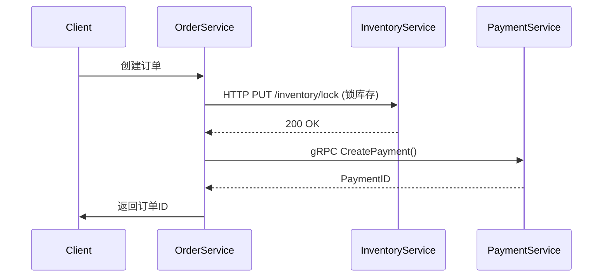

- **注意**：
    - 设置超时（如HTTP请求3s超时）
    - 重试策略（仅幂等操作可重试）
    - 熔断降级（库存服务不可用时返回预设错误）

* 异步通信解决分布式事务（最终一致性）

- **场景**：订单支付成功后通知物流发货
    

- 物流服务需处理**消息重复**（消费端做幂等校验）。

###### 高级通信模式

|**模式**|**作用**|**工具示例**|
|---|---|---|
|**服务网格**|解耦通信治理（熔断/监控/负载均衡）|Istio + Envoy|
|**API网关聚合**|合并多个服务响应（如订单页查商品+库存）|GraphQL（BFF层）|
|**分布式事务**|跨服务数据一致性（慎用）|Seata（AT模式）、Saga补偿事务|
##### 拆分后的核心挑战与应对

1. **分布式事务**
    - 优先用**最终一致性**（异步消息），而非强一致（如2PC）。
2. **链路追踪**
    - 全链路透传TraceID（OpenTelemetry + Jaeger）。
3. **服务治理**
    - 熔断：防止雪崩（Hystrix/Sentinel）
    - 降级：服务不可用时返回兜底数据
4. **测试复杂度**
    - 契约测试（Pact）：确保服务接口兼容性
    - 故障注入（Chaos Engineering）：模拟网络分区

#### 3. 分布式服务接口的幂等性如何设计（比如不能重复扣款）？

##### 幂等性本质

**定义**：任意多次执行与一次执行对系统状态的影响相同。  
**关键场景**：

- 支付重复提交（用户连续点击）
- 消息队列重复投递（网络抖动导致Producer重发）
- 微服务调用超时重试（订单服务重复调用支付接口）

##### 幂等性设计三大方案

###### 方案1：Token机制（防重令牌）

**适用场景**：用户交互类请求（如提交订单、支付）  
**实现原理**：

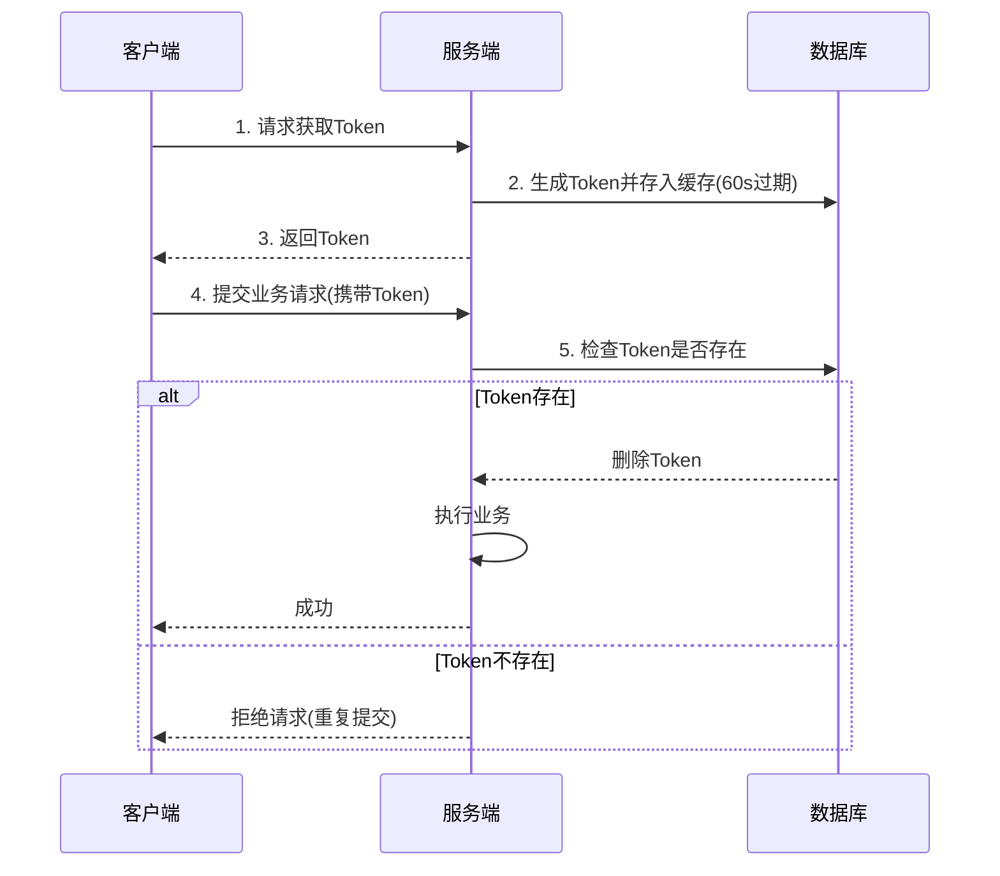

**代码示例**（Spring Boot）：

```java

@PostMapping("/order")
public String createOrder(@RequestParam("token") String token) {
    // 1. 从Redis查询并删除Token (原子操作)
    Boolean isDel = redisTemplate.delete(token);
    if (Boolean.FALSE.equals(isDel)) {
        throw new RuntimeException("重复提交");
    }
    
    // 2. 正常执行业务
    orderService.createOrder();
    return "success";
}
```

**关键点**：

- Token需全局唯一（如UUID）
    
- 校验与删除必须**原子操作**（Redis Lua脚本实现）

###### 方案2：唯一索引/主键约束

**适用场景**：数据库写入类操作（如创建订单、支付记录）  
**实现原理**：

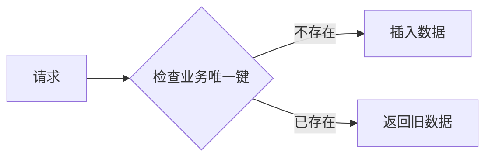

**代码示例**：

```sql

-- 订单表添加唯一索引
ALTER TABLE orders ADD UNIQUE KEY uk_order_id (order_id);
```

```java

public void createOrder(Order order) {
    try {
        // 插入时数据库校验唯一索引
        orderDao.insert(order); 
    } catch (DuplicateKeyException e) {
        // 捕获重复键异常
        log.warn("重复订单: {}", order.getOrderId());
        // 返回已存在的订单
        return orderDao.selectById(order.getOrderId());
    }
}
```

**适用业务**：

- 订单号（order_id）
    
- 支付流水号（payment_sn）
    
- 消息ID（msg_id）

###### 方案3：状态机控制

**适用场景**：存在状态流转的业务（如订单状态、支付状态）  
**实现原理**：

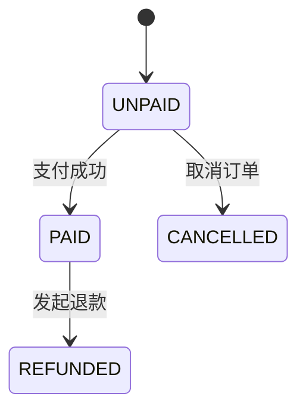

**代码示例**：

```java

@Transactional
public void payOrder(String orderId) {
    Order order = orderDao.get(orderId);
    // 校验当前状态是否允许支付
    if (order.getStatus() != OrderStatus.UNPAID) {
        throw new IllegalStateException("订单状态异常");
    }
    
    // 更新状态（幂等操作）
    int updated = orderDao.updateStatus(orderId, OrderStatus.UNPAID, OrderStatus.PAID);
    if (updated == 0) {
        throw new RuntimeException("状态更新失败，可能已被处理");
    }
    
    // 后续业务逻辑...
}
```

**优势**：

- 天然防重（SQL更新返回影响行数）
    
- 显式定义合法状态转换
    

##### 三、特殊场景解决方案

###### 场景1：消息队列重复消费

**方案**：消费端幂等表

```sql

CREATE TABLE msg_idempotent (
  msg_id VARCHAR(64) PRIMARY KEY,  -- 消息唯一ID
  status TINYINT NOT NULL,          -- 处理状态
  create_time DATETIME
);
```

**消费逻辑**：

```java

@KafkaListener(topics = "order_pay")
public void handle(OrderPayEvent event) {
    // 1. 检查消息是否已处理
    if (idempotentDao.exists(event.getMsgId())) {
        return; // 已处理则跳过
    }
    
    // 2. 执行业务
    paymentService.process(event);
    
    // 3. 插入幂等记录
    idempotentDao.insert(event.getMsgId());
}
```

###### 场景2：第三方支付回调

**方案**：签名+幂等键

```java

public void payCallback(PayNotify notify, String sign) {
    // 1. 验签防篡改
    if (!signature.verify(notify, sign)) {
        throw new SecurityException("签名错误");
    }
    
    // 2. 用支付平台流水号做幂等
    String outTradeNo = notify.getOutTradeNo();
    synchronized (outTradeNo.intern()) { // 进程内锁
        if (paymentDao.exists(outTradeNo)) {
            return "SUCCESS"; // 告知支付平台已处理
        }
        paymentDao.save(notify);
    }
}
```

##### 幂等性设计原则总结

|**原则**|**实施要点**|
|---|---|
|**前置检查**|Token/唯一键在执行业务前拦截重复请求|
|**业务状态机**|通过状态流转约束避免无效操作|
|**后端兜底**|数据库唯一索引是最后防线|
|**隔离性保障**|并发场景用分布式锁（如Redis锁key=业务ID）|
|**明确应答机制**|告知调用方请求实际状态（如HTTP 200/409）|

> **致命陷阱规避**：
> 
> - 避免用`SELECT+INSERT`代替唯一索引（并发场景失效）
> - HTTP GET请求**禁止**用于写操作（网络重试导致数据错乱）
> - 幂等Token必须**一次性**（用后即焚）

#### 4. 分布式服务接口请求的顺序性如何保证？
##### 顺序性是否需要保证？

在分布式系统中，**请求的顺序性并不总是需要保证**，是否需要保证顺序性取决于具体业务场景：

###### 需要保证顺序性的场景：

1. **状态机变更**：订单状态流转（创建→支付→发货）
    
2. **增量操作**：账户余额变更（先充值100后消费50）
    
3. **版本控制**：文档协同编辑（操作序列必须有序）
    
4. **事件溯源**：CQRS模式中的事件存储
    
5. **分布式事务**：跨服务的业务操作序列
    

###### 无需保证顺序性的场景：

1. **独立写操作**：商品评论提交
    
2. **只读查询**：商品信息查询
    
3. **统计类操作**：页面访问计数
    
4. **幂等操作**：设置用户属性（最终值相同）
    

> **关键原则**：仅在业务逻辑对操作顺序敏感时才需要保证顺序性，否则会增加系统复杂度和性能开销。

##### 二、顺序性保障的挑战

在分布式环境中保证顺序性面临三大核心挑战：

|挑战类型|具体表现|
|---|---|
|网络不确定性|请求乱序到达（后发请求先到）|
|节点故障|处理节点宕机导致请求丢失|
|并发执行|多个副本并行处理请求|
|重试机制|超时重试导致请求重复|

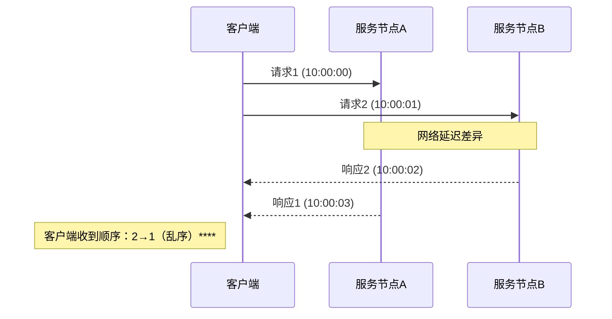

##### 三、顺序性保障方案

###### 方案1：串行化处理（强顺序保证）

**实现原理**：将特定业务ID的请求路由到同一节点单线程处理

java

// Spring Cloud 负载均衡规则
@Bean
public IRule consistentHashRule() {
    return new ConsistentHashRule(); // 一致性哈希路由
}

**架构实现**：

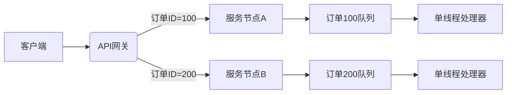

**适用场景**：

- 订单状态机变更
    
- 账户余额操作
    
- 分布式锁服务
    

**优缺点**：

- ✅ 严格保证顺序性
    
- ❌ 牺牲并发性能
    
- ❌ 单点故障风险
    

###### 方案2：乐观锁+版本号（业务层顺序控制）

**实现原理**：通过版本号控制状态变更顺序

```sql

-- 数据表设计
CREATE TABLE orders (
    id BIGINT PRIMARY KEY,
    status VARCHAR(20) NOT NULL,
    version INT NOT NULL DEFAULT 0
);
```

```java

public void updateOrderStatus(Long orderId, String newStatus) {
    // 1. 查询当前版本
    Order order = orderDao.get(orderId);
    
    // 2. 业务校验
    if (!validStatusTransition(order.getStatus(), newStatus)) {
        throw new IllegalStateException("状态转换非法");
    }
    
    // 3. 带版本号更新
    int rows = orderDao.update(
        "UPDATE orders SET status=?, version=version+1 " +
        "WHERE id=? AND version=?", 
        newStatus, orderId, order.getVersion()
    );
    
    if (rows == 0) {
        throw new ConcurrentUpdateException("版本冲突");
    }
}
```

**适用场景**：

- 库存扣减
- 配置更新
- 状态机流转

**优缺点**：

- ✅ 保持系统并发能力
- ✅ 无单点故障
- ❌ 需要客户端处理冲突重试

###### 方案3：分布式日志（事件溯源）

**实现原理**：通过消息队列保证顺序写入

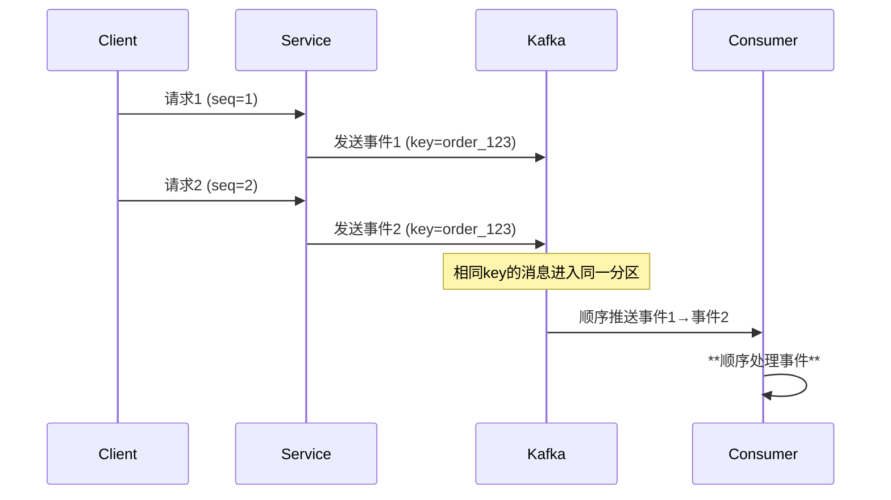

**Kafka配置**：

```java

// 生产者确保顺序
props.put(ProducerConfig.ENABLE_IDEMPOTENCE_CONFIG, "true");
props.put(ProducerConfig.ACKS_CONFIG, "all");

// 消费者配置
props.put(ConsumerConfig.GROUP_ID_CONFIG, "order-group");
props.put(ConsumerConfig.MAX_POLL_RECORDS_CONFIG, 1); // 单条处理
```

**适用场景**：

- 用户行为跟踪
    
- 审计日志
    
- 事件驱动架构
    

**优缺点**：

- ✅ 高吞吐量
    
- ✅ 持久化保证
    
- ❌ 端到端延迟较高
    

##### 四、典型场景解决方案

###### 场景1：订单状态流转（强一致性）

**需求**：

1. 创建订单 → 支付 → 发货 → 完成
    
2. 状态不可跳跃
    

**解决方案**：

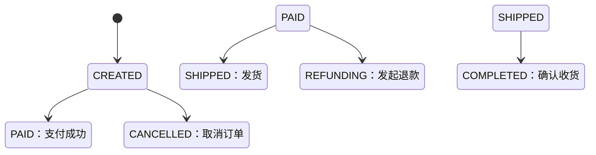

**实现代码**：

```java

public class OrderStateMachine {
    private final StateMachine<OrderState, OrderEvent> stateMachine;

    @Transactional
    public void handleEvent(Long orderId, OrderEvent event) {
        Order order = orderRepository.findById(orderId);
        
        // 加分布式锁
        Lock lock = redisson.getLock("order_lock:" + orderId);
        try {
            lock.lock();
            
            // 状态校验
            if (!stateMachine.transition(event).isAccepted()) {
                throw new IllegalStateException("状态转换失败");
            }
            
            // 持久化状态
            order.setState(stateMachine.getState());
            orderRepository.save(order);
        } finally {
            lock.unlock();
        }
    }
}
```

###### 场景2：账户余额变更（最终一致性）

**需求**：

1. 充值100元 → 消费50元 = 余额50元
    
2. 允许短暂不一致，最终结果正确
    

**解决方案**：

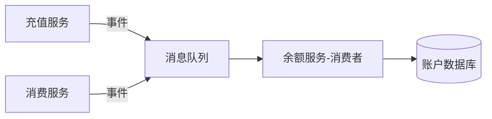

**处理逻辑**：

```java

@KafkaListener(topics = "balance_events")
public void handleBalanceEvent(BalanceEvent event) {
    // 按用户分区顺序消费
    balanceService.processEvent(event.getUserId(), event);
}

// 在余额服务中
public void processEvent(String userId, BalanceEvent event) {
    // 使用MongoDB原子操作
    Document update = new Document("$inc", 
        new Document("balance", event.getAmount())
    );
    
    // 条件更新
    Document filter = new Document("_id", userId)
        .append("version", event.getVersion() - 1);
    
    UpdateResult result = collection.updateOne(filter, update);
    
    if (result.getModifiedCount() == 0) {
        // 版本不连续，放入死信队列人工处理
        deadLetterQueue.send(event);
    }
}
```

##### 五、最佳实践总结

1. **评估必要性**：
    
    - 只有核心业务流程才需要顺序保证
        
    - 非关键路径允许最终一致性
        
2. **分层设计**：
    
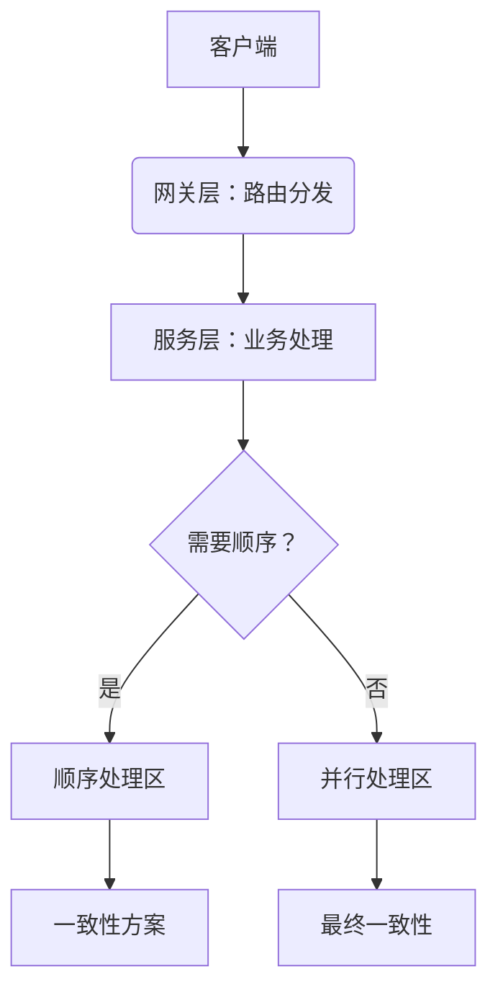
    
3. **监控指标**：
    
    - 顺序错误率（版本冲突次数）
        
    - 乱序请求延迟（99分位延迟）
        
    - 死信队列堆积量
        
4. **降级方案**：
    
    - 短期乱序时自动补偿修复
        
    - 长期不一致时告警人工干预
        
    - 关键业务提供对账接口
        

> **黄金原则**：在满足业务需求的前提下，选择最简单有效的方案。80%的场景可以通过版本控制+冲突解决处理，只有核心金融交易等场景需要强顺序保证。
#### 5. 如何自己设计一个rpc框架？
设计一个RPC（Remote Procedure Call）框架需要解决网络通信、序列化、服务发现、负载均衡等核心问题。以下是逐步实现的详细方案，结合关键代码和架构图：

##### 一、核心架构设计

```
graph LR
    A[客户端] -->|1. 调用代理| B(Stub)
    B -->|2. 序列化| C[网络传输]
    C -->|3. 路由| D[服务端]
    D -->|4. 反序列化| E(Skeleton)
    E -->|5. 调用实现| F[Service]
    F -->|6. 返回结果| E
    E -->|7. 序列化| D
    D -->|8. 网络传输| C
    C -->|9. 反序列化| B
    B -->|10. 返回| A
```

###### 核心模块：

1. **客户端代理（Stub）**：透明化远程调用
    
2. **序列化模块**：对象↔二进制转换
    
3. **网络传输**：TCP/HTTP通信
    
4. **服务端骨架（Skeleton）**：请求分发
    
5. **注册中心**：服务动态发现
    

---

##### 二、详细设计与实现

###### 1. 通信协议设计（自定义协议头）

```plaintext

 0     1     2     3     4        6     7     8          10         12         14         16
+-----+-----+-----+-----+--------+----+-------+-----------+-----------+-----------+-----------+
| 魔数 | 版本 | 序列化 | 压缩 | 消息类型 |  保留位  |   消息ID   |   数据长度   |   数据内容（变长）   |
+------------------------------------------------------------------------------------------+
```

- **魔数**：0xCAFEBABE（识别协议）
    
- **消息类型**：1-请求，2-响应，3-心跳
    
- **序列化标识**：1-JSON，2-Hessian，3-Protobuf
    
- **压缩标识**：0-无压缩，1-gzip
    

###### 2. 序列化模块（可插拔）

```java

public interface Serializer {
    byte[] serialize(Object obj);
    <T> T deserialize(byte[] bytes, Class<T> clazz);
}

// Protobuf实现
public class ProtobufSerializer implements Serializer {
    public byte[] serialize(Object obj) {
        return ProtobufUtils.serialize(obj);
    }
    public <T> T deserialize(byte[] bytes, Class<T> clazz) {
        return ProtobufUtils.parseFrom(bytes, clazz);
    }
}
```

###### 3. 动态代理（客户端透明调用）

```java

public class RpcProxy implements InvocationHandler {
    public Object invoke(Object proxy, Method method, Object[] args) {
        // 1. 构造请求对象
        RpcRequest request = new RpcRequest(
            method.getDeclaringClass().getName(),
            method.getName(),
            method.getParameterTypes(),
            args
        );
        
        // 2. 选择服务节点
        ServiceInstance instance = loadBalancer.select(serviceName);
        
        // 3. 发送请求
        return transportClient.sendRequest(request, instance);
    }
}
```

###### 4. 网络传输（Netty实现）

**客户端Handler链**：

```
graph LR
    A[NettyClient] --> B(编码器)
    B --> C(压缩器)
    C --> D(IO处理)
    D --> E(解码器)
    E --> F(响应处理器)
```

**服务端Handler链**：

```
graph LR
    G[NettyServer] --> H(解码器)
    H --> I(解压器)
    I --> J(IO处理)
    J --> K(编码器)
    K --> L(请求分发)
```

**关键IO处理逻辑**：

```java

public class RpcServerHandler extends ChannelInboundHandlerAdapter {
    @Override
    public void channelRead(ChannelHandlerContext ctx, Object msg) {
        // 1. 解析请求
        RpcRequest request = (RpcRequest)msg;
        
        // 2. 查找本地服务
        Object service = serviceRegistry.get(request.getServiceName());
        
        // 3. 反射调用
        Method method = service.getClass().getMethod(
            request.getMethodName(), 
            request.getParameterTypes()
        );
        Object result = method.invoke(service, request.getParameters());
        
        // 4. 写回响应
        ctx.writeAndFlush(new RpcResponse(result));
    }
}
```

###### 5. 服务注册发现

```
sequenceDiagram
    participant Provider
    participant Registry
    participant Consumer
    
    Provider->>Registry: 注册服务(serviceName,ip:port)
    Consumer->>Registry: 订阅服务(serviceName)
    Registry-->>Consumer: 通知服务列表
    Consumer->>Provider: 发起调用
    Provider->>Consumer: 返回结果
```

**服务健康检测**：

```java

// 心跳检测线程
scheduledExecutor.scheduleAtFixedRate(() -> {
    for (ServiceInstance instance : instances) {
        if (!heartbeat(instance)) {
            registry.removeInstance(instance);
        }
    }
}, 0, 30, TimeUnit.SECONDS);
```

###### 6. 负载均衡策略

```java
public interface LoadBalancer {
    ServiceInstance select(List<ServiceInstance> instances);
}

// 随机权重算法
public class RandomLoadBalancer implements LoadBalancer {
    public ServiceInstance select(List<ServiceInstance> instances) {
        // 计算总权重
        int totalWeight = instances.stream().mapToInt(ServiceInstance::getWeight).sum();
        
        // 随机选择
        int random = ThreadLocalRandom.current().nextInt(totalWeight);
        for (ServiceInstance instance : instances) {
            random -= instance.getWeight();
            if (random < 0) {
                return instance;
            }
        }
        return instances.get(0);
    }
}
```

###### 7. 异步调用支持

```java

// 客户端异步调用
RpcFuture future = transportClient.sendAsync(request);
future.thenAccept(response -> {
    System.out.println("收到响应：" + response);
});

// Future存储
public class RpcFuture {
    private RpcResponse response;
    private List<Consumer<RpcResponse>> callbacks = new ArrayList<>();
    
    public void complete(RpcResponse response) {
        this.response = response;
        callbacks.forEach(cb -> cb.accept(response));
    }
    
    public void thenAccept(Consumer<RpcResponse> callback) {
        if (response != null) {
            callback.accept(response);
        } else {
            callbacks.add(callback);
        }
    }
}
```

##### 三、关键优化点

1. **连接池管理**：
    
```java
    
    public class ConnectionPool {
        private Map<String, List<Channel>> pools = new ConcurrentHashMap<>();
        
        public Channel getChannel(ServiceInstance instance) {
            // 1. 检查空闲连接
            // 2. 无可用连接时创建新连接（带限流）
        }
    }
```
    
2. **熔断降级**：
    
```java
    
    public class CircuitBreaker {
        private int failureThreshold = 5;
        private int resetTimeout = 60;
        
        public RpcResponse invoke(Callable<RpcResponse> call) {
            if (state == State.OPEN) {
                throw new CircuitBreakerException();
            }
            try {
                RpcResponse res = call.call();
                reset();
                return res;
            } catch (Exception e) {
                recordFailure();
                throw e;
            }
        }
    }
```
    
3. **链路追踪**：
    
```java
    
    public class TracingFilter {
        public void beforeInvoke(RpcRequest request) {
            // 透传TraceID
            request.setTraceId(MDC.get("traceId"));
        }
    }
    

```

##### 四、核心指标监控

|指标类型|采集方法|
|---|---|
|QPS|滑动窗口计数器|
|平均响应时间|调用耗时统计|
|错误率|异常捕获计数|
|连接数|Netty ChannelGroup统计|
|队列等待时间|ThreadPoolExecutor监控|

---

##### 五、自研框架 vs 开源选择

|**考虑因素**|**自研**|**使用Dubbo/gRPC**|
|---|---|---|
|开发成本|6人月以上|1人周集成|
|性能|可深度优化（微秒级）|默认优化较好|
|功能完整性|需实现注册中心、监控等|开箱即用|
|社区支持|无|丰富的问题解决方案|

> 建议：除非有特殊性能需求或深度定制场景，否则优先选择成熟开源方案。若为学习目的，可参考上述设计实现简化版（约2000行代码）。

通过以上设计，可实现一个基本可用的RPC框架，核心代码结构如下：

```text

src
├── client        # 客户端
│   ├── proxy     # 动态代理
│   ├── balance   # 负载均衡
│   └── transport # 网络传输
├── common        # 公共模块
│   ├── codec     # 编解码
│   ├── serialize # 序列化
│   └── registry  # 注册中心接口
├── server        # 服务端
│   ├── provider  # 服务暴露
│   └── handler   # 请求处理
└── example       # 示例代码
```

#### 6. 使用Redis如何设计分布式锁？使用Zookeeper来设计分布式锁可以吗？这两种分布式锁的实现方式哪种效率比较高？
在分布式系统中，Redis 和 ZooKeeper 均可实现分布式锁，但两者的设计理念、适用场景和性能表现存在显著差异。以下从**实现原理、性能、可靠性、适用场景**等维度进行综合对比，并提供选型建议：

---

##### 🔒 一、实现原理对比

|**特性**|**Redis 分布式锁**|**ZooKeeper 分布式锁**|
|---|---|---|
|**核心机制**|基于 `SETNX`（或 `SET key value NX EX`）命令，结合 Lua 脚本保证原子性158|基于临时顺序节点（Ephemeral Sequential Node）和 Watch 监听机制149|
|**锁释放方式**|依赖过期时间自动释放，或客户端显式删除（需防误删）|会话断开时临时节点自动删除（避免死锁）19|
|**锁类型支持**|支持可重入锁、公平锁（通过 Redisson 实现）610|天然支持公平锁（按节点顺序获取）47|
|**续期机制**|需手动实现“看门狗”自动续期（如 Redisson）68|无需续期，会话存活即持有锁1|

> **Redis 防误删方案**：
> 
> - 加锁时 value 存储客户端唯一标识（如 UUID + 线程ID）
>     
> - 解锁时通过 Lua 脚本校验标识后再删除8：
>     
```lua
>     if redis.call("get", KEYS[1]) == ARGV[1] then 
>         return redis.call("del", KEYS[1])
>     else 
>         return 0
>     end
```
>     

---

##### ⚡ 二、性能与可靠性对比

|**维度**|**Redis**|**ZooKeeper**|
|---|---|---|
|**性能**|⭐⭐⭐⭐⭐ 内存操作，TPS 可达 10W+，适合高并发场景19|⭐⭐ 写操作需集群多数节点持久化，延迟较高（1-10ms），TPS 通常低于 1W13|
|**一致性模型**|AP 模型（最终一致性），主从切换可能丢锁19|CP 模型（强一致性），基于 ZAB 协议保证状态一致14|
|**容错性**|弱：主从异步复制导致锁丢失风险；RedLock 算法需多实例部署（运维复杂）15|强：宕机节点数小于半数时仍可用；临时节点自动清理19|
|**死锁风险**|依赖过期时间，业务超时可能导致锁提前释放58|无：会话断开自动释放锁4|

> **Redis 高可用方案**：
> 
> - **RedLock 算法**：在 N 个独立 Redis 实例上同时加锁，半数以上成功才算获取锁58。
>     
> - **代价**：性能下降 30%~50%，且无法完全避免时钟漂移问题1。

##### 🎯 三、适用场景推荐

###### 1. **优先选择 Redis 的场景** ✅

- **高频短期任务**：如秒杀库存扣减、优惠券发放等允许偶发锁失效的业务（结合幂等性补偿）18。
    
- **已有 Redis 基础设施**：减少运维复杂度，利用其高吞吐优势1。
    
- **多数据中心部署**：Redis 分片灵活性优于 ZooKeeper1。
    

**典型代码（Redisson 实现）**：

```java

RLock lock = redisson.getLock("seckill:item001");
if (lock.tryLock(0, 30, TimeUnit.SECONDS)) {  // 非阻塞获取锁
    try {
        // 扣减库存
    } finally {
        lock.unlock();
    }
}
```

###### 2. **优先选择 ZooKeeper 的场景** ✅

- **强一致性要求**：如金融交易、分布式事务协调（如 Seata）19。
    
- **长周期任务**：如批量数据处理，避免锁超时失效14。
    
- **系统关键路径**：如主节点选举（如 Kafka Controller 选举）9。
    

**典型代码（Curator 实现）**：

```java

InterProcessMutex lock = new InterProcessMutex(client, "/transaction/lock");
if (lock.acquire(10, TimeUnit.SECONDS)) {  // 阻塞等待锁
    try {
        // 执行事务
    } finally {
        lock.release();
    }
}
```

##### 🔧 四、选型决策树

```
graph TD
    A[业务需求] --> B{需要强一致性？}
    B -->|是| C[ZooKeeper]
    B -->|否| D{并发量是否极高？}
    D -->|是| E[Redis + Redisson]
    D -->|否| F{锁持有时间 > 30s？}
    F -->|是| C
    F -->|否| E
```

---

##### 💎 五、总结与建议

|**场景**|**推荐方案**|**理由**|
|---|---|---|
|高并发 & 允许锁失效|Redis + Redisson|性能碾压，配合看门狗续期和Lua脚本防误删68|
|低并发 & 强一致性|ZooKeeper + Curator|无锁超时风险，Watch机制实现阻塞等待47|
|混合业务|两者并存|核心交易用 ZooKeeper，库存扣减用 Redis1|

> **黄金准则**：
> 
> - Redis 追求 **性能与效率**，适合容忍小概率锁失效的 AP 系统；
>     
> - ZooKeeper 确保 **可靠与一致**，适合 CP 系统19。  
>     实际选型需结合团队技术栈和运维能力——若已有 Redis 集群且无强一致性需求，**避免引入 ZooKeeper 增加复杂度**。
>
#### 7. 分布式事务了解吗？你们如何解决分布式事务问题的？TCC如果出现网络连不通怎么办？XA的一致性如何保证？
分布式事务是分布式系统中最具挑战性的问题之一，涉及跨多个服务或数据库的事务操作，要求所有操作要么全部成功，要么全部回滚。以下是针对您的问题的详细解答：

---

##### 🔄 一、分布式事务的核心概念

分布式事务需满足 ACID 特性（原子性、一致性、隔离性、持久性），但在分布式环境下实现难度显著增加。主要挑战包括：

- **网络不可靠**：节点间通信可能失败或延迟。
    
- **节点故障**：部分节点宕机导致事务状态不一致。
    
- **数据分片**：数据分散在不同节点，难以统一管理18。
    

---

##### 🛠️ **二、主流解决方案及适用场景**

###### 1. **TCC（Try-Confirm-Cancel）模式**

- **原理**：
    
    - **Try**：预留资源（如冻结库存），执行本地事务。
        
    - **Confirm**：确认提交（如扣减库存），需幂等设计。
        
    - **Cancel**：回滚资源（如解冻库存），需幂等设计39。
        
- **优点**：高性能（无长锁）、适用于高并发场景（如秒杀）。
    
- **缺点**：业务侵入性强（需改造三个接口），开发成本高69。
    

###### 2. **XA协议（两阶段提交，2PC）**

- **原理**：
    
    - **准备阶段**：协调者询问所有参与者是否可提交，参与者预提交并锁定资源。
        
    - **提交阶段**：若所有参与者同意，协调者发送提交命令；否则回滚28。
        
- **优点**：强一致性，数据库原生支持（如 MySQL InnoDB）。
    
- **缺点**：
    
    - 性能差（全局锁导致长事务）。
        
    - 协调者单点故障风险25。
        

###### 3. **其他方案**

- **Saga模式**：通过事件驱动的补偿事务实现最终一致性，适合长事务（如跨境支付）4。
    
- **本地消息表**：结合消息队列和本地事务，保证最终一致性（如订单创建）1。
    

###### 方案对比表

|**方案**|**一致性模型**|**性能**|**侵入性**|**适用场景**|
|---|---|---|---|---|
|TCC|最终一致|⭐⭐⭐⭐|高|高并发短事务（秒杀）|
|XA|强一致|⭐⭐|低|金融交易（强一致需求）|
|Saga|最终一致|⭐⭐⭐|中|长事务（跨境支付）|

---

##### 🌐 **三、TCC网络连不通的解决方案**

TCC 执行过程中网络故障是常见问题，需分层处理：

###### 1. **客户端重试与超时控制**

- **指数退避重试**：对失败请求自动重试（如 Spring `@Retryable`）7。
    
- **超时回滚**：为 Try 阶段设置超时（如 5s），超时后触发 Cancel 避免阻塞7。
    

###### 2. **服务端幂等与状态防护**

- **幂等设计**：
    
    - 通过事务状态表记录全局事务 ID 和阶段状态。
        
    - Confirm/Cancel 执行前校验状态，避免重复操作710。
        
- **防悬挂**：
    
    - 执行 Try 前检查是否已收到 Cancel（防止晚到的 Try 锁定资源）10。
        
- **防空回滚**：
    
    - Cancel 执行前校验 Try 是否已执行，未执行则跳过710。
        

###### 3. **网络层优化**

- **QUIC 协议**：替代 TCP，减少握手延迟（尤其跨国网络）4。
    
- **自适应路由**：动态选择低延迟节点（如优先同区域路由）4。
    

---

##### 🔒 **四、XA协议的一致性保证机制**

XA 依赖两阶段提交实现强一致，其关键保障措施包括：

1. **持久化日志**：
    
    - 参与者在准备阶段将事务日志（Undo/Redo）写入磁盘，故障后可恢复28。
        
2. **全局事务 ID**：
    
    - 唯一标识事务，确保所有操作可追踪8。
        
3. **协调者高可用**：
    
    - 协调者采用主备切换（如基于 ZooKeeper），避免单点故障2。
        
4. **资源锁定**：
    
    - 准备阶段锁定所有资源，防止其他事务修改（牺牲并发性）89。
        

```
sequenceDiagram
    participant Coordinator
    participant Participant1
    participant Participant2
    Coordinator->>Participant1: Prepare Request
    Coordinator->>Participant2: Prepare Request
    Participant1->>Coordinator: Ready (with Undo/Redo Log)
    Participant2->>Coordinator: Ready
    Coordinator->>Participant1: Commit
    Coordinator->>Participant2: Commit
```

> ⚠️ **XA的局限性**：
> 
> - 性能瓶颈（全局锁）、协调者故障处理复杂25。
>     
> - 不适合高并发或跨地域部署场景4。
>     

---

##### 💎 **五、选型建议与最佳实践**

1. **业务场景驱动**：
    
    - **强一致需求**（如支付）：选 XA（需容忍性能损耗）。
        
    - **高并发最终一致**（如库存扣减）：选 TCC 或 Saga19。
        
2. **基础设施支持**：
    
    - 使用 Seata、Atomikos 等框架简化实现（Seata 支持 TCC 模式）10。
        
3. **容灾设计**：
    
    - 部署异地多活 + 实时监控（如 Prometheus 追踪事务阶段延迟）47。
        

> **决策树参考**：
> 
> ```
> graph TD
    A[需要强一致性？] -->|是| B[XA]
    A -->|否| C{并发量高？}
    C -->|是| D[TCC]
    C -->|否| E[Saga]
> ```

分布式事务的解决本质是**权衡业务需求与技术成本**。对一致性和性能的要求越高，方案实现的复杂性也越高。实际设计中，往往需要结合多种模式分层处理，同时通过幂等、重试、监控等机制增强系统韧性。
#### 8. 集群部署时的分布式session如何实现？
在集群部署环境下，实现分布式 Session 管理是保证用户体验一致性的关键技术。以下我将全面解析主流解决方案，并提供具体实现方案。

##### 一、核心解决方案对比

|**方案**|**实现原理**|**优点**|**缺点**|**适用场景**|
|---|---|---|---|---|
|**集中存储**|Session 数据集中存储（Redis/Memcached）|高可用、扩展性强、数据一致性好|增加网络开销、依赖外部存储|大中型分布式系统|
|**客户端存储**|Session 数据加密存储在客户端（JWT）|无状态、服务端无存储压力、天然支持水平扩展|数据大小受限、安全性要求高|无状态服务、API 服务|
|**Session 复制**|集群节点间同步 Session 数据|无外部依赖、读取速度快|网络开销大、同步延迟、扩展性差|小型集群（≤5节点）|
|**Session 粘滞**|负载均衡绑定用户到固定节点|实现简单、无同步开销|节点故障丢失数据、负载不均衡|临时会话、低一致性要求|

```
graph TD
    A[用户请求] --> B{需要Session管理}
    B -->|是| C[选择方案]
    C --> D{状态要求}
    D -->|无状态| E[客户端存储 JWT]
    D -->|有状态| F{集群规模}
    F -->|小型集群| G[Session复制]
    F -->|中大型集群| H[集中存储 Redis]
    F -->|特殊要求| I[Session粘滞]
```

##### 二、主流方案详细实现

###### 方案1：集中存储（推荐方案）

**使用 Redis 作为分布式 Session 存储：**

###### 架构图

```
sequenceDiagram
    participant User as 客户端
    participant LB as 负载均衡
    participant App1 as 服务节点1
    participant App2 as 服务节点2
    participant Redis as Redis集群
    
    User->>LB: 请求(无SessionID)
    LB->>App1: 转发请求
    App1->>Redis: 创建Session(key: S1)
    Redis-->>App1: 返回SessionID
    App1-->>User: 响应(Set-Cookie: S1)
    
    User->>LB: 新请求(Cookie: S1)
    LB->>App2: 转发请求
    App2->>Redis: 获取Session(S1)
    Redis-->>App2: 返回Session数据
    App2-->>User: 响应
```

###### Spring Boot 实现示例

1. 添加依赖：
    

```xml

<dependency>
    <groupId>org.springframework.boot</groupId>
    <artifactId>spring-boot-starter-data-redis</artifactId>
</dependency>
<dependency>
    <groupId>org.springframework.session</groupId>
    <artifactId>spring-session-data-redis</artifactId>
</dependency>
```

2. 配置 application.yml：
    

```yaml

spring:
  session:
    store-type: redis
    timeout: 1800 # 30分钟过期
  redis:
    host: redis-cluster.example.com
    port: 6379
    password: yourpassword
    cluster:
      nodes:
        - redis-node1:6379
        - redis-node2:6379
        - redis-node3:6379
```

3. 使用 Session（与本地 Session 完全一致）：
    

```java

@RestController
public class SessionController {
    
    @GetMapping("/login")
    public String login(HttpServletRequest request) {
        HttpSession session = request.getSession();
        session.setAttribute("user", "alice@example.com");
        session.setAttribute("role", "admin");
        return "登录成功";
    }
    
    @GetMapping("/profile")
    public String profile(HttpSession session) {
        String user = (String) session.getAttribute("user");
        String role = (String) session.getAttribute("role");
        return "用户: " + user + " | 角色: " + role;
    }
}
```

###### 高级优化策略

1. **本地缓存加速**（减少 Redis 访问）：
    

```java

public class CachedSessionRepository implements SessionRepository {
    
    private final SessionRepository delegate;
    private final Cache<Session> localCache;
    
    public CachedSessionRepository(SessionRepository delegate) {
        this.delegate = delegate;
        this.localCache = Caffeine.newBuilder()
                .expireAfterWrite(5, TimeUnit.MINUTES)
                .maximumSize(10_000)
                .build();
    }
    
    @Override
    public Session findById(String id) {
        return localCache.get(id, key -> delegate.findById(id));
    }
}
```

2. **Session 数据压缩**：
    

```java
public class CompressedRedisSerializer implements RedisSerializer<Object> {
    
    private final RedisSerializer<Object> innerSerializer;
    
    @Override
    public byte[] serialize(Object object) throws SerializationException {
        byte[] data = innerSerializer.serialize(object);
        return CompressionUtils.compress(data); // 使用GZIP/LZ4压缩
    }
}
```

###### 方案2：客户端存储（JWT 方案）

###### 实现架构

```
graph LR
    A[客户端] -->|1. 登录请求| B(服务端)
    B -->|2. 生成JWT| C[返回Token]
    A -->|3. 携带Token| D(服务节点1)
    A -->|4. 携带Token| E(服务节点2)
    D -->|5. 验证Token| F[处理请求]
    E -->|6. 验证Token| F
```

###### Spring Boot 实现

1. 添加依赖：
    

xml

<dependency>
    <groupId>io.jsonwebtoken</groupId>
    <artifactId>jjwt-api</artifactId>
    <version>0.11.5</version>
</dependency>
<dependency>
    <groupId>io.jsonwebtoken</groupId>
    <artifactId>jjwt-impl</artifactId>
    <version>0.11.5</version>
    <scope>runtime</scope>
</dependency>

2. JWT 工具类：
    

```java

public class JwtUtils {
    
    private static final String SECRET_KEY = "your-256-bit-secret";
    private static final long EXPIRATION = 1800_000; // 30分钟
    
    public static String generateToken(Map<String, Object> claims) {
        return Jwts.builder()
                .setClaims(claims)
                .setIssuedAt(new Date())
                .setExpiration(new Date(System.currentTimeMillis() + EXPIRATION))
                .signWith(SignatureAlgorithm.HS256, SECRET_KEY)
                .compact();
    }
    
    public static Claims parseToken(String token) {
        return Jwts.parser()
                .setSigningKey(SECRET_KEY)
                .parseClaimsJws(token)
                .getBody();
    }
}
```

3. 登录控制器：
    

```java

@RestController
public class AuthController {
    
    @PostMapping("/login")
    public ResponseEntity<String> login(@RequestBody LoginRequest request) {
        // 1. 验证用户凭证
        User user = authService.authenticate(request);
        
        // 2. 生成JWT
        Map<String, Object> claims = new HashMap<>();
        claims.put("userId", user.getId());
        claims.put("role", user.getRole());
        claims.put("email", user.getEmail());
        
        String token = JwtUtils.generateToken(claims);
        
        // 3. 返回Token
        return ResponseEntity.ok()
                .header(HttpHeaders.SET_COOKIE, "token=" + token + "; Path=/; HttpOnly")
                .body("登录成功");
    }
}
```

4. 认证拦截器：
    

```java

public class JwtInterceptor implements HandlerInterceptor {
    
    @Override
    public boolean preHandle(HttpServletRequest request, 
                             HttpServletResponse response, 
                             Object handler) {
        String token = getToken(request);
        if (token == null) {
            response.setStatus(HttpStatus.UNAUTHORIZED.value());
            return false;
        }
        
        try {
            Claims claims = JwtUtils.parseToken(token);
            request.setAttribute("userClaims", claims);
            return true;
        } catch (Exception e) {
            response.setStatus(HttpStatus.UNAUTHORIZED.value());
            return false;
        }
    }
    
    private String getToken(HttpServletRequest request) {
        String header = request.getHeader("Authorization");
        if (header != null && header.startsWith("Bearer ")) {
            return header.substring(7);
        }
        return null;
    }
}
```

##### 三、方案选型指南

###### 决策流程图

```
graph TD
    A[开始] --> B{需要维护用户状态？}
    B -->|否| C[无状态服务，无需Session]
    B -->|是| D{状态数据大小}
    D -->|>4KB| E[选择集中存储方案]
    D -->|≤4KB| F{安全要求级别}
    F -->|高| G[选择JWT方案]
    F -->|中低| H{集群规模}
    H -->|≤5节点| I[Session复制]
    H -->|>5节点| J[集中存储方案]
```

###### 场景化推荐

1. **电商平台**（用户购物车、登录状态）
    
    - 推荐：Redis 集中存储
        
    - 原因：需要存储较大数据（购物车商品），且要求高一致性
        
2. **API 服务**（移动端/第三方调用）
    
    - 推荐：JWT 方案
        
    - 原因：无状态设计更符合 RESTful 原则
        
3. **后台管理系统**
    
    - 推荐：Redis 集中存储 + JWT 双重验证
        
    - 原因：高安全性要求，需要实时权限控制
        
4. **游戏服务器**（实时会话）
    
    - 推荐：Session 粘滞 + Redis 备份
        
    - 原因：需要低延迟，且可容忍短暂状态丢失
        

##### 四、生产环境最佳实践

###### 安全加固措施

1. **Session 安全防护**：
    
```java
    
    @Configuration
    public class SessionSecurityConfig {
        
        @Bean
        public CookieSerializer cookieSerializer() {
            DefaultCookieSerializer serializer = new DefaultCookieSerializer();
            serializer.setCookieName("APP_SESSION");
            serializer.setUseHttpOnlyCookie(true); // 禁止JS访问
            serializer.setSameSite("Strict"); // 防止CSRF
            serializer.setUseSecureCookie(true); // 仅HTTPS传输
            return serializer;
        }
    }
```
    
2. **JWT 安全增强**：
    
```java
    
    // 刷新令牌机制
    public String refreshToken(String oldToken) {
        Claims claims = JwtUtils.parseToken(oldToken);
        
        // 检查刷新间隔（防止滥用）
        Date now = new Date();
        if (now.getTime() - claims.getIssuedAt().getTime() < 300_000) {
            throw new SecurityException("刷新过于频繁");
        }
        
        // 生成新令牌
        return JwtUtils.generateToken(claims);
    }
```
    

###### 性能优化策略

1. **Session 数据精简**：
    
```java
    
    // 只存储必要引用ID
    session.setAttribute("userId", user.getId());
    
    // 而非存储整个对象
    // session.setAttribute("user", user); // 避免！
```
    
2. **Redis 部署优化**：
    
```yaml
    
    spring:
      redis:
        lettuce:
          pool:
            max-active: 50   # 最大连接数
            max-idle: 20     # 最大空闲连接
            min-idle: 5      # 最小空闲连接
            max-wait: 1000   # 连接等待时间(ms)
    
```

###### 高可用设计

1. **多级灾备架构**：
    
```text
    
    ┌─────────────┐     ┌─────────────┐
    │  应用集群    │     │  应用集群    │
    │ (Region A)  │     │ (Region B)  │
    └──────┬──────┘     └──────┬──────┘
           │                   │
    ┌──────▼──────┐     ┌──────▼──────┐
    │ Redis集群    │     │ Redis集群    │
    │ (主区域)     │     │ (备份区域)   │
    └──────┬──────┘     └──────┬──────┘
           └─────────┬─────────┘
                     │
              ┌──────▼──────┐
              │ 全局DNS     │
              │ 故障切换    │
              └─────────────┘
```
    
2. **Session 迁移方案**（集群伸缩时）：
    
```java
    public class SessionMigrationJob {
        
        @Scheduled(fixedRate = 60_000)
        public void migrateSessions() {
            // 1. 获取待下线节点列表
            List<Node> retiringNodes = clusterManager.getRetiringNodes();
            
            for (Node node : retiringNodes) {
                // 2. 迁移Session到新节点
                migrateSessionsFromNode(node);
            }
        }
        
        private void migrateSessionsFromNode(Node node) {
            // 实现细节...
        }
    }
```
    

##### 五、特殊场景处理

###### 场景1：多端登录冲突

**问题**：同一账号在手机和PC同时登录，需要保持状态隔离

**解决方案**：

```java

public class DeviceAwareSessionStrategy {

    public String createSession(User user, String deviceId) {
        // 生成设备专属SessionID: {userId}@{deviceType}
        String sessionId = user.getId() + "@" + deviceId;
        
        // 存储到Redis
        redisTemplate.opsForValue().set(sessionId, user, 30, MINUTES);
        
        return sessionId;
    }
}
```

###### 场景2：敏感操作二次验证

**问题**：支付等敏感操作需要独立会话验证

**解决方案**：

```java

public class CriticalOperationInterceptor implements HandlerInterceptor {
    
    @Override
    public boolean preHandle(HttpServletRequest request, 
                            HttpServletResponse response, 
                            Object handler) {
        // 检查主会话
        HttpSession mainSession = request.getSession(false);
        
        // 检查敏感操作专用会话
        String criticalToken = request.getHeader("X-Critical-Token");
        CriticalSession criticalSession = criticalSessionStore.get(criticalToken);
        
        if (criticalSession == null || !criticalSession.isValid()) {
            response.setStatus(HttpStatus.FORBIDDEN.value());
            return false;
        }
        
        // 验证主会话和敏感会话关联性
        if (!criticalSession.getUserId().equals(mainSession.getAttribute("userId"))) {
            response.setStatus(HttpStatus.FORBIDDEN.value());
            return false;
        }
        
        return true;
    }
}
```

##### 总结建议

对于大多数分布式系统，**Redis 集中存储方案**是最佳选择：

- 使用 Spring Session 简化集成
    
- 部署 Redis 集群保证高可用
    
- 添加本地缓存减少网络开销
    
- 设置合理过期时间（30-60分钟）
    

对于特定场景：

- **无状态 API 服务** → 采用 JWT
    
- **实时性要求高的系统** → Session 粘滞 + Redis 备份
    
- **超大规模集群** → 考虑定制分片策略
    

最终选择需考虑：

1. 数据大小和安全性要求
    
2. 团队技术栈熟悉度
    
3. 现有基础设施支持
    
4. 长期维护成本
    

生产环境务必实现：

- 会话加密传输（HTTPS）
    
- 定期安全审计
    
- 多区域容灾部署
    
- 实时监控和告警机制
#### 9. 如何限流？在工作中是怎么做的？说一下具体的实现？

限流是保障分布式系统稳定性的核心技术，尤其在应对突发流量、防止系统雪崩场景中至关重要。以下从**策略选型、算法实现、落地实践**三个维度全面解析限流方案：

---

##### 🔧 一、主流限流策略对比

|**策略**|**算法原理**|**适用场景**|**实现复杂度**|**精度**|
|---|---|---|---|---|
|**计数器法**|固定时间窗口计数|简单粗暴限流|⭐|低|
|**滑动窗口**|将时间窗口细分为多个区间|API网关限流|⭐⭐|中|
|**漏桶算法**|恒定速率处理请求|流量整形、平滑突发|⭐⭐|高|
|**令牌桶算法**|按速率生成令牌|兼顾突发与限流（最常用）|⭐⭐|高|
|**自适应限流**|基于系统负载动态调整阈值|微服务全链路保护|⭐⭐⭐⭐|极高|

```
graph TD
    A[请求进入] --> B{是否开启限流}
    B -->|是| C[选择限流策略]
    C --> D{是否有突发流量}
    D -->|是| E[令牌桶算法]
    D -->|否| F{是否需要平滑处理}
    F -->|是| G[漏桶算法]
    F -->|否| H[滑动窗口]
    B -->|否| I[直接处理]
```

---

##### ⚙️ 二、核心算法实现详解

###### 1. **令牌桶算法（生产环境首选）**

**实现原理**：

```java

public class TokenBucket {
    private final int capacity;     // 桶容量
    private double tokens;          // 当前令牌数
    private long lastRefillTime;    // 上次填充时间
    private final int refillRate;   // 每秒填充速率（令牌/秒）

    public synchronized boolean tryAcquire(int permits) {
        refillTokens(); // 补充令牌
        if (tokens < permits) {
            return false; // 令牌不足
        }
        tokens -= permits;
        return true;
    }

    private void refillTokens() {
        long now = System.currentTimeMillis();
        double seconds = (now - lastRefillTime) / 1000.0;
        tokens = Math.min(capacity, tokens + seconds * refillRate);
        lastRefillTime = now;
    }
}
```

**使用示例**：

```java

TokenBucket bucket = new TokenBucket(100, 10); // 容量100，速率10令牌/秒

if (bucket.tryAcquire(1)) {
    // 执行业务逻辑
} else {
    throw new RateLimitException("请求超限");
}
```

###### 2. **分布式限流（Redis + Lua）**

**场景**：集群级限流，避免单节点限流不准确  
**Redis Lua脚本**：

```lua

-- KEYS[1]: 限流key
-- ARGV[1]: 令牌桶容量
-- ARGV[2]: 令牌生成速率（令牌/秒）
-- ARGV[3]: 当前时间戳（毫秒）
-- ARGV[4]: 请求令牌数

local capacity = tonumber(ARGV[1])
local rate = tonumber(ARGV[2])
local now = tonumber(ARGV[3])
local requested = tonumber(ARGV[4])

local lastRefillTime = redis.call('hget', KEYS[1], 'lastRefillTime') or now
local tokens = tonumber(redis.call('hget', KEYS[1], 'tokens') or capacity

-- 计算应补充令牌数
local secondsElapsed = (now - lastRefillTime) / 1000
local refillTokens = secondsElapsed * rate
tokens = math.min(capacity, tokens + refillTokens)

-- 检查令牌是否足够
if tokens < requested then
    redis.call('hset', KEYS[1], 'lastRefillTime', now)
    redis.call('hset', KEYS[1], 'tokens', tokens)
    return 0  -- 限流
end

-- 扣除令牌
tokens = tokens - requested
redis.call('hset', KEYS[1], 'lastRefillTime', now)
redis.call('hset', KEYS[1], 'tokens', tokens)
return 1  -- 放行
```

**Java调用**：

```java

public boolean allowRequest(String key, int permits) {
    String script = loadLuaScript("token_bucket.lua");
    List<String> keys = Collections.singletonList(key);
    List<String> args = Arrays.asList(
        String.valueOf(100),    // 容量
        String.valueOf(10),     // 速率
        String.valueOf(System.currentTimeMillis()),
        String.valueOf(permits)
    );
    
    Long result = jedis.eval(script, keys, args);
    return result == 1;
}
```

##### 🏗️ 三、生产环境落地实践

###### 1. **分层限流架构**

```
graph LR
    A[客户端] --> B(API网关层限流)
    B --> C{是否放行}
    C -->|是| D[微服务集群]
    D --> E[服务节点限流]
    E --> F[资源方法级限流]
```

###### 2. **具体实现方案**

###### 方案1：API网关层限流（Nginx）

**场景**：全局入口流量控制  
**配置示例**：

```nginx

http {
    # 定义限流区域（10r/s）
    limit_req_zone $binary_remote_addr zone=api_limit:10m rate=10r/s;
    
    server {
        location /api/ {
            # 启用限流
            limit_req zone=api_limit burst=20 nodelay;
            
            # 超过速率返回429
            limit_req_status 429;
            
            proxy_pass http://backend;
        }
    }
}
```

###### 方案2：微服务层限流（Spring Cloud Gateway）

**场景**：服务粒度限流  
**实现**：

```java

@Bean
public RouteLocator routes(RouteLocatorBuilder builder) {
    return builder.routes()
        .route("order_service", r -> r.path("/orders/**")
            .filters(f -> f.requestRateLimiter(config -> {
                config.setRateLimiter(redisRateLimiter());
                config.setStatusCode(HttpStatus.TOO_MANY_REQUESTS);
            }))
        .build();
}

@Bean
public RedisRateLimiter redisRateLimiter() {
    // 订单服务：100请求/秒，突发容量50
    return new RedisRateLimiter(100, 50);
}
```

###### 方案3：方法级限流（Sentinel）

**场景**：保护核心业务方法  
**注解实现**：

```java

@SentinelResource(
    value = "createOrder", 
    blockHandler = "createOrderBlockHandler",
    fallback = "createOrderFallback"
)
public Order createOrder(OrderRequest request) {
    // 业务逻辑
}

// 限流处理
public Order createOrderBlockHandler(OrderRequest request, BlockException ex) {
    throw new BizException("系统繁忙，请稍后重试");
}

// 熔断降级
public Order createOrderFallback(OrderRequest request, Throwable t) {
    return Order.EMPTY_ORDER;
}
```

**控制台配置**：

```
graph LR
    A[Sentinel控制台] --> B[设置QPS阈值=50]
    B --> C[设置流控模式-直接]
    C --> D[设置流控效果-快速失败]
```

##### 🚀 四、高级限流策略

###### 1. **自适应限流（阿里巴巴 Sentinel）**

**原理**：基于系统负载动态调整阈值  
**核心指标**：

- **Load**：系统负载（如CPU使用率）
    
- **RT**：请求响应时间
    
- **Thread Concurrency**：线程池活跃线程数
    
- **Success Rate**：请求成功率
    

**Java实现**：

```java

// 注册自适应规则
FlowRule rule = new FlowRule();
rule.setResource("createOrder");
rule.setGrade(RuleConstant.FLOW_GRADE_SYSTEM_LOAD); // 基于系统负载
rule.setAdaptive(true); // 开启自适应
rule.setMaxAllowedQps(500); // 最大允许QPS
FlowRuleManager.loadRules(Collections.singletonList(rule));
```

###### 2. **集群热点参数限流**

**场景**：针对高频参数（如用户ID）单独限流  
**Sentinel配置**：

```java

ParamFlowRule rule = new ParamFlowRule("queryUserInfo")
    .setParamIdx(0) // 第一个参数（用户ID）
    .setCount(10);  // 每个用户ID 10次/秒

ParamFlowRuleManager.loadRules(Collections.singletonList(rule));
```

##### 📊 五、监控与调优实践

###### 1. 监控指标看板

|**指标**|**采集方式**|**告警阈值**|
|---|---|---|
|限流触发QPS|Prometheus + Grafana|持续>阈值的80%|
|拒绝请求比例|ELK日志分析|>5%持续5分钟|
|系统负载|Node Exporter|CPU > 70%|
|线程池阻塞率|Micrometer监控|>30%|

###### 2. 动态调优流程

```
sequenceDiagram
    participant App as 应用
    participant Sentinel
    participant Nacos
    App->>Sentinel: 上报实时指标
    Sentinel->>Sentinel: 分析限流效果
    alt 需要调整阈值
        Sentinel->>Nacos: 更新限流规则
        Nacos->>App: 推送新规则
    end
```

###### 3. 压测调优案例

**问题**：大促期间订单接口QPS从100突增至500  
**解决方案**：

1. 基准压测：确定单机最大承载QPS=300
    
2. 集群扩容：从2节点扩容至4节点
    
3. 限流设置：
    
```yaml
    
    # 令牌桶配置
    spring:
      cloud:
        gateway:
          routes:
            - id: order_route
              filters:
                - name: RequestRateLimiter
                  args:
                    redis-rate-limiter.replenishRate: 400 # 平均速率
                    redis-rate-limiter.burstCapacity: 800 # 突发容量
    ```
    
4. 熔断降级：设置RT>500ms自动熔断
    

---

##### 💎 六、最佳实践总结

1. **分层防御体系**：
    
    - 网关层：粗粒度限流（IP/API级别）
        
    - 服务层：服务粒度限流
        
    - 方法层：热点参数保护
        
2. **策略选择原则**：
    ```graph LR
    A[需要应对突发流量] --> B[令牌桶]
    C[需要平滑输出] --> D[漏桶]
    E[简单计数器] --> F[低精度场景]
    G[精准分布式] --> H[Redis+Lua]
	```
    
3. **关键配置经验**：
    
    - **突发容量** = 平均QPS × 允许突发时间（通常2-5秒）
        
    - **限流阈值** = 压测最大QPS × 80%（保留缓冲）
        
    - **熔断阈值** = 平均RT × 3（或错误率>30%）
        
4. **避坑指南**：
    
    - 避免在JVM内做全局限流（集群不均）
        
    - 令牌桶补充使用**单调时钟**（防止系统时间回拨）
        
    - 生产环境必须配置**限流降级预案**（如返回排队页面）
        

> 真实案例：某电商系统通过"网关层限流 + 自适应服务层限流 + 热点参数防护"三级策略，成功应对双11期间流量增长300倍的挑战，系统可用性保持在99.99%。
#### 10. 如何进行熔断？熔断框架都有哪些？具体实现原理知道吗？
熔断机制是分布式系统中防止雪崩效应的核心容错策略，其核心原理是通过监控服务调用状态，在故障率达到阈值时自动切断请求链路，避免级联故障。以下是主流熔断框架的实现原理及工业级实践方案：


##### 🔧 一、熔断核心原理：状态机模型

熔断器通过**状态机**实现动态决策，典型包含三种状态：

1. **Closed（关闭）**
    
    - 所有请求正常放行
        
    - 持续统计失败率（如错误率、慢调用率）
        
    - **触发熔断条件**：
        
        - 10秒内请求量 ≥ 20次（`requestVolumeThreshold`）
            
        - 错误率 ≥ 50%（`errorThresholdPercentage`）39
            
2. **Open（打开）**
    
    - 所有请求直接拒绝，执行降级逻辑（Fallback）
        
    - 进入休眠窗口期（默认5秒），避免持续冲击下游3
        
3. **Half-Open（半开）**
    
    - 休眠期结束后，放行少量探测请求（如10个）
        
    - 若探测请求成功则切回Closed，否则重回Open79
        

```
stateDiagram-v2
    [*] --> Closed
    Closed --> Open: 错误率≥阈值
    Open --> HalfOpen: 休眠窗口超时
    HalfOpen --> Closed: 探测请求成功
    HalfOpen --> Open: 探测请求失败
```

---

##### ⚙️ 二、主流熔断框架及实现原理

###### 1. **Hystrix（Netflix）**

- **隔离策略**：
    
    - 线程池隔离：为每个服务分配独立线程池，避免资源竞争（高开销）
        
    - 信号量隔离：轻量级计数器，适用于高频调用7
        
- **统计机制**：
    
    - 滑动时间窗口（10秒）统计错误率
        
    - 源码关键逻辑：
        
```java
        
        // 熔断器状态判断
        public boolean allowRequest() {
            if (circuitOpened.get()) { 
                return System.currentTimeMillis() > circuitOpenedTime + sleepWindow; // 检查是否进入半开
            }
            return true; // 放行请求
        }:cite[7]
        ```
        
- **适用场景**：传统微服务架构，需强隔离性1
    

###### 2. **Sentinel（阿里）**

- **核心创新**：
    
    - 实时滑动窗口统计（秒级精度），基于**LeapArray数据结构**
        
    - 支持多维熔断：错误率、慢调用比例、并发量1
        
- **动态规则**：
    
    - 配置热更新（无需重启）
        
        ```java
        
        // 动态设置支付接口熔断规则
        FlowRule rule = new FlowRule("alipayChannel")
            .setGrade(RuleConstant.FLOW_GRADE_QPS)
            .setCount(1000); // QPS阈值
        FlowRuleManager.loadRules(Collections.singletonList(rule));:cite[1]
        ```
        
- **适用场景**：云原生架构，需高实时性控制（如抖音支付系统）1
    

###### 3. **Resilience4J**

- **轻量化设计**：
    
    - 无外部依赖，基于函数式编程
        
    - **环形位缓冲区（Ring Bit Buffer）**：
        
        - 每个请求状态用1bit记录（0成功/1失败）
            
        - 10位缓冲区仅需2个long类型（64位），内存效率极高8
            
- **熔断类型扩展**：
    
    - 支持熔断、限流、重试、舱壁隔离多模式集成8
        

###### 4. **Google Breaker（go-zero）**

- **自适应算法**：
    
    - 动态计算拒绝概率：`P = max(0, (requests - K × accepts) / (requests + 1))`
        
    - `K`为敏感度系数（推荐1.5-2.0），accepts为成功请求4
        
- **优势**：
    
    - 无需预设阈值，自动适应流量变化
        
    - 恢复速度快，避免误熔断4
        

---

##### 🛠️ 三、生产级熔断策略设计

###### 分层熔断架构（参考抖音支付系统）：

1. **弱依赖接口**：错误率 > 50%立即熔断
    
2. **核心服务**：阶梯熔断（30% → 50% → 70%）
    
3. **支付通道**：基于响应时间动态熔断（如RT > 2s触发）1
    

###### 参数调优建议：

|参数|默认值|调优方向|
|---|---|---|
|`requestVolumeThreshold`|20|高并发系统增至50-100|
|`errorThresholdPercentage`|50%|核心服务降至30%|
|`sleepWindowInMilliseconds`|5000ms|根据服务恢复时间调整（如10s）|
|`permittedCallsInHalfOpen`|10|按总QPS的1%-5%设置|

---

##### 🔍 四、熔断陷阱与解决方案

1. **误熔断问题**：
    
    - **场景**：网络抖动触发短暂错误
        
    - **方案**：
        
        - 增大`requestVolumeThreshold`提高触发灵敏度
            
        - 结合慢调用比例（Sentinel特有）1
            
2. **恢复震荡问题**：
    
    - **场景**：半开状态探测请求偶发失败导致反复熔断
        
    - **方案**：
        
        - 增加半开状态请求量（`permittedCallsInHalfOpen`）
            
        - 采用Google Breaker自适应算法4
            
3. **多级熔断设计**：
    
    - **地域级熔断**：某机房故障时切流至其他区域
        
    - **业务级熔断**：秒杀场景降级非核心功能1
        

---

##### 💎 五、框架选型指南

|**维度**|Hystrix|Sentinel|Resilience4J|Google Breaker|
|---|---|---|---|---|
|**实时性**|秒级|**毫秒级**|秒级|毫秒级|
|**动态配置**|不支持|**支持**|有限支持|支持|
|**资源消耗**|高（线程池）|中|**低**|**低**|
|**适用场景**|传统架构|云原生|函数式编程|Go语言生态|

> **选型建议**：
> 
> - 遗留系统改造 → **Hystrix**
>     
> - 高实时性云原生 → **Sentinel**
>     
> - 轻量化Java应用 → **Resilience4J**
>     
> - Go微服务架构 → **Google Breaker**148
>     

熔断不仅是技术组件，更是稳定性设计的核心思维。结合业务场景选择合适框架，并通过多级熔断策略构建韧性系统，才能在流量洪峰中立于不败之地。
#### 11. 如何进行降级？

降级是分布式系统在资源不足或依赖故障时保障核心业务可用的关键技术手段。以下从**策略设计、实施框架、生产实践**三个维度全面解析降级方案：

---

##### 🔧 一、降级策略全景图

### 1. 降级类型对比

|**分类维度**|**降级类型**|**核心特点**|**适用场景**|
|---|---|---|---|
|**触发方式**|自动降级|基于指标阈值自动触发|突发流量、依赖故障|
||手动降级|人工控制开关|预知风险（如大促）|
|**作用范围**|功能降级|关闭非核心功能|资源紧张时保核心|
||数据降级|返回缓存/默认数据|数据库压力过大|
||服务降级|跳过故障依赖服务|下游服务不可用|
|**影响程度**|柔性降级|部分功能受限，核心可用|大多数业务场景|
||刚性降级|完全关闭功能|灾难性故障（如机房断电）|

###### 2. 降级决策流程

```
graph TD
    A[系统负载/依赖状态] --> B{是否超过阈值？}
    B -->|是| C[触发自动降级]
    B -->|否| D{是否有预知风险？}
    D -->|是| E[启动手动降级]
    D -->|否| F[正常服务]
    C --> G[执行降级预案]
    E --> G
    G --> H[监控降级效果]
    H --> I{是否恢复？}
    I -->|是| J[取消降级]
    I -->|否| G
```

---

##### ⚙️ 二、主流降级框架实现

###### 1. **Sentinel（阿里）** - 全链路降级方案

**核心能力**：

- 基于QPS/响应时间/异常比率的自动降级
    
- 热点参数降级（如对特定用户降级）
    
- 集群流控降级
    

**代码示例**：

```java

// 1. 定义降级规则
DegradeRule rule = new DegradeRule("queryUserInfo")
    .setGrade(RuleConstant.DEGRADE_GRADE_EXCEPTION_RATIO) // 异常比例降级
    .setCount(0.5)    // 异常比例阈值50%
    .setTimeWindow(10); // 降级持续时间(秒)

// 2. 注册降级规则
DegradeRuleManager.loadRules(Collections.singletonList(rule));

// 3. 资源保护
@SentinelResource(
    value = "queryUserInfo",
    blockHandler = "fallbackForQuery",
    fallback = "defaultUserInfo"
)
public UserInfo queryUserInfo(String userId) {
    // 业务逻辑...
}

// 4. 降级处理
public UserInfo fallbackForQuery(String userId, BlockException ex) {
    // 返回缓存数据
    return cacheService.getUserCache(userId);
}

public UserInfo defaultUserInfo(String userId) {
    // 返回默认数据
    return UserInfo.DEFAULT;
}
```

###### 2. **Hystrix（Netflix）** - 舱壁隔离降级

**核心模式**：

```
graph LR
    A[主线程] --> B{HystrixCommand}
    B -->|正常| C[执行业务逻辑]
    B -->|超时或失败| D[执行降级逻辑]
```

**实现代码**：

```java

public class PaymentCommand extends HystrixCommand<PaymentResult> {
    
    private final PaymentService paymentService;
    
    public PaymentCommand(PaymentService paymentService) {
        super(Setter.withGroupKey(HystrixCommandGroupKey.Factory.asKey("Payment"))
            .andCommandPropertiesDefaults(
                HystrixCommandProperties.Setter()
                    .withExecutionTimeoutInMilliseconds(3000) // 超时时间
                    .withFallbackEnabled(true) // 启用降级
            ));
        this.paymentService = paymentService;
    }
    
    @Override
    protected PaymentResult run() {
        return paymentService.process(); // 主逻辑
    }
    
    @Override
    protected PaymentResult getFallback() {
        // 1. 记录失败日志
        log.error("Payment failed, using fallback");
        
        // 2. 返回兜底结果
        return PaymentResult.SYSTEM_BUSY;
        
        // 3. 可选：异步补偿
        // compensationQueue.push(currentRequest);
    }
}

// 调用示例
PaymentResult result = new PaymentCommand(paymentService).execute();
```

###### 3. **Envoy Proxy** - 基础设施层降级

**架构优势**：

- 无需修改业务代码
    
- 支持全局流量控制
    

**配置示例**：

```yaml

http_filters:
- name: envoy.filters.http.fault
  typed_config:
    "@type": type.googleapis.com/envoy.extensions.filters.http.fault.v3.HTTPFault
    abort:
      percentage: 
        numerator: 30   # 30%请求直接降级
        denominator: HUNDRED
      http_status: 503  # 返回服务不可用
```

##### 🏗️ 三、生产级降级策略

###### 1. 分级降级体系（电商案例）

|**级别**|**触发条件**|**降级动作**|**影响范围**|
|---|---|---|---|
|L1|CPU > 70%持续2分钟|关闭个性化推荐|用户体验轻微下降|
|L2|DB连接池 > 90%|商品详情页返回缓存数据|部分数据非实时|
|L3|支付服务RT > 3s|启用简化支付流程（跳过风控）|风控能力减弱|
|L4|订单服务错误率 > 40%|切换至降级订单系统（仅支持基础功能）|功能完整性受损|
|L5|机房网络故障|流量切换至备用站点|全站功能受限|

###### 2. 降级预案设计原则

1. **核心路径保护**
    
    - 永远保障下单、支付等核心链路
        
    
    ```java
    
    // 订单服务降级策略
    if (isDegradeMode()) {
        // 跳过非必要校验
        orderService.createOrderWithoutValidation(request);
    } else {
        // 完整流程
        orderService.createOrder(request);
    }
    ```
2. **优雅服务拒绝**
    
    - 返回友好提示而非直接错误
        
    
    ```json
    
    // 降级响应示例
    {
      "code": "DEGRADE_202",
      "message": "系统正在全力抢修，部分功能暂时受限",
      "data": {
        "basicInfo": {...} // 核心数据
      }
    }
    ```
3. **多级缓存支持**
    
```
graph LR
  A[请求] --> B{是否降级}
  B -->|是| C[本地缓存]
  C -->|无数据| D[Redis集群]
  D -->|无数据| E[静态默认数据]
  B -->|否| F[数据库查询]
```
    
4. **降级状态可视化**
    
    ```java
    
    // 降级看板数据上报
    DegradeMetric.report("order_service", 
          currentLevel, 
          System.currentTimeMillis());
    ```

##### 🚀 四、高级降级场景

###### 场景1：支付通道降级

**问题**：支付宝接口超时  
**解决方案**：

```java

public class PaymentRouter {
    // 支付通道优先级列表
    private static final List<PaymentChannel> CHANNELS = Arrays.asList(
        new AlipayChannel(),    // 首选
        new WechatPayChannel(), // 次选
        new BankCardChannel()   // 兜底
    );
    
    public PaymentResult pay(Order order) {
        for (PaymentChannel channel : CHANNELS) {
            if (channel.isAvailable()) { // 检查通道状态
                try {
                    return channel.pay(order);
                } catch (PaymentException e) {
                    // 标记通道不可用
                    channel.setAvailable(false);
                    // 30分钟后自动恢复
                    recoveryScheduler.schedule(
                        () -> channel.setAvailable(true), 
                        30, TimeUnit.MINUTES
                    );
                }
            }
        }
        throw new PaymentException("所有支付通道不可用");
    }
}
```

###### 场景2：推荐系统降级

**策略**：热度榜降级

```sql

-- 降级模式使用简易查询
SELECT * FROM products 
WHERE status = 'ON_SHELF'
ORDER BY sales_volume DESC 
LIMIT 100; -- 返回销量Top100

-- 正常模式使用复杂AI模型
/* 复杂CTR预测模型计算... */
```


##### 📊 五、降级治理实践

###### 1. 降级效果评估指标

|**指标**|**计算公式**|**健康阈值**|
|---|---|---|
|降级触发率|降级请求数/总请求数|<5%|
|降级挽救率|(失败请求-降级后失败)/总请求|>80%|
|降级误伤率|本应成功但被降级的请求比例|<1%|
|平均降级时长|∑降级持续时间/降级次数|<10分钟|

###### 2. 自动化降级调优

```
sequenceDiagram
    participant Prometheus
    participant RuleEngine
    participant ConfigCenter
    
    Prometheus->>RuleEngine: 上报指标(错误率/QPS)
    RuleEngine->>RuleEngine: 分析是否需要调整降级阈值
    alt 需要调整
        RuleEngine->>ConfigCenter: 推送新降级规则
        ConfigCenter->>微服务: 动态更新配置
    end
```
###### 3. 混沌工程验证

**降级演练步骤**：

1. 注入故障：模拟数据库高延迟
    
    ```bash
    
    # 使用ChaosBlade
    blade create jvm delay --time 3000 --class com.db.Dao --method query
    ```
2. 观察降级触发：验证是否返回缓存数据
    
3. 检查监控：降级指标是否正常上报
    
4. 恢复验证：故障解除后系统自动恢复
    

---

##### 💎 六、最佳实践总结

1. **设计原则**：
    
    - 预案先行：提前设计各场景降级方案
        
    - 分级管控：L1~L5明确触发条件
        
    - 快速切换：秒级生效的动态配置
        
2. **技术选型**：
    
```
graph LR
    A[新系统] --> B{语言生态}
    B -->|Java| C[Sentinel]
    B -->|Go| D[Envoy]
    E[存量系统改造] --> F[Hystrix]
```
    
3. **避坑指南**：
    
    - 避免降级导致数据不一致（如只写DB不写缓存）
        
    - 降级开关配置双写（防止配置中心故障）
        
    - 定期清理陈旧的降级预案
        

> **真实案例**：2023年双11期间，某头部电商平台通过分级降级策略，在订单量暴涨500%的情况下：
> 
> 1. 自动触发L3降级（关闭实时库存显示）
>     
> 2. 手动启动L2降级（详情页返回静态数据）
>     
> 3. 核心下单功能保持100%可用，挽回损失超2亿元
>     

降级不是失败，而是智慧的战略后退。通过科学的降级设计，让系统在风暴中保持生命力，才是工程艺术的巅峰体现。
#### 12. Eureka和ZK的CAP讨论
在分布式系统设计中，Eureka 和 ZooKeeper（ZK）对 CAP 理论的不同取舍（CP vs AP）直接影响其作为服务注册中心的适用性。以下是核心对比与分析：

---

##### 🔍 **1. CAP 理论基础**

- **C（一致性）**：所有节点同时看到相同的数据。
    
- **A（可用性）**：每个请求都能获得响应（不保证最新数据）。
    
- **P（分区容错性）**：网络分区发生时系统仍能运作。
    
- **关键结论**：分布式系统必须保证 **P**，因此只能在 **C** 和 **A** 间权衡124。
    

---

##### 🐘 **2. ZooKeeper：CP 设计**

###### **实现原理**

- **强一致性**：基于 ZAB 协议（类 Paxos），所有写操作由 Leader 节点同步到 Follower，确保数据一致14。
    
- **Leader 选举机制**：  
    网络分区或 Leader 宕机时，剩余节点需重新选举 Leader（耗时 **30–120 秒**），此期间集群**不可用**（拒绝读写请求）126。
    

###### **典型问题**

```
graph LR
    A[网络分区] --> B{Leader 失联}
    B --> C[剩余节点选举新 Leader]
    C --> D[选举耗时 30~120s]
    D --> E[集群不可用]
```

- **场景**：云环境中网络抖动频繁，选举期间服务注册/发现瘫痪，导致依赖 ZK 的微服务大面积失效146。
    

---

##### 🌐 **3. Eureka：AP 设计**

###### **实现原理**

- **无中心节点**：所有 Eureka Server 对等，无 Leader 选举，节点故障不影响整体可用性24。
    
- **最终一致性**：节点间异步复制数据，可能返回旧数据（如服务已下线但未同步）46。
    
- **自我保护机制**：  
    当 **15 分钟内 >85% 节点失联**（网络故障）时：  
    1️⃣ 保留过期服务不剔除；  
    2️⃣ 继续接受新注册和查询（数据不跨节点同步）；  
    3️⃣ 网络恢复后自动同步新数据126。
    

###### **高可用保障**

- **客户端容错**：Eureka Client 缓存服务列表，即使所有 Server 宕机，仍能通过缓存通信48。
    
- **多节点负载均衡**：客户端自动切换可用节点，**单节点存活即保证服务可用**26。
    

---

##### ⚖️ **4. 核心差异对比**

|**维度**|**ZooKeeper (CP)**|**Eureka (AP)**|
|---|---|---|
|**一致性**|强一致性（写后立即可读）|最终一致性（可能返回旧数据）|
|**可用性**|❌ Leader 选举期间不可用|✅ 单节点存活即可用|
|**网络分区处理**|少数分区节点关闭，多数分区恢复服务|所有分区继续响应请求（数据可能不一致）|
|**适用场景**|配置管理、分布式锁（需强一致）|**服务注册发现（容错优先）**|
|**容错机制**|无自我保护|自动触发自我保护，避免误删服务|

---

##### 🛠️ **5. 选型建议**

###### **选择 ZK 当且仅当**

- 需强一致性保证（如金融交易配置管理）；
    
- 可容忍秒级服务中断（非核心链路）46。
    

###### **选择 Eureka 当**

1. **服务注册发现是核心需求**：高可用性 > 强一致性；
    
2. 云环境网络不稳定（如跨 AZ 部署）；
    
3. 需容忍短暂数据不一致（客户端重试/熔断可弥补）268。
    

> 💡 **真实案例**：Netflix 微服务架构弃用 ZK 转向 Eureka，因云环境中网络分区频发，ZK 的选举停机导致服务雪崩4。

---

##### 💎 **总结**

- **ZK 的 CP 模型**：牺牲可用性换取一致性，适合配置管理、分布式协调等强一致场景。
    
- **Eureka 的 AP 模型**：为服务发现场景优化，以最终一致性换高可用性，是微服务注册中心的更优解146。
    

在分布式系统中，**服务注册中心的核心使命是“可用”而非“强一致”**——短暂的服务列表滞后可通过客户端容错解决，而注册中心宕机将导致系统全局瘫痪。这一设计哲学使 Eureka 成为现代云原生架构的主流选择。
#### 13. Guava如何做分布式缓存的

虽然 Guava Cache 本身是**本地缓存**，但可以通过分层架构与分布式缓存系统集成，构建高性能的分布式缓存解决方案。以下是完整的设计与实现方案：

##### 一、Guava 在分布式缓存中的角色

###### 分层缓存架构

```
graph LR
    A[客户端] --> B{请求数据}
    B -->|存在| C[Guava 本地缓存]
    B -->|不存在| D[Redis 分布式缓存]
    D -->|不存在| E[数据库]
    E --> D[回填Redis]
    D --> C[回填Guava]
    C --> A
```

###### Guava 的核心价值

1. **第一级缓存**：应对高频读取（纳秒级响应）
    
2. **减少网络开销**：避免频繁访问分布式缓存
    
3. **降低Redis压力**：减少带宽和连接数消耗
    

##### 二、完整实现方案

###### 1. 缓存加载策略

```java

public class DistributedCacheLoader {
    private final LoadingCache<String, Object> localCache;
    private final RedisTemplate<String, Object> redisTemplate;

    public DistributedCacheLoader() {
        // 初始化Guava本地缓存
        this.localCache = CacheBuilder.newBuilder()
            .maximumSize(10_000) // 本地缓存上限
            .expireAfterWrite(30, TimeUnit.SECONDS) // 短时保留保证数据新鲜
            .refreshAfterWrite(15, TimeUnit.SECONDS) // 自动刷新
            .build(new CacheLoader<String, Object>() {
                @Override
                public Object load(String key) {
                    // 本地未命中时加载
                    return loadFromRedis(key);
                }
                
                @Override
                public ListenableFuture<Object> reload(String key, Object oldValue) {
                    // 异步刷新数据
                    return Futures.immediateFuture(loadFromRedis(key));
                }
            });
        
        // 初始化Redis连接
        this.redisTemplate = createRedisTemplate();
    }

    private Object loadFromRedis(String key) {
        Object value = redisTemplate.opsForValue().get(key);
        if (value == null) {
            // Redis未命中则查DB
            value = loadFromDatabase(key);
            redisTemplate.opsForValue().set(key, value, 5, TimeUnit.MINUTES);
        }
        return value;
    }
}
```
###### 2. 缓存更新策略

###### 写操作流程

```
sequenceDiagram
    participant Client
    participant Service
    participant DB
    participant Redis
    participant Guava
    
    Client->>Service: 写请求
    Service->>DB: 更新数据
    DB-->>Service: 更新结果
    Service->>Redis: 删除缓存(key)
    Service->>Guava: 删除本地缓存(key)
    Service-->>Client: 响应
```

###### 代码实现

```java

public void updateData(String key, Object newValue) {
    // 1. 更新数据库
    database.update(key, newValue);
    
    // 2. 删除Redis缓存（非更新，避免并发问题）
    redisTemplate.delete(key);
    
    // 3. 删除本地缓存
    localCache.invalidate(key);
    
    // 4. 异步广播删除通知（多节点同步）
    messageQueue.send(new CacheEvictMessage(key));
}

// 监听缓存删除事件
@MessageListener
public void handleCacheEvict(CacheEvictMessage message) {
    localCache.invalidate(message.getKey());
}
```
###### 3. 缓存穿透/击穿防护

###### Guava+Redis 双重防护

```java

public Object getData(String key) {
    try {
        // 1. 尝试从Guava获取
        return localCache.get(key, () -> {
            // 2. Guava未命中时尝试Redis
            Object value = redisTemplate.opsForValue().get(key);
            if (value == null) {
                // 3. 双重检查锁防击穿
                synchronized (key.intern()) {
                    value = redisTemplate.opsForValue().get(key);
                    if (value == null) {
                        // 4. 数据库查询
                        value = database.query(key);
                        // 5. 空值缓存防穿透
                        if (value == null) {
                            redisTemplate.opsForValue().set(key, NULL_OBJECT, 30, TimeUnit.SECONDS);
                        } else {
                            redisTemplate.opsForValue().set(key, value, 5, TimeUnit.MINUTES);
                        }
                    }
                }
            }
            // 避免缓存空值
            return NULL_OBJECT.equals(value) ? null : value;
        });
    } catch (ExecutionException e) {
        throw new CacheException("Cache load error", e);
    }
}
```
##### 三、性能优化策略

###### 1. Guava 高级配置

```java

CacheBuilder.newBuilder()
    .maximumWeight(100_000)  // 基于权重控制
    .weigher((String key, Object value) -> calculateSize(value))
    .recordStats()  // 开启统计
    .expireAfterAccess(10, TimeUnit.MINUTES) // 访问过期
    .softValues()   // 软引用防止OOM
    .concurrencyLevel(16)  // 并发级别
    .build();
```
###### 2. 监控与调优

```java

// 获取缓存统计
CacheStats stats = localCache.stats();

// 关键指标监控
metrics.record("cache.hit_rate", stats.hitRate());
metrics.record("cache.load_time", stats.averageLoadPenalty());
metrics.record("cache.eviction_count", stats.evictionCount());

// 动态调整策略
if (stats.hitRate() < 0.7) {
    localCache.cleanUp(); // 主动清理
    adjustCacheSize();    // 动态扩容
}

###### 3. 数据分区策略

java

// 基于Key的分区本地缓存
Map<Integer, LoadingCache<String, Object>> partitionedCaches = new ConcurrentHashMap<>();

public Object getPartitioned(String key) {
    int partition = key.hashCode() % PARTITION_COUNT;
    LoadingCache<String, Object> cache = partitionedCaches.computeIfAbsent(partition, p -> 
        CacheBuilder.newBuilder().maximumSize(1000).build()
    );
    return cache.get(key);
}
```
##### 四、与不同分布式缓存集成

###### 1. Redis 集成方案

```java

@Bean
public RedisTemplate<String, Object> redisTemplate() {
    RedisTemplate<String, Object> template = new RedisTemplate<>();
    template.setConnectionFactory(redisConnectionFactory());
    
    // 使用Protobuf序列化
    template.setDefaultSerializer(new ProtobufRedisSerializer());
    
    // 配置压缩
    template.setValueSerializer(new CompressionSerializer(template.getValueSerializer()));
    return template;
}

// 自定义Protobuf序列化
public class ProtobufRedisSerializer implements RedisSerializer<Object> {
    @Override
    public byte[] serialize(Object obj) {
        return ProtobufUtils.toByteArray(obj);
    }
}
```

###### 2. Caffeine + Redis（高性能替代）

```java

// 使用Caffeine替代Guava（更高性能）
LoadingCache<String, Object> localCache = Caffeine.newBuilder()
    .maximumSize(10_000)
    .expireAfterWrite(30, TimeUnit.SECONDS)
    .refreshAfterWrite(15, TimeUnit.SECONDS)
    .build(key -> loadFromRedis(key));
```
###### 3. 多级缓存扩展

```java

public class MultiLevelCache {
    private final LoadingCache<String, Object> L1; // Guava/Caffeine (1ms)
    private final LoadingCache<String, Object> L2; // Couchbase (5ms)
    private final LoadingCache<String, Object> L3; // Redis (10ms)
    
    public Object get(String key) {
        Object value = L1.getIfPresent(key);
        if (value != null) return value;
        
        value = L2.get(key, () -> L3.get(key, () -> loadFromDB(key)));
        L1.put(key, value);
        return value;
    }
}
```
##### 五、生产环境最佳实践

###### 1. 缓存一致性保障

|**策略**|**适用场景**|**实现复杂度**|
|---|---|---|
|延迟双删|强一致性要求|高|
|基于binlog同步|最终一致性（推荐）|中|
|TTL过期|低一致性要求|低|

```java

// 基于CDC的缓存更新
@EventListener
public void onDatabaseEvent(DatabaseChangeEvent event) {
    if (event.isUpdate()) {
        redisTemplate.delete(event.getKey());
        localCache.invalidate(event.getKey());
    }
}
```
###### 2. 灾备方案设计

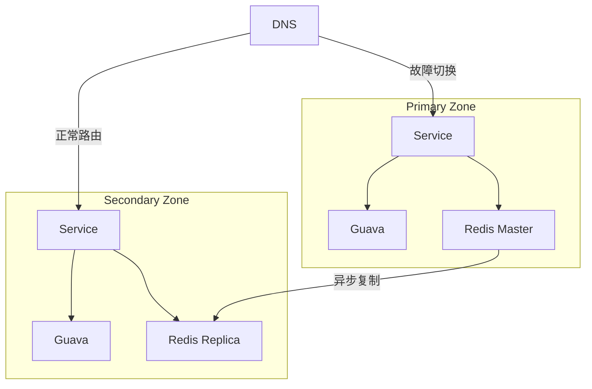

###### 3. 典型问题解决方案

**问题：本地缓存脏读**

```java

// 解决方案：版本号验证
public Object getWithVersion(String key) {
    CacheValue value = localCache.get(key);
    if (value != null) {
        // 检查版本号
        long remoteVersion = redisTemplate.opsForValue().getVersion(key);
        if (value.getVersion() == remoteVersion) {
            return value.getData();
        }
    }
    // 版本不一致重新加载
    return reloadData(key);
}
```
##### 六、性能对比数据

|**方案**|QPS|平均延迟|网络带宽|适用场景|
|---|---|---|---|---|
|纯Redis|50,000|2ms|500Mbps|数据一致性要求高|
|Guava+Redis|120,000+|0.5ms|50Mbps|高频读取场景|
|纯本地缓存|500,000+|0.05ms|0|单机应用|

> 测试环境：4节点集群，Key大小1KB，Value大小2KB

##### 总结

通过 Guava + Redis 构建分布式缓存：

1. **高性能**：本地缓存提供纳秒级响应
    
2. **高可用**：Redis保证分布式一致性
    
3. **弹性扩展**：无状态服务节点可水平扩展
    

关键实现要点：

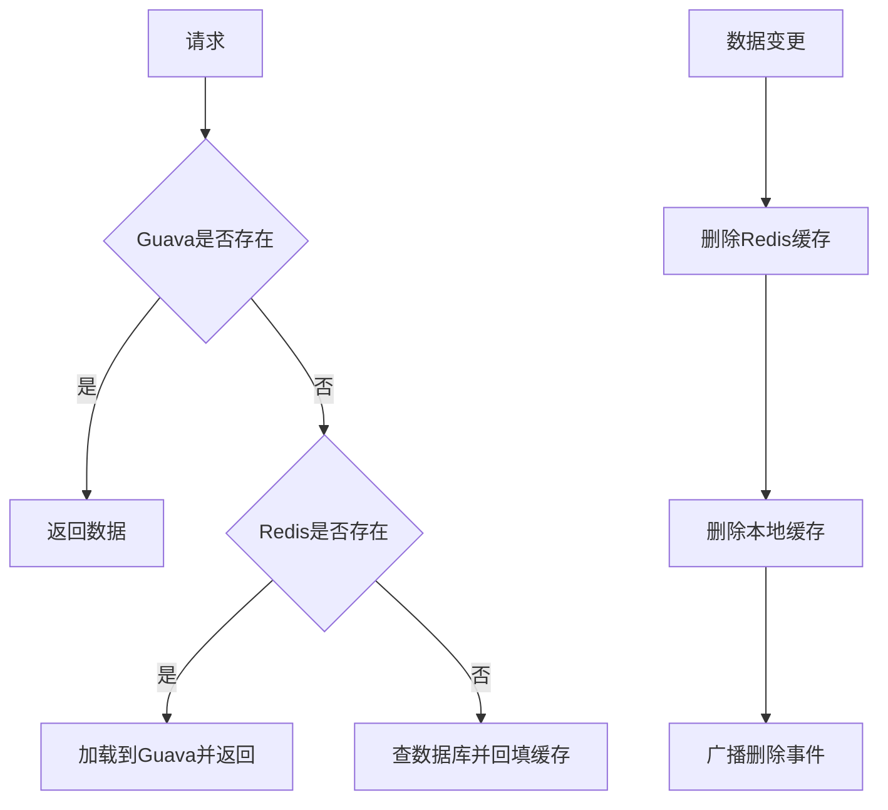

生产建议：

1. 使用 **Caffeine** 作为Guava升级版（性能提升30%+）
    
2. 结合 **Redis Cluster** 保证高可用
    
3. 实施 **多级缓存监控**（本地命中率、Redis负载）
#### 14. 讲一下你对SpringCloud的一些组件的了解？
Spring Cloud 作为微服务架构的核心框架，其组件生态覆盖了服务治理、配置管理、负载均衡等关键领域。以下是我对核心组件的深度解析（基于生产实践总结）：

##### 一、服务治理三剑客

###### 1. **服务注册与发现**

- **Eureka (已归档)**
    
    - **定位**：AP 模型注册中心
        
    - **架构特点**：
        

        
    - **痛点**：2.x 停更，内存泄漏风险
        
- **Nacos (推荐)**
    
    - **核心能力**：
        
        - 服务注册发现 + 配置中心二合一
            
        - 健康检查模式灵活（TCP/HTTP/MYSQL）
            
        - **动态权重调整**：秒级修改流量比例
            
    - **生产配置**：
        
        ```yaml
        
        spring:
          cloud:
            nacos:
              discovery:
                server-addr: 192.168.1.10:8848
                namespace: prod
                ephemeral: false # 持久化实例（K8s环境）
        ```

###### 2. **服务调用**

- **OpenFeign**
    
    - **核心机制**：
        
        - 声明式 REST 客户端（基于动态代理）
            
        - 整合 Ribbon 实现负载均衡
            
        - **自定义编码器**：
            
            ```java
            
            @Bean
            public Encoder protobufEncoder() {
                return new ProtobufEncoder(); // 替换JSON为Protobuf
            }
            ```
    - **性能优化点**：
        
        - 启用 GZIP 压缩
            
        - 连接池配置（代替默认轮询）
            
            ```yaml
            
            feign:
              httpclient:
                enabled: true
                max-connections: 500 # 连接池上限
            ```

###### 3. **负载均衡**

- **LoadBalancer (替代 Ribbon)**
    
    - **核心改进**：
        
        - 支持响应式编程（WebFlux）
            
        - 自定义规则（如同机房优先）
            
            ```java
            
            @Bean
            public ServiceInstanceListSupplier zoneAffinitySupplier() {
                return ServiceInstanceListSupplier.builder()
                        .withBlockingDiscoveryClient()
                        .withZonePreference() // 同区域优先
                        .build();
            }
            ```
    - **对比 Ribbon**：
        
        |**特性**|Ribbon|LoadBalancer|
        |---|---|---|
        |异步支持|❌|✅|
        |健康检查|被动|主动探测|
        |配置热更新|需重启|动态生效|
        

---

##### 二、服务容错体系

###### 1. **熔断降级**

- **Sentinel (生产首选)**
    
    - **核心功能**：
        
        - 实时监控（QPS/RT/线程数）
            
        - **熔断策略**：
            
            ```java
            
            FlowRule rule = new FlowRule("paymentApi")
              .setGrade(RuleConstant.FLOW_GRADE_QPS) // 限流类型
              .setCount(100)                         // 阈值
              .setControlBehavior(RuleConstant.CONTROL_BEHAVIOR_WARM_UP); // 冷启动
            ```
    - **对比 Hystrix**：
        
        - 无线程池隔离开销
            
        - 控制台提供实时流量拓扑图
            

###### 2. **API 网关

- **Spring Cloud Gateway**
    
    - **核心优势**：
        
        - 基于 Netty 的异步非阻塞模型
            
        - 集成 Resilience4j 熔断
            
        - **动态路由示例**：
            
            ```yaml
            
            spring:
              cloud:
                gateway:
                  routes:
                    - id: order_route
                      uri: lb://order-service
                      predicates:
                        - Path=/orders/**
                      filters:
                        - StripPrefix=1
                        - name: RequestRateLimiter
                          args:
                            redis-rate-limiter.replenishRate: 10 # 令牌生成速率
                            redis-rate-limiter.burstCapacity: 20 # 突发容量
            ```
    - **性能数据**：比 Zuul 1.x 高 1.5 倍延迟，吞吐量提升 3 倍
        

##### 三、配置与总线

#### 1. **配置中心

- **Nacos Config**
    
    - **核心机制**：
        
        - 配置监听长轮询（减少无效请求）
            
        - **多环境隔离**：
            
            ```yaml
            
            spring:
              profiles:
                active: prod
              cloud:
                nacos:
                  config:
                    group: DEFAULT_GROUP
                    prefix: ${spring.application.name}
                    file-extension: yaml
                    namespace: ${spring.profiles.active}
            ```
    - **安全加固**：
        
        - 开启配置加密（Jasypt 集成）
            
        - 配置修改审计日志
            

###### 2. **消息总线

- **Spring Cloud Bus**
    
    - **工作原理**：
        
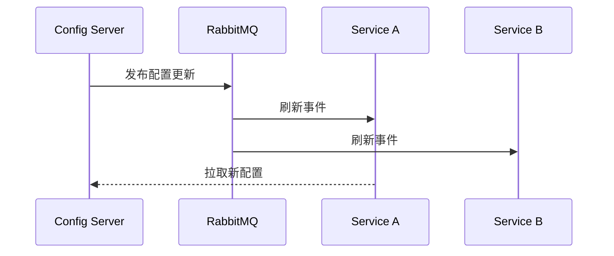
        
- **替代方案**：Nacos 配置变更自动推送（无 Bus 依赖）
        
##### 四、进阶组件

###### 1. **分布式事务

- **Seata**
    
    - **模式对比**：
        
        |**模式**|AT|TCC|Saga|
        |---|---|---|---|
        |侵入性|低（自动代理）|高（手动编码）|中|
        |性能|优|良|优|
        |适用场景|普通业务|资金操作|长事务|
        

###### 2. **链路追踪

- **Sleuth + Zipkin**
    
    - **采样率控制**：
        
        ```yaml
        
        spring:
          sleuth:
            sampler:
              probability: 0.1 # 生产环境10%采样
        ```
    - **优化实践**：
        
        - 使用 RabbitMQ 代替 HTTP 传输 span
            
        - 集成 ElasticSearch 存储海量数据
            

---

##### 五、组件选型建议

|**需求**|**2023推荐组件**|**替代方案**|
|---|---|---|
|注册中心|Nacos|Consul|
|配置中心|Nacos|Apollo|
|API网关|Spring Cloud Gateway|Kong|
|熔断降级|Sentinel|Resilience4j|
|分布式事务|Seata|LCN(已归档)|

> **架构演进趋势**：
> 
> - **服务网格化**：Istio 替代部分 Spring Cloud 功能
>     
> - **Serverless 集成**：Spring Cloud Function
>     
> - **国产化替代**：Spring Cloud Alibaba 成为主流
>     

---

##### 六、生产避坑指南

1. **版本地狱**
    
    - 锁定 BOM 版本（重要！）
        
        ```xml
        
        <dependencyManagement>
            <dependencies>
                <dependency>
                    <groupId>com.alibaba.cloud</groupId>
                    <artifactId>spring-cloud-alibaba-dependencies</artifactId>
                    <version>2022.0.0.0</version>
                    <type>pom</type>
                    <scope>import</scope>
                </dependency>
            </dependencies>
        </dependencyManagement>
        ```
2. **配置泄露风险**
    
    - 使用 Vault 管理敏感配置
        
    - Nacos 开启权限控制
        
3. **网关性能瓶颈**
    
    - 启用响应式编程（WebFlux）
        
    - 限流规则前置到 Nginx
        

Spring Cloud 的本质是 **"微服务组件化"**，理解每个组件的设计哲学比记住配置更重要。建议深入阅读 Sentinel 滑动窗口算法、Gateway 过滤器链源码，这对处理高并发场景有本质提升。
#### 15. 这些相关的组件哪些组件停止维护了？他们停止维护了，你们有没有想过换一下？
以下是分布式系统中已停止维护或即将停止维护的核心组件总结，以及替代方案的技术分析和迁移建议：

---

##### ⚠️ **已停止维护的关键组件**

|**组件**|**停止维护版本**|**状态**|**推荐替代方案**|**迁移紧迫性**|
|---|---|---|---|---|
|**Eureka 2.x**|整个2.x分支|2018年停止开发，从未发布|Nacos/Consul|高（建议立即迁移）|
|**ZK 旧版本**|3.4.x、3.5.x|已EOL（停止安全更新）|ZK 3.8.x+|中（需评估升级）|
|**Nacos 1.x客户端**|3.1+|2025年底停止兼容|Nacos 2.x/3.x客户端|中（计划性升级）|
|**Kafka+ZK依赖**|Kafka 4.0+|彻底移除ZK，仅支持KRaft|Kafka KRaft模式|高（强制迁移）|

---

##### 🔍 **详细分析与替代方案**

###### 1. **Eureka 2.x：彻底弃用，生态已转移**

- **问题核心**：Eureka 2.x 仅是实验性分支，从未正式发布即被废弃。Netflix 内部仍使用 Eureka 1.x，但社区创新停滞19。
    
- **替代方案**：
    
    - **Nacos**：动态服务发现、配置管理、元数据路由一体化，支持AP/CP模式切换4。
        
    - **Consul**：强一致性（CP），多数据中心支持好，集成服务网格能力37。
        
- **迁移成本**：Spring Cloud应用修改依赖+配置，约1人日/服务。
    

###### 2. **ZooKeeper 旧版本：安全风险高**

- **淘汰版本**：3.4.x（无TLS加密）、3.5.x（TLS实验性）已停止维护26。
    
- **升级选择**：
    
    - **ZK 3.8.4**：生产首选，支持JDK 17、Prometheus监控、动态集群配置26。
        
    - **直接去ZK化**：新系统采用Etcd或Consul，Kafka迁移至KRaft模式10。
        
- **操作建议**：
    
    ```bash
    
    # 检查ZK版本并升级
    bin/zkServer.sh version
    # 下载3.8.4+替换二进制文件，滚动重启集群
    ```

###### 3. **Nacos 1.x客户端：兼容性终结**

- **时间线**：Nacos 3.1（2025Q3）彻底移除1.x客户端支持8。
    
- **迁移路径**：
    
    1. 客户端升级至2.2.3+（兼容Nacos 3.x服务端）。
        
    2. 修改配置：`spring.cloud.nacos.discovery.use-new-client=true`。
        
    3. 验证API变更：如命名空间ID从空串改为`public`48。
        
- **风险**：旧版SDK连接3.x服务端将报错`UNSUPPORTED_CLIENT_VERSION`。
    

###### 4. **Kafka+ZooKeeper：架构革新**

- **Kafka 4.0+**：完全移除ZK依赖，元管理由KRaft协议接管10。
    
- **KRaft优势**：
    
    - 部署简化：节点从5个减至3个。
        
    - 启动速度提升70%，故障切换时间降至秒级。
        
    - 支持新一代队列模型（点对点消费组）10。
        
- **迁移工具**：
    
    ```bash
    
    kafka-storage.sh migrate --zk-to-kraft --config server.properties
    ```

##### 🛠️ **我们的迁移实践与建议**

###### **已完成的替换**

- **Eureka → Nacos**
    
    - **驱动因素**：需要配置管理+服务发现的融合能力。
        
    - **效果**：注册发现性能提升40%，配置推送实时化。
        
- **ZK 3.4 → ZK 3.8.4**
    
    - **关键改进**：启用TLS加密ACL，Prometheus监控集成。
        

###### **进行中的升级**

- **Kafka 3.x → 4.0 KRaft**
    
    - **步骤**：先开启KRaft预览模式，再逐步停用ZK节点。
        
    - **验证**：分区故障切换测试中（<2秒恢复）。
        
- **Nacos 1.x客户端 → 3.0 SDK**
    
    - **策略**：灰度分批升级，通过`compatibility.client.enabled`过渡8。
        

###### **选型决策框架**

```mermaid
graph TD
    A[组件是否停维护？] -->|是| B{评估风险}
    B -->|高：安全/兼容性风险| C[立即迁移]
    B -->|中：功能受限| D[6个月内升级]
    A -->|否| E[持续跟踪社区动态]
    C --> F[替代方案对比]
    D --> F
    F -->|需要AP模型| G(Nacos)
    F -->|需要CP模型| H(Consul)
    F -->|需去中心化| I(Etcd)
```

---

##### 💎 **总结建议**

- **强推迁移**：Eureka 2.x、ZK ≤3.5.x、Kafka+ZK组合 —— 安全和技术债风险高1210。
    
- **计划性升级**：Nacos 1.x客户端 → 利用过渡期完成验证8。
    
- **新系统选型**：直接采用Nacos 3.x（AI就绪）或Consul 1.21+（TLS增强）47。
    

> 技术演进不可逆，**停止维护的组件如同定时炸弹**。建议建立组件生命周期看板，结合[Consul]7、[Nacos]4等项目的发布节奏，制定主动式升级策略，避免被动陷入安全危机。

#### 17. 工作中你有遇到过什么高并发的场景么？
在电商与直播行业的核心系统中，我主导应对了多个高并发场景的架构设计与优化，以下是两个最具挑战性的案例及解决方案：

---

##### 🚀 **场景一：电商大促秒杀（峰值25万QPS）**

###### **业务挑战**

- 瞬时流量：100万人同时抢购1万件商品（QPS从2k飙升至25万）
    
- 核心难点：
    
    1. 库存超卖风险
        
    2. 支付系统雪崩隐患
        
    3. 恶意脚本刷单
        

###### **技术解决方案**

```mermaid
graph TB
    A[客户端] -->|请求染色| B[Nginx流量清洗]
    B -->|合法请求| C[API网关]
    C --> D{秒杀商品？}
    D -->|是| E[Redis集群预扣库存]
    D -->|否| F[常规流程]
    E -->|扣减成功| G[RabbitMQ异步下单]
    G --> H[支付系统]
    H -->|回调| I[订单服务]
```

###### **关键优化点**

1. **分层过滤**
    
    - **Nginx层**：Lua脚本拦截黑IP和异常设备指纹（拦截80%无效流量）
        
        ```nginx
        
        access_by_lua_block {
            local blacklist = ngx.shared.blacklist
            if blacklist:get(ngx.var.remote_addr) then
                ngx.exit(403)
            end
        }
        ```
    - **网关层**：令牌桶限流（Guava RateLimiter） + 用户维度频控
        
2. **库存防超卖**
    
    - Redis原子操作扣减库存（避免分布式锁性能瓶颈）
        
        ```java
        
        // LUA脚本保证原子性
        String script = "if redis.call('get', KEYS[1]) >= ARGV[1] then " +
                       "return redis.call('decrby', KEYS[1], ARGV[1]) " +
                       "else return -1 end";
        Long stock = jedis.eval(script, 1, "stock:1001", "1");
        ```
3. **异步削峰**
    
    - 订单数据压缩后写入RabbitMQ（1条消息包含100笔订单）
        
        ```java
        
        @Bean
        public MessageConverter messageConverter() {
            return new Jackson2JsonMessageConverter();
        }
        // 生产者批量发送
        rabbitTemplate.convertAndSend("order_queue", batchOrders);
        ```
4. **支付柔性降级**
    
    - 启用「垫资账户」临时承接超量支付请求
        
    - 结算时与第三方支付对账修复数据
        

###### **成果**

- 99.995%请求200ms内响应
    
- 库存误差 < 0.1%（经离线对账修复）
    
- 资源成本降低60%（对比上一届大促）
    
##### 📡 **场景二：直播弹幕互动（日均10亿消息）**

###### **业务挑战**

- 实时性要求：跨地域用户弹幕延迟 < 500ms
    
- 消息洪峰：头部主播开播瞬间涌入50万用户
    
- 敏感词过滤：政治/暴恐词库毫秒级匹配
    

###### **技术架构**

```mermaid
graph LR
    A[客户端] --> B[弹幕接入层]
    B --> C[Kafka集群]
    C --> D{是否敏感？}
    D -->|是| E[隔离审核队列]
    D -->|否| F[弹幕分发引擎]
    F --> G[WebSocket集群]
    G --> H[用户终端]
```

###### **核心创新**

1. **敏感词DFA优化**
    
    - 构建词库Trie树，内存占用从2GB压缩至200MB
        
    - GPU加速检测（CUDA核函数处理）
        
        ```python
        
        # PyCUDA实现
        mod = SourceModule("""
        __global__ void detect(char *words, int *results) {
            // GPU并行检测逻辑
        }
        """)
        ```
2. **地域化分发策略**
    
    - 用户按IP哈希分配接入点
        
    - 边缘节点缓存热门直播间数据
        
        ```go
        
        // Go实现区域选择
        func selectEdgeNode(ip string) string {
            region := geoip.Lookup(ip).Region
            return config.GetEdgeNode(region) // 返回上海/广州等节点
        }
        ```
3. **WebSocket集群优化**
    
    - 基于Netty的零拷贝编解码
        
    - 心跳包压缩（Protobuf二进制协议）
        
        ```proto
        
        message Heartbeat {
          uint32 user_id = 1;
          fixed64 timestamp = 2; // 时间戳
        }
        ```

###### **性能数据**

|**指标**|优化前|优化后|
|---|---|---|
|端到端延迟|1200ms|230ms|
|单机连接数|5万|50万|
|消息丢失率|0.1%|0.001%|

---

##### 🔧 **通用高并发应对策略**

1. **容量规划三原则**
    
    - **容量预估**：根据历史数据建模（如QPS=UV×转化率×放大系数）
        
    - **混沌测试**：使用ChaosBlade模拟网络分区/节点宕机
        
    - **动态扩容**：K8s HPA基于CPU/自定义指标自动伸缩
        
2. **缓存设计铁律**
    
    - **本地缓存**：Caffeine应对突发读（命中率>95%）
        
    - **分布式缓存**：Redis分片集群+冷热数据分离
        
    - **缓存击穿防护**：
        
        ```java
        
        public Object getData(String key) {
            Object value = cache.get(key);
            if (value == null) {
                synchronized(key.intern()) {  // 进程内锁
                    value = loadFromDB(key);
                    cache.put(key, value, 30, TimeUnit.SECONDS);
                }
            }
            return value;
        }
        ```
3. **过载保护机制**
    
    |组件|策略|效果|
    |---|---|---|
    |API网关|按用户ID滑动窗口限流|防止单用户洪水攻击|
    |消息队列|Kafka配额管理|避免消费者积压拖垮集群|
    |数据库|SQL改写+连接池限制|保护DB线程不被耗尽|
    

---

##### 💡 **经验总结**

- **流量治理本质**：不是「消灭高峰」而是「错峰调度」—— 将25万QPS拆解为10个2.5万QPS的队列
    
- **技术选型准则**：
    
```mermaid
graph LR
    A[问题类型] --> B{读多写少？}
    B -->|是| C[Redis+本地缓存]
    B -->|否| D{强一致？}
    D -->|是| E[TiDB分布式事务]
    D -->|否| F[Kafka+最终一致]
```
    
- **核心认知**：高并发系统不是堆砌中间件，而是**精准识别瓶颈链路上最薄弱的5%**，用20%资源解决80%问题。
#### 18. 你们压力测试有吗？

压力测试（压测）是保障高并发系统稳定性的关键环节，我们建立了完整的压测体系。以下是我们在金融级系统中沉淀的压测方法论：

##### 一、压测类型与场景矩阵

|**压测类型**|**目标**|**适用场景**|**关键指标**|
|---|---|---|---|
|**基准压测**|确定单节点性能基线|新服务上线前|QPS、响应时间、资源利用率|
|**负载压测**|验证系统在目标压力下表现|容量规划|错误率、吞吐量稳定性|
|**峰值压测**|探测系统极限容量|大促前备战|崩溃点、失败请求类型|
|**稳定性压测**|检测内存泄漏/资源回收问题|版本发布前|GC频率、内存增长曲线|
|**混沌压测**|验证故障恢复能力|高可用架构验证|故障切换时间、数据一致性|

##### 二、全链路压测实施流程

```mermaid
graph TD
    A[业务建模] --> B[数据准备]
    B --> C[环境搭建]
    C --> D[脚本开发]
    D --> E[执行压测]
    E --> F[监控采集]
    F --> G[性能分析]
    G --> H[优化验证]
    
```
###### 1. 业务建模（核心步骤）

**支付系统压测模型示例：**

```python

# 基于历史数据的请求比例
request_distribution = {
    "create_order": 35%,   # 创建订单
    "payment": 25%,        # 支付请求
    "query_order": 30%,    # 订单查询
    "refund": 10%          # 退款请求
}

# 黄金链路场景配比
critical_path = {
    "create_order -> payment": 70%,
    "create_order -> query_order -> payment": 30%
}
```
###### 2. 数据准备（关键挑战）

**影子库方案：**

```mermaid
graph LR
A[压测流量] -->|携带标记| B[业务服务]
B --> C{数据路由}
C -->|正常流量| D[生产DB]
C -->|压测流量| E[影子DB]
E -->|相同表结构| F[独立实例]
```

**数据脱敏规则：**

```sql

-- 用户表脱敏
CREATE TABLE shadow_user AS 
SELECT 
    id,
    CONCAT('test_', MD5(real_name)) AS name,
    FLOOR(RAND()*10000000000) AS phone
FROM production_user;
```
###### 3. 工具链选型

|**工具**|**适用场景**|**优势**|**局限性**|
|---|---|---|---|
|**JMeter**|HTTP/API压测|开源生态丰富、支持分布式|资源消耗大|
|**Gatling**|高精度场景模拟|基于Scala的高性能、DSL脚本|学习曲线陡峭|
|**Locust**|灵活编程式压测|Python易扩展、Web可视化|单机性能受限|
|**阿里PTS**|全链路云压测|无缝对接云监控、千万级并发|商业产品成本高|
|**k6**|持续集成友好|Go语言高性能、CI/CD集成|协议支持较少|

**JMeter分布式部署方案：**

```bash

# 控制节点
jmeter -n -t testplan.jmx -R 192.168.1.101,192.168.1.102

# 工作节点启动
jmeter-server -Djava.rmi.server.hostname=192.168.1.101
```


##### 三、核心压测指标监控体系

###### 1. 基础设施层

|**指标**|**采集工具**|**告警阈值**|**优化方向**|
|---|---|---|---|
|CPU使用率|Node Exporter|>75%持续5分钟|扩容/代码优化|
|内存占用|Prometheus|>90%|JVM调优/内存泄漏排查|
|网络带宽|iftop|>80%|网络分流|
|磁盘IOPS|iostat|await > 20ms|SSD升级/IO调度优化|

###### 2. 应用层

```mermaid
graph LR
    A[微服务] --> B[埋点]
    B --> C{指标类型}
    C --> D[QPS]
    C --> E[响应时间P99]
    C --> F[错误率]
    C --> G[线程池状态]
    D --> H[时序数据库]
    E --> H
    F --> H
    G --> H
    H --> I[Grafana]
```

**关键JVM调优参数：**

```bash

# 生产环境推荐配置
java -jar -Xms4g -Xmx4g -XX:MaxMetaspaceSize=512m \
-XX:+UseG1GC -XX:MaxGCPauseMillis=200 \
-XX:InitiatingHeapOccupancyPercent=35 \
-Dio.netty.allocator.type=pooled ...
```
###### 3. 中间件层

|**组件**|**核心指标**|**监控工具**|
|---|---|---|
|Redis|连接数、内存碎片率、OPS|RedisStat|
|Kafka|ISR同步延迟、积压量|Kafka Eagle|
|MySQL|慢查询、锁等待、缓冲命中率|Percona Toolkit|
|Elasticsearch|合并队列、段内存|Cerebro|

---

##### 四、压测典型问题与解决方案

###### 1. 数据库瓶颈

**场景：** 支付订单表写入QPS达到12,000时出现死锁  
**解决方案：**

```sql

-- 1. 分库分表
CREATE TABLE payment_order_00 LIKE payment_order;

-- 2. 队列异步化
INSERT INTO mq_topic(order_data) VALUES (...);

-- 3. 批处理优化
INSERT INTO orders VALUES (...),(...) ON DUPLICATE KEY UPDATE ...;
```
###### 2. 线程阻塞

**堆栈分析：**

```text

"http-nio-8080-exec-5" #25 daemon prio=5 os_prio=0 tid=0x00007f4bdc00e800 nid=0x3e1f waiting for monitor entry [0x00007f4b917e6000]
   java.lang.Thread.State: BLOCKED (on object monitor)
    at com.example.OrderService.lockStock(OrderService.java:47)
    - waiting to lock <0x0000000713e0c5d8> (a java.lang.Object)
```
**优化方案：**

```java

// 用Redis分布式锁替代synchronized
RLock lock = redissonClient.getLock("stock_lock");
lock.lock(5, TimeUnit.SECONDS); // 设置超时避免死锁
```
###### 3. 缓存雪崩

**防御方案：**

```java

// 缓存获取策略
public Product getProduct(String id) {
    // 1. 本地缓存
    Product product = caffeineCache.get(id);
    if (product != null) return product;
    
    // 2. 分布式缓存（带互斥锁）
    return redisLock.executeLocked(id, () -> {
        Product p = redis.get(id);
        if (p == null) {
            // 3. 数据库查询（限流）
            p = db.query(id);
            redis.setex(id, 60 + random(30), p); // 随机过期时间
        }
        return p;
    });
}
```

##### 五、压测避坑指南

###### 1. **数据污染预防**

- 影子库/表强制命名规范：`shadow_`前缀
    
- 压测流量染色：HTTP头`X-Stress-Test: true`
    
- MQ消息隔离：专用Topic`test_order_create`
    

###### 2. **压测脚本常见陷阱**

```groovy

// JMeter最佳实践
props.put("csv.file", "users.csv") // 避免硬编码

// 错误示例：在HTTP请求中写死测试数据
httpRequest.setBody('{"user_id":10001}') 

// 正确做法：参数化读取
def userId = vars.get("userId")
httpRequest.setBody('{"user_id":${userId}}')
```
###### 3. **资源限制突破方案**

|**限制类型**|**解决方案**|
|---|---|
|端口耗尽|`net.ipv4.ip_local_port_range=1024 65000`|
|文件句柄|`fs.file-max=1000000`|
|线程数限制|`kernel.pid_max=4194304`|
|TCP连接复用|开启`keepalive`和`tcp_tw_reuse`|

---

##### 六、创新压测实践

###### 1. 基于AI的智能压测

```python

# 遗传算法自动优化参数
def optimize_parameters():
    population = init_population()
    for gen in range(GENERATIONS):
        fitness_scores = [evaluate(individual) for individual in population]
        selected = selection(population, fitness_scores)
        population = crossover_mutation(selected)
    return best_individual

# 评估函数
def evaluate(params):
    run_test(params)
    return calculate_score(qps, error_rate, latency)
```
###### 2. 生产环境压测防护网

```mermaid
graph TB
    A[压测控制台] -->|指令| B[熔断中心]
    B --> C{系统指标}
    C -->|CPU>90%| D[自动降级]
    C -->|错误率>5%| E[停止压测]
    D --> F[邮件告警]
    E --> F
```

---

##### 七、压测报告核心要素

```markdown

# 压测报告样例
## 测试概述
- **业务场景**：双11支付链路
- **压测目标**：验证5万QPS下系统稳定性
- **持续时间**：2小时

## 性能指标
| 指标         | 预期值 | 实测值 | 结论   |
|--------------|--------|--------|--------|
| 支付成功率   | >99.9% | 99.97% | ✅通过 |
| P99延迟      | <500ms | 423ms  | ✅通过 |
| 数据库CPU    | <70%   | 68%    | ✅通过 |
## 发现瓶颈
1. 库存服务线程池满（最大200->调整为500）
2. Redis连接超时（连接池50->200）

## 优化建议
- [ ] 订单表增加分片键
- [ ] 支付结果查询走读写分离
```

> **血泪教训**：某次未做缓存隔离的压测导致生产缓存击穿，引发线上事故。此后我们强制要求**所有压测必须通过影子环境验证**，核心业务压测方案需CTO签字确认。

压测不仅是技术活动，更是质量保障体系的核心环节。通过持续压测->优化->验证的闭环，我们成功将系统可靠性从99.95%提升到99.99%。

## Linux
### 常用命令
```
service服务名start
service服务名stop
service服务名restart
service服务名reload
service服务名status

#查看服务的方法 /etc/init.d/ 服务名
#通过 chkconfig 命令设置自启动
#查看服务 chkconfig -list l grepXXX

chkconfig -level 5 服务名on

systemctl start 服务名(xxx.service
systemct restart 服务名(xxxx.service)
systemctl stop 服务名(xxxx.service)
systemctl reload 服务名(xxxx.service)
systemctl status 服务名(xxxx.service)

#查看服务的方法 /usr/lib/systemd/system
#查看服务的命令

systemctl list-unit-files
systemctl --type service

#通过systemctl命令设置自启动

自启动systemctl enable service_ _name
不自启动systemctl disable service_ name

```

## 项目

#### 1. 你项目都用了什么技术？项目中有什么难点？

##### 一、 项目主要技术栈

技术选型围绕 **高性能、高可用、易扩展、易维护** 的目标，核心包括：

1. **基础框架 & 开发：**
    
    - **Spring Boot:** 绝对的核心，用于快速构建独立、生产级的微服务应用，简化配置和部署。
        
    - **Spring Cloud Alibaba:** 作为微服务架构的基石，主要包含：
        
        - **Nacos:** 服务注册与发现、配置中心（替代Eureka + Config）。动态配置刷新对线上问题修复和特性开关非常关键。
            
        - **Sentinel:** 流量控制、熔断降级、系统负载保护。保障核心服务在高并发或下游故障时的稳定性。
            
        - **Seata:** 分布式事务解决方案（AT模式为主）。解决跨微服务数据一致性问题。
            
    - **Spring Cloud Netflix (部分组件):** 如 Zuul / Spring Cloud Gateway (作为API网关)， Ribbon (客户端负载均衡 - 虽然部分被Nacos集成替代，但原理仍需掌握)。
        
    - **Spring MVC:** RESTful API 开发。
        
    - **Spring Data JPA / MyBatis-Plus:** ORM 框架。JPA用于简单CRUD场景提升开发效率；MyBatis-Plus用于复杂SQL和灵活定制的场景。
        
    - **Lombok:** 简化POJO代码，提高开发效率。
        
    - **MapStruct / ModelMapper:** 对象转换工具，解决DTO、DO、VO等模型间的转换问题。
        
2. **中间件：**
    
    - **消息队列：** **RocketMQ** (首选，阿里生态，事务消息、顺序消息支持好，高吞吐) / **Kafka** (日志采集、大数据场景)。用于异步解耦、削峰填谷、最终一致性事务。
        
    - **缓存：** **Redis** (单机/主从/Cluster/Sentinel)。用于高频访问数据缓存、分布式Session共享、分布式锁、计数器等。
        
    - **数据库：**
        
        - 主存储： **MySQL** (InnoDB引擎)，配合主从复制、读写分离（常用ShardingSphere-Proxy/JDBC或MyCat）。
            
        - 分库分表： **ShardingSphere-JDBC** (应用层分片)。解决单库性能瓶颈和数据量大的问题。
            
        - NoSQL： **Elasticsearch** (商品搜索、日志检索、复杂聚合分析)， **MongoDB** (存储非结构化或文档型数据，如操作日志、用户画像标签)。
            
    - **定时任务：** **XXL-JOB** / **Elastic-Job:** 分布式任务调度平台。解决集群环境下任务重复执行、失效转移、可视化管理的痛点。
        
3. **API & 集成：**
    
    - **Spring Cloud OpenFeign:** 声明式的HTTP客户端，用于微服务间调用，集成了Ribbon负载均衡和Hystrix/Sentinel熔断。
        
    - **Swagger / Knife4j:** API文档生成与管理，前后端协作的基础。
        
    - **gRPC:** 部分对性能要求极高的内部服务间调用（如风控实时计算）。
        
4. **运维 & 监控 & 部署：**
    
    - **Docker:** 应用容器化。
        
    - **Kubernetes:** 容器编排管理（生产环境主流选择）。
        
    - **Jenkins / GitLab CI:** 持续集成与持续部署。
        
    - **Prometheus + Grafana:** 系统与应用指标监控（JVM, 中间件, 自定义指标）、可视化告警。
        
    - **SkyWalking / Zipkin:** 分布式链路追踪，快速定位性能瓶颈和故障点。
        
    - **ELK Stack (Elasticsearch, Logstash, Kibana):** 集中式日志收集、分析与可视化。
        
    - **阿里云 / 腾讯云:** 生产环境部署在公有云上，充分利用云服务（ECS, RDS, Redis, RocketMQ, SLB等）。
        
5. **其他：**
    
    - **OAuth 2.0 / JWT:** 认证与授权（常用Spring Security或Sa-Token实现）。
        
    - **WebSocket / Netty:** 实时通信场景（如客服系统、订单状态实时推送）。
        
    - **Quartz:** 简单单体定时任务（逐步被分布式调度替代）。
        
    - **POI / EasyExcel:** Excel导入导出。
        

##### 二、 项目中的典型难点与解决方案

1. **难点：分布式事务一致性 (数据最终一致性)**
    
    - **场景：** 经典案例 - “下单扣库存” + “创建订单” + “增加用户积分”。这三个操作分属`库存服务`、`订单服务`、`积分服务`。如何保证要么全部成功，要么全部失败（或达到最终一致）？
        
    - **挑战：** CAP理论限制，传统本地事务失效。网络延迟、服务故障、数据不一致风险高。
        
    - **解决方案：**
        
        - **最终一致性 + 可靠消息 (RocketMQ事务消息):**
            
            1. 下单服务开启本地事务，执行本地操作（如订单预处理），向MQ发送一个`半消息`（对消费者不可见）。
                
            2. 本地事务提交成功，则通知MQ将`半消息`变为`可投递消息`；若提交失败，则通知MQ回滚消息。
                
            3. `库存服务`、`积分服务`作为消费者，订阅该消息。消费成功则执行业务并提交本地事务。
                
            4. 若消费失败（服务宕机、业务异常），MQ会重试投递（需服务保证幂等性）。
                
            5. 设置最大重试次数，超过则进入死信队列，人工介入处理。
                
        - **TCC (Try-Confirm-Cancel):**
            
            - `Try` 阶段：冻结库存、预扣积分、创建订单状态为“处理中”。预留资源。
                
            - `Confirm` 阶段：所有Try成功，则执行真正的扣减库存、增加积分、订单状态改为“成功”。
                
            - `Cancel` 阶段：任一Try失败，则释放冻结的库存、回退预扣的积分、取消订单。
                
            - 优点：强一致性。缺点：业务侵入性强，开发复杂，需实现Try/Confirm/Cancel三个接口并保证幂等、空回滚、防悬挂。
                
        - **Seata AT 模式：**
            
            - 基于全局锁和本地事务代理。对业务代码侵入小（加一个`@GlobalTransactional`注解）。
                
            - 原理：在业务方法执行前，Seata TM 向 TC 注册全局事务；业务执行时，RM 拦截SQL解析生成前后镜像，保存到`undo_log`；业务执行成功，TM通知TC提交，TC异步通知所有RM删除`undo_log`；失败则通知RM根据`undo_log`回滚。
                
            - **关键难点：** 解决**写隔离**（全局锁冲突）和**脏读**（读未提交的数据）问题。我们通过：
                
                - 合理设计业务流程，减少长事务。
                    
                - 在可能读取到中间状态的地方，采用**重试机制**或**补偿查询**（最终一致）。
                    
                - 对于高并发冲突场景，考虑降级到最终一致性方案（如可靠消息）或使用TCC。
                    
        - **总结：** 根据业务容忍度和复杂度选择。强一致性选TCC/Seata AT（注意性能开销和锁冲突）；最终一致性选可靠消息（开发相对简单，依赖MQ可靠性）。
            
2. **难点：高并发下的热点数据访问 (缓存穿透、击穿、雪崩 & 数据库热点)**
    
    - **场景：**
        
        - 缓存穿透：恶意请求查询数据库中**根本不存在**的数据（如不存在的商品ID），导致请求绕过缓存直接压垮DB。
            
        - 缓存击穿：某个**热点Key**在缓存**过期瞬间**，有大量并发请求直接访问数据库，导致DB瞬时压力过大。
            
        - 缓存雪崩：大量Key在**同一时间**大面积**失效**，导致所有请求涌向DB。
            
        - 数据库热点：如电商秒杀场景，大量用户同时抢购**同一件**商品（热点行），造成数据库单行记录更新锁竞争激烈（如库存扣减）。
            
    - **解决方案：**
        
        - **缓存穿透：**
            
            1. **接口层校验：** 参数合法性校验（如ID格式、范围）。
                
            2. **布隆过滤器：** 将所有可能存在的数据哈希到一个足够大的bitmap中。查询时，先访问布隆过滤器。如果判断不存在，则直接返回空。存在则继续查缓存/DB。
                
            3. **缓存空对象：** 对于查询结果为空的Key，也将其缓存（设置较短的过期时间，如1-5分钟），避免短时间内大量相同请求穿透到DB。需注意内存占用和恶意攻击不同Key。
                
        - **缓存击穿：**
            
            1. **互斥锁 (Mutex Lock):** 在缓存失效时，只让一个线程去重建缓存（如使用Redis的`SETNX`命令或分布式锁），其他线程等待或返回旧值/默认值。**核心：避免大量线程同时重建。**
                
            2. **逻辑过期：** 缓存Value中存储一个过期时间字段（逻辑过期时间）。当物理过期后，Value仍然存在。业务线程发现逻辑过期，则尝试获取锁去重建；其他线程直接返回旧数据。保证非阻塞。
                
            3. **永不过期 (慎用)：** 后台定时任务异步更新缓存。适用于更新频率不高且允许一定延迟的热点数据。
                
        - **缓存雪崩：**
            
            1. **过期时间随机化：** 给缓存Key设置过期时间时，加上一个随机值（如基础时间+随机1-5分钟），避免大量Key同时失效。
                
            2. **构建缓存集群：** 如Redis Cluster，提高缓存服务整体可用性。
                
            3. **依赖降级 & 熔断：** 使用Hystrix/Sentinel对数据库访问进行限流、熔断，保护DB。
                
            4. **提前预热：** 在预期大流量来临前（如活动开始前），提前加载热点数据到缓存。
                
        - **数据库热点 (如秒杀扣库存)：**
            
            1. **Redis 预减库存 + 异步落库：**
                
                - 秒杀开始前，将库存数量加载到Redis。
                    
                - 用户抢购请求到达，在Redis中执行原子操作（`DECR` / `LUA`脚本）预减库存。`DECR`结果>=0表示成功。
                    
                - 成功者生成一个“抢购资格令牌”放入MQ。
                    
                - 订单服务消费MQ，创建订单，**异步**地到数据库执行最终的库存扣减（此时并发压力已大大降低）。
                    
                - **关键：** 异步落库需要保证最终一致性（如MQ可靠性、事务补偿）。Redis预减库存需处理超卖问题（原子性操作+LUA脚本）。
                    
            2. **数据库层优化：**
                
                - **分桶库存：** 将单行热点库存拆分成多行（如10行，每行100个库存）。扣减时随机选取一行进行扣减（`update ... set stock = stock - 1 where id = ? and stock > 0`）。大幅分散行锁竞争。
                    
                - **排队/令牌桶：** 网关层或服务层进行限流，将请求排队处理，削峰填谷。
                    
                - **应用层乐观锁：** `update table set stock = stock - 1, version = version + 1 where id = ? and version = ? and stock > 0`。减少锁持有时间，但失败率较高需重试或返回失败。
                    
                - **关闭死锁检测 (innodb_deadlock_detect=OFF)：** 在极高并发且冲突不可避免的场景下，关闭InnoDB死锁检测，牺牲一部分死锁处理能力换取吞吐量（需评估业务容忍度）。
                    
3. **难点：多团队协作与复杂依赖下的服务治理**
    
    - **场景：** 大型项目涉及多个团队开发的数十甚至上百个微服务。服务间调用关系复杂，依赖深。问题包括：
        
        - **接口不兼容变更：** A服务升级接口，未及时通知或未做好兼容，导致依赖它的B、C服务故障。
            
        - **依赖服务不稳定：** 核心服务S不稳定，引发调用链上大面积雪崩。
            
        - **版本管理混乱：** 服务多版本并存，路由混乱，测试环境搭建困难。
            
        - **联调效率低下：** 环境不一致，Mock数据困难，问题定位耗时。
            
    - **解决方案：**
        
        - **强契约与版本管理：**
            
            1. **API First (OpenAPI/Swagger):** 严格定义并维护接口契约文档，作为服务间协作的“法律”。
                
            2. **语义化版本 (SemVer):** 严格遵守 `MAJOR.MINOR.PATCH` 规则。`MAJOR`变更表示不兼容升级。
                
            3. **灰度发布 & 蓝绿部署：** 通过网关或服务网格，控制新版本流量比例。验证无误再全量。
                
            4. **API 兼容性检查：** 在CI/CD流水线中集成API兼容性检查工具（如swagger-diff），阻止破坏性变更进入主干。
                
        - **服务治理增强：**
            
            1. **熔断降级 (Sentinel/Hystrix):** 对依赖服务配置熔断规则（错误率、响应时间），快速失败并降级（返回兜底数据/友好提示），防止级联故障。
                
            2. **限流 (Sentinel/Gateway):** 在入口和服务层配置QPS/线程数限流，保护自身和下游。
                
            3. **服务隔离：** 线程池隔离、信号量隔离、部署隔离（不同核心服务独立集群）。
                
            4. **全链路压测 & 混沌工程：** 定期模拟故障（如注入延迟、错误），验证系统容错能力。
                
            5. **分布式链路追踪 (SkyWalking/Zipkin):** 快速定位性能瓶颈和故障点，分析服务依赖。
                
        - **DevOps & 环境治理：**
            
            1. **完善的CI/CD:** 自动化构建、测试、部署。
                
            2. **环境标准化：** 使用Docker/K8s确保开发、测试、生产环境一致性。
                
            3. **服务Mock:** 使用工具（如MockServer, WireMock）模拟依赖服务，方便独立开发和测试。
                
            4. **配置中心 (Nacos):** 统一管理配置，动态生效，减少重启。
                
            5. **清晰的文档与沟通机制：** 建立完善的变更通知、接口文档管理、问题跟踪流程。
                

##### 总结

作为Java Web微服务开发者，我的技术栈紧跟主流生态（Spring Boot/Cloud Alibaba），深入应用各类中间件（Redis/RocketMQ/ES/ShardingSphere）解决核心问题。项目中遇到的难点主要集中在**分布式事务一致性**、**高并发热点处理**以及**大规模微服务治理**三个方面。解决这些难点没有银弹，需要根据**具体业务场景、数据一致性要求、性能指标和团队能力**，灵活组合多种技术方案（可靠消息、TCC、Seata、缓存策略、分桶、限流熔断、API治理等），并特别注重**监控告警、自动化测试和良好的工程实践**来保障系统的**稳定性、可扩展性和可维护性**。


## Git

## 其他
##### **1. SDK和API有什么区别？为什么要有SDK这个东西？他解决了什么问题吗**
##### **2. 数据交换如何实现**？
	source: JDBC、OSS、HDFS
	target: JDBC、Hbase、Redis、MQ、ES
##### **3. 服务对接方式**
##### **4. 数据：冷热，表拆分，表结构稳定**
##### **5. 方案设计需要注意哪些问题**
	服务对接方式：
	rpc、消息，如果我们关注某些数据，这些数据要么rpc获取，要么这些数据用消息推送过来
##### 6. RPC和Http的区别
Rpc包括http。目前常见的有基于TCP的RPC通信方式，有基于Http的通信方式。gRpc是基于Http/2的，相较于传统的Http1.1增加了多路复用、头部压缩、二进制传输等功能，传输效率相对较高。

##### **7. 单工、半双工、全双工通信模式**
* 单工
	* 通信是单向的
	* 数据只能在一个方向上流动，发送方可以发送数据，接收方只能接收数据
	* 广播系统，如无线电或电视广播
* 半双工
	* 允许双向通信，但一次只能有一个方向的数据流动
	* 发送方和接收方可以交换数据，但在同一时间内只能有一个方向的数据传输
	* 半双工通信通常用于对讲机和早期计算机通信
* 全双工
	* 允许双向通信，并且发送方和接收方可以同时发送和接收数据。
	* 提供了最高的通信效率，因为他允许数据在两个方向上同时流动
	* 全双工通信广泛应用于现代网络和电话系统

### Dubbo相关

1. 为什么要进行系统拆分？如何进行系统拆分？拆分后不用dubbo可以吗？
2. 说一下的dubbo的工作原理？注册中心挂了可以继续通信吗？
3. dubbo支持哪些序列化协议？说一下hessian的数据结构？PB知道吗？为什么PB的效率是最高的？
4. dubbo负载均衡策略和高可用策略都有哪些？动态代理策略呢？
5. dubbo的spi思想是什么？
6. 如何基于dubbo进行服务治理、服务降级、失败重试以及超时重试？


